# Attribute directives

Change the appearance or behavior of DOM elements and Angular components with attribute directives.

## Building an attribute directive

This section walks you through creating a highlight directive that sets the background color of the host element to yellow.

1. To create a directive, use the CLI command [`ng generate directive`](tools/cli/schematics).

    <docs-code language="shell">

    ng generate directive highlight

    </docs-code>

    The CLI creates `src/app/highlight.directive.ts`, a corresponding test file `src/app/highlight.directive.spec.ts`.

    <docs-code header="src/app/highlight.directive.ts" path="adev/src/content/examples/attribute-directives/src/app/highlight.directive.0.ts"/>

    The `@Directive()` decorator's configuration property specifies the directive's CSS attribute selector, `[appHighlight]`.

1. Import `ElementRef` from `@angular/core`.
    `ElementRef` grants direct access to the host DOM element through its `nativeElement` property.

1. Add `ElementRef` in the directive's `constructor()` to [inject](guide/di) a reference to the host DOM element, the element to which you apply `appHighlight`.

1. Add logic to the `HighlightDirective` class that sets the background to yellow.

    <docs-code header="src/app/highlight.directive.ts" path="adev/src/content/examples/attribute-directives/src/app/highlight.directive.1.ts"/>

HELPFUL: Directives *do not* support namespaces.

<docs-code header="src/app/app.component.avoid.html (unsupported)" path="adev/src/content/examples/attribute-directives/src/app/app.component.avoid.html" visibleRegion="unsupported"/>

## Applying an attribute directive

1. To use the `HighlightDirective`, add a `<p>` element to the HTML template with the directive as an attribute.

    <docs-code header="src/app/app.component.html" path="adev/src/content/examples/attribute-directives/src/app/app.component.1.html" visibleRegion="applied"/>

Angular creates an instance of the `HighlightDirective` class and injects a reference to the `<p>` element into the directive's constructor, which sets the `<p>` element's background style to yellow.

## Handling user events

This section shows you how to detect when a user mouses into or out of the element and to respond by setting or clearing the highlight color.

1. Import `HostListener` from '@angular/core'.

    <docs-code header="src/app/highlight.directive.ts (imports)" path="adev/src/content/examples/attribute-directives/src/app/highlight.directive.2.ts" visibleRegion="imports"/>

1. Add two event handlers that respond when the mouse enters or leaves, each with the `@HostListener()` decorator.

    <docs-code header="src/app/highlight.directive.ts (mouse-methods)" path="adev/src/content/examples/attribute-directives/src/app/highlight.directive.2.ts" visibleRegion="mouse-methods"/>

Subscribe to events of the DOM element that hosts an attribute directive, the `<p>` in this case, with the `@HostListener()` decorator.

HELPFUL: The handlers delegate to a helper method, `highlight()`, that sets the color on the host DOM element, `el`.

The complete directive is as follows:

<docs-code header="src/app/highlight.directive.ts" path="adev/src/content/examples/attribute-directives/src/app/highlight.directive.2.ts"/>

The background color appears when the pointer hovers over the paragraph element and disappears as the pointer moves out.


## Passing values into an attribute directive

This section walks you through setting the highlight color while applying the `HighlightDirective`.

1. In `highlight.directive.ts`, import `Input` from `@angular/core`.

    <docs-code header="src/app/highlight.directive.ts (imports)" path="adev/src/content/examples/attribute-directives/src/app/highlight.directive.3.ts" visibleRegion="imports"/>

1. Add an `appHighlight` `@Input()` property.

    <docs-code header="src/app/highlight.directive.ts" path="adev/src/content/examples/attribute-directives/src/app/highlight.directive.3.ts" visibleRegion="input"/>

    The `@Input()` decorator adds metadata to the class that makes the directive's `appHighlight` property available for binding.

1. In `app.component.ts`, add a `color` property to the `AppComponent`.

    <docs-code header="src/app/app.component.ts (class)" path="adev/src/content/examples/attribute-directives/src/app/app.component.1.ts" visibleRegion="class"/>

1. To simultaneously apply the directive and the color, use property binding with the `appHighlight` directive selector, setting it equal to `color`.

    <docs-code header="src/app/app.component.html (color)" path="adev/src/content/examples/attribute-directives/src/app/app.component.html" visibleRegion="color"/>

    The `[appHighlight]` attribute binding performs two tasks:

    * Applies the highlighting directive to the `<p>` element
    * Sets the directive's highlight color with a property binding

### Setting the value with user input

This section guides you through adding radio buttons to bind your color choice to the `appHighlight` directive.

1. Add markup to `app.component.html` for choosing a color as follows:

    <docs-code header="src/app/app.component.html (v2)" path="adev/src/content/examples/attribute-directives/src/app/app.component.html" visibleRegion="v2"/>

1. Revise the `AppComponent.color` so that it has no initial value.

    <docs-code header="src/app/app.component.ts (class)" path="adev/src/content/examples/attribute-directives/src/app/app.component.ts" visibleRegion="class"/>

1. In `highlight.directive.ts`, revise `onMouseEnter` method so that it first tries to highlight with `appHighlight` and falls back to `red` if `appHighlight` is `undefined`.

    <docs-code header="src/app/highlight.directive.ts (mouse-enter)" path="adev/src/content/examples/attribute-directives/src/app/highlight.directive.3.ts" visibleRegion="mouse-enter"/>

1. Serve your application to verify that the user can choose the color with the radio buttons.

    

## Binding to a second property

This section guides you through configuring your application so the developer can set the default color.

1. Add a second `Input()` property to `HighlightDirective` called `defaultColor`.

    <docs-code header="src/app/highlight.directive.ts (defaultColor)" path="adev/src/content/examples/attribute-directives/src/app/highlight.directive.ts" visibleRegion="defaultColor"/>

1. Revise the directive's `onMouseEnter` so that it first tries to highlight with the `appHighlight`, then with the `defaultColor`, and falls back to `red` if both properties are `undefined`.

    <docs-code header="src/app/highlight.directive.ts (mouse-enter)" path="adev/src/content/examples/attribute-directives/src/app/highlight.directive.ts" visibleRegion="mouse-enter"/>

1. To bind to the `AppComponent.color` and fall back to "violet" as the default color, add the following HTML.
    In this case,  the `defaultColor` binding doesn't use square brackets, `[]`, because it is static.

    <docs-code header="src/app/app.component.html (defaultColor)" path="adev/src/content/examples/attribute-directives/src/app/app.component.html" visibleRegion="defaultColor"/>

    As with components, you can add multiple directive property bindings to a host element.

The default color is red if there is no default color binding.
When the user chooses a color the selected color becomes the active highlight color.


## Deactivating Angular processing with `NgNonBindable`

To prevent expression evaluation in the browser, add `ngNonBindable` to the host element.
`ngNonBindable` deactivates interpolation, directives, and binding in templates.

In the following example, the expression `{{ 1 + 1 }}` renders just as it does in your code editor, and does not display `2`.

<docs-code header="src/app/app.component.html" linenums="false" path="adev/src/content/examples/attribute-directives/src/app/app.component.html" visibleRegion="ngNonBindable"/>

Applying `ngNonBindable` to an element stops binding for that element's child elements.
However, `ngNonBindable` still lets directives work on the element where you apply `ngNonBindable`.
In the following example, the `appHighlight` directive is still active but Angular does not evaluate the expression `{{ 1 + 1 }}`.

<docs-code header="src/app/app.component.html" linenums="false" path="adev/src/content/examples/attribute-directives/src/app/app.component.html" visibleRegion="ngNonBindable-with-directive"/>

If you apply `ngNonBindable` to a parent element, Angular disables interpolation and binding of any sort, such as property binding or event binding, for the element's children.

<docs-decorative-header title="Built-in directives" imgSrc="adev/src/assets/images/directives.svg"> <!-- markdownlint-disable-line -->
Directives are classes that add additional behavior to elements in your Angular applications.
</docs-decorative-header>

Use Angular's built-in directives to manage forms, lists, styles, and what users see.

The different types of Angular directives are as follows:

| Directive Types                                          | Details                                                                           |
| :------------------------------------------------------- | :-------------------------------------------------------------------------------- |
| [Components](guide/components)                           | Used with a template. This type of directive is the most common directive type.   |
| [Attribute directives](#built-in-attribute-directives)   | Change the appearance or behavior of an element, component, or another directive. |
| [Structural directives](#built-in-structural-directives) | Change the DOM layout by adding and removing DOM elements.                        |

This guide covers built-in [attribute directives](#built-in-attribute-directives) and [structural directives](#built-in-structural-directives).

## Built-in attribute directives

Attribute directives listen to and modify the behavior of other HTML elements, attributes, properties, and components.

The most common attribute directives are as follows:

| Common directives                                             | Details                                            |
| :------------------------------------------------------------ | :------------------------------------------------- |
| [`NgClass`](#adding-and-removing-classes-with-ngclass)        | Adds and removes a set of CSS classes.             |
| [`NgStyle`](#setting-inline-styles-with-ngstyle)              | Adds and removes a set of HTML styles.             |
| [`NgModel`](#displaying-and-updating-properties-with-ngmodel) | Adds two-way data binding to an HTML form element. |

HELPFUL: Built-in directives use only public APIs. They do not have special access to any private APIs that other directives can't access.

## Adding and removing classes with `NgClass`

Add or remove multiple CSS classes simultaneously with `ngClass`.

HELPFUL: To add or remove a _single_ class, use [class binding](guide/templates/class-binding) rather than `NgClass`.

### Import `NgClass` in the component

To use `NgClass`, add it to the component's `imports` list.

<docs-code header="src/app/app.component.ts (NgClass import)" path="adev/src/content/examples/built-in-directives/src/app/app.component.ts" visibleRegion="import-ng-class"/>

### Using `NgClass` with an expression

On the element you'd like to style, add `[ngClass]` and set it equal to an expression.
In this case, `isSpecial` is a boolean set to `true` in `app.component.ts`.
Because `isSpecial` is true, `ngClass` applies the class of `special` to the `<div>`.

<docs-code header="src/app/app.component.html" path="adev/src/content/examples/built-in-directives/src/app/app.component.html" visibleRegion="special-div"/>

### Using `NgClass` with a method

1. To use `NgClass` with a method, add the method to the component class.
    In the following example, `setCurrentClasses()` sets the property `currentClasses` with an object that adds or removes three classes based on the `true` or `false` state of three other component properties.

    Each key of the object is a CSS class name.
    If a key is `true`, `ngClass` adds the class.
    If a key is `false`, `ngClass` removes the class.

    <docs-code header="src/app/app.component.ts" path="adev/src/content/examples/built-in-directives/src/app/app.component.ts" visibleRegion="setClasses"/>

1. In the template, add the `ngClass` property binding to `currentClasses` to set the element's classes:

    <docs-code header="src/app/app.component.html" path="adev/src/content/examples/built-in-directives/src/app/app.component.html" visibleRegion="NgClass-1"/>

For this use case, Angular applies the classes on initialization and in case of changes.
The full example calls `setCurrentClasses()` initially with `ngOnInit()` and when the dependent properties change through a button click.
These steps are not necessary to implement `ngClass`.

## Setting inline styles with `NgStyle`

### Import `NgStyle` in the component

To use `NgStyle`, add it to the component's `imports` list.

<docs-code header="src/app/app.component.ts (NgStyle import)" path="adev/src/content/examples/built-in-directives/src/app/app.component.ts" visibleRegion="import-ng-style"/>

Use `NgStyle` to set multiple inline styles simultaneously, based on the state of the component.

1. To use `NgStyle`, add a method to the component class.

    In the following example, `setCurrentStyles()` sets the property `currentStyles` with an object that defines three styles, based on the state of three other component properties.

    <docs-code header="src/app/app.component.ts" path="adev/src/content/examples/built-in-directives/src/app/app.component.ts" visibleRegion="setStyles"/>

1. To set the element's styles, add an `ngStyle` property binding to `currentStyles`.

    <docs-code header="src/app/app.component.html" path="adev/src/content/examples/built-in-directives/src/app/app.component.html" visibleRegion="NgStyle-2"/>

For this use case, Angular applies the styles upon initialization and in case of changes.
To do this, the full example calls `setCurrentStyles()` initially with `ngOnInit()` and when the dependent properties change through a button click.
However, these steps are not necessary to implement `ngStyle` on its own.

## Displaying and updating properties with `ngModel`

Use the `NgModel` directive to display a data property and update that property when the user makes changes.

1. Import `FormsModule` and add it to the AppComponent's `imports` list.

    <docs-code header="src/app/app.component.ts (FormsModule import)" path="adev/src/content/examples/built-in-directives/src/app/app.component.ts" visibleRegion="import-forms-module" />

1. Add an `[(ngModel)]` binding on an HTML `<form>` element and set it equal to the property, here `name`.

    <docs-code header="src/app/app.component.html (NgModel example)" path="adev/src/content/examples/built-in-directives/src/app/app.component.html" visibleRegion="NgModel-1"/>

    This `[(ngModel)]` syntax can only set a data-bound property.

To customize your configuration, write the expanded form, which separates the property and event binding.
Use [property binding](guide/templates/property-binding) to set the property and [event binding](guide/templates/event-binding) to respond to changes.
The following example changes the `<input>` value to uppercase:

<docs-code header="src/app/app.component.html" path="adev/src/content/examples/built-in-directives/src/app/app.component.html" visibleRegion="uppercase"/>

Here are all variations in action, including the uppercase version:


### `NgModel` and value accessors

The `NgModel` directive works for an element supported by a [ControlValueAccessor](api/forms/ControlValueAccessor).
Angular provides _value accessors_ for all of the basic HTML form elements.
For more information, see [Forms](guide/forms).

To apply `[(ngModel)]` to a non-form built-in element or a third-party custom component, you have to write a value accessor.
For more information, see the API documentation on [DefaultValueAccessor](api/forms/DefaultValueAccessor).

HELPFUL: When you write an Angular component, you don't need a value accessor or `NgModel` if you name the value and event properties according to Angular's [two-way binding syntax](guide/templates/two-way-binding#how-two-way-binding-works).

## Built-in structural directives

Structural directives are responsible for HTML layout.
They shape or reshape the DOM's structure, typically by adding, removing, and manipulating the host elements to which they are attached.

This section introduces the most common built-in structural directives:

| Common built-in structural directives              | Details                                                          |
| :------------------------------------------------- | :--------------------------------------------------------------- |
| [`NgIf`](#adding-or-removing-an-element-with-ngif) | Conditionally creates or disposes of subviews from the template. |
| [`NgFor`](#listing-items-with-ngfor)               | Repeat a node for each item in a list.                           |
| [`NgSwitch`](#switching-cases-with-ngswitch)       | A set of directives that switch among alternative views.         |

For more information, see [Structural Directives](guide/directives/structural-directives).

## Adding or removing an element with `NgIf`

Add or remove an element by applying an `NgIf` directive to a host element.

When `NgIf` is `false`, Angular removes an element and its descendants from the DOM.
Angular then disposes of their components, which frees up memory and resources.

### Import `NgIf` in the component

To use `NgIf`, add it to the component's `imports` list.

<docs-code header="src/app/app.component.ts (NgIf import)" path="adev/src/content/examples/built-in-directives/src/app/app.component.ts" visibleRegion="import-ng-if"/>

### Using `NgIf`

To add or remove an element, bind `*ngIf` to a condition expression such as `isActive` in the following example.

<docs-code header="src/app/app.component.html" path="adev/src/content/examples/built-in-directives/src/app/app.component.html" visibleRegion="NgIf-1"/>

When the `isActive` expression returns a truthy value, `NgIf` adds the `ItemDetailComponent` to the DOM.
When the expression is falsy, `NgIf` removes the `ItemDetailComponent` from the DOM and disposes of the component and all of its subcomponents.

For more information on `NgIf` and `NgIfElse`, see the [NgIf API documentation](api/common/NgIf).

### Guarding against `null`

By default, `NgIf` prevents display of an element bound to a null value.

To use `NgIf` to guard a `<div>`, add `*ngIf="yourProperty"` to the `<div>`.
In the following example, the `currentCustomer` name appears because there is a `currentCustomer`.

<docs-code header="src/app/app.component.html" path="adev/src/content/examples/built-in-directives/src/app/app.component.html" visibleRegion="NgIf-2"/>

However, if the property is `null`, Angular does not display the `<div>`.
In this example, Angular does not display the `nullCustomer` because it is `null`.

<docs-code header="src/app/app.component.html" path="adev/src/content/examples/built-in-directives/src/app/app.component.html" visibleRegion="NgIf-2b"/>

## Listing items with `NgFor`

Use the `NgFor` directive to present a list of items.

### Import `NgFor` in the component

To use `NgFor`, add it to the component's `imports` list.

<docs-code header="src/app/app.component.ts (NgFor import)" path="adev/src/content/examples/built-in-directives/src/app/app.component.ts" visibleRegion="import-ng-for"/>

### Using `NgFor`

To use `NgFor`, you have to:

1. Define a block of HTML that determines how Angular renders a single item.
1. To list your items, assign the shorthand `let item of items` to `*ngFor`.

<docs-code header="src/app/app.component.html" path="adev/src/content/examples/built-in-directives/src/app/app.component.html" visibleRegion="NgFor-1"/>

The string `"let item of items"` instructs Angular to do the following:

- Store each item in the `items` array in the local `item` looping variable
- Make each item available to the templated HTML for each iteration
- Translate `"let item of items"` into an `<ng-template>` around the host element
- Repeat the `<ng-template>` for each `item` in the list

For more information see the [Structural directive shorthand](guide/directives/structural-directives#structural-directive-shorthand) section of [Structural directives](guide/directives/structural-directives).

### Repeating a component view

To repeat a component element, apply `*ngFor` to the selector.
In the following example, the selector is `<app-item-detail>`.

<docs-code header="src/app/app.component.html" path="adev/src/content/examples/built-in-directives/src/app/app.component.html" visibleRegion="NgFor-2"/>

Reference a template input variable, such as `item`, in the following locations:

- Within the `ngFor` host element
- Within the host element descendants to access the item's properties

The following example references `item` first in an interpolation and then passes in a binding to the `item` property of the `<app-item-detail>` component.

<docs-code header="src/app/app.component.html" path="adev/src/content/examples/built-in-directives/src/app/app.component.html" visibleRegion="NgFor-1-2"/>

For more information about template input variables, see [Structural directive shorthand](guide/directives/structural-directives#structural-directive-shorthand).

### Getting the `index` of `*ngFor`

Get the `index` of `*ngFor` in a template input variable and use it in the template.

In the `*ngFor`, add a semicolon and `let i=index` to the shorthand.
The following example gets the `index` in a variable named `i` and displays it with the item name.

<docs-code header="src/app/app.component.html" path="adev/src/content/examples/built-in-directives/src/app/app.component.html" visibleRegion="NgFor-3"/>

The index property of the `NgFor` directive context returns the zero-based index of the item in each iteration.

Angular translates this instruction into an `<ng-template>` around the host element,
then uses this template repeatedly to create a new set of elements and bindings for each `item`
in the list.
For more information about shorthand, see the [Structural Directives](guide/directives/structural-directives#structural-directive-shorthand) guide.

## Repeating elements when a condition is true

To repeat a block of HTML when a particular condition is true, put the `*ngIf` on a container element that wraps an `*ngFor` element.

For more information see [one structural directive per element](guide/directives/structural-directives#one-structural-directive-per-element).

### Tracking items with `*ngFor` `trackBy`

Reduce the number of calls your application makes to the server by tracking changes to an item list.
With the `*ngFor` `trackBy` property, Angular can change and re-render only those items that have changed, rather than reloading the entire list of items.

1. Add a method to the component that returns the value `NgFor` should track.
    In this example, the value to track is the item's `id`.
    If the browser has already rendered `id`, Angular keeps track of it and doesn't re-query the server for the same `id`.

    <docs-code header="src/app/app.component.ts" path="adev/src/content/examples/built-in-directives/src/app/app.component.ts" visibleRegion="trackByItems"/>

1. In the shorthand expression, set `trackBy` to the `trackByItems()` method.

    <docs-code header="src/app/app.component.html" path="adev/src/content/examples/built-in-directives/src/app/app.component.html" visibleRegion="trackBy"/>

**Change ids** creates new items with new `item.id`s.
In the following illustration of the `trackBy` effect, **Reset items** creates new items with the same `item.id`s.

- With no `trackBy`, both buttons trigger complete DOM element replacement.
- With `trackBy`, only changing the `id` triggers element replacement.


## Hosting a directive without a DOM element

The Angular `<ng-container>` is a grouping element that doesn't interfere with styles or layout because Angular doesn't put it in the DOM.

Use `<ng-container>` when there's no single element to host the directive.

Here's a conditional paragraph using `<ng-container>`.

<docs-code header="src/app/app.component.html (ngif-ngcontainer)" path="adev/src/content/examples/structural-directives/src/app/app.component.html" visibleRegion="ngif-ngcontainer"/>


1. Import the `ngModel` directive from `FormsModule`.

1. Add `FormsModule` to the imports section of the relevant Angular module.

1. To conditionally exclude an `<option>`, wrap the `<option>` in an `<ng-container>`.

    <docs-code header="src/app/app.component.html (select-ngcontainer)" path="adev/src/content/examples/structural-directives/src/app/app.component.html" visibleRegion="select-ngcontainer"/>

    

## Switching cases with `NgSwitch`

Like the JavaScript `switch` statement, `NgSwitch` displays one element from among several possible elements, based on a switch condition.
Angular puts only the selected element into the DOM.

<!--todo: API Flagged -->

`NgSwitch` is a set of three directives:

| `NgSwitch` directives | Details                                                                                                                                                                |
| :-------------------- | :--------------------------------------------------------------------------------------------------------------------------------------------------------------------- |
| `NgSwitch`            | An attribute directive that changes the behavior of its companion directives.                                                                                          |
| `NgSwitchCase`        | Structural directive that adds its element to the DOM when its bound value equals the switch value and removes its bound value when it doesn't equal the switch value. |
| `NgSwitchDefault`     | Structural directive that adds its element to the DOM when there is no selected `NgSwitchCase`.                                                                        |

To use the directives, add the `NgSwitch`, `NgSwitchCase` and `NgSwitchDefault` to the component's `imports` list.

<docs-code header="src/app/app.component.ts (NgSwitch imports)" path="adev/src/content/examples/built-in-directives/src/app/app.component.ts" visibleRegion="import-ng-switch"/>

### Using `NgSwitch`

1. On an element, such as a `<div>`, add `[ngSwitch]` bound to an expression that returns the switch value, such as `feature`.
    Though the `feature` value in this example is a string, the switch value can be of any type.

1. Bind to `*ngSwitchCase` and `*ngSwitchDefault` on the elements for the cases.

    <docs-code header="src/app/app.component.html" path="adev/src/content/examples/built-in-directives/src/app/app.component.html" visibleRegion="NgSwitch"/>

1. In the parent component, define `currentItem`, to use it in the `[ngSwitch]` expression.

    <docs-code header="src/app/app.component.ts" path="adev/src/content/examples/built-in-directives/src/app/app.component.ts" visibleRegion="item"/>

1. In each child component, add an `item` [input property](guide/components/inputs) which is bound to the `currentItem` of the parent component.
    The following two snippets show the parent component and one of the child components.
    The other child components are identical to `StoutItemComponent`.

    <docs-code header="In each child component, here StoutItemComponent" path="adev/src/content/examples/built-in-directives/src/app/item-switch.component.ts" visibleRegion="input"/>

    

Switch directives also work with built-in HTML elements and web components.
For example, you could replace the `<app-best-item>` switch case with a `<div>` as follows.

<docs-code header="src/app/app.component.html" path="adev/src/content/examples/built-in-directives/src/app/app.component.html" visibleRegion="NgSwitch-div"/>

## What's next

<docs-pill-row>
  <docs-pill href="guide/directives/attribute-directives" title="Attribute Directives"/>
  <docs-pill href="guide/directives/structural-directives" title="Structural Directives"/>
  <docs-pill href="guide/directives/directive-composition-api" title="Directive composition API"/>
</docs-pill-row>

# Directive composition API

Angular directives offer a great way to encapsulate reusable behaviors— directives can apply
attributes, CSS classes, and event listeners to an element.

The *directive composition API* lets you apply directives to a component's host element from
*within* the component TypeScript class.

## Adding directives to a component

You apply directives to a component by adding a `hostDirectives` property to a component's
decorator. We call such directives *host directives*.

In this example, we apply the directive `MenuBehavior` to the host element of `AdminMenu`. This
works similarly to applying the `MenuBehavior` to the `<admin-menu>` element in a template.

```typescript
@Component({
  standalone: true,
  selector: 'admin-menu',
  template: 'admin-menu.html',
  hostDirectives: [MenuBehavior],
})
export class AdminMenu { }
```

When the framework renders a component, Angular also creates an instance of each host directive. The
directives' host bindings apply to the component's host element. By default, host directive inputs
and outputs are not exposed as part of the component's public API. See
[Including inputs and outputs](#including-inputs-and-outputs) below for more information.

**Angular applies host directives statically at compile time.** You cannot dynamically add
directives at runtime.

**Directives used in `hostDirectives` must be `standalone: true`.**

**Angular ignores the `selector` of directives applied in the `hostDirectives` property.**

## Including inputs and outputs

When you apply `hostDirectives` to your component, the inputs and outputs from the host directives
are not included in your component's API by default. You can explicitly include inputs and outputs
in your component's API by expanding the entry in `hostDirectives`:

```typescript
@Component({
  standalone: true,
  selector: 'admin-menu',
  template: 'admin-menu.html',
  hostDirectives: [{
    directive: MenuBehavior,
    inputs: ['menuId'],
    outputs: ['menuClosed'],
  }],
})
export class AdminMenu { }
```

By explicitly specifying the inputs and outputs, consumers of the component with `hostDirective` can
bind them in a template:

```html

<admin-menu menuId="top-menu" (menuClosed)="logMenuClosed()">
```

Furthermore, you can alias inputs and outputs from `hostDirective` to customize the API of your
component:

```typescript
@Component({
  standalone: true,
  selector: 'admin-menu',
  template: 'admin-menu.html',
  hostDirectives: [{
    directive: MenuBehavior,
    inputs: ['menuId: id'],
    outputs: ['menuClosed: closed'],
  }],
})
export class AdminMenu { }
```

```html

<admin-menu id="top-menu" (closed)="logMenuClosed()">
```

## Adding directives to another directive

You can also add `hostDirectives` to other directives, in addition to components. This enables the
transitive aggregation of multiple behaviors.

In the following example, we define two directives, `Menu` and `Tooltip`. We then compose the behavior
of these two directives in `MenuWithTooltip`. Finally, we apply `MenuWithTooltip`
to `SpecializedMenuWithTooltip`.

When `SpecializedMenuWithTooltip` is used in a template, it creates instances of all of `Menu`
, `Tooltip`, and `MenuWithTooltip`. Each of these directives' host bindings apply to the host
element of `SpecializedMenuWithTooltip`.

```typescript
@Directive({...})
export class Menu { }

@Directive({...})
export class Tooltip { }

// MenuWithTooltip can compose behaviors from multiple other directives
@Directive({
  standalone: true,
  hostDirectives: [Tooltip, Menu],
})
export class MenuWithTooltip { }

// CustomWidget can apply the already-composed behaviors from MenuWithTooltip
@Directive({
  standalone: true,
  hostDirectives: [MenuWithTooltip],
})
export class SpecializedMenuWithTooltip { }
```

## Host directive semantics

### Directive execution order

Host directives go through the same lifecycle as components and directives used directly in a
template. However, host directives always execute their constructor, lifecycle hooks, and bindings _before_ the component or directive on which they are applied.

The following example shows minimal use of a host directive:

```typescript
@Component({
  standalone: true,
  selector: 'admin-menu',
  template: 'admin-menu.html',
  hostDirectives: [MenuBehavior],
})
export class AdminMenu { }
```

The order of execution here is:

1. `MenuBehavior` instantiated
2. `AdminMenu` instantiated
3. `MenuBehavior` receives inputs (`ngOnInit`)
4. `AdminMenu` receives inputs (`ngOnInit`)
5. `MenuBehavior` applies host bindings
6. `AdminMenu` applies host bindings

This order of operations means that components with `hostDirectives` can override any host bindings
specified by a host directive.

This order of operations extends to nested chains of host directives, as shown in the following
example.

```typescript
@Directive({...})
export class Tooltip { }

@Directive({
  standalone: true,
  hostDirectives: [Tooltip],
})
export class CustomTooltip { }

@Directive({
  standalone: true,
  hostDirectives: [CustomTooltip],
})
export class EvenMoreCustomTooltip { }
```

In the example above, the order of execution is:

1. `Tooltip` instantiated
2. `CustomTooltip` instantiated
3. `EvenMoreCustomTooltip` instantiated
4. `Tooltip` receives inputs (`ngOnInit`)
5. `CustomTooltip` receives inputs (`ngOnInit`)
6. `EvenMoreCustomTooltip` receives inputs (`ngOnInit`)
7. `Tooltip` applies host bindings
8. `CustomTooltip` applies host bindings
9. `EvenMoreCustomTooltip` applies host bindings

### Dependency injection

A component or directive that specifies `hostDirectives` can inject the instances of those host
directives and vice versa.

When applying host directives to a component, both the component and host directives can define
providers.

If a component or directive with `hostDirectives` and those host directives both provide the same
injection token, the providers defined by class with `hostDirectives` take precedence over providers
defined by the host directives.

### Performance

While the directive composition API offers a powerful tool for reusing common behaviors, excessive
use of host directives can impact your application's memory use. If you create components or
directives that use *many* host directives, you may inadvertently balloon the memory used by your
application.

The following example shows a component that applies several host directives.

```typescript
@Component({
  standalone: true,
  hostDirectives: [
    DisabledState,
    RequiredState,
    ValidationState,
    ColorState,
    RippleBehavior,
  ],
})
export class CustomCheckbox { }
```

This example declares a custom checkbox component that includes five host directives. This
means that Angular will create six objects each time a `CustomCheckbox` renders— one for the
component and one for each host directive. For a few checkboxes on a page, this won't pose any
significant issues. However, if your page renders *hundreds* of checkboxes, such as in a table, then
you could start to see an impact of the additional object allocations. Always be sure to profile
your application to determine the right composition pattern for your use case.

# Structural directives

Structural directives are directives applied to an `<ng-template>` element that conditionally or repeatedly render the content of that `<ng-template>`.

## Example use case

In this guide you'll build a structural directive which fetches data from a given data source and renders its template when that data is available. This directive is called `SelectDirective`, after the SQL keyword `SELECT`, and match it with an attribute selector `[select]`.

`SelectDirective` will have an input naming the data source to be used, which you will call `selectFrom`. The `select` prefix for this input is important for the [shorthand syntax](#structural-directive-shorthand). The directive will instantiate its `<ng-template>` with a template context providing the selected data.

The following is an example of using this directive directly on an `<ng-template>` would look like:

```html
<ng-template select let-data [selectFrom]="source">
  <p>The data is: {{ data }}</p>
</ng-template>
```

The structural directive can wait for the data to become available and then render its `<ng-template>`.

HELPFUL: Note that Angular's `<ng-template>` element defines a template that doesn't render anything by default, if you just wrap elements in an `<ng-template>` without applying a structural directive those elements will not be rendered.

For more information, see the [ng-template API](api/core/ng-template) documentation.

## Structural directive shorthand

Angular supports a shorthand syntax for structural directives which avoids the need to explicitly author an `<ng-template>` element.

Structural directives can be applied directly on an element by prefixing the directive attribute selector with an asterisk (`*`), such as `*select`. Angular transforms the asterisk in front of a structural directive into an `<ng-template>` that hosts the directive and surrounds the element and its descendants.

You can use this with `SelectDirective` as follows:

```html
<p *select="let data from source">The data is: {{data}}</p>
```

This example shows the flexibility of structural directive shorthand syntax, which is sometimes called _microsyntax_.

When used in this way, only the structural directive and its bindings are applied to the `<ng-template>`. Any other attributes or bindings on the `<p>` tag are left alone. For example, these two forms are equivalent:

```html
<!-- Shorthand syntax: -->
<p class="data-view" *select="let data from source">The data is: {{data}}</p>

<!-- Long-form syntax: -->
<ng-template select let-data [selectFrom]="source">
  <p class="data-view">The data is: {{data}}</p>
</ng-template>
```

Shorthand syntax is expanded through a set of conventions. A more thorough [grammar](#structural-directive-syntax-reference) is defined below, but in the above example, this transformation can be explained as follows:

The first part of the `*select` expression is `let data`, which declares a template variable `data`. Since no assignment follows, the template variable is bound to the template context property `$implicit`.

The second piece of syntax is a key-expression pair, `from source`. `from` is a binding key and `source` is a regular template expression. Binding keys are mapped to properties by transforming them to PascalCase and prepending the structural directive selector. The `from` key is mapped to `selectFrom`, which is then bound to the expression `source`. This is why many structural directives will have inputs that are all prefixed with the structural directive's selector.

## One structural directive per element

You can only apply one structural directive per element when using the shorthand syntax. This is because there is only one `<ng-template>` element onto which that directive gets unwrapped. Multiple directives would require multiple nested `<ng-template>`, and it's unclear which directive should be first. `<ng-container>` can be used when to create wrapper layers when multiple structural directives need to be applied around the same physical DOM element or component, which allows the user to define the nested structure.

## Creating a structural directive

This section guides you through creating the `SelectDirective`.

<docs-workflow>
<docs-step title="Generate the directive">
Using the Angular CLI, run the following command, where `select` is the name of the directive:

```shell
ng generate directive select
```

Angular creates the directive class and specifies the CSS selector, `[select]`, that identifies the directive in a template.
</docs-step>
<docs-step title="Make the directive structural">
Import `TemplateRef`, and `ViewContainerRef`. Inject `TemplateRef` and `ViewContainerRef` in the directive constructor as private variables.

```ts
import {Directive, TemplateRef, ViewContainerRef} from '@angular/core';

@Directive({
  standalone: true,
  selector: 'select',
})
export class SelectDirective {
  constructor(private templateRef: TemplateRef, private ViewContainerRef: ViewContainerRef) {}
}

```

</docs-step>
<docs-step title="Add the 'selectFrom' input">
Add a `selectFrom` `@Input()` property.

```ts
export class SelectDirective {
  // ...

  @Input({required: true}) selectFrom!: DataSource;
}
```

</docs-step>
<docs-step title="Add the business logic">
With `SelectDirective` now scaffolded as a structural directive with its input, you can now add the logic to fetch the data and render the template with it:

```ts
export class SelectDirective {
  // ...

  async ngOnInit() {
    const data = await this.selectFrom.load();
    this.viewContainerRef.createEmbeddedView(this.templateRef, {
      // Create the embedded view with a context object that contains
      // the data via the key `$implicit`.
      $implicit: data,
    });
  }
}
```

</docs-step>
</docs-workflow>

That's it - `SelectDirective` is up and running. A follow-up step might be to [add template type-checking support](#typing-the-directives-context).

## Structural directive syntax reference

When you write your own structural directives, use the following syntax:

<docs-code hideCopy language="typescript">

*:prefix="( :let | :expression ) (';' | ',')? ( :let | :as | :keyExp )*"

</docs-code>

The following patterns describe each portion of the structural directive grammar:

```ts
as = :export "as" :local ";"?
keyExp = :key ":"? :expression ("as" :local)? ";"?
let = "let" :local "=" :export ";"?
```

| Keyword      | Details                                            |
| :----------- | :------------------------------------------------- |
| `prefix`     | HTML attribute key                                 |
| `key`        | HTML attribute key                                 |
| `local`      | Local variable name used in the template           |
| `export`     | Value exported by the directive under a given name |
| `expression` | Standard Angular expression                        |

### How Angular translates shorthand

Angular translates structural directive shorthand into the normal binding syntax as follows:

| Shorthand | Translation |
|:--- |:--- |
| `prefix` and naked `expression` | `[prefix]="expression"` |
| `keyExp` | `[prefixKey]="expression"` (The `prefix` is added to the `key`) |
| `let local` | `let-local="export"` |

### Shorthand examples

The following table provides shorthand examples:

| Shorthand | How Angular interprets the syntax |
|:--- |:--- |
| `*ngFor="let item of [1,2,3]"` | `<ng-template ngFor let-item [ngForOf]="[1, 2, 3]">` |
| `*ngFor="let item of [1,2,3] as items; trackBy: myTrack; index as i"` | `<ng-template ngFor let-item [ngForOf]="[1,2,3]" let-items="ngForOf" [ngForTrackBy]="myTrack" let-i="index">` |
| `*ngIf="exp"`| `<ng-template [ngIf]="exp">` |
| `*ngIf="exp as value"` | `<ng-template [ngIf]="exp" let-value="ngIf">` |

## Improving template type checking for custom directives

You can improve template type checking for custom directives by adding template guards to your directive definition.
These guards help the Angular template type checker find mistakes in the template at compile time, which can avoid runtime errors.
Two different types of guards are possible:

* `ngTemplateGuard_(input)` lets you control how an input expression should be narrowed based on the type of a specific input.
* `ngTemplateContextGuard` is used to determine the type of the context object for the template, based on the type of the directive itself.

This section provides examples of both kinds of guards.
For more information, see [Template type checking](tools/cli/template-typecheck "Template type-checking guide").

### Type narrowing with template guards

A structural directive in a template controls whether that template is rendered at run time. Some structural directives want to perform type narrowing based the type of an input expression.

There are two narrowings which are possible with input guards:

* Narrowing the input expression based on a TypeScript type assertion function.
* Narrowing the input expression based on its truthiness.

To narrow the input expression by defining a type assertion function:

```ts
// This directive only renders its template if the actor is a user.
// You want to assert that within the template, the type of the `actor`
// expression is narrowed to `User`.
@Directive(...)
class ActorIsUser {
  @Input() actor: User|Robot;

  static ngTemplateGuard_actor(dir: ActorIsUser, expr: User|Robot): expr is User {
    // The return statement is unnecessary in practice, but included to
    // prevent TypeScript errors.
    return true;
  }
}
```

Type-checking will behave within the template as if the `ngTemplateGuard_actor` has been asserted on the expression bound to the input.

Some directives only render their templates when an input is truthy. It's not possible to capture the full semantics of truthiness in a type assertion function, so instead a literal type of `'binding'` can be used to signal to the template type-checker that the binding expression itself should be used as the guard:

```ts
@Directive(...)
class CustomIf {
  @Input() condition!: any;

  static ngTemplateGuard_condition: 'binding';
}
```

The template type-checker will behave as if the expression bound to `condition` was asserted to be truthy within the template.

### Typing the directive's context

If your structural directive provides a context to the instantiated template, you can properly type it inside the template by providing a static `ngTemplateContextGuard` type assertion function. This function can use the type of the directive to derive the type of the context, which is useful when the type of the directive is generic.

For the `SelectDirective` described above, you can implement an `ngTemplateContextGuard` to correctly specify the data type, even if the data source is generic.

```ts
// Declare an interface for the template context:
export interface SelectTemplateContext<T> {
  $implicit: T;
}

@Directive(...)
export class SelectDirective<T> {
  // The directive's generic type `T` will be inferred from the `DataSource` type
  // passed to the input.
  @Input({required: true}) selectFrom!: DataSource<T>;

  // Narrow the type of the context using the generic type of the directive.
  static ngTemplateContextGuard<T>(dir: SelectDirective<T>, ctx: any): ctx is SelectTemplateContext<T> {
    // As before the guard body is not used at runtime, and included only to avoid
    // TypeScript errors.
    return true;
  }
}
```

# Deferrable Views

## Overview

Deferrable views can be used in component template to defer the loading of select dependencies within that template. Those dependencies include components, directives, and pipes, and any associated CSS. To use this feature, you can declaratively wrap a section of your template in a `@defer` block which specifies the loading conditions.

Deferrable views support a series of [triggers](guide/defer#triggers), [prefetching](guide/defer#prefetching), and several sub blocks used for [placeholder](guide/defer#placeholder), [loading](guide/defer#loading), and [error](guide/defer#error) state management. You can also create custom conditions with [`when`](guide/defer#when) and [`prefetch when`](guide/defer#prefetching).

```html
@defer {
  <large-component />
}
```

## Why use Deferrable Views?

Deferrable views, also known as `@defer` blocks, are a powerful tool that can be used to reduce the initial bundle size of your application or defer heavy components that may not ever be loaded until a later time. This should result in a faster initial load and an improvement in your Core Web Vitals (CWV) results. Deferring some of your components until later should specifically improve Largest Contentful Paint (LCP) and Time to First Byte (TTFB).

Note: It is highly recommended that any defer loaded component that might result in layout shift once the dependencies have loaded be below the fold or otherwise not yet visible to the user.

## Which dependencies are defer-loadable?

In order for dependencies within a `@defer` block to be deferred, they need to meet two conditions:

1. They must be standalone. Non-standalone dependencies cannot be deferred and will still be eagerly loaded, even inside of `@defer` blocks.

2. They must not be directly referenced from the same file, outside of `@defer` blocks; this includes ViewChild queries.

Transitive dependencies of the components, directives, and pipes used in the defer block can be standalone or NgModule based and will still be deferred.

## Blocks

`@defer` blocks have several sub blocks to allow you to gracefully handle different stages in the deferred loading process.

### `@defer`

The content of the main `@defer` block is the section of content that is lazily loaded. It will not be rendered initially, and all of the content will appear once the specified [trigger](guide/defer#triggers) or `when` condition is met and the dependencies have been fetched. By default, a `@defer` block is triggered when the browser state becomes [idle](guide/defer#on-idle).

### `@placeholder`

By default, defer blocks do not render any content before they are triggered. The `@placeholder` is an optional block that declares content to show before the defer block is triggered. This placeholder content is replaced with the main content once the loading is complete. You can use any content in the placeholder section including plain HTML, components, directives, and pipes; however keep in mind the dependencies of the placeholder block are eagerly loaded.

Note: For the best user experience, you should always specify a `@placeholder` block.

The `@placeholder` block accepts an optional parameter to specify the `minimum` amount of time that this placeholder should be shown. This `minimum` parameter is specified in time increments of milliseconds (ms) or seconds (s). This parameter exists to prevent fast flickering of placeholder content in the case that the deferred dependencies are fetched quickly. The `minimum` timer for the `@placeholder` block begins after the initial render of this `@placeholder` block completes.

```html
@defer {
  <large-component />
} @placeholder (minimum 500ms) {
  <p>Placeholder content</p>
}
```

Note: Certain triggers may require the presence of either a `@placeholder` or a [template reference variable](guide/templates/reference-variables) to function. See the [Triggers](guide/defer#triggers) section for more details.

### `@loading`

The `@loading` block is an optional block that allows you to declare content that will be shown during the loading of any deferred dependencies. Its dependences are eagerly loaded (similar to `@placeholder`).

For example, you could show a loading spinner. Once loading has been triggered, the `@loading` block replaces the `@placeholder` block. 

The `@loading` block accepts two optional parameters to specify the `minimum` amount of time that this placeholder should be shown and amount of time to wait `after` loading begins before showing the loading template. `minimum` and `after` parameters are specified in time increments of milliseconds (ms) or seconds (s). Just like `@placeholder`, these parameters exist to prevent fast flickering of content in the case that the deferred dependencies are fetched quickly. Both the `minimum` and `after` timers for the `@loading` block begins immediately after the loading has been triggered.

```html
@defer {
  <large-component />
} @loading (after 100ms; minimum 1s) {
  
}
```

### `@error`

The `@error` block allows you to declare content that will be shown if deferred loading fails. Similar to `@placeholder` and `@loading`, the dependencies of the `@error` block are eagerly loaded. The `@error` block is optional.

```html
@defer {
  <calendar-cmp />
} @error {
  <p>Failed to load the calendar</p>
}
```

## Triggers

When a `@defer` block is triggered, it replaces placeholder content with lazily loaded content. There are two options for configuring when this swap is triggered: `on` and `when`.

<a id="on"></a>
`on` specifies a trigger condition using a trigger from the list of available triggers below. An example would be on interaction or on viewport.

Multiple event triggers can be defined at once. For example: `on interaction; on timer(5s)` means that the defer block will be triggered if the user interacts with the placeholder, or after 5 seconds.

Note: Multiple `on` triggers are always OR conditions. Similarly, `on` mixed with `when` conditions are also OR conditions.

```html
@defer (on viewport; on timer(5s)) {
  <calendar-cmp />
} @placeholder {
  
}
```

<a id="when"></a>
`when` specifies a condition as an expression that returns a boolean. When this expression becomes truthy, the placeholder is swapped with the lazily loaded content (which may be an asynchronous operation if the dependencies need to be fetched).

Note: if the `when` condition switches back to `false`, the defer block is not reverted back to the placeholder. The swap is a one-time operation. If the content within the block should be conditionally rendered, an `if` condition can be used within the block itself.

```html
@defer (when cond) {
  <calendar-cmp />
}
```

You could also use both `when` and `on` together in one statement, and the swap will be triggered if either condition is met.

```html
@defer (on viewport; when cond) {
  <calendar-cmp />
} @placeholder {
  
}
```

### on idle

`idle` will trigger the deferred loading once the browser has reached an idle state (detected using the `requestIdleCallback` API under the hood). This is the default behavior with a defer block.

### on viewport

`viewport` would trigger the deferred block when the specified content enters the viewport using the [`IntersectionObserver` API](https://developer.mozilla.org/en-US/docs/Web/API/Intersection_Observer_API). This could be the placeholder content or an element reference.

By default, the placeholder will act as the element watched for entering viewport as long as it is a single root element node.

```html
@defer (on viewport) {
  <calendar-cmp />
} @placeholder {
  <div>Calendar placeholder</div>
}
```

Alternatively, you can specify a [template reference variable](guide/templates/reference-variables) in the same template as the `@defer` block as the element that is watched to enter the viewport. This variable is passed in as a parameter on the viewport trigger.

```html
<div #greeting>Hello!</div>

@defer (on viewport(greeting)) {
  <greetings-cmp />
}
```

### on interaction

`interaction` will trigger the deferred block when the user interacts with the specified element through `click` or `keydown` events.

By default, the placeholder will act as the interaction element as long as it is a single root element node.

```html
@defer (on interaction) {
  <calendar-cmp />
} @placeholder {
  <div>Calendar placeholder</div>
}
```

Alternatively, you can specify a [template reference variable](guide/templates/reference-variables) as the element that triggers interaction. This variable is passed in as a parameter on the interaction trigger.

```html
<button type="button" #greeting>Hello!</button>

@defer (on interaction(greeting)) {
  <calendar-cmp />
} @placeholder {
  <div>Calendar placeholder</div>
}
```

### on hover

`hover` triggers deferred loading when the mouse has hovered over the trigger area. Events used for this are `mouseenter` and `focusin`.

By default, the placeholder will act as the hover element as long as it is a single root element node.

```html
@defer (on hover) {
  <calendar-cmp />
} @placeholder {
  <div>Calendar placeholder</div>
}
```

Alternatively, you can specify a [template reference variable](guide/templates/reference-variables) as the hover element. This variable is passed in as a parameter on the hover trigger.

```html
<div #greeting>Hello!</div>

@defer (on hover(greeting)) {
  <calendar-cmp />
} @placeholder {
  <div>Calendar placeholder</div>
}
```

### on immediate

`immediate` triggers the deferred load immediately, meaning once the client has finished rendering, the defer chunk would then start fetching right away.

```html
@defer (on immediate) {
  <calendar-cmp />
} @placeholder {
  <div>Calendar placeholder</div>
}
```

### on timer

`timer(x)` would trigger after a specified duration. The duration is required and can be specified in `ms` or `s`.

```html
@defer (on timer(500ms)) {
  <calendar-cmp />
}
```

## Prefetching

`@defer` allows to specify conditions when prefetching of the dependencies should be triggered. You can use a special `prefetch` keyword. `prefetch` syntax works similarly to the main defer conditions, and accepts `when` and/or `on` to declare the trigger.

In this case, `when` and `on` associated with defer controls when to render, and `prefetch when` and `prefetch on` controls when to fetch the resources. This enables more advanced behaviors, such as letting you start to prefetch resources before a user has actually seen or interacted with a defer block, but might interact with it soon, making the resources available faster.

In the example below, the prefetching starts when a browser becomes idle and the contents of the block is rendered on interaction.

```html
@defer (on interaction; prefetch on idle) {
  <calendar-cmp />
} @placeholder {
  
}
```

## Testing

Angular provides TestBed APIs to simplify the process of testing `@defer` blocks and triggering different states during testing. By default, `@defer` blocks in tests will play through like a defer block would behave in a real application. If you want to manually step through states, you can switch the defer block behavior to `Manual` in the TestBed configuration.

```typescript
it('should render a defer block in different states', async () => {
  // configures the defer block behavior to start in "paused" state for manual control.
  TestBed.configureTestingModule({deferBlockBehavior: DeferBlockBehavior.Manual});

  @Component({
    // ...
    template: `
      @defer {
        <large-component />
      } @placeholder {
        Placeholder
      } @loading {
        Loading...
      }
    `
  })
  class ComponentA {}

  // Create component fixture.
  const componentFixture = TestBed.createComponent(ComponentA);

  // Retrieve the list of all defer block fixtures and get the first block.
  const deferBlockFixture = (await componentFixture.getDeferBlocks())[0];

  // Renders placeholder state by default.
  expect(componentFixture.nativeElement.innerHTML).toContain('Placeholder');

  // Render loading state and verify rendered output.
  await deferBlockFixture.render(DeferBlockState.Loading);
  expect(componentFixture.nativeElement.innerHTML).toContain('Loading');

  // Render final state and verify the output.
  await deferBlockFixture.render(DeferBlockState.Complete);
  expect(componentFixture.nativeElement.innerHTML).toContain('large works!');
});
```

## Behavior with Server-side rendering (SSR) and Static site generation (SSG)

When rendering an application on the server (either using SSR or SSG), defer blocks always render their `@placeholder` (or nothing if a placeholder is not specified). Triggers are ignored on the server.

## Behavior with `NgModule`

`@defer` blocks can be used in both standalone and NgModule-based components, directives and pipes. You can use standalone and NgModule-based dependencies inside of a `@defer` block, however **only standalone components, directives, and pipes can be deferred**. The NgModule-based dependencies would be included into the eagerly loaded bundle.

## Nested `@defer` blocks and avoiding cascading loads

There are cases where nesting multiple `@defer` blocks may cause cascading requests. An example of this would be when a `@defer` block with an immediate trigger has a nested `@defer` block with another immediate trigger. When you have nested `@defer` blocks, make sure that an inner one has a different set of conditions, so that they don't trigger at the same time, causing cascading requests.

## Avoiding Layout Shifts

It is a recommended best practice to not defer components that will be visible in the user's viewport on initial load. This will negatively affect Core Web Vitals by causing an increase in cumulative layout shift (CLS). If you choose to defer components in this area, it's best to avoid `immediate`, `timer`, `viewport`, and custom `when` conditions that would cause the content to be loaded during the initial render of the page.

# Singleton services

A singleton service is a service for which only one instance exists in an application.

## Providing a singleton service

There are two ways to make a service a singleton in Angular:

* Set the `providedIn` property of the `@Injectable()` to `"root"`
* Include the service in the `AppModule` or in a module that is only imported by the `AppModule`

### Using `providedIn`

The preferred way to create a singleton service is to set `providedIn` to `root` on the service's `@Injectable()` decorator.
This tells Angular to provide the service in the application root.

<docs-code header="src/app/user.service.ts" highlight="[4]">
import { Injectable } from '@angular/core';

@Injectable({
  providedIn: 'root',
})
export class UserService {
}
</docs-code>

### NgModule `providers` array

In applications built with Angular versions prior to 6.0, services were commonly registered in the `@NgModule` `providers` field as followed:

<docs-code language="typescript">
@NgModule({
  // ...
  providers: [UserService],
})
</docs-code>

If this NgModule were the root `AppModule`, the `UserService` would be a singleton and available throughout the application.
Though you may see it coded this way, using the `providedIn` property of the `@Injectable()` decorator on the service itself is preferable as of Angular 6.0 as it makes your services tree-shakable.

## The `forRoot()` pattern

Generally, you'll only need `providedIn` for providing services and `forRoot()`/`forChild()` for routing.
However, understanding how `forRoot()` works to make sure a service is a singleton will inform your development at a deeper level.

If a module defines both providers and declarations (components, directives, pipes), then loading the module in multiple feature modules would duplicate the registration of the service.
This could result in multiple service instances and the service would no longer behave as a singleton.

There are multiple ways to prevent this:

* Use the [`providedIn` syntax](#using-providedin) instead of registering the service in the module.
* Separate your services into their own module that is imported once.
* Define `forRoot()` and `forChild()` methods in the module.

For an introductory explanation see the [Lazy Loading Feature Modules](guide/ngmodules/lazy-loading) guide.

Use `forRoot()` to separate providers from a module so you can import that module into the root module with `providers` and child modules without `providers`.

1. Create a static method `forRoot()` on the module.
1. Place the providers into the `forRoot()` method.

<docs-code header="src/app/greeting/greeting.module.ts" highlight="[3,6,7]" language="typescript">
@NgModule({...})
export class GreetingModule {
  static forRoot(config: UserServiceConfig): ModuleWithProviders<GreetingModule> {
    return {
      ngModule: GreetingModule,
      providers: [
        {provide: UserServiceConfig, useValue: config }
      ]
    };
  }
}
</docs-code>

### `forRoot()` and the `Router`

`RouterModule` provides the `Router` service, as well as router directives, such as `RouterOutlet` and `routerLink`.
The root application module imports `RouterModule` so that the application has a `Router` and the root application components can access the router directives.
Any feature modules must also import `RouterModule` so that their components can place router directives into their templates.

If the `RouterModule` didn't have `forRoot()` then each feature module would instantiate a new `Router` instance, which would break the application as there can only be one `Router`.
By using the `forRoot()` method, the root application module imports `RouterModule.forRoot(...)` and gets a `Router`, and all feature modules import `RouterModule.forChild(...)` which does not instantiate another `Router`.

HELPFUL: If you have a module which has both providers and declarations, you *can* use this technique to separate them out and you may see this pattern in legacy applications.
However, since Angular 6.0, the best practice for providing services is with the `@Injectable()` `providedIn` property.

### How `forRoot()` works

`forRoot()` takes a service configuration object and returns a [ModuleWithProviders](api/core/ModuleWithProviders), which is a simple object with the following properties:

| Properties  | Details |
|:---         |:---     |
| `ngModule`  | In this example, the `GreetingModule` class |
| `providers` | The configured providers                    |

Specifically, Angular accumulates all imported providers before appending the items listed in `@NgModule.providers`.
This sequence ensures that whatever you add explicitly to the `AppModule` providers takes precedence over the providers of imported modules.

The sample application imports `GreetingModule` and uses its `forRoot()` method one time, in `AppModule`.
Registering it once like this prevents multiple instances.

In the following example, the `UserServiceConfig` is optionally injected in the `UserService`.
If a config exists, the service sets the user name based on the retrieved config.

<docs-code header="src/app/greeting/user.service.ts (constructor)" language="typescript">
  constructor(@Optional() config?: UserServiceConfig) {
    if (config) {
      this._userName = config.userName;
    }
  }
</docs-code>

Here's `forRoot()` that takes a `UserServiceConfig` object:

<docs-code header="src/app/greeting/greeting.module.ts" highlight="[3,6,7]" language="typescript">
@NgModule({...})
export class GreetingModule {
  static forRoot(config: UserServiceConfig): ModuleWithProviders<GreetingModule> {
    return {
      ngModule: GreetingModule,
      providers: [
        {provide: UserServiceConfig, useValue: config }
      ]
    };
  }
}
</docs-code>

Lastly, call it within the `imports` list of the `AppModule`.
In the following snippet, other parts of the file are left out.

<docs-code header="src/app/app.module.ts (imports)" language="typescript">
import { GreetingModule } from './greeting/greeting.module';

@NgModule({
  // ...
  imports: [
    // ...
    GreetingModule.forRoot({userName: 'Miss Marple'}),
  ],
})
</docs-code>

The application will then display "Miss Marple" as the user.

Remember to import `GreetingModule` as a JavaScript import, and don't add usages of `forRoot` to more than one `@NgModule` `imports` list.

## Prevent reimport of the `GreetingModule`

Only the root `AppModule` should import the `GreetingModule`.
If a lazy-loaded module imports it too, the application can generate [multiple instances](guide/ngmodules/faq#why-is-it-bad-if-a-shared-module-provides-a-service-to-a-lazy-loaded-module?) of a service.

To guard against a lazy loaded module re-importing `GreetingModule`, add the following `GreetingModule` constructor.

<docs-code header="src/app/greeting/greeting.module.ts" language="typescript">
  constructor(@Optional() @SkipSelf() parentModule?: GreetingModule) {
    if (parentModule) {
      throw new Error(
        'GreetingModule is already loaded. Import it in the AppModule only');
    }
  }
</docs-code>

The constructor tells Angular to inject the `GreetingModule` into itself.
The injection would be circular if Angular looked for `GreetingModule` in the *current* injector, but the `@SkipSelf()` decorator means "look for `GreetingModule` in an ancestor injector, above me in the injector hierarchy".

By default, the injector throws an error when it can't find a requested provider.
The `@Optional()` decorator means not finding the service is OK.
The injector returns `null`, the `parentModule` parameter is null, and the constructor concludes uneventfully.

It's a different story if you improperly import `GreetingModule` into a lazy loaded module such as `CustomersModule`.

Angular creates a lazy loaded module with its own injector, a child of the root injector.
`@SkipSelf()` causes Angular to look for a `GreetingModule` in the parent injector, which this time is the root injector.
Of course it finds the instance imported by the root `AppModule`.
Now `parentModule` exists and the constructor throws the error.

## More on NgModules

<docs-pill-row>
  <docs-pill href="/guide/ngmodules/sharing" title="Sharing Modules"/>
  <docs-pill href="/guide/ngmodules/lazy-loading" title="Lazy Loading Modules"/>
  <docs-pill href="/guide/ngmodules/faq" title="NgModule FAQ"/>
</docs-pill-row>

# Lazy-loading feature modules

By default, NgModules are eagerly loaded. This means that as soon as the application loads, so do all the NgModules, whether they are immediately necessary or not.
For large applications with lots of routes, consider lazy loading —a design pattern that loads NgModules as needed.
Lazy loading helps keep initial bundle sizes smaller, which in turn helps decrease load times.

<!-- For the final sample application with two lazy-loaded modules that this page describes: -->
<!-- TODO: link to GitHub -->
<!-- <docs-code live/> -->

## Lazy loading basics

This section introduces the basic procedure for configuring a lazy-loaded route.
For a step-by-step example, see the [step-by-step setup](#step-by-step-setup) section on this page.

To lazy load Angular modules, use `loadChildren` (instead of `component`) in your `AppRoutingModule` `routes` configuration as follows.

<docs-code header="AppRoutingModule (excerpt)" language="typescript">

const routes: Routes = [
  {
    path: 'items',
    loadChildren: () => import('./items/items.module').then(m => m.ItemsModule)
  }
];

</docs-code>

In the lazy-loaded module's routing module, add a route for the component.

<docs-code header="Routing module for lazy loaded module (excerpt)" language="typescript">

const routes: Routes = [
  {
    path: '',
    component: ItemsComponent
  }
];

</docs-code>

Also be sure to remove the `ItemsModule` from the `AppModule`.
For step-by-step instructions on lazy loading modules, continue with the following sections of this page.

## Step-by-step setup

Setting up a lazy-loaded feature module requires two main steps:

1. Create the feature module with the Angular CLI, using the `--route` flag.
1. Configure the routes.

### Set up an application

If you don't already have an application, follow the following steps to create one with the Angular CLI.
If you already have an application, skip to [Configure the routes](#config-routes).

Enter the following command where `customer-app` is the name of your app:

<docs-code language="shell">

ng new customer-app --no-standalone --routing

</docs-code>

This creates an application called `customer-app`, `--no-standalone` flag makes the app module-based, and the `--routing` flag generates a file called `app-routing.module.ts`.
This is one of the files you need for setting up lazy loading for your feature module.
Navigate into the project by issuing the command `cd customer-app`.

### Create a feature module with routing

Next, you need a feature module with a component to route to.
To make one, enter the following command in the command line tool, where `customers` is the name of the feature module.
The path for loading the `customers` feature modules is also `customers` because it is specified with the `--route` option:

<docs-code language="shell">

ng generate module customers --route customers --module app.module

</docs-code>

This creates a `customers` directory having the new lazy-loadable feature module `CustomersModule` defined in the `customers.module.ts` file and the routing module `CustomersRoutingModule` defined in the `customers-routing.module.ts` file.
The command automatically declares the `CustomersComponent` and imports `CustomersRoutingModule` inside the new feature module.

Because the new module is meant to be lazy-loaded, the command does **not** add a reference to it in the application's root module file, `app.module.ts`.
Instead, it adds the declared route, `customers` to the `routes` array declared in the module provided as the `--module` option.

<docs-code header="src/app/app-routing.module.ts" language="typescript">
const routes: Routes = [
  {
    path: 'customers',
    loadChildren: () => import('./customers/customers.module').then(m => m.CustomersModule)
  }
];
</docs-code>

Notice that the lazy-loading syntax uses `loadChildren` followed by a function that uses the browser's built-in `import('...')` syntax for dynamic imports.
The import path is the relative path to the module.

<docs-callout title="String-based lazy loading">

In Angular version 8, the string syntax for the `loadChildren` route specification was deprecated in favor of the `import()` syntax.
You can opt into using string-based lazy loading (`loadChildren: './path/to/module#Module'`) by including the lazy-loaded routes in your `tsconfig` file, which includes the lazy-loaded files in the compilation.

By default the Angular CLI generates projects with stricter file inclusions intended to be used with the `import()` syntax.

</docs-callout>

### Add another feature module

Use the same command to create a second lazy-loaded feature module with routing, along with its stub component.

<docs-code language="shell">

ng generate module orders --route orders --module app.module

</docs-code>

This creates a new directory called `orders` containing the `OrdersModule` and `OrdersRoutingModule`, along with the new `OrdersComponent` source files.
The `orders` route, specified with the `--route` option, is added to the `routes` array inside the `app-routing.module.ts` file, using the lazy-loading syntax.

<docs-code header="src/app/app-routing.module.ts" language="typescript" highlight="[6,7,8,9]">
const routes: Routes = [
  {
    path: 'customers',
    loadChildren: () => import('./customers/customers.module').then(m => m.CustomersModule)
  },
  {
    path: 'orders',
    loadChildren: () => import('./orders/orders.module').then(m => m.OrdersModule)
  }
];
</docs-code>

### Set up the UI

Though you can type the URL into the address bar, a navigation UI is straightforward for the user and more common.
Replace the default placeholder markup in `app.component.html` with a custom nav, so you can navigate to your modules in the browser:

<docs-code header="src/app/app.component.html" language="html" highlight="[4,5,6]">
<h1>
  {{title}}
</h1>
<button type="button" routerLink="/customers">Customers</button>
<button type="button" routerLink="/orders">Orders</button>
<button type="button" routerLink="">Home</button>
<router-outlet></router-outlet>
</docs-code>

To see your application in the browser so far, enter the following command in the command line tool window:

<docs-code language="shell">

ng serve

</docs-code>

Then go to `localhost:4200` where you should see "customer-app" and three buttons.


These buttons work, because the Angular CLI automatically added the routes for the feature modules to the `routes` array in `app-routing.module.ts`.

### Imports and route configuration

The Angular CLI automatically added each feature module to the routes map at the application level.
Finish this off by adding the default route.
In the `app-routing.module.ts` file, update the `routes` array with the following:

<docs-code header="src/app/app-routing.module.ts" language="typescript">
const routes: Routes = [
  {
    path: 'customers',
    loadChildren: () => import('./customers/customers.module').then(m => m.CustomersModule)
  },
  {
    path: 'orders',
    loadChildren: () => import('./orders/orders.module').then(m => m.OrdersModule)
  },
  {
    path: '',
    redirectTo: '',
    pathMatch: 'full'
  }
];
</docs-code>

The first two paths are the routes to the `CustomersModule` and the `OrdersModule`.
The final entry defines a default route.
The empty path matches everything that doesn't match an earlier path.

### Inside the feature module

Next, take a look at the `customers.module.ts` file.
If you're using the Angular CLI and following the steps outlined in this page, you don't have to do anything here.

<docs-code header="src/app/customers/customers.module.ts" language="typescript">
import { NgModule } from '@angular/core';
import { CommonModule } from '@angular/common';
import { CustomersRoutingModule } from './customers-routing.module';
import { CustomersComponent } from './customers.component';

@NgModule({
  imports: [
    CommonModule,
    CustomersRoutingModule
  ],
  declarations: [CustomersComponent]
})
export class CustomersModule { }
</docs-code>

The `customers.module.ts` file imports the `customers-routing.module.ts` and `customers.component.ts` files.
`CustomersRoutingModule` is listed in the `@NgModule` `imports` array giving `CustomersModule` access to its own routing module.
`CustomersComponent` is in the `declarations` array, which means `CustomersComponent` belongs to the `CustomersModule`.

The `app-routing.module.ts` then imports the feature module, `customers.module.ts` using JavaScript's dynamic import.

The feature-specific route definition file `customers-routing.module.ts` imports its own feature component defined in the `customers.component.ts` file, along with the other JavaScript import statements.
It then maps the empty path to the `CustomersComponent`.

<docs-code header="src/app/customers/customers-routing.module.ts" language="typescript"
           highlight="[8,9]">
import { NgModule } from '@angular/core';
import { Routes, RouterModule } from '@angular/router';

import { CustomersComponent } from './customers.component';

const routes: Routes = [
  {
    path: '',
    component: CustomersComponent
  }
];
@NgModule({
  imports: [RouterModule.forChild(routes)],
  exports: [RouterModule]
})
export class CustomersRoutingModule { }
</docs-code>

The `path` here is set to an empty string because the path in `AppRoutingModule` is already set to `customers`, so this route in the `CustomersRoutingModule`, is already within the `customers` context.
Every route in this routing module is a child route.

The other feature module's routing module is configured similarly.

<docs-code header="src/app/orders/orders-routing.module.ts (excerpt)" language="typescript">
import { OrdersComponent } from './orders.component';

const routes: Routes = [
  {
    path: '',
    component: OrdersComponent
  }
];
</docs-code>

### Verify lazy loading

You can verify that a module is indeed being lazy loaded with the Chrome developer tools.
In Chrome, open the developer tools by pressing <kbd>⌘ Cmd</kbd>+<kbd>Option</kbd>+<kbd>i</kbd> on a Mac or <kbd>Ctrl</kbd>+<kbd>Shift</kbd>+<kbd>j</kbd> on a PC and go to the Network Tab.


Click on the Orders or Customers button.
If you see a chunk appear, everything is wired up properly and the feature module is being lazy loaded.
A chunk should appear for Orders and for Customers but only appears once for each.


To see it again, or to test after making changes, click the circle with a line through it in the upper left of the Network Tab:


Then reload with <kbd>⌘ Cmd</kbd>+<kbd>R</kbd> or <kbd>Ctrl</kbd>+<kbd>R</kbd>, depending on your platform.

## `forRoot()` and `forChild()`

You might have noticed that the Angular CLI adds `RouterModule.forRoot(routes)` to the `AppRoutingModule` `imports` array.
This lets Angular know that the `AppRoutingModule` is a routing module and `forRoot()` specifies that this is the root routing module.
It configures all the routes you pass to it, gives you access to the router directives, and registers the `Router` service.
Use `forRoot()` only once in the application, inside the `AppRoutingModule`.

The Angular CLI also adds `RouterModule.forChild(routes)` to feature routing modules.
This way, Angular knows that the route list is only responsible for providing extra routes and is intended for feature modules.
You can use `forChild()` in multiple modules.

The `forRoot()` method takes care of the *global* injector configuration for the Router.
The `forChild()` method has no injector configuration.
It uses directives such as `RouterOutlet` and `RouterLink`.
For more information, see the [`forRoot()` pattern](guide/ngmodules/singleton-services#forRoot) section of the singleton services guide.

## Preloading

Preloading improves UX by loading parts of your application in the background.
You can preload modules, standalone components or component data.

### Preloading modules and standalone components

Preloading modules and standalone components improves UX by loading parts of your application in the background. By doing this, users don't have to wait for the elements to download when they activate a route.

To enable preloading of all lazy loaded modules and standalone components, import the `PreloadAllModules` token from the Angular `router`.

### Module based application

<docs-code header="AppRoutingModule (excerpt)" language="typescript">

import { PreloadAllModules } from '@angular/router';

</docs-code>

Then, specify your preloading strategy in the `AppRoutingModule`'s `RouterModule.forRoot()` call.

<docs-code header="AppRoutingModule (excerpt)" language="typescript" highlight="[4]">
RouterModule.forRoot(
  appRoutes,
  {
    preloadingStrategy: PreloadAllModules
  }
)
</docs-code>

### Standalone application

For standalone applications configure preloading strategies by adding `withPreloading` to  `provideRouter`s RouterFeatures in `app.config.ts`

<docs-code header="app.config.ts" language="typescript" highlight="[3,5,14]">
import { ApplicationConfig } from '@angular/core';
import {
  PreloadAllModules,
  provideRouter
  withPreloading,
} from '@angular/router';

import { routes } from './app.routes';

export const appConfig: ApplicationConfig = {
  providers: [
    provideRouter(
      routes,
      withPreloading(PreloadAllModules)
    ),
  ],
};
</docs-code>

### Preloading component data

To preload component data, use a `resolver`.
Resolvers improve UX by blocking the page load until all necessary data is available to fully display the page.

#### Resolvers

Create a resolver service.
With the Angular CLI, the command to create a service is as follows:

<docs-code language="shell">
ng generate service <service-name>
</docs-code>

In the newly created service, implement the `Resolve` interface provided by the `@angular/router` package:

<docs-code header="Resolver service (excerpt)" language="typescript">

import { Resolve } from '@angular/router';

…

/*An interface that represents your data model*/
export interface Crisis {
  id: number;
  name: string;
}

export class CrisisDetailResolverService implements Resolve<Crisis> {
  resolve(route: ActivatedRouteSnapshot, state: RouterStateSnapshot): Observable<Crisis> {
    // your logic goes here
  }
}

</docs-code>

Import this resolver into your module's routing module.

<docs-code header="Feature module's routing module (excerpt)" language="typescript">

import { CrisisDetailResolverService } from './crisis-detail-resolver.service';

</docs-code>

Add a `resolve` object to the component's `route` configuration.

<docs-code header="Feature module's routing module (excerpt)" language="typescript"
           highlight="[4,5,6]">
{
  path: '/your-path',
  component: YourComponent,
  resolve: {
    crisis: CrisisDetailResolverService
  }
}
</docs-code>

In the component's constructor, inject an instance of the `ActivatedRoute` class that represents the current route.

<docs-code header="Component's constructor (excerpt)">
import { ActivatedRoute } from '@angular/router';

@Component({ … })
class YourComponent {
  constructor(private route: ActivatedRoute) {}
}
</docs-code>

Use the injected instance of the `ActivatedRoute` class to access `data` associated with a given route.

<docs-code header="Component's ngOnInit lifecycle hook (excerpt)" language="typescript"
           highlight="[1,5,8]">
import { ActivatedRoute } from '@angular/router';

@Component({ … })
class YourComponent {
  constructor(private route: ActivatedRoute) {}

  ngOnInit() {
    this.route.data
      .subscribe(data => {
        const crisis: Crisis = data.crisis;
        // …
      });
  }
}
</docs-code>

## Troubleshooting lazy-loading modules

A common error when lazy-loading modules is importing common modules in multiple places within an application.
Test for this condition by first generating the module using the Angular CLI and including the `--route route-name` parameter, where `route-name` is the name of your module.
Next, create the module without the `--route` parameter.
If `ng generate module` with the `--route` parameter returns an error, but runs correctly without it, you might have imported the same module in multiple places.

Remember, many common Angular modules should be imported at the base of your application.

For more information on Angular Modules, see [NgModules](guide/ngmodules).

## More on NgModules and routing

You might also be interested in the following:

* [Routing and Navigation](guide/routing)
* [Providers](guide/ngmodules/providers)
* [Types of Feature Modules](guide/ngmodules/module-types)
* [Route-level code-splitting in Angular](https://web.dev/route-level-code-splitting-in-angular)
* [Route preloading strategies in Angular](https://web.dev/route-preloading-in-angular)

# JavaScript modules vs. NgModules

JavaScript modules and NgModules can help you modularize your code, but they are very different.
Angular applications rely on both kinds of modules.

## JavaScript modules: Files exposing code

A [JavaScript module](https://javascript.info/modules "JavaScript.Info - Modules") is an individual file with JavaScript code, usually containing a class or a library of functions for a specific purpose within your application.
JavaScript modules let you spread your work across multiple files.

HELPFUL: To learn more about JavaScript modules, see [ES6 In Depth: Modules](https://hacks.mozilla.org/2015/08/es6-in-depth-modules).
For the module specification, see the [6th Edition of the ECMAScript standard](https://www.ecma-international.org/ecma-262/6.0/#sec-modules).

To make the code in a JavaScript module available to other modules, use an `export` statement at the end of the relevant code in the module, such as the following:

<docs-code language="typescript">
export class AppComponent { … }
</docs-code>

When you need that module's code in another module, use an `import` statement as follows:

<docs-code language="typescript">
import { AppComponent } from './app.component';
</docs-code>

Each module has its own top-level scope.
In other words, top-level variables and functions in a module are not seen in other scripts or modules.

## NgModules: Classes with metadata for compiling

An NgModule is a class marked by the `@NgModule` decorator with a metadata object that describes how that particular part of the application fits together with the other parts.
NgModules are specific to Angular.
While classes with an `@NgModule` decorator are by convention kept in their own files, they differ from JavaScript modules because they include this metadata.

The `@NgModule` metadata plays an important role in guiding the Angular compilation process that converts the application code you write into highly performant JavaScript code.
The metadata describes how to compile a component's template and how to create an injector at runtime.
It identifies the NgModule's components, directives, and pipes"),
and makes some of them public through the `exports` property so that external components can use them.
You can also use an NgModule to add providers for services, so that the services are available elsewhere in your application.

Rather than defining all member classes in one giant file as a JavaScript module, declare which components, directives, and pipes belong to the NgModule in the `@NgModule.declarations` list.
These classes are called declarables.
An NgModule can export only the declarable classes it owns or imports from other NgModules.
It doesn't declare or export any other kind of class.
Declarables are the only classes that matter to the Angular compilation process.

For a complete description of the NgModule metadata properties, see [Using the NgModule metadata](guide/ngmodules/api "Using the NgModule metadata").

## An example that uses both

The root NgModule `AppModule` generated by the [Angular CLI](/tools/cli) for a new application project demonstrates how you use both kinds of modules:

<docs-code header="src/app/app.module.ts">
import { BrowserModule } from '@angular/platform-browser';
import { NgModule } from '@angular/core';

import { AppComponent } from './app.component';

@NgModule({
  declarations: [AppComponent],
  imports: [BrowserModule],
  providers: [],
  bootstrap: [AppComponent]
})
export class AppModule {}
</docs-code>

The root NgModule starts with `import` statements to import JavaScript modules.
It then configures the `@NgModule` with the following arrays:

* `declarations`: The components, directives, and pipes that belong to the NgModule.
  A new application project's root NgModule has only one component, called `AppComponent`.

* `imports`: Other NgModules you are using, so that you can use their declarables.
  The newly generated root NgModule imports [`BrowserModule`](api/platform-browser/BrowserModule "BrowserModule NgModule") in order to use browser-specific services such as [DOM](https://www.w3.org/TR/DOM-Level-2-Core/introduction.html "Definition of Document Object Model") rendering, sanitization, and location.

* `providers`: Providers of services that components in other NgModules can use.
  There are no providers in a newly generated root NgModule.

* `bootstrap`: The component that Angular creates and inserts into the `index.html` host web page, thereby bootstrapping the application.
  This component, `AppComponent`, appears in both the `declarations` and the `bootstrap` arrays.

## Next steps

* To learn more about the root NgModule, see [Launching an app with a root NgModule](guide/ngmodules/bootstrapping "Launching an app with a root NgModule").
* To learn about frequently used Angular NgModules and how to import them into your app, see [Frequently-used modules](guide/ngmodules/frequent "Frequently-used modules").

# NgModules

**NgModules** configure the injector, the compiler and help organize related things together.

An NgModule is a class marked by the `@NgModule` decorator.
`@NgModule` takes a metadata object that describes how to compile a component's template and how to create an injector at runtime.
It identifies the module's own components, directives, and pipes, making some of them public, through the `exports` property, so that external components can use them.
`@NgModule` can also add service providers to the application dependency injectors.

## Angular modularity

Modules are a great way to organize an application and extend it with capabilities from external libraries.

Angular libraries are NgModules, such as `FormsModule`, `HttpClientModule`, and `RouterModule`.
Many third-party libraries are available as NgModules such as the [Material Design component library](https://material.angular.io), [Ionic](https://ionicframework.com), or [Angular's Firebase integration](https://github.com/angular/angularfire).

NgModules consolidate components, directives, and pipes into cohesive blocks of functionality, each focused on a feature area, application business domain, workflow, or common collection of utilities.

Modules can also add services to the application.
Such services might be internally developed, like something you'd develop yourself or come from outside sources, such as the Angular router and HTTP client.

Modules can be loaded eagerly when the application starts or lazy loaded asynchronously by the router.

NgModule metadata does the following:

* Declares which components, directives, and pipes belong to the module
* Makes some of those components, directives, and pipes public so that other module's component templates can use them
* Imports other modules with the components, directives, and pipes that components in the current module need
* Provides services that other application components can use

Every Angular application has at least one module, the root module.
You [bootstrap](guide/ngmodules/bootstrapping) that module to launch the application.

The root module is all you need in an application with few components.
As the application grows, you refactor the root module into [feature modules](guide/ngmodules/feature-modules) that represent collections of related functionality.
You then import these modules into the root module.

## The basic NgModule

The [Angular CLI](/tools/cli) generates the following basic `AppModule` when creating a new application.

<docs-code header="src/app/app.module.ts">
import { BrowserModule } from '@angular/platform-browser';
import { NgModule } from '@angular/core';

import { AppComponent } from './app.component';

@NgModule({
  declarations: [AppComponent],
  imports: [BrowserModule],
  providers: [],
  bootstrap: [AppComponent]
})
export class AppModule {}
</docs-code>

At the top are the import statements.
The next section is where you configure the `@NgModule` by stating what components and directives belong to it (`declarations`) as well as which other modules it uses (`imports`).
For more information on the structure of an `@NgModule`, be sure to read [Bootstrapping](guide/ngmodules/bootstrapping).

## More on NgModules

<docs-pill-row>
  <docs-pill href="/guide/ngmodules/feature-modules" title="Feature Modules"/>
  <docs-pill href="/guide/ngmodules/providers" title="Providers"/>
  <docs-pill href="/guide/ngmodules/module-types" title="Types of NgModules"/>
</docs-pill-row>

# Providing dependencies in modules

A provider is an instruction to the [Dependency Injection](guide/di) system on how to obtain a value for a dependency.
Most of the time, these dependencies are services that you create and provide.

## Providing a service

If you already have an application that was created with the [Angular CLI](/tools/cli), you can create a service using the `ng generate` CLI command in the root project directory.
Replace *User* with the name of your service.

<docs-code language="shell">

ng generate service User

</docs-code>

This command creates the following `UserService` skeleton:

<docs-code header="src/app/user.service.ts">
import { Injectable } from '@angular/core';

@Injectable({
  providedIn: 'root',
})
export class UserService {
}
</docs-code>

You can now inject `UserService` anywhere in your application.

The service itself is a class that the CLI generated and that's decorated with `@Injectable()`.
By default, this decorator has a `providedIn` property, which creates a provider for the service.
In this case, `providedIn: 'root'` specifies that Angular should provide the service in the root injector.

## Provider scope

When you add a service provider to the root application injector, it's available throughout the application.
Additionally, these providers are also available to all the classes in the application as long they have the lookup token.

You should always provide your service in the root injector unless there is a case where you want the service to be available only if the consumer imports a particular `@NgModule`.

## Limiting provider scope by lazy loading modules

In the basic CLI-generated app, modules are eagerly loaded which means that they are all loaded when the application launches.
Angular uses an injector system to make things available between modules.
In an eagerly loaded app, the root application injector makes all of the providers in all of the modules available throughout the application.

This behavior necessarily changes when you use lazy loading.
Lazy loading is when you load modules only when you need them; for example, when routing.
They aren't loaded right away like with eagerly loaded modules.
This means that any services listed in their provider arrays aren't available because the root injector doesn't know about these modules.

<!--todo: KW--Make diagram here -->
<!--todo: KW--per Misko: not clear if the lazy modules are siblings or grand-children. They are both depending on router structure. -->

When the Angular router lazy-loads a module, it creates a new injector.
This injector is a child of the root application injector.
Imagine a tree of injectors; there is a single root injector and then a child injector for each lazy loaded module.
This child injector gets populated with all the module-specific providers, if any.
Look up resolution for every provider follows the [rules of dependency injection hierarchy](guide/di/hierarchical-dependency-injection#resolution-rules).

Any component created within a lazy loaded module's context, such as by router navigation, gets its own local instance of child provided services, not the instance in the root application injector.
Components in external modules continue to receive the instances created for the application root injector.

Though you can provide services by lazy loading modules, not all services can be lazy loaded.
For instance, some modules only work in the root module, such as the Router.
The Router works with the global location object in the browser.

As of Angular version 9, you can provide a new instance of a service with each lazy loaded module.
The following code adds this functionality to `UserService`.

<docs-code header="src/app/user.service.ts" highlight="[4]">
import { Injectable } from '@angular/core';

@Injectable({
  providedIn: 'any',
})
export class UserService {
}
</docs-code>

With `providedIn: 'any'`, all eagerly loaded modules share a singleton instance; however, lazy loaded modules each get their own unique instance, as shown in the following diagram.


## Limiting provider scope with components

Another way to limit provider scope is by adding the service you want to limit to the component's `providers` array.
Component providers and NgModule providers are independent of each other.
This method is helpful when you want to eagerly load a module that needs a service all to itself.
Providing a service in the component limits the service only to that component and its descendants.
Other components in the same module can't access it.

<docs-code header="src/app/app.component.ts">
@Component({
  // ...
  providers: [UserService]
})
export class AppComponent {}
</docs-code>

## Providing services in modules vs. components

Generally, provide services the whole application needs in the root module and scope services by providing them in lazy loaded modules.

The router works at the root level so if you put providers in a component, even `AppComponent`, lazy loaded modules, which rely on the router, can't see them.

<!-- KW--Make a diagram here -->
Register a provider with a component when you must limit a service instance to a component and its component tree, that is, its child components.
For example, a user editing component, `UserEditorComponent`, that needs a private copy of a caching `UserService` should register the `UserService` with the `UserEditorComponent`.
Then each new instance of the `UserEditorComponent` gets its own cached service instance.

## Injector hierarchy and service instances

Services are singletons within the scope of an injector, which means there is at most one instance of a service in a given injector.

Angular DI has a [hierarchical injection system](guide/di/hierarchical-dependency-injection), which means that nested injectors can create their own service instances.
Whenever Angular creates a new instance of a component that has `providers` specified in `@Component()`, it also creates a new child injector for that instance.
Similarly, when a new NgModule is lazy-loaded at run time, Angular can create an injector for it with its own providers.

Child modules and component injectors are independent of each other, and create their own separate instances of the provided services.
When Angular destroys an NgModule or component instance, it also destroys that injector and that injector's service instances.

For more information, see [Hierarchical injectors](guide/di/hierarchical-dependency-injection).

## More on NgModules

<docs-pill-row>
  <docs-pill href="/guide/ngmodules/singleton-services" title="Singleton Services"/>
  <docs-pill href="/guide/ngmodules/lazy-loading" title="Lazy Loading Modules"/>
  <docs-pill href="/guide/di/dependency-injection-providers" title="Dependency providers"/>
  <docs-pill href="/guide/ngmodules/faq" title="NgModule FAQ"/>
</docs-pill-row>

# NgModule API

At a high level, NgModules are a way to organize Angular applications and they accomplish this through the metadata in the `@NgModule` decorator.
The metadata falls into three categories:

| Category                 | Details |
|:---                      |:---     |
| Static                   | Compiler configuration which tells the compiler about directive selectors and where in templates the directives should be applied through selector matching. This is configured using the `declarations` array. |
| Runtime                  | Injector configuration using the `providers` array.                                                                                                                                                             |
| Composability / Grouping | Bringing NgModules together and making them available using the `imports` and `exports` arrays.                                                                                                                 |

<docs-code language="typescript" highlight="[2,5,8]">

@NgModule({
  // Static, that is compiler configuration
  declarations: [], // Configure the selectors

  // Runtime, or injector configuration
  providers: [], // Runtime injector configuration

  // Composability / Grouping
  imports: [], // composing NgModules together
  exports: [] // making NgModules available to other parts of the app
})

</docs-code>

## `@NgModule` metadata

The following table summarizes the `@NgModule` metadata properties.

| Property       | Details |
|:---            |:---     |
| `declarations` | A list of [declarable](guide/ngmodules/faq#what-is-a-declarable?) classes (*components*, *directives*, and *pipes*) that *belong to this module*. <ol> <li> When compiling a template, you need to determine a set of selectors which should be used for triggering their corresponding directives. </li> <li> The template is compiled within the context of an NgModule —the NgModule within which the template's component is declared— which determines the set of selectors using the following rules: <ul> <li> All selectors of directives listed in `declarations`. </li> <li> All selectors of directives exported from imported NgModules. </li> </ul> </li> </ol> Components, directives, and pipes must belong to *exactly* one module. The compiler emits an error if you try to declare the same class in more than one module. Be careful not to re-declare a class that is imported directly or indirectly from another module.                                                                                                                                                                                                                                                 |
| `providers`    | A list of dependency-injection providers. <br /> Angular registers these providers with the NgModule's injector. If it is the NgModule used for bootstrapping then it is the root injector. <br /> These services become available for injection into any component, directive, pipe or service which is a child of this injector. <br /> A lazy-loaded module has its own injector which is typically a child of the application root injector. <br /> Lazy-loaded services are scoped to the lazy module's injector. If a lazy-loaded module also provides the `UserService`, any component created within that module's context (such as by router navigation) gets the local instance of the service, not the instance in the root application injector. <br /> Components in external modules continue to receive the instance provided by their injectors. <br /> For more information on injector hierarchy and scoping, see [Providers](guide/ngmodules/providers) and the [DI Guide](guide/di).                                                                                                                                                                                  |
| `imports`      | A list of modules which should be folded into this module. Folded means it is as if all the imported NgModule's exported properties were declared here. <br /> Specifically, it is as if the list of modules whose exported components, directives, or pipes are referenced by the component templates were declared in this module. <br /> A component template can [reference](guide/ngmodules/faq#how-does-angular-find-components,-directives,-and-pipes-in-a-template?-what-is-a-template-reference?) another component, directive, or pipe when the reference is declared in this module or if the imported module has exported it. For example, a component can use the `NgIf` and `NgFor` directives only if the module has imported the Angular `CommonModule` (perhaps indirectly by importing `BrowserModule`). <br /> You can import many standard directives from the `CommonModule` but some familiar directives belong to other modules. For example, you can use `[(ngModel)]` only after importing the Angular `FormsModule`.                                                                                                                                                                                                                                     |
| `exports`      | A list of declarations —*component*, *directive*, and *pipe* classes— that an importing module can use. <br /> Exported declarations are the module's *public API*. A component in another module can use *this* module's `UserComponent` if it imports this module and this module exports `UserComponent`. <br /> Declarations are private by default. If this module does *not* export `UserComponent`, then only the components within *this* module can use `UserComponent`. <br /> Importing a module does *not* automatically re-export the imported module's imports. Module 'B' can't use `ngIf` just because it imported module 'A' which imported `CommonModule`. Module 'B' must import `CommonModule` itself. <br /> A module can list another module among its `exports`, in which case all of that module's public components, directives, and pipes are exported. <br /> [Re-export](guide/ngmodules/faq#what-should-i-export?) makes module transitivity explicit. If Module 'A' re-exports `CommonModule` and Module 'B' imports Module 'A', Module 'B' components can use `ngIf` even though 'B' itself didn't import `CommonModule`. |
| `bootstrap`    | A list of components that are automatically bootstrapped. <br /> Usually there's only one component in this list, the *root component* of the application. <br /> Angular can launch with multiple bootstrap components, each with its own location in the host web page.                                                                                                                                                                                                                                                                                                                                                                                                                                                                                                                                                                                                                                                                                                                                                                                                                                                                                                                           |

## More on NgModules

<docs-pill-row>
  <docs-pill href="guide/ngmodules/feature-modules" title="Feature Modules"/>
  <docs-pill href="guide/ngmodules/providers" title="Providers"/>
  <docs-pill href="guide/ngmodules/module-types" title="Types of Feature Modules"/>
</docs-pill-row>

# Launching your app with a root module

An NgModule describes how the application parts fit together.
Every application has at least one Angular module, the *root* module, which must be present for bootstrapping the application on launch.
By convention and by default, this NgModule is named `AppModule`.

When you use the [Angular CLI](/tools/cli) `ng new` command to generate an app, the default `AppModule` looks like the following:

<docs-code language="typescript">
import { BrowserModule } from '@angular/platform-browser';
import { NgModule } from '@angular/core';

import { AppComponent } from './app.component';

@NgModule({
  declarations: [
    AppComponent
  ],
  imports: [
    BrowserModule
  ],
  providers: [],
  bootstrap: [AppComponent]
})
export class AppModule { }

</docs-code>

The `@NgModule` decorator identifies `AppModule` as an `NgModule` class.
`@NgModule` takes a metadata object that tells Angular how to compile and launch the application.

| Metadata field    | Details |
|:---               |:---     |
| `declarations`    | Includes the *root* application component.                                                                        |
| `imports`         | Imports `BrowserModule` to enable browser-specific services (such as DOM rendering, sanitization)                 |
| `providers`       | The service providers.                                                                                            |
| `bootstrap`       | The *root* component that Angular creates and inserts into the `index.html` host web page.                        |

## The `declarations` array

The module's `declarations` array tells Angular which components belong to that module.
As you create more components, add them to `declarations`.

The `declarations` array only takes declarables.
Declarables are [components](guide/components), [directives](guide/directives), and [pipes](guide/pipes).
All of a module's declarables must be in the `declarations` array.
Declarables must belong to exactly one module.
The compiler returns an error if declare the same class in multiple modules.

These declared classes are usable within the module but private to components in a different module, unless they are exported from this module and the other module imports this one.

An example of what goes into a declarations array follows:

<docs-code language="typescript">

declarations: [
  YourComponent,
  YourPipe,
  YourDirective
],

</docs-code>

### Using directives with `@NgModule`

Use the `declarations` array for directives.
To use a directive, component, or pipe in a module, you must do a few things:

1. Export it from the TypeScript file where you wrote it
2. Import it into the appropriate file containing the `@NgModule` class.
3. Declare it in the `@NgModule` `declarations` array.

Those three steps look like the following. In the file where you create your directive, export it.
The following example shows an empty directive named `ItemDirective`.

<docs-code header="src/app/item.directive.ts" highlight="[6]">
import { Directive } from '@angular/core';

@Directive({
  selector: '[appItem]'
})
export class ItemDirective {
  // your code here
}
</docs-code>

The key point here is that you have to export it, so that you can import it elsewhere.
Next, import it into the file in which your `NgModule` lives. In this example, this is the `app.module.ts` file.

<docs-code header="src/app/app.module.ts">
import { ItemDirective } from './item.directive';
</docs-code>

And in the same file, add it to the `@NgModule` `declarations` array:

<docs-code header="src/app/app.module.ts" highlight="[3]">
  declarations: [
    AppComponent,
    ItemDirective
  ],
</docs-code>

Now you can use `ItemDirective` in a component.
This example uses `AppModule`, but you would follow the same steps for a feature module.
For more about directives, see [Attribute Directives](guide/directives/attribute-directives) and [Structural Directives](guide/directives/structural-directives).
You'd also use the same technique for [pipes](guide/pipes) and [components](guide/components).

Remember, components, directives, and pipes belong to one module only.
You only need to declare them once in your application because you share them by importing the necessary modules.
This saves you time and helps keep your application lean.

## The `imports` array

Modules accept an `imports` array in the `@NgModule` metadata object.
It tells Angular about other NgModules that this particular module needs to function properly.

<docs-code header="src/app/app.module.ts">
  imports: [
    BrowserModule,
    FormsModule,
    HttpClientModule
  ],
</docs-code>

This list of modules are those that export components, directives, or pipes that component templates in this module reference.
In this case, the component is `AppComponent`, which references components, directives, or pipes in `BrowserModule`, `FormsModule`, or  `HttpClientModule`.
A component template can reference another component, directive, or pipe when the referenced class is declared in this module, or the class was imported from another module.

## The `providers` array

The providers array is where you list the services the application needs.
When you list services here, they are available app-wide.
You can scope them when using feature modules and lazy loading.
For more information, see [Providers in modules](guide/ngmodules/providers).

## The `bootstrap` array

The application launches by bootstrapping the root `AppModule`.
The bootstrapping process creates the component(s) listed in the `bootstrap` array and inserts each one into the browser DOM, if it finds an element matching the component's `selector`.

Each bootstrapped component is the base of its own tree of components.
Inserting a bootstrapped component usually triggers a cascade of component creations that builds up that tree.
While you can put more than one component tree on a host web page, most applications have only one component tree and bootstrap a single root component.

The root component is commonly called `AppComponent` and is in the root module's `bootstrap` array.

In a situation where you want to bootstrap a component based on an API response,
or you want to mount the `AppComponent` in a different DOM node that doesn't match the component selector, please refer to `ApplicationRef.bootstrap()` documentation.

## More about Angular Modules

See [Frequently Used Modules](guide/ngmodules/frequent) to learn more about modules you will commonly see in applications.

# NgModule FAQ

NgModules help organize an application into cohesive blocks of functionality.

This page answers the questions many developers ask about NgModule design and implementation.

## What classes should I add to the `declarations` array?

Add [declarable](guide/ngmodules/bootstrapping#the-declarations-array) classes —components, directives, and pipes— to a `declarations` list.

Declare these classes in *exactly one* module of the application.
Declare them in a module if they belong to that particular module.

## What is a `declarable`?

Declarables are the class types —components, directives, and pipes— that you can add to a module's `declarations` list.
They're the only classes that you can add to `declarations`.

## What classes should I *not* add to `declarations`?

Add only [declarable](guide/ngmodules/bootstrapping#the-declarations-array) classes to an NgModule's `declarations` list.

Do *not* declare the following:

* A class that's already declared in another module, whether an application module, `@NgModule`, or third-party module.
* An array of directives imported from another module.
    For example, don't declare `FORMS_DIRECTIVES` from `@angular/forms` because the `FormsModule` already declares it.
* Module classes.
* Service classes.
* Non-Angular classes and objects, such as strings, numbers, functions, entity models, configurations, business logic, and helper classes.

## Why list the same component in multiple `NgModule` properties?

`AppComponent` is often listed in both `declarations` and `bootstrap`.
You might see the same component listed in `declarations` and `exports`.

While that seems redundant, these properties have different functions.
Membership in one list doesn't imply membership in another list.

* `AppComponent` could be declared in this module but not bootstrapped.
* `AppComponent` could be bootstrapped in this module but declared in a different feature module.
* A component could be imported from another application module (so you can't declare it) and re-exported by this module.
* A component could be exported for inclusion in an external component's template as well as dynamically loaded in a pop-up dialog.

## What does "Can't bind to 'x' since it isn't a known property of 'y'" mean?

This error often means that you haven't declared the directive "x" or haven't imported the NgModule to which "x" belongs.

HELPFUL: Perhaps you declared "x" in an application submodule but forgot to export it.
The "x" class isn't visible to other modules until you add it to the `exports` list.

## What should I import?

Import NgModules whose public (exported) [declarable classes](guide/ngmodules/bootstrapping#the-declarations-array)
you need to reference in this module's component templates.

This always means importing `CommonModule` from `@angular/common` for access to
the Angular directives such as `NgIf` and `NgFor`.
You can import it directly or from another NgModule that [re-exports](#can-i-re-export-classes-and-modules?) it.

Import [BrowserModule](#should-i-import-browsermodule-or-commonmodule?) only in the root `AppModule`.

Import `FormsModule` from `@angular/forms` if your components have `[(ngModel)]` two-way binding expressions.

Import *shared* and *feature* modules when your components use their components, directives, and pipes.

## Should I import `BrowserModule` or `CommonModule`?

The root application module, `AppModule`, of almost every browser application should import `BrowserModule` from `@angular/platform-browser`.
`BrowserModule` provides services that are essential to launch and run a browser application.

`BrowserModule` also re-exports `CommonModule` from `@angular/common`,
which means that components in the `AppModule` also have access to
the Angular directives every application needs, such as `NgIf` and `NgFor`.

Do not import `BrowserModule` in any other module.
*Feature modules* and *lazy-loaded modules* should import `CommonModule` instead.
They need the common directives.
They don't need to re-install the app-wide providers.

Note: Importing `CommonModule` also frees feature modules for use on *any* target platform, not just browsers.

## What if I import the same module twice?

That's not a problem.
When three modules all import Module 'A', Angular evaluates Module 'A' once, the first time it encounters it, and doesn't do so again.

That's true at whatever level `A` appears in a hierarchy of imported NgModules.
When Module 'B' imports Module 'A', Module 'C' imports 'B', and Module 'D' imports `[C, B, A]`, then 'D' triggers the evaluation of 'C', which triggers the evaluation of 'B', which evaluates 'A'.
When Angular gets to the 'B' and 'A' in 'D', they're already cached and ready to go.

Angular doesn't like NgModules with circular references, so don't let Module 'A' import Module 'B', which imports Module 'A'.

## What should I export?

Export [declarable](guide/ngmodules/bootstrapping#the-declarations-array) classes that components in *other* NgModules should be able to use in their templates.
These are your *public* classes.
If you don't export a declarable class, it stays *private*, visible only to other components declared in this NgModule.

You *can* export any declarable class —components, directives, and pipes— whether
it's declared in this NgModule or in an imported NgModule.

You *can* re-export entire imported NgModules, which effectively re-export all of their exported classes.
An NgModule can even export a module that it doesn't import.

## What should I *not* export?

Don't export the following:

* Private components, directives, and pipes that you need only within components declared in this NgModule.
    If you don't want another NgModule to see it, don't export it.

* Non-declarable objects such as services, functions, configurations, and entity models.
* Components that are only loaded dynamically by the router or by bootstrapping.
    Such components can never be selected in another component's template.
    While there's no harm in exporting them, there's also no benefit.

* Pure service modules that don't have public (exported) declarations.
    For example, there's no point in re-exporting `HttpClientModule` because it doesn't export anything.
    Its only purpose is to add http service providers to the application as a whole.

## Can I re-export classes and modules?

Absolutely.

NgModules are a great way to selectively aggregate classes from other NgModules and re-export them in a consolidated, convenience module.

An NgModule can re-export entire NgModules, which effectively re-exports all of their exported classes.
Angular's own `BrowserModule` exports a couple of NgModules like this:

<docs-code language="typescript">

exports: [CommonModule, ApplicationModule]

</docs-code>

An NgModule can export a combination of its own declarations, selected imported classes, and imported NgModules.

Don't bother re-exporting pure service modules.
Pure service modules don't export [declarable](guide/ngmodules/bootstrapping#the-declarations-array) classes that another NgModule could use.
For example, there's no point in re-exporting `HttpClientModule` because it doesn't export anything.
Its only purpose is to add http service providers to the application as a whole.

## What is the `forRoot()` method?

The `forRoot()` static method is a convention that makes it easy for developers to configure services and providers that are intended to be singletons.
A good example of `forRoot()` is the `RouterModule.forRoot()` method.

For more information on `forRoot()` see [the `forRoot()` pattern](guide/ngmodules/singleton-services#the-forroot()-pattern) section of the [Singleton Services](guide/ngmodules/singleton-services) guide.

## Why is a service provided in a feature module visible everywhere?

Providers listed in the `@NgModule.providers` of a bootstrapped module have application scope.
Adding a service provider to `@NgModule.providers` effectively publishes the service to the entire application.

When you import an NgModule, Angular adds the module's service providers (the contents of its `providers` list) to the application root injector.

This makes the provider visible to every class in the application that knows the provider's lookup token, or name.

Extensibility through NgModule imports is a primary goal of the NgModule system.
Merging NgModule providers into the application injector makes it easy for a module library to enrich the entire application with new services.
By adding the `HttpClientModule` once, every application component can make HTTP requests.

However, this might feel like an unwelcome surprise if you expect the module's services to be visible only to the components declared by that feature module.
If the `HeroModule` provides the `HeroService` and the root `AppModule` imports `HeroModule`, any class that knows the `HeroService` *type* can inject that service, not just the classes declared in the `HeroModule`.

To limit access to a service, consider lazy loading the NgModule that provides that service.
See [How do I restrict service scope to a module?](#how-do-i-restrict-service-scope-to-a-module?) for more information.

## Why is a service provided in a lazy-loaded module visible only to that module?

Unlike providers of the modules loaded at launch, providers of lazy-loaded modules are *module-scoped*.

When the Angular router lazy-loads a module, it creates a new execution context.
That [context has its own injector](#why-does-lazy-loading-create-a-child-injector? "Why Angular creates a child injector"), which is a direct child of the application injector.
The router adds the lazy module's providers and the providers of its imported NgModules to this child injector.

These providers are insulated from changes to application providers with the same lookup token.
When the router creates a component within the lazy-loaded context,
Angular prefers service instances created from these providers to the service instances of the application root injector.

## What if two modules provide the same service?

When two imported modules, loaded at the same time, list a provider with the same token, the second module's provider "wins".
That's because both providers are added to the same injector.

When Angular looks to inject a service for that token, it creates and delivers the instance created by the second provider.

*Every* class that injects this service gets the instance created by the second provider.
Even classes declared within the first module get the instance created by the second provider.

If NgModule A provides a service for token 'X' and imports an NgModule B that also provides a service for token 'X', then NgModule A's service definition "wins".

The service provided by the root `AppModule` takes precedence over services provided by imported NgModules.
The `AppModule` always wins.

## How do I restrict service scope to a module?

When a module is loaded at application launch, its `@NgModule.providers` have *application-wide scope*; that is, they are available for injection throughout the application.

Imported providers are easily replaced by providers from another imported NgModule.
Such replacement might be by design.
It could be unintentional and have adverse consequences.

As a general rule, import modules with providers *exactly once*, preferably in the application's *root module*.
That's also usually the best place to configure, wrap, and override them.

Suppose a module requires a customized `HttpBackend` that adds a special header for all Http requests.
If another module elsewhere in the application also customizes `HttpBackend` or merely imports the `HttpClientModule`, it could override this module's `HttpBackend` provider, losing the special header.
The server will reject http requests from this module.

To avoid this problem, import the `HttpClientModule` only in the `AppModule`, the application *root module*.

If you must guard against this kind of "provider corruption", *don't rely on a launch-time module's `providers`*.

Load the module lazily if you can.
Angular gives a [lazy-loaded module](#why-is-a-service-provided-in-a-lazy-loaded-module-visible-only-to-that-module?) its own child injector.
The module's providers are visible only within the component tree created with this injector.

### Alternative: Restricting scope to a component and its children

Continuing with the same example, suppose the components of a module truly require a private, custom `HttpBackend`.

Create a "top component" that acts as the root for all of the module's components.
Add the custom `HttpBackend` provider to the top component's `providers` list rather than the module's `providers`.
Recall that Angular creates a child injector for each component instance and populates the injector with the component's own providers.

When a child of this component asks for the `HttpBackend` service,
Angular provides the local `HttpBackend` service, not the version provided in the application root injector.
Child components can then make configured HTTP requests no matter how other modules configure `HttpBackend`.

Make sure to create components needing access to this special-configuration `HttpBackend` as children of this component.

You can embed the child components in the top component's template.
Alternatively, make the top component a routing host by giving it a `<router-outlet>`.
Define child routes and let the router load module components into that outlet.

Though you can limit access to a service by providing it in a lazy loaded module or providing it in a component, providing services in a component can lead to multiple instances of those services.
Thus, the lazy loading is preferable.

## Should I add application-wide providers to the root `AppModule` or the root `AppComponent`?

Define application-wide providers by specifying `providedIn: 'root'` on its `@Injectable()` decorator (in the case of services) or at `InjectionToken` construction (in the case where tokens are provided).
Providers that are created this way automatically are made available to the entire application and don't need to be listed in any module.

If a provider cannot be configured in this way \(perhaps because it has no sensible default value\), then register application-wide providers in the root `AppModule`, not in the `AppComponent`.

Lazy-loaded modules and their components can inject `AppModule` services; they can't inject `AppComponent` services.

Register a service in `AppComponent` providers *only* if the service must be hidden
from components outside the `AppComponent` tree.
This is a rare use case.

More generally, [prefer registering providers in NgModules](#should-i-add-other-providers-to-a-module-or-a-component?) to registering in components.

### Discussion

Angular registers all startup module providers with the application root injector.
The services that root injector providers create have application scope, which means they are available to the entire application.

Certain services, such as the `Router`, only work when you register them in the application root injector.

By contrast, Angular registers `AppComponent` providers with the `AppComponent`'s own injector.
`AppComponent` services are available only to that component and its component tree.
They have component scope.

The `AppComponent`'s injector is a child of the root injector, one down in the injector hierarchy.
For applications that don't use the router, that's almost the entire application.
But in routed applications, routing operates at the root level where `AppComponent` services don't exist.
This means that lazy-loaded modules can't reach them.

## Should I add other providers to a module or a component?

Providers should be configured using `@Injectable` syntax.
If possible, they should be provided in the application root (`providedIn: 'root'`).
Services that are configured this way are lazily loaded if they are only used from a lazily loaded context.

If it's the consumer's decision whether a provider is available application-wide or not, then register providers in modules (`@NgModule.providers`) instead of registering in components (`@Component.providers`).

Register a provider with a component when you *must* limit the scope of a service instance to that component and its component tree.
Apply the same reasoning to registering a provider with a directive.

For example, an editing component that needs a private copy of a caching service should register the service with the component.
Then each new instance of the component gets its own cached service instance.
The changes that editor makes in its service don't touch the instances elsewhere in the application.

[Always register *application-wide* services with the root `AppModule`](#should-i-add-application-wide-providers-to-the-root-appmodule-or-the-root-appcomponent?), not the root `AppComponent`.

## Why is it bad if a shared module provides a service to a lazy-loaded module?

### The eagerly loaded scenario

When an eagerly loaded module provides a service, for example a `UserService`, that service is available application-wide.
If the root module provides `UserService` and imports another module that provides the same `UserService`, Angular registers one of them in the root application injector (see [What if I import the same module twice?](#what-if-i-import-the-same-module-twice?)).

Then, when some component injects `UserService`, Angular finds it in the application root injector, and delivers the app-wide singleton service.
No problem.

### The lazy loaded scenario

Now consider a lazy loaded module that also provides a service called `UserService`.

When the router lazy loads a module, it creates a child injector and registers the `UserService` provider with that child injector.
The child injector is *not* the root injector.

When Angular creates a lazy component for that module and injects `UserService`, it finds a `UserService` provider in the lazy module's *child injector*
and creates a *new* instance of the `UserService`.
This is an entirely different `UserService` instance than the app-wide singleton version that Angular injected in one of the eagerly loaded components.

This scenario causes your application to create a new instance every time, instead of using the singleton.

## Why does lazy loading create a child injector?

Angular adds `@NgModule.providers` to the application root injector, unless the NgModule is lazy-loaded.
For a lazy-loaded NgModule, Angular creates a *child injector* and adds the module's providers to the child injector.

This means that an NgModule behaves differently depending on whether it's loaded during application start or lazy-loaded later.
Neglecting that difference can lead to [adverse consequences](#why-is-it-bad-if-a-shared-module-provides-a-service-to-a-lazy-loaded-module?).

Why doesn't Angular add lazy-loaded providers to the application root injector as it does for eagerly loaded NgModules?

The answer is grounded in a fundamental characteristic of the Angular dependency-injection system.
An injector can add providers *until it's first used*.
Once an injector starts creating and delivering services, its provider list is frozen; no new providers are allowed.

When an application starts, Angular first configures the root injector with the providers of all eagerly loaded NgModules *before* creating its first component and injecting any of the provided services.
Once the application begins, the application root injector is closed to new providers.

Time passes and application logic triggers lazy loading of an NgModule.
Angular must add the lazy-loaded module's providers to an injector somewhere.
It can't add them to the application root injector because that injector is closed to new providers.
So Angular creates a new child injector for the lazy-loaded module context.

## How can I tell if an NgModule or service was previously loaded?

Some NgModules and their services should be loaded only once by the root `AppModule`.
Importing the module a second time by lazy loading a module could [produce errant behavior](#why-is-it-bad-if-a-shared-module-provides-a-service-to-a-lazy-loaded-module?) that may be difficult to detect and diagnose.

To prevent this issue, write a constructor that attempts to inject the module or service from the root application injector.
If the injection succeeds, the class has been loaded a second time.
You can throw an error or take other remedial action.

Certain NgModules, such as `BrowserModule`, implement such a guard.
Here is a custom constructor for an NgModule called `GreetingModule`.

<docs-code header="src/app/greeting/greeting.module.ts" language="typescript">
@NgModule({...})
export class GreetingModule {
  constructor(@Optional() @SkipSelf() parentModule?: GreetingModule) {
    if (parentModule) {
      throw new Error(
        'GreetingModule is already loaded. Import it in the AppModule only');
    }
  }
}
</docs-code>

## What kinds of modules should I have and how should I use them?

Every application is different.
Developers have various levels of experience and comfort with the available choices.
Some suggestions and guidelines appear to have wide appeal.

### `SharedModule`

`SharedModule` is a conventional name for an `NgModule` with the components, directives, and pipes that you use everywhere in your application.
This module should consist entirely of `declarations`, most of them exported.

The `SharedModule` may re-export other widget modules, such as `CommonModule`, `FormsModule`, and NgModules with the UI controls that you use most widely.

The `SharedModule` should not have `providers` for reasons [explained previously](#why-is-it-bad-if-a-shared-module-provides-a-service-to-a-lazy-loaded-module?).
Nor should any of its imported or re-exported modules have `providers`.

Import the `SharedModule` in your *feature* modules.

### Feature Modules

Feature modules are modules you create around specific application business domains, user workflows, and utility collections.
They support your application by containing a particular feature, such as routes, services, widgets, etc.
To conceptualize what a feature module might be in your app, consider that if you would put the files related to a certain functionality, like a search, in one folder, that the contents of that folder would be a feature module that you might call your `SearchModule`.
It would contain all of the components, routing, and templates that would make up the search functionality.

For more information, see [Feature Modules](guide/ngmodules/feature-modules) and [Module Types](guide/ngmodules/module-types)

## What's the difference between NgModules and JavaScript Modules?

In an Angular app, NgModules and JavaScript modules work together.

In modern JavaScript, every file is a module (see the [Modules](https://exploringjs.com/es6/ch_modules.html) page of the Exploring ES6 website).
Within each file you write an `export` statement to make parts of the module public.

An Angular NgModule is a class with the `@NgModule` decorator —JavaScript modules don't have to have the `@NgModule` decorator.
Angular's `NgModule` has `imports` and `exports` and they serve a similar purpose.

You *import* other NgModules so you can use their exported classes in component templates.
You *export* this NgModule's classes so they can be imported and used by components of *other* NgModules.

For more information, see [JavaScript Modules vs. NgModules](guide/ngmodules/vs-jsmodule).

## What is a template reference?

How does Angular find components, directives, and pipes in a template?

The [Angular compiler](#what-is-the-angular-compiler?) looks inside component templates for other components, directives, and pipes.
When it finds one, that's a template reference.

The Angular compiler finds a component or directive in a template when it can match the *selector* of that component or directive to some HTML in that template.

The compiler finds a pipe if the pipe's *name* appears within the pipe syntax of the template HTML.

Angular only matches selectors and pipe names for classes that are declared by this module or exported by a module that this module imports.

## What is the Angular compiler?

The Angular compiler converts the application code you write into highly performant JavaScript code.
The `@NgModule` metadata plays an important role in guiding the compilation process.

The code you write isn't immediately executable.
For example, components have templates that contain custom elements, attribute directives, Angular binding declarations, and some peculiar syntax that clearly isn't native HTML.

The Angular compiler reads the template markup, combines it with the corresponding component class code, and emits *component factories*.

A component factory creates a pure, 100% JavaScript representation of the component that incorporates everything described in its `@Component` metadata:
The HTML, the binding instructions, the attached styles.

Because directives and pipes appear in component templates, the Angular compiler incorporates them into compiled component code too.

`@NgModule` metadata tells the Angular compiler what components to compile for this module and how to link this module with other modules.

# Guidelines for creating NgModules

This topic provides a conceptual overview of the different categories of NgModules you can create in order to organize your code in a modular structure.
These categories are not cast in stone —they are suggestions.
You may want to create NgModules for other purposes, or combine the characteristics of some of these categories.

NgModules are a great way to organize an application and keep code related to a specific functionality or feature separate from other code.
Use NgModules to consolidate components, directives, and pipes into cohesive blocks of functionality.
Focus each block on a feature or business domain, a workflow or navigation flow, a common collection of utilities, or one or more providers for services.

## Summary of NgModule categories

All applications start by [bootstrapping a root NgModule](guide/ngmodules/bootstrapping "Launching an app with a root NgModule").
You can organize your other NgModules any way you want.

This topic provides some guidelines for the following general categories of NgModules:

| Category            | Details |
|:---                 |:---     |
| [Domain](#domain-ngmodules)   | Is organized around a feature, business domain, or user experience.                                                                         |
| [Routing](#routing-ngmodules) | Provides the routing configuration for another NgModule.                                                                                    |
| [Service](#service-ngmodules) | Provides utility services such as data access and messaging.                                                                                |
| [Widget](#widget-ngmodules)   | Makes a component, directive, or pipe available to other NgModules.                                                                         |
| [Shared](#shared-ngmodules)   | Makes a set of components, directives, and pipes available to other NgModules.                                                              |

The following table summarizes the key characteristics of each category.

| NgModule | Declarations | Providers      | Exports       | Imported by |
|:---      |:---          |:---            |:---           |:---         |
| Domain   | Yes          | Rare           | Top component | Another domain, `AppModule`    |
| Routed   | Yes          | Rare           | No            | None                           |
| Routing  | No           | Yes \(Guards\) | RouterModule  | Another domain \(for routing\) |
| Service  | No           | Yes            | No            | `AppModule`                    |
| Widget   | Yes          | Rare           | Yes           | Another domain                 |
| Shared   | Yes          | No             | Yes           | Another domain                 |

## Domain NgModules

Use a domain NgModule to deliver a user experience dedicated to a particular feature or application domain, such as editing a customer or placing an order.

A domain NgModule organizes the code related to a certain function, containing all of the components, routing, and templates that make up the function.
Your top component in the domain NgModule acts as the feature or domain's root, and is the only component you export.
Private supporting subcomponents descend from it.

Import a domain NgModule exactly once into another NgModule, such as a domain NgModule, or into the root NgModule (`AppModule`) of an application that contains only a few NgModules.

Domain NgModules consist mostly of declarations.
You rarely include providers.
If you do, the lifetime of the provided services should be the same as the lifetime of the NgModule.

## Routing NgModules

Use a routing NgModule to provide the routing configuration for a domain NgModule, thereby separating routing concerns from its companion domain NgModule.

HELPFUL: For an overview and details about routing, see [In-app navigation: routing to views](guide/routing "In-app navigation: routing to views").

Use a routing NgModule to do the following tasks:

* Define routes
* Add router configuration to the NgModule via `imports`
* Add guard and resolver service providers to the NgModule's providers

The name of the routing NgModule should parallel the name of its companion NgModule, using the suffix `Routing`.
For example, consider a `ContactModule` in `contact.module.ts` has a routing NgModule named `ContactRoutingModule` in `contact-routing.module.ts`.

Import a routing NgModule only into its companion NgModule.
If the companion NgModule is the root `AppModule`, the `AppRoutingModule` adds router configuration to its imports with `RouterModule.forRoot(routes)`.
All other routing NgModules are children that import using `RouterModule.forChild(routes)`.

In your routing NgModule, re-export the `RouterModule` as a convenience so that components of the companion NgModule have access to router directives such as `RouterLink` and `RouterOutlet`.

Don't use declarations in a routing NgModule.
Components, directives, and pipes are the responsibility of the companion domain NgModule, not the routing NgModule.

## Service NgModules

Use a service NgModule to provide a utility service such as data access or messaging.
Ideal service NgModules consist entirely of providers and have no declarations.
Angular's `HttpClientModule` is a good example of a service NgModule.

Use only the root `AppModule` to import service NgModules.

## Widget NgModules

Use a widget NgModule to make a component, directive, or pipe available to external NgModules.
Import widget NgModules into any NgModules that need the widgets in their templates.
Many third-party UI component libraries are provided as widget NgModules.

A widget NgModule should consist entirely of declarations, most of them exported.
It would rarely have providers.

## Shared NgModules

Put commonly used directives, pipes, and components into one NgModule, typically named `SharedModule`, and then import just that NgModule wherever you need it in other parts of your application.
You can import the shared NgModule in your domain NgModules, including [lazy-loaded NgModules](guide/ngmodules/lazy-loading "Lazy-loading an NgModule").

Note: Shared NgModules should not include providers, nor should any of its imported or re-exported NgModules include providers.

To learn how to use shared modules to organize and streamline your code, see [Sharing NgModules in an app](guide/ngmodules/sharing "Sharing NgModules in an app").

## Next steps

If you want to manage NgModule loading and the use of dependencies and services, see the following:

* To learn about loading NgModules eagerly when the application starts, or lazy-loading NgModules asynchronously by the router, see [Lazy-loading feature modules](guide/ngmodules/lazy-loading)
* To understand how to provide a service or other dependency for your app, see [Providing Dependencies for an NgModule](guide/ngmodules/providers "Providing Dependencies for an NgModule")
* To learn how to create a singleton service to use in NgModules, see [Making a service a singleton](guide/ngmodules/singleton-services "Making a service a singleton")

# Frequently-used modules

An Angular application needs at least one module that serves as the root module.
As you add features to your app, you can add them in modules.
The following are frequently used Angular modules with examples of some of the things they contain:

| NgModule              | Import it from              | Why you use it |
|:---                   |:---                         |:---            |
| `BrowserModule`       | `@angular/platform-browser` | To run your application in a browser.                  |
| `CommonModule`        | `@angular/common`           | To use `NgIf` and `NgFor`.                             |
| `FormsModule`         | `@angular/forms`            | To build template driven forms \(includes `NgModel`\). |
| `ReactiveFormsModule` | `@angular/forms`            | To build reactive forms.                               |
| `RouterModule`        | `@angular/router`           | To use `RouterLink`, `.forRoot()`, and `.forChild()`.  |
| `HttpClientModule`    | `@angular/common/http`      | To communicate with a server using the HTTP protocol.  |

## Importing modules

When you use these Angular modules, import them in `AppModule`, or your feature module as appropriate, and list them in the `@NgModule` `imports` array.

For example, in a new application generated by the [Angular CLI](/tools/cli), `BrowserModule` is imported into the `AppModule`.

<docs-code language="typescript" highlight="[1,11,12]">
import { BrowserModule } from '@angular/platform-browser';
import { NgModule } from '@angular/core';

import { AppComponent } from './app.component';

@NgModule({
  declarations: [
    AppComponent
  ],
  imports: [
    /* add modules here so Angular knows to use them */
    BrowserModule,
  ],
  providers: [],
  bootstrap: [AppComponent]
})
export class AppModule { }

</docs-code>

The imports at the top of the array are JavaScript import statements while the `imports` array within `@NgModule` is Angular specific.
For more information on the difference, see [JavaScript Modules vs. NgModules](guide/ngmodules/vs-jsmodule).

## `BrowserModule` and `CommonModule`

`BrowserModule` re-exports `CommonModule`, which exposes many common directives such as `ngIf` and `ngFor`.
These directives are available to any module that imports the browser module, given the re-export.

For applications that run in the browser, import `BrowserModule` in the root `AppModule` because it provides services that are essential to launch and render your application in browsers.

Note: `BrowserModule`'s providers are for the whole application so it should only be in the root module, not in feature modules. Feature modules only need the common directives in `CommonModule`; they don't need to re-install app-wide providers.

# Feature modules

Feature modules are NgModules for the purpose of organizing code.

As your application grows, you can organize code relevant for a specific feature.
This helps apply clear boundaries for features.
With feature modules, you can keep code related to a specific functionality or feature separate from other code.
Delineating areas of your application helps with collaboration between developers and teams, separating directives, and managing the size of the root module.

## Feature modules vs. root modules

A feature module is an organizational best practice, as opposed to a concept of the core Angular API.
A feature module delivers a cohesive set of functionality focused on a specific application need such as a user workflow, routing, or forms.
While you can do everything within the root module, feature modules help you partition the application into focused areas.
A feature module collaborates with the root module and with other modules through the services it provides and the components, directives, and pipes that it shares.

## How to make a feature module

Assuming you already have an application that you created with the [Angular CLI](/tools/cli), create a feature module using the CLI by entering the following command in the root project directory.
You can omit the "Module" suffix from the name because the CLI appends it:

<docs-code language="shell">

ng generate module CustomerDashboard

</docs-code>

This causes the CLI to create a folder called `customer-dashboard` with a file inside called `customer-dashboard.module.ts` with the following contents:

<docs-code language="typescript">

import { NgModule } from '@angular/core';
import { CommonModule } from '@angular/common';

@NgModule({
  imports: [
    CommonModule
  ],
  declarations: []
})
export class CustomerDashboardModule { }

</docs-code>

The structure of an NgModule is the same whether it is a root module or a feature module.
In the CLI generated feature module, there are two JavaScript import statements at the top of the file: the first imports `NgModule`, which, like the root module, lets you use the `@NgModule` decorator; the second imports `CommonModule`, which contributes many common directives such as `ngIf` and `ngFor`.

Note: Feature modules import `CommonModule` instead of `BrowserModule`, which is only imported once in the root module.
`CommonModule` only contains information for common directives such as `ngIf` and `ngFor` which are needed in most templates, whereas `BrowserModule` configures the Angular application for the browser which needs to be done only once.

The `declarations` array is available for you to add declarables, which are components, directives, and pipes that belong exclusively to this particular module.
To add a component, enter the following command at the command line where `customer-dashboard` is the directory where the CLI generated the feature module and `CustomerDashboard` is the name of the component:

<docs-code language="shell">

ng generate component customer-dashboard/CustomerDashboard

</docs-code>

This generates a folder for the new component within the `customer-dashboard` folder and updates `CustomerDashboardModule`.

<docs-code header="src/app/customer-dashboard/customer-dashboard.module.ts"
           highlight="[4,11,14]">
import { NgModule } from '@angular/core';
import { CommonModule } from '@angular/common';

import { CustomerDashboardComponent } from './customer-dashboard/customer-dashboard.component';

@NgModule({
  imports: [
    CommonModule
  ],
  declarations: [
    CustomerDashboardComponent
  ],
  exports: [
    CustomerDashboardComponent
  ]
})
export class CustomerDashboardModule { }
</docs-code>

The `CustomerDashboardComponent` is now in the JavaScript import list at the top and added to the `declarations` array, which lets Angular know to associate this new component with this feature module.

## Importing a feature module

To incorporate the feature module into your app, you have to let the root module, `app.module.ts`, know about it.
Notice the `CustomerDashboardModule` export at the bottom of `customer-dashboard.module.ts`.
This exposes it so that other modules can get to it.
To import it into the `AppModule`, add it to the imports in `app.module.ts` and to the `imports` array:

<docs-code header="src/app/app.module.ts" highlight="[5,6,14]">
import { NgModule } from '@angular/core';
import { BrowserModule } from '@angular/platform-browser';
import { AppComponent } from './app.component';

// import the feature module here so you can add it to the imports array below
import { CustomerDashboardModule } from './customer-dashboard/customer-dashboard.module';

@NgModule({
  declarations: [
    AppComponent
  ],
  imports: [
    BrowserModule,
    CustomerDashboardModule // add the feature module here
  ],
  providers: [],
  bootstrap: [AppComponent]
})
export class AppModule { }
</docs-code>

Now the `AppModule` knows about the feature module and `AppComponent` can use the customer dashboard component.
More details on this in the section below.

If you were to add any service providers to the feature module, `AppModule` would know about those too, as would any other imported feature modules.

## Rendering a feature module's component template

When the CLI generated the `CustomerDashboardComponent` for the feature module, it included a template, `customer-dashboard.component.html`, with the following markup:

<docs-code header="src/app/customer-dashboard/customer-dashboard/customer-dashboard.component.html" language="html">
<p>
  customer-dashboard works!
</p>
</docs-code>

To see this HTML in the `AppComponent`, you first have to export the `CustomerDashboardComponent` in the `CustomerDashboardModule`.
In `customer-dashboard.module.ts`, just beneath the `declarations` array, add an `exports` array containing `CustomerDashboardComponent`:

<docs-code header="src/app/customer-dashboard/customer-dashboard.module.ts" highlight="[2]">
  exports: [
    CustomerDashboardComponent
  ]
</docs-code>

Next, in the `AppComponent`, `app.component.html`, add the tag `<app-customer-dashboard>`:

<docs-code header="src/app/app.component.html" highlight="[5]" language="html">
<h1>
  {{title}}
</h1>

<app-customer-dashboard></app-customer-dashboard>
</docs-code>

Now, in addition to the title that renders by default, the `CustomerDashboardComponent` template renders too:


## More on NgModules

<docs-pill-row>
  <docs-pill href="/guide/ngmodules/lazy-loading" title="Lazy Loading Modules with the Angular Router"/>
  <docs-pill href="/guide/ngmodules/providers" title="Providers"/>
  <docs-pill href="/guide/ngmodules/module-types" title="Types of Feature Modules"/>
</docs-pill-row>

# Sharing modules

Creating shared modules allows you to organize and streamline your code.
You can put commonly used directives, pipes, and components into one module and then import just that module wherever you need it in other parts of your application.

Consider the following module from an imaginary app:

<docs-code language="typescript" highlight="[9,19,20]">
import { CommonModule } from '@angular/common';
import { NgModule } from '@angular/core';
import { FormsModule } from '@angular/forms';
import { CustomerComponent } from './customer.component';
import { NewItemDirective } from './new-item.directive';
import { OrdersPipe } from './orders.pipe';

@NgModule({
  imports: [CommonModule],
  declarations: [
    CustomerComponent,
    NewItemDirective,
    OrdersPipe
  ],
  exports: [
    CustomerComponent,
    NewItemDirective,
    OrdersPipe,
    CommonModule,
    FormsModule
  ],
})
export class SharedModule { }

</docs-code>

Notice the following:

* It imports the `CommonModule` because the module's component needs common directives
* It declares and exports the utility pipe, directive, and component classes
* It re-exports the `CommonModule` and `FormsModule`

By re-exporting `CommonModule` and `FormsModule`, any other module that imports this `SharedModule`, gets access to directives like `NgIf` and `NgFor` from `CommonModule` and can bind to component properties with `[(ngModel)]`, a directive in the `FormsModule`.

Even though the components declared by `SharedModule` might not bind with `[(ngModel)]` and there may be no need for `SharedModule` to import `FormsModule`, `SharedModule` can still export `FormsModule` without listing it among its `imports`.
This way, you can give other modules access to `FormsModule` without having to make it available for itself.

## More on NgModules

<docs-pill-row>
  <docs-pill href="/guide/ngmodules/providers" title="Providers"/>
  <docs-pill href="/guide/ngmodules/module-types" title="Types of Feature Modules"/>
</docs-pill-row>

# Hydration

## What is hydration

Hydration is the process that restores the server-side rendered application on the client. This includes things like reusing the server rendered DOM structures, persisting the application state, transferring application data that was retrieved already by the server, and other processes.

## Why is hydration important?

Hydration improves application performance by avoiding extra work to re-create DOM nodes. Instead, Angular tries to match existing DOM elements to the applications structure at runtime and reuses DOM nodes when possible. This results in a performance improvement that can be measured using [Core Web Vitals (CWV)](https://web.dev/learn-core-web-vitals/) statistics, such as reducing the First Input Delay ([FID](https://web.dev/fid/)) and Largest Contentful Paint ([LCP](https://web.dev/lcp/)), as well as Cumulative Layout Shift ([CLS](https://web.dev/cls/)). Improving these numbers also affects things like SEO performance.

Without hydration enabled, server-side rendered Angular applications will destroy and re-render the application's DOM, which may result in a visible UI flicker. This re-rendering can negatively impact [Core Web Vitals](https://web.dev/learn-core-web-vitals/) like [LCP](https://web.dev/lcp/) and cause a layout shift. Enabling hydration allows the existing DOM to be re-used and prevents a flicker.

## How do you enable hydration in Angular

Before you can get started with hydration, you must have a server-side rendered (SSR) application. Follow the [Angular SSR Guide](guide/ssr) to enable server-side rendering first. Once you have SSR working with your application, you can enable hydration by visiting your main app component or module and importing `provideClientHydration` from `@angular/platform-browser`. You'll then add that provider to your app's bootstrapping providers list.

```typescript
import {
  bootstrapApplication,
  provideClientHydration,
} from '@angular/platform-browser';
...

bootstrapApplication(AppComponent, {
  providers: [provideClientHydration()]
});
```

Alternatively if you are using NgModules, you would add `provideClientHydration` to your root app module's provider list.

```typescript
import {provideClientHydration} from '@angular/platform-browser';
import {NgModule} from '@angular/core';

@NgModule({
  declarations: [AppComponent],
  exports: [AppComponent],
  bootstrap: [AppComponent],
  providers: [provideClientHydration()],
})
export class AppModule {}
```

IMPORTANT: Make sure that the `provideClientHydration()` call is also included into a set of providers that is used to bootstrap an application on the **server**. In applications with the default project structure (generated by the `ng new` command), adding a call to the root `AppModule` should be sufficient, since this module is imported by the server module. If you use a custom setup, add the `provideClientHydration()` call to the providers list in the server bootstrap configuration.

After you've followed these steps and have started up your server, load your application in the browser.

HELPFUL: You will likely need to fix instances of Direct DOM Manipulation before hydration will fully work either by switching to Angular constructs or by using `ngSkipHydration`. See [Constraints](#constraints), [Direct DOM Manipulation](#direct-dom-manipulation), and [How to skip hydration for particular components](#how-to-skip-hydration-for-particular-components) for more details.

While running an application in dev mode, you can confirm hydration is enabled by opening the Developer Tools in your browser and viewing the console. You should see a message that includes hydration-related stats, such as the number of components and nodes hydrated.

HELPFUL: Angular calculates the stats based on all components rendered on a page, including those that come from third-party libraries.

## Constraints

Hydration imposes a few constraints on your application that are not present without hydration enabled. Your application must have the same generated DOM structure on both the server and the client. The process of hydration expects the DOM tree to have the same structure in both places. This also includes whitespaces and comment nodes that Angular produces during the rendering on the server. Those whitespaces and nodes must be present in the HTML generated by the server-side rendering process.

IMPORTANT: The HTML produced by the server side rendering operation **must not** be altered between the server and the client.

If there is a mismatch between server and client DOM tree structures, the hydration process will encounter problems attempting to match up what was expected to what is actually present in the DOM. Components that do direct DOM manipulation using native DOM APIs are the most common culprit.

### Direct DOM Manipulation

If you have components that manipulate the DOM using native DOM APIs or use `innerHTML` or `outerHTML`, the hydration process will encounter errors. Specific cases where DOM manipulation is a problem are situations like accessing the `document`, querying for specific elements, and injecting additional nodes using `appendChild`. Detaching DOM nodes and moving them to other locations will also result in errors.

This is because Angular is unaware of these DOM changes and cannot resolve them during the hydration process. Angular will expect a certain structure, but it will encounter a different structure when attempting to hydrate. This mismatch will result in hydration failure and throw a DOM mismatch error ([see below](#errors)).

It is best to refactor your component to avoid this sort of DOM manipulation. Try to use Angular APIs to do this work, if you can. If you cannot refactor this behavior, use the `ngSkipHydration` attribute ([described below](#how-to-skip-hydration-for-particular-components)) until you can refactor into a hydration friendly solution.

### Valid HTML structure

There are a few cases where if you have a component template that does not have valid HTML structure, this could result in a DOM mismatch error during hydration.

As an example, here are some of the most common cases of this issue.

* `<table>` without a `<tbody>`
* `<div>` inside a `<p>`
* `<a>` inside an `<h1>`
* `<a>` inside another `<a>`

If you are uncertain about whether your HTML is valid, you can use a [syntax validator](https://validator.w3.org/) to check it.

### Preserve Whitespaces Configuration

When using the hydration feature, we recommend using the default setting of `false` for `preserveWhitespaces`. If this setting is not in your tsconfig, the value will be `false` and no changes are required. If you choose to enable preserving whitespaces by adding `preserveWhitespaces: true` to your tsconfig, it is possible you may encounter issues with hydration. This is not yet a fully supported configuration.

HELPFUL: Make sure that this setting is set **consistently** in `tsconfig.server.json` for your server and `tsconfig.app.json` for your browser builds. A mismatched value will cause hydration to break.

If you choose to set this setting in your tsconfig, we recommend to set it only in `tsconfig.app.json` which by default the `tsconfig.server.json` will inherit it from.

### Custom or Noop Zone.js are not yet supported

Hydration relies on a signal from Zone.js when it becomes stable inside an application, so that Angular can start the serialization process on the server or post-hydration cleanup on the client to remove DOM nodes that remained unclaimed.

Providing a custom or a "noop" Zone.js implementation may lead to a different timing of the "stable" event, thus triggering the serialization or the cleanup too early or too late. This is not yet a fully supported configuration and you may need to adjust the timing of the `onStable` event in the custom Zone.js implementation.

## Errors

There are several hydration related errors you may encounter ranging from node mismatches to cases when the `ngSkipHydration` was used on an invalid host node. The most common error case that may occur is due to direct DOM manipulation using native APIs that results in hydration being unable to find or match the expected DOM tree structure on the client that was rendered by the server. The other case you may encounter this type of error was mentioned in the [Valid HTML structure](#valid-html-structure) section earlier. So, make sure the HTML in your templates are using valid structure, and you'll avoid that error case.

For a full reference on hydration related errors, visit the [Errors Reference Guide](/errors).

## How to skip hydration for particular components

Some components may not work properly with hydration enabled due to some of the aforementioned issues, like [Direct DOM Manipulation](#direct-dom-manipulation). As a workaround, you can add the `ngSkipHydration` attribute to a component's tag in order to skip hydrating the entire component.

```html
<app-example ngSkipHydration />
```

Alternatively you can set `ngSkipHydration` as a host binding.

```typescript
@Component({
  ...
  host: {ngSkipHydration: 'true'},
})
class ExampleComponent {}
```

The `ngSkipHydration` attribute will force Angular to skip hydrating the entire component and its children. Using this attribute means that the component will behave as if hydration is not enabled, meaning it will destroy and re-render itself.

HELPFUL: This will fix rendering issues, but it means that for this component (and its children), you don't get the benefits of hydration. You will need to adjust your component's implementation to avoid hydration-breaking patterns (i.e. Direct DOM Manipulation) to be able to remove the skip hydration annotation.

The `ngSkipHydration` attribute can only be used on component host nodes. Angular throws an error if this attribute is added to other nodes.

Keep in mind that adding the `ngSkipHydration` attribute to your root application component would effectively disable hydration for your entire application. Be careful and thoughtful about using this attribute. It is intended as a last resort workaround. Components that break hydration should be considered bugs that need to be fixed.

## I18N

HELPFUL: Support for internationalization with hydration is currently in [developer preview](/guide/releases#developer-preview). By default, Angular will skip hydration for components that use i18n blocks, effectively re-rendering those components from scratch.

To enable hydration for i18n blocks, you can add [`withI18nSupport`](/api/platform-browser/withI18nSupport) to your `provideClientHydration` call.

```typescript
import {
  bootstrapApplication,
  provideClientHydration,
  withI18nSupport,
} from '@angular/platform-browser';
...

bootstrapApplication(AppComponent, {
  providers: [provideClientHydration(withI18nSupport())]
});
```

## Third Party Libraries with DOM Manipulation

There are a number of third party libraries that depend on DOM manipulation to be able to render. D3 charts is a prime example. These libraries worked without hydration, but they may cause DOM mismatch errors when hydration is enabled. For now, if you encounter DOM mismatch errors using one of these libraries, you can add the `ngSkipHydration` attribute to the component that renders using that library.

<docs-decorative-header title="Dependency injection in Angular" imgSrc="adev/src/assets/images/dependency_injection.svg"> <!-- markdownlint-disable-line -->
"DI" is a design pattern and mechanism for creating and delivering some parts of an app to other parts of an app that require them.
</docs-decorative-header>

Tip: Check out Angular's [Essentials](essentials/sharing-logic) before diving into this comprehensive guide.

When you develop a smaller part of your system, like a module or a class, you may need to use features from other classes. For example, you may need an HTTP service to make backend calls. Dependency Injection, or DI, is a design pattern and mechanism for creating and delivering some parts of an application to other parts of an application that require them. Angular supports this design pattern and you can use it in your applications to increase flexibility and modularity.

In Angular, dependencies are typically services, but they also can be values, such as strings or functions. An injector for an application (created automatically during bootstrap) instantiates dependencies when needed, using a configured provider of the service or value.

## Learn about Angular dependency injection

<docs-card-container>
  <docs-card title="Understanding dependency injection" href="/guide/di/dependency-injection">
    Learn basic principles of dependency injection in Angular.
  </docs-card>
  <docs-card title="Creating and injecting service" href="/guide/di/creating-injectable-service">
    Describes how to create a service and inject it in other services and components.
  </docs-card>
  <docs-card title="Configuring dependency providers" href="/guide/di/dependency-injection-providers">
    Describes how to configure dependencies using the providers field on the @Component and @NgModule decorators. Also describes how to use InjectionToken to provide and inject values in DI, which can be helpful when you want to use a value other than classes as dependencies.
  </docs-card>
    <docs-card title="Injection context" href="/guide/di/dependency-injection-context">
    Describes what an injection context is and how to use the DI system where you need it.
  </docs-card>
  <docs-card title="Hierarchical injectors" href="/guide/di/hierarchical-dependency-injection">
    Hierarchical DI enables you to share dependencies between different parts of the application only when and if you need to. This is an advanced topic.
  </docs-card>
</docs-card-container>

# Creating an injectable service

Service is a broad category encompassing any value, function, or feature that an application needs.
A service is typically a class with a narrow, well-defined purpose.
A component is one type of class that can use DI.

Angular distinguishes components from services to increase modularity and reusability.
By separating a component's view-related features from other kinds of processing, you can make your component classes lean and efficient.

Ideally, a component's job is to enable the user experience and nothing more.
A component should present properties and methods for data binding, to mediate between the view (rendered by the template) and the application logic (which often includes some notion of a model).

A component can delegate certain tasks to services, such as fetching data from the server, validating user input, or logging directly to the console.
By defining such processing tasks in an injectable service class, you make those tasks available to any component.
You can also make your application more adaptable by configuring different providers of the same kind of service, as appropriate in different circumstances.

Angular does not enforce these principles.
Angular helps you follow these principles by making it easy to factor your application logic into services and make those services available to components through DI.

## Service examples

Here's an example of a service class that logs to the browser console.

<docs-code header="src/app/logger.service.ts (class)" language="typescript">
export class Logger {
  log(msg: unknown) { console.log(msg); }
  error(msg: unknown) { console.error(msg); }
  warn(msg: unknown) { console.warn(msg); }
}
</docs-code>

Services can depend on other services.
For example, here's a `HeroService` that depends on the `Logger` service, and also uses `BackendService` to get heroes.
That service in turn might depend on the `HttpClient` service to fetch heroes asynchronously from a server.

<docs-code header="src/app/hero.service.ts (class)" language="typescript"
           highlight="[5,6,10,12]">
export class HeroService {
  private heroes: Hero[] = [];

  constructor(
    private backend: BackendService,
    private logger: Logger) {}

  async getHeroes() {
    // Fetch
    this.heroes = await this.backend.getAll(Hero);
    // Log
    this.logger.log(`Fetched ${this.heroes.length} heroes.`);
    return this.heroes;
  }
}
</docs-code>

## Creating an injectable service

Angular CLI provides a command to create a new service. In the following example, you add a new service to your application, which was created earlier with the `ng new` command.

To generate a new `HeroService` class in the `src/app/heroes` folder, follow these steps:

1. Run this [Angular CLI](/tools/cli) command:

<docs-code language="sh">
ng generate service heroes/hero
</docs-code>

This command creates the following default `HeroService`.

<docs-code header="src/app/heroes/hero.service.ts (CLI-generated)" language="typescript">
import { Injectable } from '@angular/core';

@Injectable({
  providedIn: 'root',
})
export class HeroService {}
</docs-code>

The `@Injectable()` decorator specifies that Angular can use this class in the DI system.
The metadata, `providedIn: 'root'`, means that the `HeroService` is provided throughout the application.

Add a `getHeroes()` method that returns the heroes from `mock.heroes.ts` to get the hero mock data:

<docs-code header="src/app/heroes/hero.service.ts" language="typescript">
import { Injectable } from '@angular/core';
import { HEROES } from './mock-heroes';

@Injectable({
  // declares that this service should be created
  // by the root application injector.
  providedIn: 'root',
})
export class HeroService {
  getHeroes() {
    return HEROES;
  }
}
</docs-code>

For clarity and maintainability, it is recommended that you define components and services in separate files.

## Injecting services

To inject a service as a dependency into a component, you can use component's `constructor()` and supply a constructor argument with the dependency type.

The following example specifies the `HeroService` in the `HeroListComponent` constructor.
The type of the `heroService` is `HeroService`.
Angular recognizes the `HeroService` type as a dependency, since that class was previously annotated with the `@Injectable` decorator.

<docs-code header="src/app/heroes/hero-list.component (constructor signature)" language="typescript">
  constructor(heroService: HeroService)
</docs-code>

## Injecting services in other services

When a service depends on another service, follow the same pattern as injecting into a component.
In the following example `HeroService` depends on a `Logger` service to report its activities.

1. Import the `Logger` service.
2. Then inject the `Logger` service in the `HeroService` `constructor()` by specifying `private logger: Logger`.

<docs-code header="src/app/heroes/hero.service.ts" language="typescript"
           highlight="[3,9,12]">
import { Injectable } from '@angular/core';
import { HEROES } from './mock-heroes';
import { Logger } from '../logger.service';

@Injectable({
  providedIn: 'root',
})
export class HeroService {
  constructor(private logger: Logger) {}

  getHeroes() {
    this.logger.log('Getting heroes.');
    return HEROES;
  }
}
</docs-code>

In this example, the `getHeroes()` method uses the `Logger` service by logging a message when fetching heroes.

## What's next

<docs-pill-row>
  <docs-pill href="/guide/di/dependency-injection-providers" title="Configure dependencies"/>
  <docs-pill href="/guide/di/dependency-injection-providers#using-an-injectiontoken-object" title="`InjectionTokens`"/>
</docs-pill-row>

# Configuring dependency providers

The previous sections described how to use class instances as dependencies.
Aside from classes, you can also use values such as `boolean`, `string`, `Date`, and objects as dependencies.
Angular provides the necessary APIs to make the dependency configuration flexible, so you can make those values available in DI.

## Specifying a provider token

If you specify the service class as the provider token, the default behavior is for the injector to instantiate that class using the `new` operator.

In the following example, the app component provides a `Logger` instance.

<docs-code header="src/app/app.component.ts" language="typescript">
providers: [Logger],
</docs-code>

You can, however, configure DI to associate the `Logger` provider token with a different class or any other value.
So when the `Logger` is injected, the configured value is used instead.

In fact, the class provider syntax is a shorthand expression that expands into a provider configuration, defined by the `Provider` interface.
Angular expands the `providers` value in this case into a full provider object as follows:

<docs-code header="src/app/app.component.ts" language="typescript">
[{ provide: Logger, useClass: Logger }]
</docs-code>

The expanded provider configuration is an object literal with two properties:

- The `provide` property holds the token that serves as the key for consuming the dependency value.
- The second property is a provider definition object, which tells the injector **how** to create the dependency value. The provider-definition can be one of the following:
  - `useClass` - this option tells Angular DI to instantiate a provided class when a dependency is injected
  - `useExisting` - allows you to alias a token and reference any existing one.
  - `useFactory` - allows you to define a function that constructs a dependency.
  - `useValue` - provides a static value that should be used as a dependency.

The section below describes how to use the different provider definitions.

### Class providers: useClass

The `useClass` provider key lets you create and return a new instance of the specified class.

You can use this type of provider to substitute an alternative implementation for a common or default class.
The alternative implementation can, for example, implement a different strategy, extend the default class, or emulate the behavior of the real class in a test case.

In the following example, `BetterLogger` would be instantiated when the `Logger` dependency is requested in a component or any other class.

<docs-code header="src/app/app.component.ts" language="typescript">
[{ provide: Logger, useClass: BetterLogger }]
</docs-code>

If the alternative class providers have their own dependencies, specify both providers in the providers metadata property of the parent module or component.

<docs-code header="src/app/app.component.ts" language="typescript">
[
  UserService, // dependency needed in `EvenBetterLogger`.
  { provide: Logger, useClass: EvenBetterLogger },
]
</docs-code>

In this example, `EvenBetterLogger` displays the user name in the log message. This logger gets the user from an injected `UserService` instance.

<docs-code header="src/app/even-better-logger.component.ts" language="typescript"
           highlight="[[3],[6]]">
@Injectable()
export class EvenBetterLogger extends Logger {
  constructor(private userService: UserService) {}

  override log(message: string) {
    const name = this.userService.user.name;
    super.log(`Message to ${name}: ${message}`);
  }
}
</docs-code>

Angular DI knows how to construct the `UserService` dependency, since it has been configured above and is available in the injector.

### Alias providers: useExisting

The `useExisting` provider key lets you map one token to another.
In effect, the first token is an alias for the service associated with the second token, creating two ways to access the same service object.

In the following example, the injector injects the singleton instance of `NewLogger` when the component asks for either the new or the old logger.
In this way, `OldLogger` is an alias for `NewLogger`.

<docs-code header="src/app/app.component.ts" language="typescript" highlight="[4]">
[
  NewLogger,
  // Alias OldLogger w/ reference to NewLogger
  { provide: OldLogger, useExisting: NewLogger},
]
</docs-code>

Note: Ensure you do not alias `OldLogger` to `NewLogger` with `useClass`, as this creates two different `NewLogger` instances.

### Factory providers: useFactory

The `useFactory` provider key lets you create a dependency object by calling a factory function.
With this approach you can create a dynamic value based on information available in the DI and elsewhere in the app.

In the following example, only authorized users should see secret heroes in the `HeroService`.
Authorization can change during the course of a single application session, as when a different user logs in .

To keep security-sensitive information in `UserService` and out of `HeroService`, give the `HeroService` constructor a boolean flag to control display of secret heroes.

<docs-code header="src/app/heroes/hero.service.ts" language="typescript"
           highlight="[[4],[7]]">
class HeroService {
  constructor(
    private logger: Logger,
    private isAuthorized: boolean) { }

  getHeroes() {
    const auth = this.isAuthorized ? 'authorized ' : 'unauthorized';
    this.logger.log(`Getting heroes for ${auth} user.`);
    return HEROES.filter(hero => this.isAuthorized || !hero.isSecret);
  }
}
</docs-code>

To implement the `isAuthorized` flag, use a factory provider to create a new logger instance for `HeroService`.
This is necessary as we need to manually pass `Logger` when constructing the hero service.

<docs-code header="src/app/heroes/hero.service.provider.ts" language="typescript">
const heroServiceFactory = (logger: Logger, userService: UserService) =>
  new HeroService(logger, userService.user.isAuthorized);
</docs-code>

The factory function has access to `UserService`.
You inject both `Logger` and `UserService` into the factory provider so the injector can pass them along to the factory function.

<docs-code header="src/app/heroes/hero.service.provider.ts" language="typescript"
           highlight="[3,4]">
export const heroServiceProvider = {
  provide: HeroService,
  useFactory: heroServiceFactory,
  deps: [Logger, UserService]
};
</docs-code>

- The `useFactory` field specifies that the provider is a factory function whose implementation is `heroServiceFactory`.
- The `deps` property is an array of provider tokens.
The `Logger` and `UserService` classes serve as tokens for their own class providers.
The injector resolves these tokens and injects the corresponding services into the matching `heroServiceFactory` factory function parameters, based on the order specified.

Capturing the factory provider in the exported variable, `heroServiceProvider`, makes the factory provider reusable.

### Value providers: useValue

The `useValue` key lets you associate a static value with a DI token.

Use this technique to provide runtime configuration constants such as website base addresses and feature flags.
You can also use a value provider in a unit test to provide mock data in place of a production data service.

The next section provides more information about the `useValue` key.

## Using an `InjectionToken` object

Use an `InjectionToken` object as provider token for non-class dependencies.
The following example defines a token, `APP_CONFIG` of the type `InjectionToken`.

<docs-code header="src/app/app.config.ts" language="typescript" highlight="[3]">
import { InjectionToken } from '@angular/core';

export const APP_CONFIG = new InjectionToken<AppConfig>('app.config description');
</docs-code>

The optional type parameter, `<AppConfig>`, and the token description, `app.config description`, specify the token's purpose.

Next, register the dependency provider in the component using the `InjectionToken` object of `APP_CONFIG`.

<docs-code header="src/app/app.component.ts" language="typescript">
providers: [{ provide: APP_CONFIG, useValue: MY_APP_CONFIG_VARIABLE }]
</docs-code>

Now, inject the configuration object into the constructor with `@Inject()` parameter decorator.

<docs-code header="src/app/app.component.ts" language="typescript" highlight="[2]">
export class AppComponent {
  constructor(@Inject(APP_CONFIG) config: AppConfig) {
    this.title = config.title;
  }
}
</docs-code>

### Interfaces and DI

Though the TypeScript `AppConfig` interface supports typing within the class, the `AppConfig` interface plays no role in DI.
In TypeScript, an interface is a design-time artifact, and does not have a runtime representation, or token, that the DI framework can use.

When the transpiler changes TypeScript to JavaScript, the interface disappears because JavaScript doesn't have interfaces.
Because there is no interface for Angular to find at runtime, the interface cannot be a token, nor can you inject it.

<docs-code header="src/app/app.component.ts" language="typescript">
// Can't use interface as provider token
[{ provide: AppConfig, useValue: MY_APP_CONFIG_VARIABLE })]
</docs-code>

<docs-code header="src/app/app.component.ts" language="typescript" highlight="[3]">
export class AppComponent {
  // Can't inject using the interface as the parameter type
  constructor(private config: AppConfig) {}
}
</docs-code>

# DI in action

This guide explores additional features of dependency injection in Angular.

## Custom providers with `@Inject`

Using a custom provider allows you to provide a concrete implementation for implicit dependencies, such as built-in browser APIs.
The following example uses an `InjectionToken` to provide the [localStorage](https://developer.mozilla.org/docs/Web/API/Window/localStorage) browser API as a dependency in the `BrowserStorageService`.

<docs-code header="src/app/storage.service.ts" language="typescript"
           highlight="[[3,6],[12]]">
import { Inject, Injectable, InjectionToken } from '@angular/core';

export const BROWSER_STORAGE = new InjectionToken<Storage>('Browser Storage', {
  providedIn: 'root',
  factory: () => localStorage
});

@Injectable({
  providedIn: 'root'
})
export class BrowserStorageService {
  constructor(@Inject(BROWSER_STORAGE) public storage: Storage) {}

  get(key: string) {
    return this.storage.getItem(key);
  }

  set(key: string, value: string) {
    this.storage.setItem(key, value);
  }
}
</docs-code>

The `factory` function returns the `localStorage` property that is attached to the browser window object.
The `Inject` decorator is a constructor parameter used to specify a custom provider of a dependency.

This custom provider can now be overridden during testing with a mock API of `localStorage` instead of interacting with real browser APIs.

## Inject the component's DOM element

Although developers strive to avoid it, some visual effects and third-party tools require direct DOM access.
As a result, you might need to access a component's DOM element.

Angular exposes the underlying element of a `@Component` or `@Directive` via injection using the `ElementRef` injection token.

<docs-code language="typescript" highlight="[7]">
import { Directive, ElementRef } from '@angular/core';

@Directive({
  selector: '[appHighlight]'
})
export class HighlightDirective {
  constructor(private element: ElementRef) {}

  update() {
    this.element.nativeElement.style.color = 'red';
  }
}
</docs-code>

## Resolve circular dependencies with a forward reference

The order of class declaration matters in TypeScript.
You can't refer directly to a class until it's been defined.

This isn't usually a problem, especially if you adhere to the recommended *one class per file* rule.
But sometimes circular references are unavoidable.
For example, when class 'A' refers to class 'B' and 'B' refers to 'A'.
One of them has to be defined first.

The Angular `forwardRef()` function creates an *indirect* reference that Angular can resolve later.

You face a similar problem when a class makes *a reference to itself*.
For example in its `providers` array.
The `providers` array is a property of the `@Component()` decorator function which must appear before the class definition.
You can break such circular references by using `forwardRef`.

<docs-code header="app.component.ts" language="typescript" highlight="[4]">
providers: [
  {
    provide: PARENT_MENU_ITEM,
    useExisting: forwardRef(() => MenuItem),
  },
],
</docs-code>

# Understanding dependency injection

Dependency injection, or DI, is one of the fundamental concepts in Angular. DI is wired into the Angular framework and allows classes with Angular decorators, such as Components, Directives, Pipes, and Injectables, to configure dependencies that they need.

Two main roles exist in the DI system: dependency consumer and dependency provider.

Angular facilitates the interaction between dependency consumers and dependency providers using an abstraction called `Injector`. When a dependency is requested, the injector checks its registry to see if there is an instance already available there. If not, a new instance is created and stored in the registry. Angular creates an application-wide injector (also known as "root" injector) during the application bootstrap process. In most cases you don't need to manually create injectors, but you should know that there is a layer that connects providers and consumers.

This topic covers basic scenarios of how a class can act as a dependency. Angular also allows you to use functions, objects, primitive types such as string or Boolean, or any other types as dependencies. For more information, see [Dependency providers](guide/di/dependency-injection-providers).

## Providing dependency

Consider there is a class called `HeroService` that needs to act as a dependency in a component.

The first step is to add the `@Injectable` decorator to show that the class can be injected.

<docs-code language="typescript" highlight="[1]">
@Injectable()
class HeroService {}
</docs-code>

The next step is to make it available in the DI by providing it.
A dependency can be provided in multiple places:

* [**Preferred**: At the application root level using `providedIn`.](#preferred-at-the-application-root-level-using-providedin)
* [At the Component level.](#at-the-component-level)
* [At application root level using `ApplicationConfig`.](#at-application-root-level-using-applicationconfig)
* [`NgModule` based applications.](#ngmodule-based-applications)

### **Preferred**: At the application root level using `providedIn`

Providing a service at the application root level using `providedIn` allows injecting the service into all other classes.
Using `providedIn` enables Angular and JavaScript code optimizers to effectively remove services that are unused (known as tree-shaking).

You can provide a service by using `providedIn: 'root'` in the `@Injectable` decorator:

<docs-code language="typescript" highlight="[2]">
@Injectable({
  providedIn: 'root'
})
class HeroService {}
</docs-code>

When you provide the service at the root level, Angular creates a single, shared instance of the `HeroService` and injects it into any class that asks for it.

### At the Component level

You can provide services at `@Component` level by using the `providers` field of the `@Component` decorator.
In this case the `HeroService` becomes available to all instances of this component and other components and directives used in the template.

For example:

<docs-code language="typescript" highlight="[5]">
@Component({
  standalone: true,
  selector: 'hero-list',
  template: '...',
  providers: [HeroService]
})
class HeroListComponent {}
</docs-code>

When you register a provider at the component level, you get a new instance of the service with each new instance of that component.

Note: Declaring a service like this causes `HeroService` to always be included in your application— even if the service is unused.

### At application root level using `ApplicationConfig`

You can use the `providers` field of the `ApplicationConfig` (passed to the `bootstrapApplication` function) to provide a service or other `Injectable` at the application level.

In the example below, the `HeroService` is available to all components, directives, and pipes.

<docs-code language="typescript" highlight="[3]">
export const appConfig: ApplicationConfig = {
    providers: [
      { provide: HeroService },
    ]
};
</docs-code>

Then, in `main.ts`:

<docs-code language="typescript">
bootstrapApplication(AppComponent, appConfig)
</docs-code>

Note: Declaring a service like this causes `HeroService` to always be included in your application— even if the service is unused.

### `NgModule` based applications

`@NgModule`-based applications use the `providers` field of the `@NgModule` decorator to provide a service or other `Injectable` available at the application level.

A service provided in a module is available to all declarations of the module, or to any other modules which share the same `ModuleInjector`.
To understand all edge-cases, see [Hierarchical injectors](guide/di/hierarchical-dependency-injection).

Note: Declaring a service using `providers` causes the service to be included in your application— even if the service is unused.

## Injecting/consuming a dependency

The most common way to inject a dependency is to declare it in a class constructor. When Angular creates a new instance of a component, directive, or pipe class, it determines which services or other dependencies that class needs by looking at the constructor parameter types. For example, if the `HeroListComponent` needs the `HeroService`, the constructor can look like this:

<docs-code language="typescript" highlight="[3]">
@Component({ … })
class HeroListComponent {
  constructor(private service: HeroService) {}
}
</docs-code>

Another option is to use the [inject](api/core/inject) method:

<docs-code language="typescript" highlight="[3]">
@Component({ … })
class HeroListComponent {
  private service = inject(HeroService);
}
</docs-code>

When Angular discovers that a component depends on a service, it first checks if the injector has any existing instances of that service. If a requested service instance doesn't yet exist, the injector creates one using the registered provider, and adds it to the injector before returning the service to Angular.

When all requested services have been resolved and returned, Angular can call the component's constructor with those services as arguments.

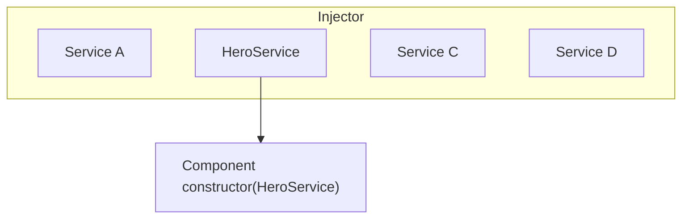

## What's next

<docs-pill-row>
  <docs-pill href="/guide/di/creating-injectable-service" title="Creating and injecting services"/>
</docs-pill-row>

# Injection context

The dependency injection (DI) system relies internally on a runtime context where the current injector is available.
This means that injectors can only work when code is executed in this context.

The injection context is available in these situations:

* Construction (via the `constructor`) of a class being instantiated by the DI system, such as an `@Injectable` or `@Component`.
* In the initializer for fields of such classes.
* In the factory function specified for `useFactory` of a `Provider` or an `@Injectable`.
* In the `factory` function specified for an `InjectionToken`.
* Within a stack frame that is run in a injection context.

Knowing when you are in an injection context, will allow you to use the [`inject`](api/core/inject) function to inject instances.

## Class constructors

Everytime the DI system instantiates a class, this is done in an injection context. This is being handled by the framework itself. The constructor of the class is executed in that runtime context thus allowing to inject a token using the [`inject`](api/core/inject) function.

<docs-code language="typescript" highlight="[[3],[6]]">
class MyComponent  {
  private service1: Service1;
  private service2: Service2 = inject(Service2); // In context

  constructor() {
    this.service1 = inject(HeroService) // In context
  }
}
</docs-code>

## Stack frame in context

Some APIs are designed to be run in an injection context. This is the case, for example, of the router guards. It allows the use of [`inject`](api/core/inject) to access a service within the guard function.

Here is an example for `CanActivateFn`

<docs-code language="typescript" highlight="[3]">
const canActivateTeam: CanActivateFn =
    (route: ActivatedRouteSnapshot, state: RouterStateSnapshot) => {
      return inject(PermissionsService).canActivate(inject(UserToken), route.params.id);
    };
</docs-code>

## Run within an injection context

When you want to run a given function in an injection context without being in one, you can do it with `runInInjectionContext`.
This requires to have access to a given injector like the `EnvironmentInjector` for example.

<docs-code header="src/app/heroes/hero.service.ts" language="typescript"
           highlight="[9]">
@Injectable({
  providedIn: 'root',
})
export class HeroService {
  private environmentInjector = inject(EnvironmentInjector);

  someMethod() {
    runInInjectionContext(this.environmentInjector, () => {
      inject(SomeService); // Do what you need with the injected service
    });
  }
}
</docs-code>

Note that `inject` will return an instance only if the injector can resolve the required token.

## Asserts the context

Angular provides `assertInInjectionContext` helper function to assert that the current context is an injection context.

## Using DI outside of a context

Calling [`inject`](api/core/inject) or calling `assertInInjectionContext` outside of an injection context will throw [error NG0203](/errors/NG0203).

# Hierarchical injectors

Injectors in Angular have rules that you can leverage to achieve the desired visibility of injectables in your applications.
By understanding these rules, you can determine whether to declare a provider at the application level, in a Component, or in a Directive.

The applications you build with Angular can become quite large, and one way to manage this complexity is to split up the application into a well-defined tree of components.

There can be sections of your page that work in a completely independent way than the rest of the application, with its own local copies of the services and other dependencies that it needs.
Some of the services that these sections of the application use might be shared with other parts of the application, or with parent components that are further up in the component tree, while other dependencies are meant to be private.

With hierarchical dependency injection, you can isolate sections of the application and give them their own private dependencies not shared with the rest of the application, or have parent components share certain dependencies with its child components only but not with the rest of the component tree, and so on. Hierarchical dependency injection enables you to share dependencies between different parts of the application only when and if you need to.

## Types of injector hierarchies

Angular has two injector hierarchies:

| Injector hierarchies        | Details |
|:---                         |:---     |
| `EnvironmentInjector` hierarchy | Configure an `ElementInjector` in this hierarchy using `@Injectable()` or `providers` array in `ApplicationConfig`. |
| `ElementInjector` hierarchy | Created implicitly at each DOM element. An `ElementInjector` is empty by default unless you configure it in the `providers` property on `@Directive()` or `@Component()`. |

<docs-callout title="NgModule Based Applications">
For `NgModule` based applications, you can provide dependencies with the `ModuleInjector` hierarchy using an `@NgModule()` or `@Injectable()` annotation.
</docs-callout>

### `EnvironmentInjector`

The `EnvironmentInjector` can be configured in one of two ways by using:

* The `@Injectable()` `providedIn` property to refer to `root` or `platform`
* The `ApplicationConfig` `providers` array

<docs-callout title="Tree-shaking and @Injectable()">

Using the `@Injectable()` `providedIn` property is preferable to using the `ApplicationConfig` `providers` array. With `@Injectable()` `providedIn`, optimization tools can perform tree-shaking, which removes services that your application isn't using. This results in smaller bundle sizes.

Tree-shaking is especially useful for a library because the application which uses the library may not have a need to inject it.

</docs-callout>

`EnvironmentInjector` is configured by the `ApplicationConfig.providers`.

Provide services using `providedIn` of `@Injectable()` as follows:

<docs-code language="typescript" highlight="[4]">
import { Injectable } from '@angular/core';

@Injectable({
  providedIn: 'root'  // <--provides this service in the root EnvironmentInjector
})
export class ItemService {
  name = 'telephone';
}

</docs-code>

The `@Injectable()` decorator identifies a service class.
The `providedIn` property configures a specific `EnvironmentInjector`, here `root`, which makes the service available in the `root` `EnvironmentInjector`.

### ModuleInjector

In the case of `NgModule` based applications, the ModuleInjector can be configured in one of two ways by using:

* The `@Injectable()` `providedIn` property to refer to `root` or `platform`
* The `@NgModule()` `providers` array

`ModuleInjector` is configured by the `@NgModule.providers` and `NgModule.imports` property. `ModuleInjector` is a flattening of all the providers arrays that can be reached by following the `NgModule.imports` recursively.

Child `ModuleInjector` hierarchies are created when lazy loading other `@NgModules`.

### Platform injector

There are two more injectors above `root`, an additional `EnvironmentInjector` and `NullInjector()`.

Consider how Angular bootstraps the application with the following in `main.ts`:

<docs-code language="javascript">
bootstrapApplication(AppComponent, appConfig);
</docs-code>

The `bootstrapApplication()` method creates a child injector of the platform injector which is configured by the `ApplicationConfig` instance.
This is the `root` `EnvironmentInjector`.

The `platformBrowserDynamic()` method creates an injector configured by a `PlatformModule`, which contains platform-specific dependencies.
This allows multiple applications to share a platform configuration.
For example, a browser has only one URL bar, no matter how many applications you have running.
You can configure additional platform-specific providers at the platform level by supplying `extraProviders` using the `platformBrowser()` function.

The next parent injector in the hierarchy is the `NullInjector()`, which is the top of the tree.
If you've gone so far up the tree that you are looking for a service in the `NullInjector()`, you'll get an error unless you've used `@Optional()` because ultimately, everything ends at the `NullInjector()` and it returns an error or, in the case of `@Optional()`, `null`.
For more information on `@Optional()`, see the [`@Optional()` section](#optional) of this guide.

The following diagram represents the relationship between the `root` `ModuleInjector` and its parent injectors as the previous paragraphs describe.

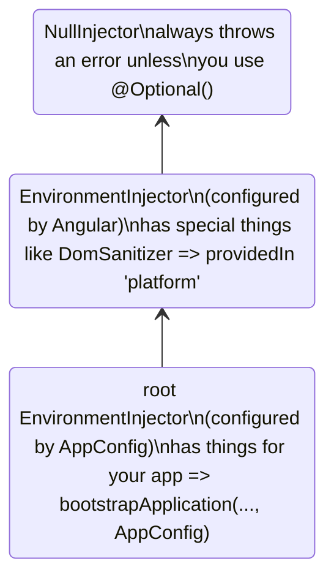

While the name `root` is a special alias, other `EnvironmentInjector` hierarchies don't have aliases.
You have the option to create `EnvironmentInjector` hierarchies whenever a dynamically loaded component is created, such as with the Router, which will create child `EnvironmentInjector` hierarchies.

All requests forward up to the root injector, whether you configured it with the `ApplicationConfig` instance passed to the `bootstrapApplication()` method, or registered all providers with `root` in their own services.

<docs-callout title="@Injectable() vs. ApplicationConfig">

If you configure an app-wide provider in the `ApplicationConfig` of `bootstrapApplication`, it overrides one configured for `root` in the `@Injectable()` metadata.
You can do this to configure a non-default provider of a service that is shared with multiple applications.

Here is an example of the case where the component router configuration includes a non-default [location strategy](guide/routing#location-strategy) by listing its provider in the `providers` list of the `ApplicationConfig`.

```ts
providers: [
  { provide: LocationStrategy, useClass: HashLocationStrategy }
]
```

For `NgModule` based applications, configure app-wide providers in the `AppModule` `providers`.

</docs-callout>

### `ElementInjector`

Angular creates `ElementInjector` hierarchies implicitly for each DOM element.

Providing a service in the `@Component()` decorator using its `providers` or `viewProviders` property configures an `ElementInjector`.
For example, the following `TestComponent` configures the `ElementInjector` by providing the service as follows:

<docs-code language="typescript" highlight="[3]">
@Component({
  …
  providers: [{ provide: ItemService, useValue: { name: 'lamp' } }]
})
export class TestComponent
</docs-code>

HELPFUL: See the [resolution rules](#resolution-rules) section to understand the relationship between the `EnvironmentInjector` tree, the `ModuleInjector` and the `ElementInjector` tree.

When you provide services in a component, that service is available by way of the `ElementInjector` at that component instance.
It may also be visible at child component/directives based on visibility rules described in the [resolution rules](#resolution-rules) section.

When the component instance is destroyed, so is that service instance.

#### `@Directive()` and `@Component()`

A component is a special type of directive, which means that just as `@Directive()` has a `providers` property, `@Component()` does too.
This means that directives as well as components can configure providers, using the `providers` property.
When you configure a provider for a component or directive using the `providers` property, that provider belongs to the `ElementInjector` of that component or directive.
Components and directives on the same element share an injector.

## Resolution rules

When resolving a token for a component/directive, Angular resolves it in two phases:

1. Against its parents in the `ElementInjector` hierarchy.
2. Against its parents in the `EnvironmentInjector` hierarchy.

When a component declares a dependency, Angular tries to satisfy that dependency with its own `ElementInjector`.
If the component's injector lacks the provider, it passes the request up to its parent component's `ElementInjector`.

The requests keep forwarding up until Angular finds an injector that can handle the request or runs out of ancestor `ElementInjector` hierarchies.

If Angular doesn't find the provider in any `ElementInjector` hierarchies, it goes back to the element where the request originated and looks in the `EnvironmentInjector` hierarchy.
If Angular still doesn't find the provider, it throws an error.

If you have registered a provider for the same DI token at different levels, the first one Angular encounters is the one it uses to resolve the dependency.
If, for example, a provider is registered locally in the component that needs a service,
Angular doesn't look for another provider of the same service.

HELPFUL: For `NgModule` based applications, Angular will search the `ModuleInjector` hierarchy if it cannot find a provider in the `ElementInjector` hierarchies.

## Resolution modifiers

Angular's resolution behavior can be modified with `@Optional()`, `@Self()`, `@SkipSelf()` and `@Host()`.
Import each of them from `@angular/core` and use each in the component class constructor or in the `inject` configuration when you inject your service.

### Types of modifiers

Resolution modifiers fall into three categories:

* What to do if Angular doesn't find what you're looking for, that is `@Optional()`
* Where to start looking, that is `@SkipSelf()`
* Where to stop looking, `@Host()` and `@Self()`

By default, Angular always starts at the current `Injector` and keeps searching all the way up.
Modifiers allow you to change the starting, or _self_, location and the ending location.

Additionally, you can combine all of the modifiers except:

* `@Host()` and `@Self()`
* `@SkipSelf()` and `@Self()`.

### `@Optional()`

`@Optional()` allows Angular to consider a service you inject to be optional.
This way, if it can't be resolved at runtime, Angular resolves the service as `null`, rather than throwing an error.
In the following example, the service, `OptionalService`, isn't provided in the service, `ApplicationConfig`, `@NgModule()`, or component class, so it isn't available anywhere in the app.

<docs-code header="src/app/optional/optional.component.ts" language="typescript">
export class OptionalComponent {
  constructor(@Optional() public optional?: OptionalService) {}
}
</docs-code>

### `@Self()`

Use `@Self()` so that Angular will only look at the `ElementInjector` for the current component or directive.

A good use case for `@Self()` is to inject a service but only if it is available on the current host element.
To avoid errors in this situation, combine `@Self()` with `@Optional()`.

For example, in the following `SelfComponent`, notice the injected `LeafService` in the constructor.

<docs-code header="src/app/self-no-data/self-no-data.component.ts" language="typescript"
           highlight="[7]">
@Component({
  selector: 'app-self-no-data',
  templateUrl: './self-no-data.component.html',
  styleUrls: ['./self-no-data.component.css']
})
export class SelfNoDataComponent {
  constructor(@Self() @Optional() public leaf?: LeafService) { }
}
</docs-code>

In this example, there is a parent provider and injecting the service will return the value, however, injecting the service with `@Self()` and `@Optional()` will return `null` because `@Self()` tells the injector to stop searching in the current host element.

Another example shows the component class with a provider for `FlowerService`.
In this case, the injector looks no further than the current `ElementInjector` because it finds the `FlowerService` and returns the tulip <code>&#x1F337;</code>.

<docs-code header="src/app/self/self.component.ts" path="adev/src/content/examples/resolution-modifiers/src/app/self/self.component.ts" visibleRegion="self-component"/>

### `@SkipSelf()`

`@SkipSelf()` is the opposite of `@Self()`.
With `@SkipSelf()`, Angular starts its search for a service in the parent `ElementInjector`, rather than in the current one.
So if the parent `ElementInjector` were using the fern <code>&#x1F33F;</code> value for `emoji`, but you had maple leaf <code>&#x1F341;</code> in the component's `providers` array, Angular would ignore maple leaf <code>&#x1F341;</code> and use fern <code>&#x1F33F;</code>.

To see this in code, assume that the following value for `emoji` is what the parent component were using, as in this service:

<docs-code header="src/app/leaf.service.ts" language="typescript">
export class LeafService {
  emoji = '🌿';
}
</docs-code>

Imagine that in the child component, you had a different value, maple leaf <code>&#x1F341;</code> but you wanted to use the parent's value instead.
This is when you'd use `@SkipSelf()`:

<docs-code header="src/app/skipself/skipself.component.ts" language="typescript"
           highlight="[[6],[10]]">
@Component({
  selector: 'app-skipself',
  templateUrl: './skipself.component.html',
  styleUrls: ['./skipself.component.css'],
  // Angular would ignore this LeafService instance
  providers: [{ provide: LeafService, useValue: { emoji: '🍁' } }]
})
export class SkipselfComponent {
  // Use @SkipSelf() in the constructor
  constructor(@SkipSelf() public leaf: LeafService) { }
}
</docs-code>

In this case, the value you'd get for `emoji` would be fern <code>&#x1F33F;</code>, not maple leaf <code>&#x1F341;</code>.

#### `@SkipSelf()` with `@Optional()`

Use `@SkipSelf()` with `@Optional()` to prevent an error if the value is `null`.

In the following example, the `Person` service is injected in the constructor.
`@SkipSelf()` tells Angular to skip the current injector and `@Optional()` will prevent an error should the `Person` service be `null`.

<docs-code language="typescript">
class Person {
  constructor(@Optional() @SkipSelf() parent?: Person) {}
}
</docs-code>

### `@Host()`

<!-- TODO: Remove ambiguity between @Host and @Self. -->

`@Host()` lets you designate a component as the last stop in the injector tree when searching for providers.

Even if there is a service instance further up the tree, Angular won't continue looking.
Use `@Host()` as follows:

<docs-code header="src/app/host/host.component.ts" language="typescript"
           highlight="[[6],[10]]">
@Component({
  selector: 'app-host',
  templateUrl: './host.component.html',
  styleUrls: ['./host.component.css'],
  //  provide the service
  providers: [{ provide: FlowerService, useValue: { emoji: '🌷' } }]
})
export class HostComponent {
  // use @Host() in the constructor when injecting the service
  constructor(@Host() @Optional() public flower?: FlowerService) { }
}
</docs-code>

Since `HostComponent` has `@Host()` in its constructor, no matter what the parent of `HostComponent` might have as a `flower.emoji` value, the `HostComponent` will use tulip <code>&#x1F337;</code>.

## Logical structure of the template

When you provide services in the component class, services are visible within the `ElementInjector` tree relative to where and how you provide those services.

Understanding the underlying logical structure of the Angular template will give you a foundation for configuring services and in turn control their visibility.

Components are used in your templates, as in the following example:

<docs-code language="html">
<app-root>
  <app-child></app-child>;
</app-root>
</docs-code>

HELPFUL: Usually, you declare the components and their templates in separate files.
For the purposes of understanding how the injection system works, it is useful to look at them from the point of view of a combined logical tree.
The term _logical_ distinguishes it from the render tree, which is your application's DOM tree.
To mark the locations of where the component templates are located, this guide uses the `<#VIEW>` pseudo-element, which doesn't actually exist in the render tree and is present for mental model purposes only.

The following is an example of how the `<app-root>` and `<app-child>` view trees are combined into a single logical tree:

<docs-code language="html">
<app-root>
  <#VIEW>
    <app-child>
     <#VIEW>
       …content goes here…
     </#VIEW>
    </app-child>
  </#VIEW>
</app-root>
</docs-code>

Understanding the idea of the `<#VIEW>` demarcation is especially significant when you configure services in the component class.

## Example: Providing services in `@Component()`

How you provide services using a `@Component()` (or `@Directive()`) decorator determines their visibility.
The following sections demonstrate `providers` and `viewProviders` along with ways to modify service visibility with `@SkipSelf()` and `@Host()`.

A component class can provide services in two ways:

| Arrays                       | Details |
|:---                          |:---     |
| With a `providers` array     | `@Component({ providers: [SomeService] })`     |
| With a `viewProviders` array | `@Component({ viewProviders: [SomeService] })` |

In the examples below, you will see the logical tree of an Angular application.
To illustrate how the injector works in the context of templates, the logical tree will represent the HTML structure of the application.
For example, the logical tree will show that `<child-component>` is a direct children of `<parent-component>`.

In the logical tree, you will see special attributes: `@Provide`, `@Inject`, and `@ApplicationConfig`.
These aren't real attributes but are here to demonstrate what is going on under the hood.

| Angular service attribute                                                                                          | Details |
|:---                                                                                                                |:---     |
| `@Inject(Token)=>Value`     | If `Token` is injected at this location in the logical tree, its value would be `Value`.     |
| `@Provide(Token=Value)`     | Indicates that `Token` is provided with `Value` at this location in the logical tree.        |
| `@ApplicationConfig` | Demonstrates that a fallback `EnvironmentInjector` should be used at this location.          |

### Example app structure

The example application has a `FlowerService` provided in `root` with an `emoji` value of red hibiscus <code>&#x1F33A;</code>.

<docs-code header="src/app/flower.service.ts" language="typescript">
@Injectable({
  providedIn: 'root'
})
export class FlowerService {
  emoji = '🌺';
}
</docs-code>

Consider an application with only an `AppComponent` and a `ChildComponent`.
The most basic rendered view would look like nested HTML elements such as the following:

<docs-code language="html">

<app-root> <!-- AppComponent selector -->
  <app-child> <!-- ChildComponent selector -->
  </app-child>
</app-root>

</docs-code>

However, behind the scenes, Angular uses a logical view representation as follows when resolving injection requests:

<docs-code language="html">
<app-root> <!-- AppComponent selector -->
  <#VIEW>
    <app-child> <!-- ChildComponent selector -->
      <#VIEW>
      </#VIEW>
    </app-child>
  </#VIEW>
</app-root>
</docs-code>

The `<#VIEW>` here represents an instance of a template.
Notice that each component has its own `<#VIEW>`.

Knowledge of this structure can inform how you provide and inject your services, and give you complete control of service visibility.

Now, consider that `<app-root>` injects the `FlowerService`:

<docs-code header="src/app/app.component.ts" language="typescript">
export class AppComponent  {
  constructor(public flower: FlowerService) {}
}
</docs-code>

Add a binding to the `<app-root>` template to visualize the result:

<docs-code header="src/app/app.component.html" language="html">
<p>Emoji from FlowerService: {{flower.emoji}}</p>
</docs-code>

The output in the view would be:

<docs-code language="shell">
Emoji from FlowerService: &#x1F33A;
</docs-code>

In the logical tree, this would be represented as follows:

<docs-code language="html" highlight="[[1],[2],[4]]">
<app-root @ApplicationConfig
        @Inject(FlowerService) flower=>"&#x1F33A;">
  <#VIEW>
    <p>Emoji from FlowerService: {{flower.emoji}} (&#x1F33A;)</p>
    <app-child>
      <#VIEW>
      </#VIEW>
    </app-child>
  </#VIEW>
</app-root>

</docs-code>

When `<app-root>` requests the `FlowerService`, it is the injector's job to resolve the `FlowerService` token.
The resolution of the token happens in two phases:

1. The injector determines the starting location in the logical tree and an ending location of the search.
    The injector begins with the starting location and looks for the token at each view level in the logical tree.
    If the token is found it is returned.

1. If the token is not found, the injector looks for the closest parent `EnvironmentInjector` to delegate the request to.

In the example case, the constraints are:

1. Start with `<#VIEW>` belonging to `<app-root>` and end with `<app-root>`.

    * Normally the starting point for search is at the point of injection.
        However, in this case `<app-root>` is a component. `@Component`s are special in that they also include their own `viewProviders`, which is why the search starts at `<#VIEW>` belonging to `<app-root>`.
        This would not be the case for a directive matched at the same location.
    * The ending location happens to be the same as the component itself, because it is the topmost component in this application.

1. The `ElementInjector` provided by the `ApplicationConfig` acts as the fallback injector when the injection token can't be found in the `ElementInjector` hierarchies.

### Using the `providers` array

Now, in the `ChildComponent` class, add a provider for `FlowerService` to demonstrate more complex resolution rules in the upcoming sections:

<docs-code header="src/app/child.component.ts" language="typescript"
           highlight="[[5,6],[10]]">
@Component({
  selector: 'app-child',
  templateUrl: './child.component.html',
  styleUrls: ['./child.component.css'],
  // use the providers array to provide a service
  providers: [{ provide: FlowerService, useValue: { emoji: '🌻' } }]
})
export class ChildComponent {
  // inject the service
  constructor( public flower: FlowerService) { }
}
</docs-code>

Now that the `FlowerService` is provided in the `@Component()` decorator, when the `<app-child>` requests the service, the injector has only to look as far as the `ElementInjector` in the `<app-child>`.
It won't have to continue the search any further through the injector tree.

The next step is to add a binding to the `ChildComponent` template.

<docs-code header="src/app/child.component.html" language="html">
<p>Emoji from FlowerService: {{flower.emoji}}</p>
</docs-code>

To render the new values, add `<app-child>` to the bottom of the `AppComponent` template so the view also displays the sunflower:

<docs-code language="shell">
Child Component
Emoji from FlowerService: &#x1F33B;
</docs-code>

In the logical tree, this is represented as follows:

<docs-code language="html">

<app-root @ApplicationConfig
        @Inject(FlowerService) flower=>"&#x1F33A;">
  <#VIEW>
    <p>Emoji from FlowerService: {{flower.emoji}} (&#x1F33A;)</p>
    <app-child @Provide(FlowerService="&#x1F33B;")
               @Inject(FlowerService)=>"&#x1F33B;"> <!-- search ends here -->
      <#VIEW> <!-- search starts here -->
        <h2>Child Component</h2>
        <p>Emoji from FlowerService: {{flower.emoji}} (&#x1F33B;)</p>
      </#VIEW>
    </app-child>
  </#VIEW>
</app-root>

</docs-code>

When `<app-child>` requests the `FlowerService`, the injector begins its search at the `<#VIEW>` belonging to `<app-child>` \(`<#VIEW>` is included because it is injected from `@Component()`\) and ends with `<app-child>`.
In this case, the `FlowerService` is resolved in the `providers` array with sunflower <code>&#x1F33B;</code> of the `<app-child>`.
The injector doesn't have to look any further in the injector tree.
It stops as soon as it finds the `FlowerService` and never sees the red hibiscus <code>&#x1F33A;</code>.

### Using the `viewProviders` array

Use the `viewProviders` array as another way to provide services in the `@Component()` decorator.
Using `viewProviders` makes services visible in the `<#VIEW>`.

HELPFUL: The steps are the same as using the `providers` array, with the exception of using the `viewProviders` array instead.

For step-by-step instructions, continue with this section.
If you can set it up on your own, skip ahead to [Modifying service availability](#visibility-of-provided-tokens).

For demonstration, we are building an `AnimalService` to demonstrate `viewProviders`.
First, create an `AnimalService` with an `emoji` property of whale <code>&#x1F433;</code>:

<docs-code header="src/app/animal.service.ts" language="typescript">
import { Injectable } from '@angular/core';

@Injectable({
  providedIn: 'root'
})
export class AnimalService {
  emoji = '🐳';
}
</docs-code>

Following the same pattern as with the `FlowerService`, inject the `AnimalService` in the `AppComponent` class:

<docs-code header="src/app/app.component.ts" language="typescript" highlight="[4]">
export class AppComponent {
  constructor(
    public flower: FlowerService,
    public animal: AnimalService) {}
}
</docs-code>

HELPFUL: You can leave all the `FlowerService` related code in place as it will allow a comparison with the `AnimalService`.

Add a `viewProviders` array and inject the `AnimalService` in the `<app-child>` class, too, but give `emoji` a different value.
Here, it has a value of dog <code>&#x1F436;</code>.

<docs-code header="src/app/child.component.ts" language="typescript"
           highlight="[[7],[11]]">
@Component({
  selector: 'app-child',
  templateUrl: './child.component.html',
  styleUrls: ['./child.component.css'],
  // provide services
  providers: [{ provide: FlowerService, useValue: { emoji: '🌻' } }],
  viewProviders: [{ provide: AnimalService, useValue: { emoji: '🐶' } }]
})
export class ChildComponent {
  // inject service
  constructor( public flower: FlowerService, public animal: AnimalService) { }
...
}
</docs-code>

Add bindings to the `ChildComponent` and the `AppComponent` templates.
In the `ChildComponent` template, add the following binding:

<docs-code header="src/app/child.component.html" language="html">
<p>Emoji from AnimalService: {{animal.emoji}}</p>
</docs-code>

Additionally, add the same to the `AppComponent` template:

<docs-code header="src/app/app.component.html" language="html">
<p>Emoji from AnimalService: {{animal.emoji}}</p>s
</docs-code>

Now you should see both values in the browser:

<docs-code hideCopy language="shell">

AppComponent
Emoji from AnimalService: &#x1F433;

Child Component
Emoji from AnimalService: &#x1F436;

</docs-code>

The logic tree for this example of `viewProviders` is as follows:

<docs-code language="html">

<app-root @ApplicationConfig
         @Inject(AnimalService) animal=>"&#x1F433;">
  <#VIEW>
    <app-child>
      <#VIEW @Provide(AnimalService="&#x1F436;")
            @Inject(AnimalService=>"&#x1F436;")>
       <!-- ^^using viewProviders means AnimalService is available in <#VIEW>-->
       <p>Emoji from AnimalService: {{animal.emoji}} (&#x1F436;)</p>
      </#VIEW>
    </app-child>
  </#VIEW>
</app-root>

</docs-code>

Just as with the `FlowerService` example, the `AnimalService` is provided in the `<app-child>` `@Component()` decorator.
This means that since the injector first looks in the `ElementInjector` of the component, it finds the `AnimalService` value of dog <code>&#x1F436;</code>.
It doesn't need to continue searching the `ElementInjector` tree, nor does it need to search the `ModuleInjector`.

### `providers` vs. `viewProviders`

The `viewProviders` field is conceptually similar to `providers`, but there is one notable difference.
Configured providers in `viewProviders` are not visible to projected content that ends up as a logical children of the component.

To see the difference between using `providers` and `viewProviders`, add another component to the example and call it `InspectorComponent`.
`InspectorComponent` will be a child of the `ChildComponent`.
In `inspector.component.ts`, inject the `FlowerService` and `AnimalService` in the constructor:

<docs-code header="src/app/inspector/inspector.component.ts" language="typescript">
export class InspectorComponent {
  constructor(public flower: FlowerService, public animal: AnimalService) { }
}
</docs-code>

You do not need a `providers` or `viewProviders` array.
Next, in `inspector.component.html`, add the same markup from previous components:

<docs-code header="src/app/inspector/inspector.component.html" language="html">
<p>Emoji from FlowerService: {{flower.emoji}}</p>
<p>Emoji from AnimalService: {{animal.emoji}}</p>
</docs-code>

Remember to add the `InspectorComponent` to the `ChildComponent` `imports` array.

<docs-code header="src/app/child/child.component.ts" language="typescript"
           highlight="[3]">
@Component({
  ...
  imports: [InspectorComponent]
})

</docs-code>

Next, add the following to `child.component.html`:

<docs-code header="src/app/child/child.component.html" language="html"
           highlight="[3,9]">
...

<div class="container">
  <h3>Content projection</h3>
  <ng-content></ng-content>
</div>
<h3>Inside the view</h3>

<app-inspector></app-inspector>
</docs-code>

`<ng-content>` allows you to project content, and `<app-inspector>` inside the `ChildComponent` template makes the `InspectorComponent` a child component of `ChildComponent`.

Next, add the following to `app.component.html` to take advantage of content projection.

<docs-code header="src/app/app.component.html" language="html" highlight="[2]">
<app-child>
  <app-inspector></app-inspector>
</app-child>
</docs-code>

The browser now renders the following, omitting the previous examples for brevity:

<docs-code hideCopy language="shell">
...
Content projection

Emoji from FlowerService: &#x1F33B;
Emoji from AnimalService: &#x1F433;

Emoji from FlowerService: &#x1F33B;
Emoji from AnimalService: &#x1F436;

</docs-code>

These four bindings demonstrate the difference between `providers` and `viewProviders`.
Remember that the dog emoji <code>&#x1F436;</code> is declared inside the `<#VIEW>` of `ChildComponent` and isn't visible to the projected content.
Instead, the projected content sees the whale <code>&#x1F433;</code>.

However, in the next output section though, the `InspectorComponent` is an actual child component of `ChildComponent`, `InspectorComponent` is inside the `<#VIEW>`, so when it asks for the `AnimalService`, it sees the dog <code>&#x1F436;</code>.

The `AnimalService` in the logical tree would look like this:

<docs-code language="html">

<app-root @ApplicationConfig
         @Inject(AnimalService) animal=>"&#x1F433;">
  <#VIEW>
    <app-child>
      <#VIEW @Provide(AnimalService="&#x1F436;")
            @Inject(AnimalService=>"&#x1F436;")>
        <!-- ^^using viewProviders means AnimalService is available in <#VIEW>-->
        <p>Emoji from AnimalService: {{animal.emoji}} (&#x1F436;)</p>

        <div class="container">
          <h3>Content projection</h3>
          <app-inspector @Inject(AnimalService) animal=>"&#x1F433;">
            <p>Emoji from AnimalService: {{animal.emoji}} (&#x1F433;)</p>
          </app-inspector>
        </div>

        <app-inspector>
          <#VIEW @Inject(AnimalService) animal=>"&#x1F436;">
            <p>Emoji from AnimalService: {{animal.emoji}} (&#x1F436;)</p>
          </#VIEW>
        </app-inspector>
      </#VIEW>
    </app-child>
  </#VIEW>
</app-root>

</docs-code>

The projected content of `<app-inspector>` sees the whale <code>&#x1F433;</code>, not the dog <code>&#x1F436;</code>, because the dog <code>&#x1F436;</code> is inside the `<app-child>` `<#VIEW>`.
The `<app-inspector>` can only see the dog <code>&#x1F436;</code> if it is also within the `<#VIEW>`.

### Visibility of provided tokens

Visibility decorators influence where the search for the injection token begins and ends in the logic tree.
To do this, place visibility decorators at the point of injection, that is, the `constructor()`, rather than at a point of declaration.

To alter where the injector starts looking for `FlowerService`, add `@SkipSelf()` to the `<app-child>` `@Inject` declaration where `FlowerService` is injected.
This declaration is in the `<app-child>` constructor as shown in `child.component.ts`:

<docs-code language="typescript">
constructor(@SkipSelf() public flower: FlowerService) { }
</docs-code>

With `@SkipSelf()`, the `<app-child>` injector doesn't look to itself for the `FlowerService`.
Instead, the injector starts looking for the `FlowerService` at the `ElementInjector` of the `<app-root>`, where it finds nothing.
Then, it goes back to the `<app-child>` `ModuleInjector` and finds the red hibiscus <code>&#x1F33A;</code> value, which is available because `<app-child>` and `<app-root>` share the same `ModuleInjector`.
The UI renders the following:

<docs-code hideCopy language="shell">

Emoji from FlowerService: &#x1F33A;

</docs-code>

In a logical tree, this same idea might look like this:

<docs-code language="html">

<app-root @ApplicationConfig
        @Inject(FlowerService) flower=>"&#x1F33A;">
  <#VIEW>
    <app-child @Provide(FlowerService="&#x1F33B;")>
      <#VIEW @Inject(FlowerService, SkipSelf)=>"&#x1F33A;">
        <!-- With SkipSelf, the injector looks to the next injector up the tree (app-root) -->
      </#VIEW>
    </app-child>
  </#VIEW>
</app-root>

</docs-code>

Though `<app-child>` provides the sunflower <code>&#x1F33B;</code>, the application renders the red hibiscus <code>&#x1F33A;</code> because `@SkipSelf()` causes the current injector (`app-child`) to skip itself and look to its parent.

If you now add `@Host()` (in addition to the `@SkipSelf()`), the result will be `null`.
This is because `@Host()` limits the upper bound of the search to the `app-child` `<#VIEW>`.
Here's the idea in the logical tree:

<docs-code language="html">

<app-root @ApplicationConfig
        @Inject(FlowerService) flower=>"&#x1F33A;">
  <#VIEW> <!-- end search here with null-->
    <app-child @Provide(FlowerService="&#x1F33B;")> <!-- start search here -->
      <#VIEW @Inject(FlowerService, @SkipSelf, @Host, @Optional)=>null>
      </#VIEW>
      </app-parent>
  </#VIEW>
</app-root>

</docs-code>

Here, the services and their values are the same, but `@Host()` stops the injector from looking any further than the `<#VIEW>` for `FlowerService`, so it doesn't find it and returns `null`.

### `@SkipSelf()` and `viewProviders`

Remember, `<app-child>` provides the `AnimalService` in the `viewProviders` array with the value of dog <code>&#x1F436;</code>.
Because the injector has only to look at the `ElementInjector` of the `<app-child>` for the `AnimalService`, it never sees the whale <code>&#x1F433;</code>.

As in the `FlowerService` example, if you add `@SkipSelf()` to the constructor for the `AnimalService`, the injector won't look in the  `ElementInjector` of the current `<app-child>` for the `AnimalService`.
Instead, the injector will begin at the `<app-root>` `ElementInjector`.

<docs-code language="typescript" highlight="[6]">
@Component({
  standalone: true,
  selector: 'app-child',
  …
  viewProviders: [
    { provide: AnimalService, useValue: { emoji: '&#x1F436;' } },
  ],
})
</docs-code>

The logical tree looks like this with `@SkipSelf()` in `<app-child>`:

<docs-code language="html">

<app-root @ApplicationConfig
          @Inject(AnimalService=>"&#x1F433;")>
  <#VIEW><!-- search begins here -->
    <app-child>
      <#VIEW @Provide(AnimalService="&#x1F436;")
             @Inject(AnimalService, SkipSelf=>"&#x1F433;")>
        <!--Add @SkipSelf -->
      </#VIEW>
    </app-child>
  </#VIEW>
</app-root>

</docs-code>

With `@SkipSelf()` in the `<app-child>`, the injector begins its search for the `AnimalService` in the `<app-root>` `ElementInjector` and finds whale <code>&#x1F433;</code>.

### `@Host()` and `viewProviders`

If you just use `@Host()` for the injection of `AnimalService`, the result is dog <code>&#x1F436;</code> because the injector finds the `AnimalService` in the `<app-child>` `<#VIEW>` itself.
The `ChildComponent` configures the `viewProviders` so that the dog emoji is provided as `AnimalService` value.
You can also see `@Host()` in the constructor:

<docs-code language="typescript" highlight="[[6],[10]]">
@Component({
  standalone: true
  selector: 'app-child',
  …
  viewProviders: [
    { provide: AnimalService, useValue: { emoji: '&#x1F436;' } },
  ]
})
export class ChildComponent {
  constructor(@Host() public animal: AnimalService) { }
}
</docs-code>

`@Host()` causes the injector to look until it encounters the edge of the `<#VIEW>`.

<docs-code language="html">

<app-root @ApplicationConfig
          @Inject(AnimalService=>"&#x1F433;")>
  <#VIEW>
    <app-child>
      <#VIEW @Provide(AnimalService="&#x1F436;")
             @Inject(AnimalService, @Host=>"&#x1F436;")> <!-- @Host stops search here -->
      </#VIEW>
    </app-child>
  </#VIEW>
</app-root>

</docs-code>

Add a `viewProviders` array with a third animal, hedgehog <code>&#x1F994;</code>, to the `app.component.ts` `@Component()` metadata:

<docs-code language="typescript" highlight="[7]">
@Component({
  standalone: true,
  selector: 'app-root',
  templateUrl: './app.component.html',
  styleUrls: [ './app.component.css' ],
  viewProviders: [
    { provide: AnimalService, useValue: { emoji: '&#x1F994;' } },
  ],
})

</docs-code>

Next, add `@SkipSelf()` along with `@Host()` to the constructor for the `AnimalService` injection in `child.component.ts`.
Here are `@Host()` and `@SkipSelf()` in the `<app-child>` constructor:

<docs-code language="typescript" highlight="[4]">
export class ChildComponent {

  constructor(
    @Host() @SkipSelf() public animal: AnimalService) { }
}

</docs-code>

<!-- TODO: This requires a rework. It seems not well explained what `viewProviders`/`injectors` is here
  and how `@Host()` works.
 -->

When `@Host()` and `@SkipSelf()` were applied to the `FlowerService`, which is in the `providers` array, the result was `null` because `@SkipSelf()` starts its search in the `<app-child>` injector, but `@Host()` stops searching at `<#VIEW>` —where there is no `FlowerService`
In the logical tree, you can see that the `FlowerService` is visible in `<app-child>`, not its `<#VIEW>`.

However, the `AnimalService`, which is provided in the `AppComponent` `viewProviders` array, is visible.

The logical tree representation shows why this is:

<docs-code language="html">

<app-root @ApplicationConfig
        @Inject(AnimalService=>"&#x1F433;")>
  <#VIEW @Provide(AnimalService="&#x1F994;")
         @Inject(AnimalService, @Optional)=>"&#x1F994;">
    <!-- ^^@SkipSelf() starts here,  @Host() stops here^^ -->
    <app-child>
      <#VIEW @Provide(AnimalService="&#x1F436;")
             @Inject(AnimalService, @SkipSelf, @Host, @Optional)=>"&#x1F994;">
               <!-- Add @SkipSelf ^^-->
      </#VIEW>
      </app-child>
  </#VIEW>
</app-root>

</docs-code>

`@SkipSelf()`, causes the injector to start its search for the `AnimalService` at the `<app-root>`, not the `<app-child>`, where the request originates, and `@Host()` stops the search at the `<app-root>` `<#VIEW>`.
Since `AnimalService` is provided by way of the `viewProviders` array, the injector finds hedgehog <code>&#x1F994;</code> in the `<#VIEW>`.

## Example: `ElementInjector` use cases

The ability to configure one or more providers at different levels opens up useful possibilities.

### Scenario: service isolation

Architectural reasons may lead you to restrict access to a service to the application domain where it belongs.
For example, consider we build a `VillainsListComponent` that displays a list of villains.
It gets those villains from a `VillainsService`.

If you provide `VillainsService` in the root `AppModule`, it will make `VillainsService` visible everywhere in the application.
If you later modify the `VillainsService`, you could break something in other components that started depending this service by accident.

Instead, you should provide the `VillainsService` in the `providers` metadata of the `VillainsListComponent` like this:

<docs-code header="src/app/villains-list.component.ts (metadata)" language="typescript"
           highlight="[4]">
@Component({
  selector: 'app-villains-list',
  templateUrl: './villains-list.component.html',
  providers: [VillainsService]
})
export class VillainsListComponent {}
</docs-code>

By providing `VillainsService` in the `VillainsListComponent` metadata and nowhere else, the service becomes available only in the `VillainsListComponent` and its subcomponent tree.

`VillainService` is a singleton with respect to `VillainsListComponent` because that is where it is declared.
As long as `VillainsListComponent` does not get destroyed it will be the same instance of `VillainService` but if there are multiple instances of `VillainsListComponent`, then each instance of `VillainsListComponent` will have its own instance of `VillainService`.

### Scenario: multiple edit sessions

Many applications allow users to work on several open tasks at the same time.
For example, in a tax preparation application, the preparer could be working on several tax returns, switching from one to the other throughout the day.

To demonstrate that scenario, imagine a `HeroListComponent` that displays a list of super heroes.

To open a hero's tax return, the preparer clicks on a hero name, which opens a component for editing that return.
Each selected hero tax return opens in its own component and multiple returns can be open at the same time.

Each tax return component has the following characteristics:

* Is its own tax return editing session
* Can change a tax return without affecting a return in another component
* Has the ability to save the changes to its tax return or cancel them

Suppose that the `HeroTaxReturnComponent` had logic to manage and restore changes.
That would be a straightforward task for a hero tax return.
In the real world, with a rich tax return data model, the change management would be tricky.
You could delegate that management to a helper service, as this example does.

The `HeroTaxReturnService` caches a single `HeroTaxReturn`, tracks changes to that return, and can save or restore it.
It also delegates to the application-wide singleton `HeroService`, which it gets by injection.

<docs-code header="src/app/hero-tax-return.service.ts" language="typescript">
import { Injectable } from '@angular/core';
import { HeroTaxReturn } from './hero';
import { HeroesService } from './heroes.service';

@Injectable()
export class HeroTaxReturnService {
  private currentTaxReturn!: HeroTaxReturn;
  private originalTaxReturn!: HeroTaxReturn;

  constructor(private heroService: HeroesService) {}

  set taxReturn(htr: HeroTaxReturn) {
    this.originalTaxReturn = htr;
    this.currentTaxReturn  = htr.clone();
  }

  get taxReturn(): HeroTaxReturn {
    return this.currentTaxReturn;
  }

  restoreTaxReturn() {
    this.taxReturn = this.originalTaxReturn;
  }

  saveTaxReturn() {
    this.taxReturn = this.currentTaxReturn;
    this.heroService.saveTaxReturn(this.currentTaxReturn).subscribe();
  }
}
</docs-code>

Here is the `HeroTaxReturnComponent` that makes use of `HeroTaxReturnService`.

<docs-code header="src/app/hero-tax-return.component.ts" language="typescript">
import { Component, EventEmitter, Input, Output } from '@angular/core';
import { HeroTaxReturn } from './hero';
import { HeroTaxReturnService } from './hero-tax-return.service';

@Component({
  selector: 'app-hero-tax-return',
  templateUrl: './hero-tax-return.component.html',
  styleUrls: [ './hero-tax-return.component.css' ],
  providers: [ HeroTaxReturnService ]
})
export class HeroTaxReturnComponent {
  message = '';

  @Output() close = new EventEmitter<void>();

  get taxReturn(): HeroTaxReturn {
    return this.heroTaxReturnService.taxReturn;
  }

  @Input()
  set taxReturn(htr: HeroTaxReturn) {
    this.heroTaxReturnService.taxReturn = htr;
  }

  constructor(private heroTaxReturnService: HeroTaxReturnService) {}

  onCanceled()  {
    this.flashMessage('Canceled');
    this.heroTaxReturnService.restoreTaxReturn();
  }

  onClose() { this.close.emit(); }

  onSaved() {
    this.flashMessage('Saved');
    this.heroTaxReturnService.saveTaxReturn();
  }

  flashMessage(msg: string) {
    this.message = msg;
    setTimeout(() => this.message = '', 500);
  }
}
</docs-code>

The _tax-return-to-edit_ arrives by way of the `@Input()` property, which is implemented with getters and setters.
The setter initializes the component's own instance of the `HeroTaxReturnService` with the incoming return.
The getter always returns what that service says is the current state of the hero.
The component also asks the service to save and restore this tax return.

This won't work if the service is an application-wide singleton.
Every component would share the same service instance, and each component would overwrite the tax return that belonged to another hero.

To prevent this, configure the component-level injector of `HeroTaxReturnComponent` to provide the service, using the `providers` property in the component metadata.

<docs-code header="src/app/hero-tax-return.component.ts (providers)" language="typescript">
providers: [HeroTaxReturnService]
</docs-code>

The `HeroTaxReturnComponent` has its own provider of the `HeroTaxReturnService`.
Recall that every component _instance_ has its own injector.
Providing the service at the component level ensures that _every_ instance of the component gets a private instance of the service. This makes sure that no tax return gets overwritten.

HELPFUL: The rest of the scenario code relies on other Angular features and techniques that you can learn about elsewhere in the documentation.

### Scenario: specialized providers

Another reason to provide a service again at another level is to substitute a _more specialized_ implementation of that service, deeper in the component tree.

For example, consider a `Car` component that includes tire service information and depends on other services to provide more details about the car.

The root injector, marked as (A), uses _generic_ providers for details about `CarService` and `EngineService`.

1. `Car` component (A).  Component (A) displays tire service data about a car and specifies generic services to provide more information about the car.

2. Child component (B). Component (B) defines its own, _specialized_ providers for `CarService` and `EngineService` that have special capabilities suitable for what's going on in component (B).

3. Child component (C) as a child of Component (B). Component (C) defines its own, even _more specialized_ provider for `CarService`.

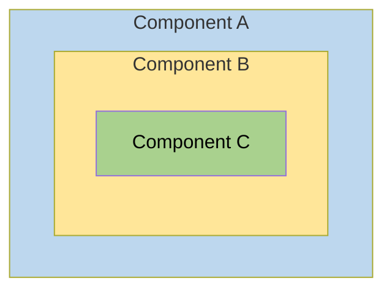

Behind the scenes, each component sets up its own injector with zero, one, or more providers defined for that component itself.

When you resolve an instance of `Car` at the deepest component (C), its injector produces:

* An instance of `Car` resolved by injector (C)
* An `Engine` resolved by injector (B)
* Its `Tires` resolved by the root injector (A).

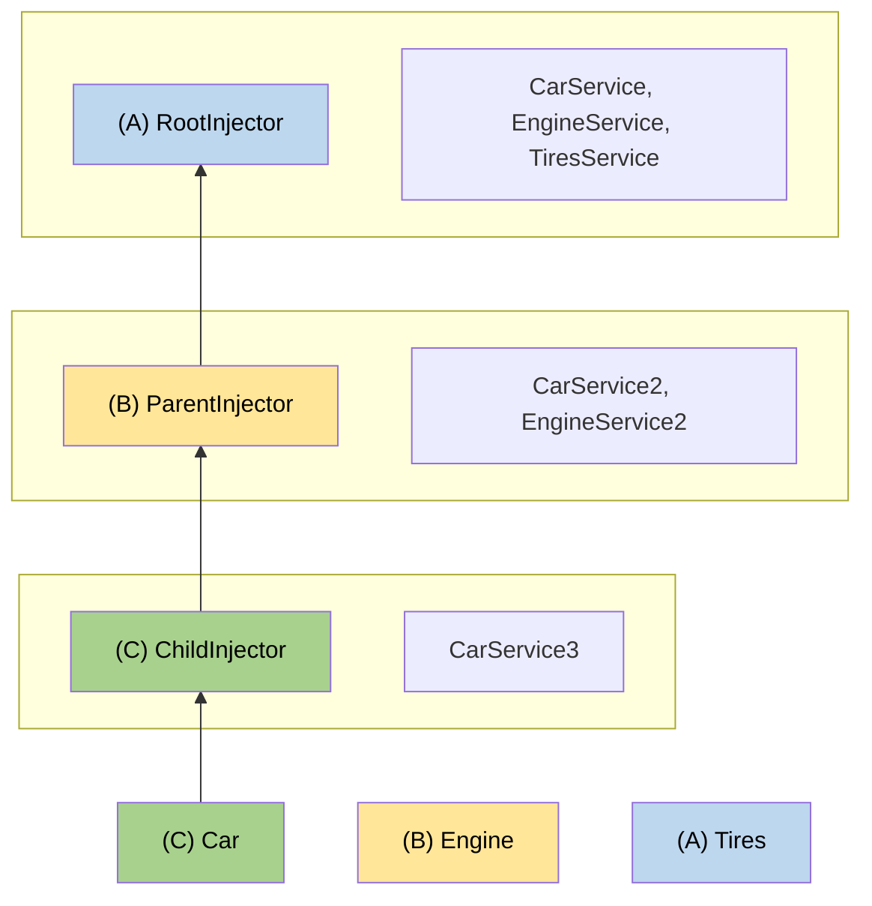

## More on dependency injection

<docs-pill-row>
  <docs-pill href="/guide/di/dependency-injection-providers" title="DI Providers"/>
</docs-pill-row>

# Optimizing client application size with lightweight injection tokens

This page provides a conceptual overview of a dependency injection technique that is recommended for library developers.
Designing your library with *lightweight injection tokens* helps optimize the bundle size of client applications that use your library.

You can manage the dependency structure among your components and injectable services to optimize bundle size by using tree-shakable providers.
This normally ensures that if a provided component or service is never actually used by the application, the compiler can remove its code from the bundle.

Due to the way Angular stores injection tokens, it is possible that such an unused component or service can end up in the bundle anyway.
This page describes a dependency-injection design pattern that supports proper tree-shaking by using lightweight injection tokens.

The lightweight injection token design pattern is especially important for library developers.
It ensures that when an application uses only some of your library's capabilities, the unused code can be eliminated from the client's application bundle.

When an application uses your library, there might be some services that your library supplies which the client application doesn't use.
In this case, the application developer should expect that service to be tree-shaken, and not contribute to the size of the compiled application.
Because the application developer cannot know about or remedy a tree-shaking problem in the library, it is the responsibility of the library developer to do so.
To prevent the retention of unused components, your library should use the lightweight injection token design pattern.

## When tokens are retained

To better explain the condition under which token retention occurs, consider a library that provides a library-card component.
This component contains a body and can contain an optional header.

<docs-code language="html">

<lib-card>;
  <lib-header>…</lib-header>;
</lib-card>;

</docs-code>

In a likely implementation, the `<lib-card>` component uses `@ContentChild()` or `@ContentChildren()` to get `<lib-header>` and `<lib-body>`, as in the following.

<docs-code language="typescript" highlight="[12]">
@Component({
  selector: 'lib-header',
  …,
})
class LibHeaderComponent {}

@Component({
  selector: 'lib-card',
  …,
})
class LibCardComponent {
  @ContentChild(LibHeaderComponent) header: LibHeaderComponent|null = null;
}

</docs-code>

Because `<lib-header>` is optional, the element can appear in the template in its minimal form, `<lib-card></lib-card>`.
In this case, `<lib-header>` is not used and you would expect it to be tree-shaken, but that is not what happens.
This is because `LibCardComponent` actually contains two references to the `LibHeaderComponent`.

<docs-code language="typescript">
@ContentChild(LibHeaderComponent) header: LibHeaderComponent;
</docs-code>

* One of these reference is in the *type position*-- that is, it specifies `LibHeaderComponent` as a type: `header: LibHeaderComponent;`.
* The other reference is in the *value position*-- that is, LibHeaderComponent is the value of the `@ContentChild()` parameter decorator: `@ContentChild(LibHeaderComponent)`.

The compiler handles token references in these positions differently.

* The compiler erases *type position* references after conversion from TypeScript, so they have no impact on tree-shaking.
* The compiler must keep *value position* references at runtime, which **prevents** the component from being tree-shaken.

In the example, the compiler retains the `LibHeaderComponent` token that occurs in the value position.
This prevents the referenced component from being tree-shaken, even if the application does not actually use `<lib-header>` anywhere.
If `LibHeaderComponent` 's code, template, and styles combined becomes too large, including it unnecessarily can significantly increase the size of the client application.

## When to use the lightweight injection token pattern

The tree-shaking problem arises when a component is used as an injection token.
There are two cases when that can happen.

* The token is used in the value position of a [content query](guide/components/queries#content-queries).
* The token is used as a type specifier for constructor injection.

In the following example, both uses of the `OtherComponent` token cause retention of `OtherComponent`, preventing it from being tree-shaken when it is not used.

<docs-code language="typescript" highlight="[[2],[4]]">
class MyComponent {
  constructor(@Optional() other: OtherComponent) {}

  @ContentChild(OtherComponent) other: OtherComponent|null;
}
</docs-code>

Although tokens used only as type specifiers are removed when converted to JavaScript, all tokens used for dependency injection are needed at runtime.
These effectively change `constructor(@Optional() other: OtherComponent)` to `constructor(@Optional() @Inject(OtherComponent) other)`.
The token is now in a value position, and causes the tree shaker to keep the reference.

HELPFUL: For all services, a library should use [tree-shakable providers](guide/di/dependency-injection#providing-dependency), providing dependencies at the root level rather than in components or modules.

## Using lightweight injection tokens

The lightweight injection token design pattern consists of using a small abstract class as an injection token, and providing the actual implementation at a later stage.
The abstract class is retained, not tree-shaken, but it is small and has no material impact on the application size.

The following example shows how this works for the `LibHeaderComponent`.

<docs-code language="typescript" language="[[1],[6],[17]]">
abstract class LibHeaderToken {}

@Component({
  selector: 'lib-header',
  providers: [
    {provide: LibHeaderToken, useExisting: LibHeaderComponent}
  ]
  …,
})
class LibHeaderComponent extends LibHeaderToken {}

@Component({
  selector: 'lib-card',
  …,
})
class LibCardComponent {
  @ContentChild(LibHeaderToken) header: LibHeaderToken|null = null;
}
</docs-code>

In this example, the `LibCardComponent` implementation no longer refers to `LibHeaderComponent` in either the type position or the value position.
This lets full tree shaking of `LibHeaderComponent` take place.
The `LibHeaderToken` is retained, but it is only a class declaration, with no concrete implementation.
It is small and does not materially impact the application size when retained after compilation.

Instead, `LibHeaderComponent` itself implements the abstract `LibHeaderToken` class.
You can safely use that token as the provider in the component definition, allowing Angular to correctly inject the concrete type.

To summarize, the lightweight injection token pattern consists of the following.

1. A lightweight injection token that is represented as an abstract class.
1. A component definition that implements the abstract class.
1. Injection of the lightweight pattern, using `@ContentChild()` or `@ContentChildren()`.
1. A provider in the implementation of the lightweight injection token which associates the lightweight injection token with the implementation.

### Use the lightweight injection token for API definition

A component that injects a lightweight injection token might need to invoke a method in the injected class.
The token is now an abstract class. Since the injectable component implements that class, you must also declare an abstract method in the abstract lightweight injection token class.
The implementation of the method, with all its code overhead, resides in the injectable component that can be tree-shaken.
This lets the parent communicate with the child, if it is present, in a type-safe manner.

For example, the `LibCardComponent` now queries `LibHeaderToken` rather than `LibHeaderComponent`.
The following example shows how the pattern lets `LibCardComponent` communicate with the `LibHeaderComponent` without actually referring to `LibHeaderComponent`.

<docs-code language="typescript" highlight="[[3],[13,16],[27]]">
abstract class LibHeaderToken {
  abstract doSomething(): void;
}

@Component({
  selector: 'lib-header',
  providers: [
    {provide: LibHeaderToken, useExisting: LibHeaderComponent}
  ]
  …,
})
class LibHeaderComponent extends LibHeaderToken {
  doSomething(): void {
    // Concrete implementation of `doSomething`
  }
}

@Component({
  selector: 'lib-card',
  …,
})
class LibCardComponent implement AfterContentInit {
  @ContentChild(LibHeaderToken) header: LibHeaderToken|null = null;

  ngAfterContentInit(): void {
    if (this.header !== null) {
      this.header?.doSomething();
    }
  }
}
</docs-code>

In this example the parent queries the token to get the child component, and stores the resulting component reference if it is present.
Before calling a method in the child, the parent component checks to see if the child component is present.
If the child component has been tree-shaken, there is no runtime reference to it, and no call to its method.

### Naming your lightweight injection token

Lightweight injection tokens are only useful with components.
The Angular style guide suggests that you name components using the "Component" suffix.
The example "LibHeaderComponent" follows this convention.

You should maintain the relationship between the component and its token while still distinguishing between them.
The recommended style is to use the component base name with the suffix "`Token`" to name your lightweight injection tokens: "`LibHeaderToken`."

<docs-decorative-header title="Forms in Angular" imgSrc="adev/src/assets/images/overview.svg"> <!-- markdownlint-disable-line -->
Handling user input with forms is the cornerstone of many common applications.
</docs-decorative-header>

Applications use forms to enable users to log in, to update a profile, to enter sensitive information, and to perform many other data-entry tasks.

Angular provides two different approaches to handling user input through forms: reactive and template-driven.
Both capture user input events from the view, validate the user input, create a form model and data model to update, and provide a way to track changes.

This guide provides information to help you decide which type of form works best for your situation.
It introduces the common building blocks used by both approaches.
It also summarizes the key differences between the two approaches, and demonstrates those differences in the context of setup, data flow, and testing.

## Choosing an approach

Reactive forms and template-driven forms process and manage form data differently.
Each approach offers different advantages.

| Forms                 | Details |
|:---                   |:---     |
| Reactive forms        | Provide direct, explicit access to the underlying form's object model. Compared to template-driven forms, they are more robust: they're more scalable, reusable, and testable. If forms are a key part of your application, or you're already using reactive patterns for building your application, use reactive forms.                                                                                             |
| Template-driven forms | Rely on directives in the template to create and manipulate the underlying object model. They are useful for adding a simple form to an app, such as an email list signup form. They're straightforward to add to an app, but they don't scale as well as reactive forms. If you have very basic form requirements and logic that can be managed solely in the template, template-driven forms could be a good fit. |

### Key differences

The following table summarizes the key differences between reactive and template-driven forms.

|                                                    | Reactive                             | Template-driven                 |
|:---                                                |:---                                  |:---                             |
| [Setup of form model](#setting-up-the-form-model)  | Explicit, created in component class | Implicit, created by directives |
| [Data model](#mutability-of-the-data-model)        | Structured and immutable             | Unstructured and mutable        |
| [Data flow](#data-flow-in-forms)                     | Synchronous                          | Asynchronous                    |
| [Form validation](#form-validation)                | Functions                            | Directives                      |

### Scalability

If forms are a central part of your application, scalability is very important.
Being able to reuse form models across components is critical.

Reactive forms are more scalable than template-driven forms.
They provide direct access to the underlying form API, and use [synchronous data flow](#data-flow-in-reactive-forms) between the view and the data model, which makes creating large-scale forms easier.
Reactive forms require less setup for testing, and testing does not require deep understanding of change detection to properly test form updates and validation.

Template-driven forms focus on simple scenarios and are not as reusable.
They abstract away the underlying form API, and use [asynchronous data flow](#data-flow-in-template-driven-forms) between the view and the data model.
The abstraction of template-driven forms also affects testing.
Tests are deeply reliant on manual change detection execution to run properly, and require more setup.

## Setting up the form model

Both reactive and template-driven forms track value changes between the form input elements that users interact with and the form data in your component model.
The two approaches share underlying building blocks, but differ in how you create and manage the common form-control instances.

### Common form foundation classes

Both reactive and template-driven forms are built on the following base classes.

| Base classes           | Details |
|:---                    |:---     |
| `FormControl`          | Tracks the value and validation status of an individual form control.               |
| `FormGroup`            | Tracks the same values and status for a collection of form controls.                |
| `FormArray`            | Tracks the same values and status for an array of form controls.                    |
| `ControlValueAccessor` | Creates a bridge between Angular `FormControl` instances and built-in DOM elements. |

### Setup in reactive forms

With reactive forms, you define the form model directly in the component class.
The `[formControl]` directive links the explicitly created `FormControl` instance to a specific form element in the view, using an internal value accessor.

The following component implements an input field for a single control, using reactive forms.
In this example, the form model is the `FormControl` instance.

<docs-code path="adev/src/content/examples/forms-overview/src/app/reactive/favorite-color/favorite-color.component.ts"/>

IMPORTANT: In reactive forms, the form model is the source of truth; it provides the value and status of the form element at any given point in time, through the `[formControl]` directive on the `<input>` element.

### Setup in template-driven forms

In template-driven forms, the form model is implicit, rather than explicit.
The directive `NgModel` creates and manages a `FormControl` instance for a given form element.

The following component implements the same input field for a single control, using template-driven forms.

<docs-code path="adev/src/content/examples/forms-overview/src/app/template/favorite-color/favorite-color.component.ts"/>

IMPORTANT: In a template-driven form the source of truth is the template. The `NgModel` directive automatically manages the `FormControl` instance for you.

## Data flow in forms

When an application contains a form, Angular must keep the view in sync with the component model and the component model in sync with the view.
As users change values and make selections through the view, the new values must be reflected in the data model.
Similarly, when the program logic changes values in the data model, those values must be reflected in the view.

Reactive and template-driven forms differ in how they handle data flowing from the user or from programmatic changes.
The following diagrams illustrate both kinds of data flow for each type of form, using the favorite-color input field defined above.

### Data flow in reactive forms

In reactive forms each form element in the view is directly linked to the form model (a `FormControl` instance).
Updates from the view to the model and from the model to the view are synchronous and do not depend on how the UI is rendered.

The view-to-model diagram shows how data flows when an input field's value is changed from the view through the following steps.

1. The user types a value into the input element, in this case the favorite color *Blue*.
1. The form input element emits an "input" event with the latest value.
1. The `ControlValueAccessor` listening for events on the form input element immediately relays the new value to the `FormControl` instance.
1. The `FormControl` instance emits the new value through the `valueChanges` observable.
1. Any subscribers to the `valueChanges` observable receive the new value.

```mermaid
flowchart TB
    U{User}
    I("<input>")
    CVA(ControlValueAccessor)
    FC(FormControl)
    O(Observers)
    U-->|Types in the input box|I
    I-->|Fires the 'input' event|CVA
    CVA-->|"Calls setValue() on the FormControl"|FC
    FC-.->|Fires a 'valueChanges' event to observers|O
```

The model-to-view diagram shows how a programmatic change to the model is propagated to the view through the following steps.

1. The user calls the `favoriteColorControl.setValue()` method, which updates the `FormControl` value.
1. The `FormControl` instance emits the new value through the `valueChanges` observable.
1. Any subscribers to the `valueChanges` observable receive the new value.
1. The control value accessor on the form input element updates the element with the new value.

```mermaid
flowchart TB
    U{User}
    I(<input>)
    CVA(ControlValueAccessor)
    FC(FormControl)
    O(Observers)
    U-->|"Calls setValue() on the FormControl"|FC
    FC-->|Notifies the ControlValueAccessor|CVA
    FC-.->|Fires a 'valueChanges' event to observers|O
    CVA-->|"Updates the value of the <input>"|I
```

### Data flow in template-driven forms

In template-driven forms, each form element is linked to a directive that manages the form model internally.

The view-to-model diagram shows how data flows when an input field's value is changed from the view through the following steps.

1. The user types *Blue* into the input element.
1. The input element emits an "input" event with the value *Blue*.
1. The control value accessor attached to the input triggers the `setValue()` method on the `FormControl` instance.
1. The `FormControl` instance emits the new value through the `valueChanges` observable.
1. Any subscribers to the `valueChanges` observable receive the new value.
1. The control value accessor also calls the `NgModel.viewToModelUpdate()` method which emits an `ngModelChange` event.
1. Because the component template uses two-way data binding for the `favoriteColor` property, the `favoriteColor` property in the component is updated to the value emitted by the `ngModelChange` event \(*Blue*\).

```mermaid
flowchart TB
    U{User}
    I(<input>)
    CVA(ControlValueAccessor)
    FC(FormControl)
    M(NgModel)
    O(Observers)
    C(Component)
    P(Two-way binding)
    U-->|Types in the input box|I
    I-->|Fires the 'input' event|CVA
    CVA-->|"Calls setValue() on the FormControl"|FC
    FC-.->|Fires a 'valueChanges' event to observers|O
    CVA-->|"Calls viewToModelUpdate()"|M
    M-->|Emits an ngModelChange event|C
    C-->|Updates the value of the two-way bound property|P
```

The model-to-view diagram shows how data flows from model to view when the `favoriteColor` changes from *Blue* to *Red*, through the following steps

1. The `favoriteColor` value is updated in the component.
1. Change detection begins.
1. During change detection, the `ngOnChanges` lifecycle hook is called on the `NgModel` directive instance because the value of one of its inputs has changed.
1. The `ngOnChanges()` method queues an async task to set the value for the internal `FormControl` instance.
1. Change detection completes.
1. On the next tick, the task to set the `FormControl` instance value is executed.
1. The `FormControl` instance emits the latest value through the `valueChanges` observable.
1. Any subscribers to the `valueChanges` observable receive the new value.
1. The control value accessor updates the form input element in the view with the latest `favoriteColor` value.

```mermaid
flowchart TB
    C(Component)
    P(Property bound to NgModel)
    C-->|Updates the property value|P
    P-->|Triggers CD|CD1


    subgraph CD1 [First Change Detection]
        direction TB
        M(NgModel)
        FC(FormControl)

        M-->|Asynchronously sets FormControl value|FC
    end
    CD1-->|Async actions trigger a second round of Change Detection|CD2

    subgraph CD2 [Second Change Detection]
        direction TB
        FC2(FormControl)
        O(Observers)
        CVA(ControlValueAccessor)
        I("<input>")
        FC2-.->|Fires a 'valueChanges' event to observers|O
        O-->|ControlValueAccessor receives valueChanges event|CVA
        CVA-->|Sets the value in the control|I
    end
```

Note: `NgModel` triggers a second change detection to avoid `ExpressionChangedAfterItHasBeenChecked` errors, because the value change originates in an input binding.

### Mutability of the data model

The change-tracking method plays a role in the efficiency of your application.

| Forms                 | Details |
|:---                   |:---     |
| Reactive forms        | Keep the data model pure by providing it as an immutable data structure. Each time a change is triggered on the data model, the `FormControl` instance returns a new data model rather than updating the existing data model. This gives you the ability to track unique changes to the data model through the control's observable. Change detection is more efficient because it only needs to update on unique changes. Because data updates follow reactive patterns, you can integrate with observable operators to transform data. |
| Template-driven forms | Rely on mutability with two-way data binding to update the data model in the component as changes are made in the template. Because there are no unique changes to track on the data model when using two-way data binding, change detection is less efficient at determining when updates are required.                                                                                                                                                                                                                                 |

The difference is demonstrated in the previous examples that use the favorite-color input element.

* With reactive forms, the **`FormControl` instance** always returns a new value when the control's value is updated
* With template-driven forms, the **favorite color property** is always modified to its new value

## Form validation

Validation is an integral part of managing any set of forms.
Whether you're checking for required fields or querying an external API for an existing username, Angular provides a set of built-in validators as well as the ability to create custom validators.

| Forms                 | Details |
|:---                   |:---     |
| Reactive forms        | Define custom validators as **functions** that receive a control to validate                                 |
| Template-driven forms | Tied to template **directives**, and must provide custom validator directives that wrap validation functions |

For more information, see [Form Validation](guide/forms/form-validation#validating-input-in-reactive-forms).

## Testing

Testing plays a large part in complex applications.
A simpler testing strategy is useful when validating that your forms function correctly.
Reactive forms and template-driven forms have different levels of reliance on rendering the UI to perform assertions based on form control and form field changes.
The following examples demonstrate the process of testing forms with reactive and template-driven forms.

### Testing reactive forms

Reactive forms provide a relatively straightforward testing strategy because they provide synchronous access to the form and data models, and they can be tested without rendering the UI.
In these tests, status and data are queried and manipulated through the control without interacting with the change detection cycle.

The following tests use the favorite-color components from previous examples to verify the view-to-model and model-to-view data flows for a reactive form.

<!--todo: make consistent with other topics -->

#### Verifying view-to-model data flow

The first example performs the following steps to verify the view-to-model data flow.

1. Query the view for the form input element, and create a custom "input" event for the test.
1. Set the new value for the input to *Red*, and dispatch the "input" event on the form input element.
1. Assert that the component's `favoriteColorControl` value matches the value from the input.

<docs-code header="Favorite color test - view to model" path="adev/src/content/examples/forms-overview/src/app/reactive/favorite-color/favorite-color.component.spec.ts" visibleRegion="view-to-model"/>

The next example performs the following steps to verify the model-to-view data flow.

1. Use the `favoriteColorControl`, a `FormControl` instance, to set the new value.
1. Query the view for the form input element.
1. Assert that the new value set on the control matches the value in the input.

<docs-code header="Favorite color test - model to view" path="adev/src/content/examples/forms-overview/src/app/reactive/favorite-color/favorite-color.component.spec.ts" visibleRegion="model-to-view"/>

### Testing template-driven forms

Writing tests with template-driven forms requires a detailed knowledge of the change detection process and an understanding of how directives run on each cycle to ensure that elements are queried, tested, or changed at the correct time.

The following tests use the favorite color components mentioned earlier to verify the data flows from view to model and model to view for a template-driven form.

The following test verifies the data flow from view to model.

<docs-code header="Favorite color test - view to model" path="adev/src/content/examples/forms-overview/src/app/template/favorite-color/favorite-color.component.spec.ts" visibleRegion="view-to-model"/>

Here are the steps performed in the view to model test.

1. Query the view for the form input element, and create a custom "input" event for the test.
1. Set the new value for the input to *Red*, and dispatch the "input" event on the form input element.
1. Run change detection through the test fixture.
1. Assert that the component `favoriteColor` property value matches the value from the input.

The following test verifies the data flow from model to view.

<docs-code header="Favorite color test - model to view" path="adev/src/content/examples/forms-overview/src/app/template/favorite-color/favorite-color.component.spec.ts" visibleRegion="model-to-view"/>

Here are the steps performed in the model to view test.

1. Use the component instance to set the value of the `favoriteColor` property.
1. Run change detection through the test fixture.
1. Use the `tick()` method to simulate the passage of time within the `fakeAsync()` task.
1. Query the view for the form input element.
1. Assert that the input value matches the value of the `favoriteColor` property in the component instance.

## Next steps

To learn more about reactive forms, see the following guides:

<docs-pill-row>
  <docs-pill href="guide/forms/reactive-forms" title="Reactive forms"/>
  <docs-pill href="guide/forms/form-validation#validating-input-in-reactive-forms" title="Form validation"/>
  <docs-pill href="guide/forms/dynamic-forms" title="Dynamic forms"/>
</docs-pill-row>

To learn more about template-driven forms, see the following guides:

<docs-pill-row>
  <docs-pill href="guide/forms/template-driven-forms" title="Template Driven Forms tutorial" />
  <docs-pill href="guide/forms/form-validation#validating-input-in-template-driven-forms" title="Form validation" />
  <docs-pill href="api/forms/NgForm" title="NgForm directive API reference" />
</docs-pill-row>

# Building dynamic forms

Many forms, such as questionnaires, can be very similar to one another in format and intent.
To make it faster and easier to generate different versions of such a form, you can create a _dynamic form template_ based on metadata that describes the business object model.
Then, use the template to generate new forms automatically, according to changes in the data model.

The technique is particularly useful when you have a type of form whose content must change frequently to meet rapidly changing business and regulatory requirements.
A typical use-case is a questionnaire.
You might need to get input from users in different contexts.
The format and style of the forms a user sees should remain constant, while the actual questions you need to ask vary with the context.

In this tutorial you will build a dynamic form that presents a basic questionnaire.
You build an online application for heroes seeking employment.
The agency is constantly tinkering with the application process, but by using the dynamic form
you can create the new forms on the fly without changing the application code.

The tutorial walks you through the following steps.

1. Enable reactive forms for a project.
1. Establish a data model to represent form controls.
1. Populate the model with sample data.
1. Develop a component to create form controls dynamically.

The form you create uses input validation and styling to improve the user experience.
It has a Submit button that is only enabled when all user input is valid, and flags invalid input with color coding and error messages.

The basic version can evolve to support a richer variety of questions, more graceful rendering, and superior user experience.

## Enable reactive forms for your project

Dynamic forms are based on reactive forms.

To give the application access reactive forms directives, import `ReactiveFormsModule` from the `@angular/forms` library into the necessary components.

The following code from the example shows the setup in the root module.

<docs-code-multifile>
    <docs-code header="dynamic-form.component.ts" path="adev/src/content/examples/dynamic-form/src/app/dynamic-form.component.ts"/>
    <docs-code header="dynamic-form-question.component.ts" path="adev/src/content/examples/dynamic-form/src/app/dynamic-form-question.component.ts"/>
</docs-code-multifile>

## Create a form object model

A dynamic form requires an object model that can describe all scenarios needed by the form functionality.
The example hero-application form is a set of questions — that is, each control in the form must ask a question and accept an answer.

The data model for this type of form must represent a question.
The example includes the `DynamicFormQuestionComponent`, which defines a question as the fundamental object in the model.

The following `QuestionBase` is a base class for a set of controls that can represent the question and its answer in the form.

<docs-code header="src/app/question-base.ts" path="adev/src/content/examples/dynamic-form/src/app/question-base.ts"/>

### Define control classes

From this base, the example derives two new classes, `TextboxQuestion` and `DropdownQuestion`, that represent different control types.
When you create the form template in the next step, you instantiate these specific question types in order to render the appropriate controls dynamically.

The `TextboxQuestion` control type is represented in a form template using an `<input>` element. It presents a question and lets users enter input. The `type` attribute of the element is defined based on the `type` field specified in the `options` argument (for example `text`, `email`, `url`).

<docs-code header="question-textbox.ts" path="adev/src/content/examples/dynamic-form/src/app/question-textbox.ts"/>

The `DropdownQuestion` control type presents a list of choices in a select box.

 <docs-code header="question-dropdown.ts" path="adev/src/content/examples/dynamic-form/src/app/question-dropdown.ts"/>

### Compose form groups

A dynamic form uses a service to create grouped sets of input controls, based on the form model.
The following `QuestionControlService` collects a set of `FormGroup` instances that consume the metadata from the question model.
You can specify default values and validation rules.

<docs-code header="src/app/question-control.service.ts" path="adev/src/content/examples/dynamic-form/src/app/question-control.service.ts"/>

## Compose dynamic form contents

The dynamic form itself is represented by a container component, which you add in a later step.
Each question is represented in the form component's template by an `<app-question>` tag, which matches an instance of `DynamicFormQuestionComponent`.

The `DynamicFormQuestionComponent` is responsible for rendering the details of an individual question based on values in the data-bound question object.
The form relies on a [`[formGroup]` directive](api/forms/FormGroupDirective "API reference") to connect the template HTML to the underlying control objects.
The `DynamicFormQuestionComponent` creates form groups and populates them with controls defined in the question model, specifying display and validation rules.

<docs-code-multifile>
  <docs-code header="dynamic-form-question.component.html" path="adev/src/content/examples/dynamic-form/src/app/dynamic-form-question.component.html"/>
  <docs-code header="dynamic-form-question.component.ts" path="adev/src/content/examples/dynamic-form/src/app/dynamic-form-question.component.ts"/>
</docs-code-multifile>

The goal of the `DynamicFormQuestionComponent` is to present question types defined in your model.
You only have two types of questions at this point but you can imagine many more.
The `ngSwitch` statement in the template determines which type of question to display.
The switch uses directives with the [`formControlName`](api/forms/FormControlName "FormControlName directive API reference") and [`formGroup`](api/forms/FormGroupDirective "FormGroupDirective API reference") selectors.
Both directives are defined in `ReactiveFormsModule`.

### Supply data

Another service is needed to supply a specific set of questions from which to build an individual form.
For this exercise you create the `QuestionService` to supply this array of questions from the hard-coded sample data.
In a real-world app, the service might fetch data from a backend system.
The key point, however, is that you control the hero job-application questions entirely through the objects returned from `QuestionService`.
To maintain the questionnaire as requirements change, you only need to add, update, and remove objects from the `questions` array.

The `QuestionService` supplies a set of questions in the form of an array bound to `@Input()` questions.

<docs-code header="src/app/question.service.ts" path="adev/src/content/examples/dynamic-form/src/app/question.service.ts"/>

## Create a dynamic form template

The `DynamicFormComponent` component is the entry point and the main container for the form, which is represented using the `<app-dynamic-form>` in a template.

The `DynamicFormComponent` component presents a list of questions by binding each one to an `<app-question>` element that matches the `DynamicFormQuestionComponent`.

<docs-code-multifile>
    <docs-code header="dynamic-form.component.html" path="adev/src/content/examples/dynamic-form/src/app/dynamic-form.component.html"/>
    <docs-code header="dynamic-form.component.ts" path="adev/src/content/examples/dynamic-form/src/app/dynamic-form.component.ts"/>
</docs-code-multifile>

### Display the form

To display an instance of the dynamic form, the `AppComponent` shell template passes the `questions` array returned by the `QuestionService` to the form container component, `<app-dynamic-form>`.

<docs-code header="app.component.ts" path="adev/src/content/examples/dynamic-form/src/app/app.component.ts"/>

This separation of model and data lets you repurpose the components for any type of survey, as long as it's compatible with the _question_ object model.

### Ensuring valid data

The form template uses dynamic data binding of metadata to render the form without making any hardcoded assumptions about specific questions.
It adds both control metadata and validation criteria dynamically.

To ensure valid input, the _Save_ button is disabled until the form is in a valid state.
When the form is valid, click _Save_ and the application renders the current form values as JSON.

The following figure shows the final form.


## Next steps

<docs-pill-row>
  <docs-pill title="Validating form input" href="guide/forms/reactive-forms#validating-form-input" />
  <docs-pill title="Form validation guide" href="guide/forms/form-validation" />
</docs-pill-row>

# Validating form input

You can improve overall data quality by validating user input for accuracy and completeness.
This page shows how to validate user input from the UI and display useful validation messages, in both reactive and template-driven forms.

## Validating input in template-driven forms

To add validation to a template-driven form, you add the same validation attributes as you would with [native HTML form validation](https://developer.mozilla.org/docs/Web/Guide/HTML/HTML5/Constraint_validation).
Angular uses directives to match these attributes with validator functions in the framework.

Every time the value of a form control changes, Angular runs validation and generates either a list of validation errors that results in an `INVALID` status, or null, which results in a VALID status.

You can then inspect the control's state by exporting `ngModel` to a local template variable.
The following example exports `NgModel` into a variable called `name`:

<docs-code header="template/actor-form-template.component.html (name)" path="adev/src/content/examples/form-validation/src/app/template/actor-form-template.component.html" visibleRegion="name-with-error-msg"/>

Notice the following features illustrated by the example.

* The `<input>` element carries the HTML validation attributes: `required` and `minlength`.
    It also carries a custom validator directive, `forbiddenName`.
    For more information, see the [Custom validators](#defining-custom-validators) section.

* `#name="ngModel"` exports `NgModel` into a local variable called `name`.
    `NgModel` mirrors many of the properties of its underlying `FormControl` instance, so you can use this in the template to check for control states such as `valid` and `dirty`.
    For a full list of control properties, see the [AbstractControl](api/forms/AbstractControl) API reference.

  * The `*ngIf` on the `<div>` element reveals a set of nested message `divs` but only if the `name` is invalid and the control is either `dirty` or `touched`.

  * Each nested `<div>` can present a custom message for one of the possible validation errors.
        There are messages for `required`, `minlength`, and `forbiddenName`.

HELPFUL: To prevent the validator from displaying errors before the user has a chance to edit the form, you should check for either the `dirty` or `touched` states in a control.

* When the user changes the value in the watched field, the control is marked as "dirty"
* When the user blurs the form control element, the control is marked as "touched"

## Validating input in reactive forms

In a reactive form, the source of truth is the component class.
Instead of adding validators through attributes in the template, you add validator functions directly to the form control model in the component class.
Angular then calls these functions whenever the value of the control changes.

### Validator functions

Validator functions can be either synchronous or asynchronous.

| Validator type   | Details |
|:---              |:---     |
| Sync validators  | Synchronous functions that take a control instance and immediately return either a set of validation errors or `null`. Pass these in as the second argument when you instantiate a `FormControl`.                       |
| Async validators | Asynchronous functions that take a control instance and return a Promise or Observable that later emits a set of validation errors or `null`. Pass these in as the third argument when you instantiate a `FormControl`. |

For performance reasons, Angular only runs async validators if all sync validators pass.
Each must complete before errors are set.

### Built-in validator functions

You can choose to [write your own validator functions](#defining-custom-validators), or you can use some of Angular's built-in validators.

The same built-in validators that are available as attributes in template-driven forms, such as `required` and `minlength`, are all available to use as functions from the `Validators` class.
For a full list of built-in validators, see the [Validators](api/forms/Validators) API reference.

To update the actor form to be a reactive form, use some of the same
built-in validators —this time, in function form, as in the following example.

<docs-code header="reactive/actor-form-reactive.component.ts (validator functions)" path="adev/src/content/examples/form-validation/src/app/reactive/actor-form-reactive.component.1.ts" visibleRegion="form-group"/>

In this example, the `name` control sets up two built-in validators —`Validators.required` and `Validators.minLength(4)`— and one custom validator, `forbiddenNameValidator`.

All of these validators are synchronous, so they are passed as the second argument.
Notice that you can support multiple validators by passing the functions in as an array.

This example also adds a few getter methods.
In a reactive form, you can always access any form control through the `get` method on its parent group, but sometimes it's useful to define getters as shorthand for the template.

If you look at the template for the `name` input again, it is fairly similar to the template-driven example.

<docs-code header="reactive/actor-form-reactive.component.html (name with error msg)" path="adev/src/content/examples/form-validation/src/app/reactive/actor-form-reactive.component.html" visibleRegion="name-with-error-msg"/>

This form differs from the template-driven version in that it no longer exports any directives. Instead, it uses the `name` getter defined in  the component class.

Notice that the `required` attribute is still present in the template. Although it's not necessary for validation, it should be retained for accessibility purposes.

## Defining custom validators

The built-in validators don't always match the exact use case of your application, so you sometimes need to create a custom validator.

Consider the `forbiddenNameValidator` function from the previous example.
Here's what the definition of that function looks like.

<docs-code header="shared/forbidden-name.directive.ts (forbiddenNameValidator)" path="adev/src/content/examples/form-validation/src/app/shared/forbidden-name.directive.ts" visibleRegion="custom-validator"/>

The function is a factory that takes a regular expression to detect a *specific* forbidden name and returns a validator function.

In this sample, the forbidden name is "bob", so the validator rejects any actor name containing "bob".
Elsewhere it could reject "alice" or any name that the configuring regular expression matches.

The `forbiddenNameValidator` factory returns the configured validator function.
That function takes an Angular control object and returns *either* null if the control value is valid *or* a validation error object.
The validation error object typically has a property whose name is the validation key, `'forbiddenName'`, and whose value is an arbitrary dictionary of values that you could insert into an error message, `{name}`.

Custom async validators are similar to sync validators, but they must instead return a Promise or observable that later emits null or a validation error object.
In the case of an observable, the observable must complete, at which point the form uses the last value emitted for validation.

### Adding custom validators to reactive forms

In reactive forms, add a custom validator by passing the function directly to the `FormControl`.

<docs-code header="reactive/actor-form-reactive.component.ts (validator functions)" path="adev/src/content/examples/form-validation/src/app/reactive/actor-form-reactive.component.1.ts" visibleRegion="custom-validator"/>

### Adding custom validators to template-driven forms

In template-driven forms, add a directive to the template, where the directive wraps the validator function.
For example, the corresponding `ForbiddenValidatorDirective` serves as a wrapper around the `forbiddenNameValidator`.

Angular recognizes the directive's role in the validation process because the directive registers itself with the `NG_VALIDATORS` provider, as shown in the following example.
`NG_VALIDATORS` is a predefined provider with an extensible collection of validators.

<docs-code header="shared/forbidden-name.directive.ts (providers)" path="adev/src/content/examples/form-validation/src/app/shared/forbidden-name.directive.ts" visibleRegion="directive-providers"/>

The directive class then implements the `Validator` interface, so that it can easily integrate with Angular forms.
Here is the rest of the directive to help you get an idea of how it all comes together.

<docs-code header="shared/forbidden-name.directive.ts (directive)" path="adev/src/content/examples/form-validation/src/app/shared/forbidden-name.directive.ts" visibleRegion="directive"/>

Once the `ForbiddenValidatorDirective` is ready, you can add its selector, `appForbiddenName`, to any input element to activate it.
For example:

<docs-code header="template/actor-form-template.component.html (forbidden-name-input)" path="adev/src/content/examples/form-validation/src/app/template/actor-form-template.component.html" visibleRegion="name-input"/>

HELPFUL: Notice that the custom validation directive is instantiated with `useExisting` rather than `useClass`.
The registered validator must be *this instance* of the `ForbiddenValidatorDirective` —the instance in the form with its `forbiddenName` property bound to "bob".

If you were to replace `useExisting` with `useClass`, then you'd be registering a new class instance, one that doesn't have a `forbiddenName`.

## Control status CSS classes

Angular automatically mirrors many control properties onto the form control element as CSS classes.
Use these classes to style form control elements according to the state of the form.
The following classes are currently supported.

* `.ng-valid`
* `.ng-invalid`
* `.ng-pending`
* `.ng-pristine`
* `.ng-dirty`
* `.ng-untouched`
* `.ng-touched`
* `.ng-submitted` \(enclosing form element only\)

In the following example, the actor form uses the `.ng-valid` and `.ng-invalid` classes to
set the color of each form control's border.

<docs-code header="forms.css (status classes)" path="adev/src/content/examples/form-validation/src/assets/forms.css"/>

## Cross-field validation

A cross-field validator is a [custom validator](#defining-custom-validators "Read about custom validators") that compares the values of different fields in a form and accepts or rejects them in combination.
For example, you might have a form that offers mutually incompatible options, so that if the user can choose A or B, but not both.
Some field values might also depend on others; a user might be allowed to choose B only if A is also chosen.

The following cross validation examples show how to do the following:

* Validate reactive or template-based form input based on the values of two sibling controls,
* Show a descriptive error message after the user interacted with the form and the validation failed.

The examples use cross-validation to ensure that actors do not reuse the same name in their role by filling out the Actor Form.
The validators do this by checking that the actor names and roles do not match.

### Adding cross-validation to reactive forms

The form has the following structure:

<docs-code language="javascript">

const actorForm = new FormGroup({
  'name': new FormControl(),
  'role': new FormControl(),
  'skill': new FormControl()
});

</docs-code>

Notice that the `name` and `role` are sibling controls.
To evaluate both controls in a single custom validator, you must perform the validation in a common ancestor control: the `FormGroup`.
You query the `FormGroup` for its child controls so that you can compare their values.

To add a validator to the `FormGroup`, pass the new validator in as the second argument on creation.

<docs-code language="javascript">

const actorForm = new FormGroup({
  'name': new FormControl(),
  'role': new FormControl(),
  'skill': new FormControl()
}, { validators: unambiguousRoleValidator });

</docs-code>

The validator code is as follows.

<docs-code header="shared/unambiguous-role.directive.ts" path="adev/src/content/examples/form-validation/src/app/shared/unambiguous-role.directive.ts" visibleRegion="cross-validation-validator"/>

The `unambiguousRoleValidator` validator implements the `ValidatorFn` interface.
It takes an Angular control object as an argument and returns either null if the form is valid, or `ValidationErrors` otherwise.

The validator retrieves the child controls by calling the `FormGroup`'s [get](api/forms/AbstractControl#get) method, then compares the values of the `name` and `role` controls.

If the values do not match, the role is unambiguous, both are valid, and the validator returns null.
If they do match, the actor's role is ambiguous and the validator must mark the form as invalid by returning an error object.

To provide better user experience, the template shows an appropriate error message when the form is invalid.

<docs-code header="reactive/actor-form-template.component.html" path="adev/src/content/examples/form-validation/src/app/reactive/actor-form-reactive.component.html" visibleRegion="cross-validation-error-message"/>

This `*ngIf` displays the error if the `FormGroup` has the cross validation error returned by the `unambiguousRoleValidator` validator, but only if the user finished [interacting with the form](#control-status-css-classes).

### Adding cross-validation to template-driven forms

For a template-driven form, you must create a directive to wrap the validator function.
You provide that directive as the validator using the [`NG_VALIDATORS` token](/api/forms/NG_VALIDATORS), as shown in the following example.

<docs-code header="shared/unambiguous-role.directive.ts" path="adev/src/content/examples/form-validation/src/app/shared/unambiguous-role.directive.ts" visibleRegion="cross-validation-directive"/>

You must add the new directive to the HTML template.
Because the validator must be registered at the highest level in the form, the following template puts the directive on the `form` tag.

<docs-code header="template/actor-form-template.component.html" path="adev/src/content/examples/form-validation/src/app/template/actor-form-template.component.html" visibleRegion="cross-validation-register-validator"/>

To provide better user experience, an appropriate error message appears when the form is invalid.

<docs-code header="template/actor-form-template.component.html" path="adev/src/content/examples/form-validation/src/app/template/actor-form-template.component.html" visibleRegion="cross-validation-error-message"/>

This is the same in both template-driven and reactive forms.

## Creating asynchronous validators

Asynchronous validators implement the `AsyncValidatorFn` and `AsyncValidator` interfaces.
These are very similar to their synchronous counterparts, with the following differences.

* The `validate()` functions must return a Promise or an observable,
* The observable returned must be finite, meaning it must complete at some point.
    To convert an infinite observable into a finite one, pipe the observable through a filtering operator such as `first`, `last`, `take`, or `takeUntil`.

Asynchronous validation happens after the synchronous validation, and is performed only if the synchronous validation is successful.
This check lets forms avoid potentially expensive async validation processes \(such as an HTTP request\) if the more basic validation methods have already found invalid input.

After asynchronous validation begins, the form control enters a `pending` state.
Inspect the control's `pending` property and use it to give visual feedback about the ongoing validation operation.

A common UI pattern is to show a spinner while the async validation is being performed.
The following example shows how to achieve this in a template-driven form.

<docs-code language="html">

<input [(ngModel)]="name" #model="ngModel" appSomeAsyncValidator>
<app-spinner *ngIf="model.pending"></app-spinner>

</docs-code>

### Implementing a custom async validator

In the following example, an async validator ensures that actors are cast for a role that is not already taken.
New actors are constantly auditioning and old actors are retiring, so the list of available roles cannot be retrieved ahead of time.
To validate the potential role entry, the validator must initiate an asynchronous operation to consult a central database of all currently cast actors.

The following code creates the validator class, `UniqueRoleValidator`, which implements the `AsyncValidator` interface.

<docs-code path="adev/src/content/examples/form-validation/src/app/shared/role.directive.ts" visibleRegion="async-validator"/>

The constructor injects the `ActorsService`, which defines the following interface.

<docs-code language="typescript">
interface ActorsService {
  isRoleTaken: (role: string) => Observable<boolean>;
}
</docs-code>

In a real world application, the `ActorsService` would be responsible for making an HTTP request to the actor database to check if the role is available.
From the validator's point of view, the actual implementation of the service is not important, so the example can just code against the `ActorsService` interface.

As the validation begins, the `UnambiguousRoleValidator` delegates to the `ActorsService` `isRoleTaken()` method with the current control value.
At this point the control is marked as `pending` and remains in this state until the observable chain returned from the `validate()` method completes.

The `isRoleTaken()` method dispatches an HTTP request that checks if the role is available, and returns `Observable<boolean>` as the result.
The `validate()` method pipes the response through the `map` operator and transforms it into a validation result.

The method then, like any validator, returns `null` if the form is valid, and `ValidationErrors` if it is not.
This validator handles any potential errors with the `catchError` operator.
In this case, the validator treats the `isRoleTaken()` error as a successful validation, because failure to make a validation request does not necessarily mean that the role is invalid.
You could handle the error differently and return the `ValidationError` object instead.

After some time passes, the observable chain completes and the asynchronous validation is done.
The `pending` flag is set to `false`, and the form validity is updated.

### Adding async validators to reactive forms

To use an async validator in reactive forms, begin by injecting the validator into the constructor of the component class.

<docs-code path="adev/src/content/examples/form-validation/src/app/reactive/actor-form-reactive.component.2.ts" visibleRegion="async-validator-inject"/>

Then, pass the validator function directly to the `FormControl` to apply it.

In the following example, the `validate` function of `UnambiguousRoleValidator` is applied to `roleControl` by passing it to the control's `asyncValidators` option and binding it to the instance of `UnambiguousRoleValidator` that was injected into `ActorFormReactiveComponent`.
The value of `asyncValidators` can be either a single async validator function, or an array of functions.
To learn more about `FormControl` options, see the [AbstractControlOptions](api/forms/AbstractControlOptions) API reference.

<docs-code path="adev/src/content/examples/form-validation/src/app/reactive/actor-form-reactive.component.2.ts" visibleRegion="async-validator-usage"/>

### Adding async validators to template-driven forms

To use an async validator in template-driven forms, create a new directive and register the `NG_ASYNC_VALIDATORS` provider on it.

In the example below, the directive injects the `UniqueRoleValidator` class that contains the actual validation logic and invokes it in the `validate` function, triggered by Angular when validation should happen.

<docs-code path="adev/src/content/examples/form-validation/src/app/shared/role.directive.ts" visibleRegion="async-validator-directive"/>

Then, as with synchronous validators, add the directive's selector to an input to activate it.

<docs-code header="template/actor-form-template.component.html (unique-unambiguous-role-input)" path="adev/src/content/examples/form-validation/src/app/template/actor-form-template.component.html" visibleRegion="role-input"/>

### Optimizing performance of async validators

By default, all validators run after every form value change.
With synchronous validators, this does not normally have a noticeable impact on application performance.
Async validators, however, commonly perform some kind of HTTP request to validate the control.
Dispatching an HTTP request after every keystroke could put a strain on the backend API, and should be avoided if possible.

You can delay updating the form validity by changing the `updateOn` property from `change` (default) to `submit` or `blur`.

With template-driven forms, set the property in the template.

<docs-code language="html">
<input [(ngModel)]="name" [ngModelOptions]="{updateOn: 'blur'}">
</docs-code>

With reactive forms, set the property in the `FormControl` instance.

<docs-code language="typescript">
new FormControl('', {updateOn: 'blur'});
</docs-code>

## Interaction with native HTML form validation

By default, Angular disables [native HTML form validation](https://developer.mozilla.org/docs/Web/Guide/HTML/Constraint_validation) by adding the `novalidate` attribute on the enclosing `<form>` and uses directives to match these attributes with validator functions in the framework.
If you want to use native validation **in combination** with Angular-based validation, you can re-enable it with the `ngNativeValidate` directive.
See the [API docs](api/forms/NgForm#native-dom-validation-ui) for details.

# Reactive forms

Reactive forms provide a model-driven approach to handling form inputs whose values change over time.
This guide shows you how to create and update a basic form control, progress to using multiple controls in a group, validate form values, and create dynamic forms where you can add or remove controls at run time.

## Overview of reactive forms

Reactive forms use an explicit and immutable approach to managing the state of a form at a given point in time.
Each change to the form state returns a new state, which maintains the integrity of the model between changes.
Reactive forms are built around observable streams, where form inputs and values are provided as streams of input values, which can be accessed synchronously.

Reactive forms also provide a straightforward path to testing because you are assured that your data is consistent and predictable when requested.
Any consumers of the streams have access to manipulate that data safely.

Reactive forms differ from [template-driven forms](guide/forms/template-driven-forms) in distinct ways.
Reactive forms provide synchronous access to the data model, immutability with observable operators, and change tracking through observable streams.

Template-driven forms let direct access modify data in your template, but are less explicit than reactive forms because they rely on directives embedded in the template, along with mutable data to track changes asynchronously.
See the [Forms Overview](guide/forms) for detailed comparisons between the two paradigms.

## Adding a basic form control

There are three steps to using form controls.

1. Register the reactive forms module in your application.
    This module declares the reactive-form directives that you need to use reactive forms.

1. Generate a new component and instantiate a new `FormControl`.
1. Register the `FormControl` in the template.

You can then display the form by adding the component to the template.

The following examples show how to add a single form control.
In the example, the user enters their name into an input field, captures that input value, and displays the current value of the form control element.

<docs-workflow>

<docs-step title="Import the ReactiveFormsModule">
To use reactive form controls, import `ReactiveFormsModule` from the `@angular/forms` package and add it to your NgModule's `imports` array.

<docs-code header="src/app/app.module.ts (excerpt)" path="adev/src/content/examples/reactive-forms/src/app/app.module.ts" visibleRegion="imports" />
</docs-step>

<docs-step title="Generate a new component with a FormControl">
Use the CLI command `ng generate component` to generate a component in your project to host the control.

<docs-code header="src/app/name-editor/name-editor.component.ts" path="adev/src/content/examples/reactive-forms/src/app/name-editor/name-editor.component.ts" visibleRegion="create-control"/>

Use the constructor of `FormControl` to set its initial value, which in this case is an empty string. By creating these controls in your component class, you get immediate access to listen for, update, and validate the state of the form input.
</docs-step>

<docs-step title="Register the control in the template">
After you create the control in the component class, you must associate it with a form control element in the template. Update the template with the form control using the `formControl` binding provided by `FormControlDirective`, which is also included in the `ReactiveFormsModule`.

<docs-code header="src/app/name-editor/name-editor.component.html" path="adev/src/content/examples/reactive-forms/src/app/name-editor/name-editor.component.html" visibleRegion="control-binding" />

Using the template binding syntax, the form control is now registered to the `name` input element in the template. The form control and DOM element communicate with each other: the view reflects changes in the model, and the model reflects changes in the view.
</docs-step>

<docs-step title="Display the component">
The `FormControl` assigned to the `name` property is displayed when the `<app-name-editor>` component is added to a template.

<docs-code header="src/app/app.component.html (name editor)" path="adev/src/content/examples/reactive-forms/src/app/app.component.1.html" visibleRegion="app-name-editor"/>
</docs-step>
</docs-workflow>

### Displaying a form control value

You can display the value in the following ways.

* Through the `valueChanges` observable where you can listen for changes in the form's value in the template using `AsyncPipe` or in the component class using the `subscribe()` method
* With the `value` property, which gives you a snapshot of the current value

The following example shows you how to display the current value using interpolation in the template.

<docs-code header="src/app/name-editor/name-editor.component.html (control value)" path="adev/src/content/examples/reactive-forms/src/app/name-editor/name-editor.component.html" visibleRegion="display-value"/>

The displayed value changes as you update the form control element.

Reactive forms provide access to information about a given control through properties and methods provided with each instance.
These properties and methods of the underlying [AbstractControl](api/forms/AbstractControl "API reference") class are used to control form state and determine when to display messages when handling [input validation](#basic-form-validation "Learn more about validating form input").

Read about other `FormControl` properties and methods in the [API Reference](api/forms/FormControl "Detailed syntax reference").

### Replacing a form control value

Reactive forms have methods to change a control's value programmatically, which gives you the flexibility to update the value without user interaction.
A form control instance provides a `setValue()` method that updates the value of the form control and validates the structure of the value provided against the control's structure.
For example, when retrieving form data from a backend API or service, use the `setValue()` method to update the control to its new value, replacing the old value entirely.

The following example adds a method to the component class to update the value of the control to *Nancy* using the `setValue()` method.

<docs-code header="src/app/name-editor/name-editor.component.ts (update value)" path="adev/src/content/examples/reactive-forms/src/app/name-editor/name-editor.component.ts" visibleRegion="update-value"/>

Update the template with a button to simulate a name update.
When you click the **Update Name** button, the value entered in the form control element is reflected as its current value.

<docs-code header="src/app/name-editor/name-editor.component.html (update value)" path="adev/src/content/examples/reactive-forms/src/app/name-editor/name-editor.component.html" visibleRegion="update-value"/>

The form model is the source of truth for the control, so when you click the button, the value of the input is changed within the component class, overriding its current value.

HELPFUL: In this example, you're using a single control.
When using the `setValue()` method with a [form group](#grouping-form-controls) or [form array](#creating-dynamic-forms) instance, the value needs to match the structure of the group or array.

## Grouping form controls

Forms typically contain several related controls.
Reactive forms provide two ways of grouping multiple related controls into a single input form.

| Form groups | Details |
|:---         |:---     |
| Form group  | Defines a form with a fixed set of controls that you can manage together. Form group basics are discussed in this section. You can also [nest form groups](#creating-nested-form-groups "See more about nesting groups") to create more complex forms.      |
| Form array  | Defines a dynamic form, where you can add and remove controls at run time. You can also nest form arrays to create more complex forms. For more about this option, see [Creating dynamic forms](#creating-dynamic-forms). |

Just as a form control instance gives you control over a single input field, a form group instance tracks the form state of a group of form control instances \(for example, a form\).
Each control in a form group instance is tracked by name when creating the form group.
The following example shows how to manage multiple form control instances in a single group.

Generate a `ProfileEditor` component and import the `FormGroup` and `FormControl` classes from the `@angular/forms` package.

<docs-code language="shell">
ng generate component ProfileEditor
</docs-code>

<docs-code header="src/app/profile-editor/profile-editor.component.ts (imports)" path="adev/src/content/examples/reactive-forms/src/app/profile-editor/profile-editor.component.1.ts" visibleRegion="imports"/>

To add a form group to this component, take the following steps.

1. Create a `FormGroup` instance.
1. Associate the `FormGroup` model and view.
1. Save the form data.

<docs-workflow>

<docs-step title="Create a FormGroup instance">
Create a property in the component class named `profileForm` and set the property to a new form group instance. To initialize the form group, provide the constructor with an object of named keys mapped to their control.

For the profile form, add two form control instances with the names `firstName` and `lastName`

<docs-code header="src/app/profile-editor/profile-editor.component.ts (form group)" path="adev/src/content/examples/reactive-forms/src/app/profile-editor/profile-editor.component.1.ts" visibleRegion="formgroup"/>

The individual form controls are now collected within a group. A `FormGroup` instance provides its model value as an object reduced from the values of each control in the group. A form group instance has the same properties (such as `value` and `untouched`) and methods (such as `setValue()`) as a form control instance.
</docs-step>

<docs-step title="Associate the FormGroup model and view">
A form group tracks the status and changes for each of its controls, so if one of the controls changes, the parent control also emits a new status or value change. The model for the group is maintained from its members. After you define the model, you must update the template to reflect the model in the view.

<docs-code header="src/app/profile-editor/profile-editor.component.html (template form group)" path="adev/src/content/examples/reactive-forms/src/app/profile-editor/profile-editor.component.1.html" visibleRegion="formgroup"/>

Just as a form group contains a group of controls, the *profileForm* `FormGroup` is bound to the `form` element with the `FormGroup` directive, creating a communication layer between the model and the form containing the inputs.  The `formControlName` input provided by the `FormControlName` directive binds each individual input to the form control defined in `FormGroup`. The form controls communicate with their respective elements. They also communicate changes to the form group instance, which provides the source of truth for the model value.
</docs-step>

<docs-step title="Save form data">
The `ProfileEditor` component accepts input from the user, but in a real scenario you want to capture the form value and make it available for further processing outside the component. The `FormGroup` directive listens for the `submit` event emitted by the `form` element and emits an `ngSubmit` event that you can bind to a callback function. Add an `ngSubmit` event listener to the `form` tag with the `onSubmit()` callback method.

<docs-code header="src/app/profile-editor/profile-editor.component.html (submit event)" path="adev/src/content/examples/reactive-forms/src/app/profile-editor/profile-editor.component.html" visibleRegion="ng-submit"/>

The `onSubmit()` method in the `ProfileEditor` component captures the current value of `profileForm`. Use `EventEmitter` to keep the form encapsulated and to provide the form value outside the component. The following example uses `console.warn` to log a message to the browser console.

<docs-code header="src/app/profile-editor/profile-editor.component.ts (submit method)" path="adev/src/content/examples/reactive-forms/src/app/profile-editor/profile-editor.component.ts" visibleRegion="on-submit"/>

The `submit` event is emitted by the `form` tag using the built-in DOM event. You trigger the event by clicking a button with `submit` type. This lets the user press the **Enter** key to submit the completed form.

Use a `button` element to add a button to the bottom of the form to trigger the form submission.

<docs-code header="src/app/profile-editor/profile-editor.component.html (submit button)" path="adev/src/content/examples/reactive-forms/src/app/profile-editor/profile-editor.component.html" visibleRegion="submit-button"/>

The button in the preceding snippet also has a `disabled` binding attached to it to disable the button when `profileForm` is invalid. You aren't performing any validation yet, so the button is always enabled. Basic form validation is covered in the [Validating form input](#validating-form-input) section.
</docs-step>

<docs-step title="Display the component">
To display the `ProfileEditor` component that contains the form, add it to a component template.

<docs-code header="src/app/app.component.html (profile editor)" path="adev/src/content/examples/reactive-forms/src/app/app.component.1.html" visibleRegion="app-profile-editor"/>

`ProfileEditor` lets you manage the form control instances for the `firstName` and `lastName` controls within the form group instance.

### Creating nested form groups

Form groups can accept both individual form control instances and other form group instances as children.
This makes composing complex form models easier to maintain and logically group together.

When building complex forms, managing the different areas of information is easier in smaller sections.
Using a nested form group instance lets you break large forms groups into smaller, more manageable ones.

To make more complex forms, use the following steps.

1. Create a nested group.
1. Group the nested form in the template.

Some types of information naturally fall into the same group.
A name and address are typical examples of such nested groups, and are used in the following examples.

<docs-workflow>
<docs-step title="Create a nested group">
To create a nested group in `profileForm`, add a nested `address` element to the form group instance.

<docs-code header="src/app/profile-editor/profile-editor.component.ts (nested form group)" path="adev/src/content/examples/reactive-forms/src/app/profile-editor/profile-editor.component.1.ts" visibleRegion="nested-formgroup"/>

In this example, `address group` combines the current `firstName` and `lastName` controls with the new `street`, `city`, `state`, and `zip` controls. Even though the `address` element in the form group is a child of the overall `profileForm` element in the form group, the same rules apply with value and status changes. Changes in status and value from the nested form group propagate to the parent form group, maintaining consistency with the overall model.
</docs-step>

<docs-step title="Group the nested form in the template">
After you update the model in the component class, update the template to connect the form group instance and its input elements. Add the `address` form group containing the `street`, `city`, `state`, and `zip` fields to the `ProfileEditor` template.

<docs-code header="src/app/profile-editor/profile-editor.component.html (template nested form group)" path="adev/src/content/examples/reactive-forms/src/app/profile-editor/profile-editor.component.1.html" visibleRegion="formgroupname"/>

The `ProfileEditor` form is displayed as one group, but the model is broken down further to represent the logical grouping areas.

Display the value for the form group instance in the component template using the `value` property and `JsonPipe`.
</docs-step>
</docs-workflow>

### Updating parts of the data model

When updating the value for a form group instance that contains multiple controls, you might only want to update parts of the model.
This section covers how to update specific parts of a form control data model.

There are two ways to update the model value:

| Methods        | Details |
|:---            |:---     |
| `setValue()`   | Set a new value for an individual control. The `setValue()` method strictly adheres to the structure of the form group and replaces the entire value for the control. |
| `patchValue()` | Replace any properties defined in the object that have changed in the form model.                                                                                     |

The strict checks of the `setValue()` method help catch nesting errors in complex forms, while `patchValue()` fails silently on those errors.

In `ProfileEditorComponent`, use the `updateProfile` method with the following example to update the first name and street address for the user.

<docs-code header="src/app/profile-editor/profile-editor.component.ts (patch value)" path="adev/src/content/examples/reactive-forms/src/app/profile-editor/profile-editor.component.1.ts" visibleRegion="patch-value"/>

Simulate an update by adding a button to the template to update the user profile on demand.

<docs-code header="src/app/profile-editor/profile-editor.component.html (update value)" path="adev/src/content/examples/reactive-forms/src/app/profile-editor/profile-editor.component.1.html" visibleRegion="patch-value"/>

When a user clicks the button, the `profileForm` model is updated with new values for `firstName` and `street`. Notice that `street` is provided in an object inside the `address` property.
This is necessary because the `patchValue()` method applies the update against the model structure.
`PatchValue()` only updates properties that the form model defines.

## Using the FormBuilder service to generate controls

Creating form control instances manually can become repetitive when dealing with multiple forms.
The `FormBuilder` service provides convenient methods for generating controls.

Use the following steps to take advantage of this service.

1. Import the `FormBuilder` class.
1. Inject the `FormBuilder` service.
1. Generate the form contents.

The following examples show how to refactor the `ProfileEditor` component to use the form builder service to create form control and form group instances.

<docs-workflow>
<docs-step title="Import the FormBuilder class">
Import the `FormBuilder` class from the `@angular/forms` package.

<docs-code header="src/app/profile-editor/profile-editor.component.ts (import)" path="adev/src/content/examples/reactive-forms/src/app/profile-editor/profile-editor.component.2.ts" visibleRegion="form-builder-imports"/>

</docs-step>

<docs-step title="Inject the FormBuilder service">
The `FormBuilder` service is an injectable provider that is provided with the reactive forms module. Inject this dependency by adding it to the component constructor.

<docs-code header="src/app/profile-editor/profile-editor.component.ts (constructor)" path="adev/src/content/examples/reactive-forms/src/app/profile-editor/profile-editor.component.2.ts" visibleRegion="inject-form-builder"/>

</docs-step>
<docs-step title="Generate form controls">
The `FormBuilder` service has three methods: `control()`, `group()`, and `array()`. These are factory methods for generating instances in your component classes including form controls, form groups, and form arrays. Use the `group` method to create the `profileForm` controls.

<docs-code header="src/app/profile-editor/profile-editor.component.ts (form builder)" path="adev/src/content/examples/reactive-forms/src/app/profile-editor/profile-editor.component.2.ts" visibleRegion="form-builder"/>

In the preceding example, you use the `group()` method with the same object to define the properties in the model. The value for each control name is an array containing the initial value as the first item in the array.

Tip: You can define the control with just the initial value, but if your controls need sync or async validation, add sync and async validators as the second and third items in the array. Compare using the form builder to creating the instances manually.

  <docs-code-multifile>
    <docs-code header="src/app/profile-editor/profile-editor.component.ts (instances)" path="adev/src/content/examples/reactive-forms/src/app/profile-editor/profile-editor.component.1.ts" visibleRegion="formgroup-compare"/>
    <docs-code header="src/app/profile-editor/profile-editor.component.ts (form builder)" path="adev/src/content/examples/reactive-forms/src/app/profile-editor/profile-editor.component.2.ts" visibleRegion="formgroup-compare"/>
  </docs-code-multifile>
</docs-step>

</docs-workflow>

## Validating form input

*Form validation* is used to ensure that user input is complete and correct.
This section covers adding a single validator to a form control and displaying the overall form status.
Form validation is covered more extensively in the [Form Validation](guide/forms/form-validation) guide.

Use the following steps to add form validation.

1. Import a validator function in your form component.
1. Add the validator to the field in the form.
1. Add logic to handle the validation status.

The most common validation is making a field required.
The following example shows how to add a required validation to the `firstName` control and display the result of validation.

<docs-workflow>
<docs-step title="Import a validator function">
Reactive forms include a set of validator functions for common use cases. These functions receive a control to validate against and return an error object or a null value based on the validation check.

Import the `Validators` class from the `@angular/forms` package.

<docs-code header="src/app/profile-editor/profile-editor.component.ts (import)" path="adev/src/content/examples/reactive-forms/src/app/profile-editor/profile-editor.component.ts" visibleRegion="validator-imports"/>
</docs-step>

<docs-step title="Make a field required">
In the `ProfileEditor` component, add the `Validators.required` static method as the second item in the array for the `firstName` control.

<docs-code header="src/app/profile-editor/profile-editor.component.ts (required validator)" path="adev/src/content/examples/reactive-forms/src/app/profile-editor/profile-editor.component.ts" visibleRegion="required-validator"/>
</docs-step>

<docs-step title="Display form status">
When you add a required field to the form control, its initial status is invalid. This invalid status propagates to the parent form group element, making its status invalid. Access the current status of the form group instance through its `status` property.

Display the current status of `profileForm` using interpolation.

<docs-code header="src/app/profile-editor/profile-editor.component.html (display status)" path="adev/src/content/examples/reactive-forms/src/app/profile-editor/profile-editor.component.html" visibleRegion="display-status"/>

The **Submit** button is disabled because `profileForm` is invalid due to the required `firstName` form control. After you fill out the `firstName` input, the form becomes valid and the **Submit** button is enabled.

For more on form validation, visit the [Form Validation](guide/forms/form-validation) guide.
</docs-step>
</docs-workflow>

## Creating dynamic forms

`FormArray` is an alternative to `FormGroup` for managing any number of unnamed controls.
As with form group instances, you can dynamically insert and remove controls from form array instances, and the form array instance value and validation status is calculated from its child controls.
However, you don't need to define a key for each control by name, so this is a great option if you don't know the number of child values in advance.

To define a dynamic form, take the following steps.

1. Import the `FormArray` class.
1. Define a `FormArray` control.
1. Access the `FormArray` control with a getter method.
1. Display the form array in a template.

The following example shows you how to manage an array of *aliases* in `ProfileEditor`.

<docs-workflow>
<docs-step title="Import the `FormArray` class">
Import the `FormArray` class from `@angular/forms` to use for type information. The `FormBuilder` service is ready to create a `FormArray` instance.

<docs-code header="src/app/profile-editor/profile-editor.component.ts (import)" path="adev/src/content/examples/reactive-forms/src/app/profile-editor/profile-editor.component.2.ts" visibleRegion="form-array-imports"/>
</docs-step>

<docs-step title="Define a `FormArray` control">
You can initialize a form array with any number of controls, from zero to many, by defining them in an array. Add an `aliases` property to the form group instance for `profileForm` to define the form array.

Use the `FormBuilder.array()` method to define the array, and the `FormBuilder.control()` method to populate the array with an initial control.

<docs-code header="src/app/profile-editor/profile-editor.component.ts (aliases form array)" path="adev/src/content/examples/reactive-forms/src/app/profile-editor/profile-editor.component.ts" visibleRegion="aliases"/>

The aliases control in the form group instance is now populated with a single control until more controls are added dynamically.
</docs-step>

<docs-step title="Access the `FormArray` control">
A getter provides access to the aliases in the form array instance compared to repeating the `profileForm.get()` method to get each instance. The form array instance represents an undefined number of controls in an array. It's convenient to access a control through a getter, and this approach is straightforward to repeat for additional controls. <br />

Use the getter syntax to create an `aliases` class property to retrieve the alias's form array control from the parent form group.

<docs-code header="src/app/profile-editor/profile-editor.component.ts (aliases getter)" path="adev/src/content/examples/reactive-forms/src/app/profile-editor/profile-editor.component.ts" visibleRegion="aliases-getter"/>

Because the returned control is of the type `AbstractControl`, you need to provide an explicit type to access the method syntax for the form array instance.  Define a method to dynamically insert an alias control into the alias's form array. The `FormArray.push()` method inserts the control as a new item in the array.

<docs-code header="src/app/profile-editor/profile-editor.component.ts (add alias)" path="adev/src/content/examples/reactive-forms/src/app/profile-editor/profile-editor.component.ts" visibleRegion="add-alias"/>

In the template, each control is displayed as a separate input field.

</docs-step>

<docs-step title="Display the form array in the template">

To attach the aliases from your form model, you must add it to the template. Similar to the `formGroupName` input provided by `FormGroupNameDirective`, `formArrayName` binds communication from the form array instance to the template with `FormArrayNameDirective`.

Add the following template HTML after the `<div>` closing the `formGroupName` element.

<docs-code header="src/app/profile-editor/profile-editor.component.html (aliases form array template)" path="adev/src/content/examples/reactive-forms/src/app/profile-editor/profile-editor.component.html" visibleRegion="formarrayname"/>

The `*ngFor` directive iterates over each form control instance provided by the aliases form array instance. Because form array elements are unnamed, you assign the index to the `i` variable and pass it to each control to bind it to the `formControlName` input.

Each time a new alias instance is added, the new form array instance is provided its control based on the index. This lets you track each individual control when calculating the status and value of the root control.

</docs-step>

<docs-step title="Add an alias">

Initially, the form contains one `Alias` field. To add another field, click the **Add Alias** button. You can also validate the array of aliases reported by the form model displayed by `Form Value` at the bottom of the template.  Instead of a form control instance for each alias, you can compose another form group instance with additional fields. The process of defining a control for each item is the same.
</docs-step>

</docs-workflow>

## Reactive forms API summary

The following table lists the base classes and services used to create and manage reactive form controls.
For complete syntax details, see the API reference documentation for the [Forms package](api/forms "API reference").

### Classes

| Class             | Details |
|:---               |:---     |
| `AbstractControl` | The abstract base class for the concrete form control classes `FormControl`, `FormGroup`, and `FormArray`. It provides their common behaviors and properties.                           |
| `FormControl`     | Manages the value and validity status of an individual form control. It corresponds to an HTML form control such as `<input>` or `<select>`.                                            |
| `FormGroup`       | Manages the value and validity state of a group of `AbstractControl` instances. The group's properties include its child controls. The top-level form in your component is `FormGroup`. |
| `FormArray`       | Manages the value and validity state of a numerically indexed array of `AbstractControl` instances.                                                                                     |
| `FormBuilder`     | An injectable service that provides factory methods for creating control instances.                                                                                                     |
| `FormRecord`      | Tracks the value and validity state of a collection of `FormControl` instances, each of which has the same value type.                                                                  |

### Directives

| Directive              | Details |
|:---                    |:---     |
| `FormControlDirective` | Syncs a standalone `FormControl` instance to a form control element.                       |
| `FormControlName`      | Syncs `FormControl` in an existing `FormGroup` instance to a form control element by name. |
| `FormGroupDirective`   | Syncs an existing `FormGroup` instance to a DOM element.                                   |
| `FormGroupName`        | Syncs a nested `FormGroup` instance to a DOM element.                                      |
| `FormArrayName`        | Syncs a nested `FormArray` instance to a DOM element.                                      |

# Building a template-driven form

This tutorial shows you how to create a template-driven form. The control elements in the form are bound to data properties that have input validation. The input validation helps maintain data integrity and styling to improve the user experience.

Template-driven forms use [two-way data binding](guide/templates/two-way-binding) to update the data model in the component as changes are made in the template and vice versa.

<docs-callout helpful title="Template vs Reactive forms">
Angular supports two design approaches for interactive forms. Template-driven forms allow you to use form-specific directives in your Angular template. Reactive forms provide a model-driven approach to building forms.

Template-driven forms are a great choice for small or simple forms, while reactive forms are more scalable and suitable for complex forms. For a comparison of the two approaches, see [Choosing an approach](guide/forms#choosing-an-approach)
</docs-callout>

You can build almost any kind of form with an Angular template —login forms, contact forms, and pretty much any business form.
You can lay out the controls creatively and bind them to the data in your object model.
You can specify validation rules and display validation errors, conditionally allow input from specific controls, trigger built-in visual feedback, and much more.

## Objectives

This tutorial teaches you how to do the following:

* Build an Angular form with a component and template
* Use `ngModel` to create two-way data bindings for reading and writing input-control values
* Provide visual feedback using special CSS classes that track the state of the controls
* Display validation errors to users and conditionally allow input from form controls based on the form status
* Share information across HTML elements using [template reference variables](guide/templates/reference-variables)

## Build a template-driven form

Template-driven forms rely on directives defined in the `FormsModule`.

| Directives     | Details |
|:---            |:---     |
| `NgModel`      | Reconciles value changes in the attached form element with changes in the data model, allowing you to respond to user input with input validation and error handling.                                                                                                           |
| `NgForm`       | Creates a top-level `FormGroup` instance and binds it to a `<form>` element to track aggregated form value and validation status. As soon as you import `FormsModule`, this directive becomes active by default on all `<form>` tags. You don't need to add a special selector. |
| `NgModelGroup` | Creates and binds a `FormGroup` instance to a DOM element.                                                                                                                                                                                                                      |

### Step overview

In the course of this tutorial, you bind a sample form to data and handle user input using the following steps.

1. Build the basic form.
    * Define a sample data model
    * Include required infrastructure such as the `FormsModule`
1. Bind form controls to data properties using the `ngModel` directive and two-way data-binding syntax.
    * Examine how `ngModel` reports control states using CSS classes
    * Name controls to make them accessible to `ngModel`
1. Track input validity and control status using `ngModel`.
    * Add custom CSS to provide visual feedback on the status
    * Show and hide validation-error messages
1. Respond to a native HTML button-click event by adding to the model data.
1. Handle form submission using the [`ngSubmit`](api/forms/NgForm#properties) output property of the form.
    * Disable the **Submit** button until the form is valid
    * After submit, swap out the finished form for different content on the page

## Build the form

<!-- TODO: link to preview -->
<!-- <docs-code live/> -->

1. The provided sample application creates the `Actor` class which defines the data model reflected in the form.

    <docs-code header="src/app/actor.ts" language="typescript" path="adev/src/content/examples/forms/src/app/actor.ts"/>

1. The form layout and details are defined in the `ActorFormComponent` class.

    <docs-code header="src/app/actor-form/actor-form.component.ts (v1)" path="adev/src/content/examples/forms/src/app/actor-form/actor-form.component.ts" visibleRegion="v1"/>

    The component's `selector` value of "app-actor-form" means you can drop this form in a parent template using the `<app-actor-form>` tag.

1. The following code creates a new actor instance, so that the initial form can show an example actor.

    <docs-code language="typescript" path="adev/src/content/examples/forms/src/app/actor-form/actor-form.component.ts" language="typescript" visibleRegion="Marilyn"/>

    This demo uses dummy data for `model` and `skills`.
    In a real app, you would inject a data service to get and save real data, or expose these properties as inputs and outputs.

1. The application enables the Forms feature and registers the created form component.

    <docs-code header="src/app/app.module.ts" language="typescript" path="adev/src/content/examples/forms/src/app/app.module.ts"/>

1. The form is displayed in the application layout defined by the root component's template.

    <docs-code header="src/app/app.component.html" language="html" path="adev/src/content/examples/forms/src/app/app.component.html"/>

    The initial template defines the layout for a form with two form groups and a submit button.
    The form groups correspond to two properties of the Actor data model, name and studio.
    Each group has a label and a box for user input.

    * The **Name** `<input>` control element has the HTML5 `required` attribute
    * The **Studio** `<input>` control element does not because `studio` is optional

    The **Submit** button has some classes on it for styling.
    At this point, the form  layout is all plain HTML5, with no bindings or directives.

1. The sample form uses some style classes from [Twitter Bootstrap](https://getbootstrap.com/css): `container`, `form-group`, `form-control`, and `btn`.
    To use these styles, the application's style sheet imports the library.

    <docs-code header="src/styles.css" path="adev/src/content/examples/forms/src/styles.1.css"/>

1. The form requires that an actor's skill is chosen from a predefined list of `skills` maintained internally in `ActorFormComponent`.
    The Angular [NgForOf directive](api/common/NgForOf "API reference") iterates over the data values to populate the `<select>` element.

    <docs-code header="src/app/actor-form/actor-form.component.html (skills)" path="adev/src/content/examples/forms/src/app/actor-form/actor-form.component.html" visibleRegion="skills"/>

If you run the application right now, you see the list of skills in the selection control.
The input elements are not yet bound to data values or events, so they are still blank and have no behavior.

## Bind input controls to data properties

The next step is to bind the input controls to the corresponding `Actor` properties with two-way data binding, so that they respond to user input by updating the data model, and also respond to programmatic changes in the data by updating the display.

The `ngModel` directive declared in the `FormsModule` lets you bind controls in your template-driven form to properties in your data model.
When you include the directive using the  syntax for two-way data binding, `[(ngModel)]`, Angular can track the value and user interaction of the control and keep the view synced with the model.

1. Edit the template file `actor-form.component.html`.
1. Find the `<input>` tag next to the **Name** label.
1. Add the `ngModel` directive, using two-way data binding syntax `[(ngModel)]="..."`.

<docs-code header="src/app/actor-form/actor-form.component.html (excerpt)" path="adev/src/content/examples/forms/src/app/actor-form/actor-form.component.html" visibleRegion="ngModelName-1"/>

HELPFUL: This example has a temporary diagnostic interpolation after each input tag, `{{model.name}}`, to show the current data value of the corresponding property. The comment reminds you to remove the diagnostic lines when you have finished observing the two-way data binding at work.

### Access the overall form status

When you imported the `FormsModule` in your component, Angular automatically created and attached an [NgForm](api/forms/NgForm) directive to the `<form>` tag in the template (because `NgForm` has the selector `form` that matches `<form>` elements).

To get access to the `NgForm` and the overall form status, declare a [template reference variable](guide/templates/reference-variables).

1. Edit the template file `actor-form.component.html`.
1. Update the `<form>` tag with a template reference variable, `#actorForm`, and set its value as follows.

    <docs-code header="src/app/actor-form/actor-form.component.html (excerpt)" path="adev/src/content/examples/forms/src/app/actor-form/actor-form.component.html" visibleRegion="template-variable"/>

    The `actorForm` template variable is now a reference to the `NgForm` directive instance that governs the form as a whole.

1. Run the app.
1. Start typing in the **Name** input box.

    As you add and delete characters, you can see them appear and disappear from the data model.

  The diagnostic line that shows interpolated values demonstrates that values are really flowing from the input box to the model and back again.

### Naming control elements

When you use `[(ngModel)]` on an element, you must define a `name` attribute for that element.
Angular uses the assigned name to register the element with the `NgForm` directive attached to the parent `<form>` element.

The example added a `name` attribute to the `<input>` element and set it to "name", which makes sense for the actor's name.
Any unique value will do, but using a descriptive name is helpful.

1. Add similar `[(ngModel)]` bindings and `name` attributes to **Studio** and **Skill**.
1. You can now remove the diagnostic messages that show interpolated values.
1. To confirm that two-way data binding works for the entire actor model, add a new text binding with the [`json`](api/common/JsonPipe) pipe at the top to the component's template, which serializes the data to a string.

After these revisions, the form template should look like the following:

<docs-code header="src/app/actor-form/actor-form.component.html (excerpt)" path="adev/src/content/examples/forms/src/app/actor-form/actor-form.component.html" visibleRegion="ngModel-2"/>

You'll notice that:

* Each `<input>` element has an `id` property.
    This is used by the `<label>` element's `for` attribute to match the label to its input control.
    This is a [standard HTML feature](https://developer.mozilla.org/docs/Web/HTML/Element/label).

* Each `<input>` element also has the required `name` property that Angular uses to register the control with the form.

When you have observed the effects, you can delete the `{{ model | json }}` text binding.

## Track form states

Angular applies the `ng-submitted` class to `form` elements after the form has been submitted. This class can be used to change the form's style after it has been submitted.

## Track control states

Adding the `NgModel` directive to a control adds class names to the control that describe its state.
These classes can be used to change a control's style based on its state.

The following table describes the class names that Angular applies based on the control's state.

| States                           | Class if true | Class if false |
|:---                              |:---           |:---            |
| The control has been visited.    | `ng-touched`  | `ng-untouched` |
| The control's value has changed. | `ng-dirty`    | `ng-pristine`  |
| The control's value is valid.    | `ng-valid`    | `ng-invalid`   |

Angular also applies the `ng-submitted` class to `form` elements upon submission,
but not to the controls inside the `form` element.

You use these CSS classes to define the styles for your control based on its status.

### Observe control states

To see how the classes are added and removed by the framework, open the browser's developer tools and inspect the `<input>` element that represents the actor name.

1. Using your browser's developer tools, find the  `<input>` element that corresponds to the **Name** input box.
    You can see that the element has multiple CSS classes in addition to "form-control".

1. When you first bring it up, the classes indicate that it has a valid value, that the value has not been changed since initialization or reset, and that the control has not been visited since initialization or reset.

    <docs-code language="html">

    <input class="form-control ng-untouched ng-pristine ng-valid">;

    </docs-code>

1. Take the following actions on the **Name** `<input>` box, and observe which classes appear.
    * Look but don't touch.
        The classes indicate that it is untouched, pristine, and valid.

    * Click inside the name box, then click outside it.
        The control has now been visited, and the element has the `ng-touched` class instead of the `ng-untouched` class.

    * Add slashes to the end of the name.
        It is now touched and dirty.

    * Erase the name.
        This makes the value invalid, so the `ng-invalid` class replaces the `ng-valid` class.

### Create visual feedback for states

The `ng-valid`/`ng-invalid` pair is particularly interesting, because you want to send a
strong visual signal when the values are invalid.
You also want to mark required fields.

You can mark required fields and invalid data at the same time with a colored bar
on the left of the input box.

To change the appearance in this way, take the following steps.

1. Add definitions for the `ng-*` CSS classes.
1. Add these class definitions to a new `forms.css` file.
1. Add the new file to the project as a sibling to `index.html`:

<docs-code header="src/assets/forms.css" language="css" path="adev/src/content/examples/forms/src/assets/forms.css"/>

1. In the `index.html` file, update the `<head>` tag to include the new style sheet.

<docs-code header="src/index.html (styles)" path="adev/src/content/examples/forms/src/index.html" visibleRegion="styles"/>

### Show and hide validation error messages

The **Name** input box is required and clearing it turns the bar red.
That indicates that something is wrong, but the user doesn't know what is wrong or what to do about it.
You can provide a helpful message by checking for and responding to the control's state.

The **Skill** select box is also required, but it doesn't need this kind of error handling because the selection box already constrains the selection to valid values.

To define and show an error message when appropriate, take the following steps.

<docs-workflow>
<docs-step title="Add a local reference to the input">
Extend the `input` tag with a template reference variable that you can use to access the input box's Angular control from within the template. In the example, the variable is `#name="ngModel"`.

The template reference variable (`#name`) is set to `"ngModel"` because that is the value of the [`NgModel.exportAs`](api/core/Directive#exportAs) property. This property tells Angular how to link a reference variable to a directive.
</docs-step>

<docs-step title="Add the error message">
Add a `<div>` that contains a suitable error message.
</docs-step>

<docs-step title="Make the error message conditional">
Show or hide the error message by binding properties of the `name` control to the message `<div>` element's `hidden` property.
</docs-step>

<docs-code header="src/app/actor-form/actor-form.component.html (hidden-error-msg)" path="adev/src/content/examples/forms/src/app/actor-form/actor-form.component.html" visibleRegion="hidden-error-msg"/>

<docs-step title="Add a conditional error message to name">
Add a conditional error message to the `name` input box, as in the following example.

<docs-code header="src/app/actor-form/actor-form.component.html (excerpt)" path="adev/src/content/examples/forms/src/app/actor-form/actor-form.component.html" visibleRegion="name-with-error-msg"/>
</docs-step>
</docs-workflow>

<docs-callout title='Illustrating the "pristine" state'>

In this example, you hide the message when the control is either valid or *pristine*.
Pristine means the user hasn't changed the value since it was displayed in this form.
If you ignore the `pristine` state, you would hide the message only when the value is valid.
If you arrive in this component with a new, blank actor or an invalid actor, you'll see the error message immediately, before you've done anything.

You might want the message to display only when the user makes an invalid change.
Hiding the message while the control is in the `pristine` state achieves that goal.
You'll see the significance of this choice when you add a new actor to the form in the next step.

</docs-callout>

## Add a new actor

This exercise shows how you can respond to a native HTML button-click event by adding to the model data.
To let form users add a new actor, you will add a **New Actor** button that responds to a click event.

1. In the template, place a "New Actor" `<button>` element at the bottom of the form.
1. In the component file, add the actor-creation method to the actor data model.

    <docs-code header="src/app/actor-form/actor-form.component.ts (New Actor method)" path="adev/src/content/examples/forms/src/app/actor-form/actor-form.component.ts" visibleRegion="new-actor"/>

1. Bind the button's click event to an actor-creation method, `newActor()`.

    <docs-code header="src/app/actor-form/actor-form.component.html (New Actor button)" path="adev/src/content/examples/forms/src/app/actor-form/actor-form.component.html" visibleRegion="new-actor-button-no-reset"/>

1. Run the application again and click the **New Actor** button.

    The form clears, and the *required* bars to the left of the input box are red, indicating invalid `name` and `skill` properties.
    Notice that the error messages are hidden.
    This is because the form is pristine; you haven't changed anything yet.

1. Enter a name and click **New Actor** again.

    Now the application displays a `Name is required` error message, because the input box is no longer pristine.
    The form remembers that you entered a name before clicking **New Actor**.

1. To restore the pristine state of the form controls, clear all of the flags imperatively by calling the form's `reset()` method after calling the `newActor()` method.

    <docs-code header="src/app/actor-form/actor-form.component.html (Reset the form)" path="adev/src/content/examples/forms/src/app/actor-form/actor-form.component.html" visibleRegion="new-actor-button-form-reset"/>

    Now clicking **New Actor** resets both the form and its control flags.

## Submit the form with `ngSubmit`

The user should be able to submit this form after filling it in.
The **Submit** button at the bottom of the form does nothing on its own, but it does trigger a form-submit event because of its type (`type="submit"`).

To respond to this event, take the following steps.

<docs-workflow>

<docs-step title="Listen to ngOnSubmit">
Bind the form's [`ngSubmit`](api/forms/NgForm#properties) event property to the actor-form component's `onSubmit()` method.

<docs-code header="src/app/actor-form/actor-form.component.html (ngSubmit)" path="adev/src/content/examples/forms/src/app/actor-form/actor-form.component.html" visibleRegion="ngSubmit"/>
</docs-step>

<docs-step title="Bind the disabled property">
Use the template reference variable, `#actorForm` to access the form that contains the **Submit** button and create an event binding.

You will bind the form property that indicates its overall validity to the **Submit** button's `disabled` property.

<docs-code header="src/app/actor-form/actor-form.component.html (submit-button)" path="adev/src/content/examples/forms/src/app/actor-form/actor-form.component.html" visibleRegion="submit-button"/>
</docs-step>

<docs-step title="Run the application">
Notice that the button is enabled —although it doesn't do anything useful yet.
</docs-step>

<docs-step title="Delete the Name value">
This violates the "required" rule, so it displays the error message —and notice that it also disables the **Submit** button.

You didn't have to explicitly wire the button's enabled state to the form's validity.
The `FormsModule` did this automatically when you defined a template reference variable on the enhanced form element, then referred to that variable in the button control.
</docs-step>
</docs-workflow>

### Respond to form submission

To show a response to form submission, you can hide the data entry area and display something else in its place.

<docs-workflow>
<docs-step title="Wrap the form">
Wrap the entire form in a `<div>` and bind its `hidden` property to the `ActorFormComponent.submitted` property.

<docs-code header="src/app/actor-form/actor-form.component.html (excerpt)" path="adev/src/content/examples/forms/src/app/actor-form/actor-form.component.html" visibleRegion="edit-div"/>

The main form is visible from the start because the `submitted` property is false until you submit the form, as this fragment from the `ActorFormComponent` shows:

<docs-code header="src/app/actor-form/actor-form.component.ts (submitted)" path="adev/src/content/examples/forms/src/app/actor-form/actor-form.component.ts" visibleRegion="submitted"/>

When you click the **Submit** button, the `submitted` flag becomes true and the form disappears.
</docs-step>

<docs-step title="Add the submitted state">
To show something else while the form is in the submitted state, add the following HTML below the new `<div>` wrapper.

<docs-code header="src/app/actor-form/actor-form.component.html (excerpt)" path="adev/src/content/examples/forms/src/app/actor-form/actor-form.component.html" visibleRegion="submitted"/>

This `<div>`, which shows a read-only actor with interpolation bindings, appears only while the component is in the submitted state.

The alternative display includes an *Edit* button whose click event is bound to an expression that clears the `submitted` flag.
</docs-step>

<docs-step title="Test the Edit button">
Click the *Edit* button to switch the display back to the editable form.
</docs-step>
</docs-workflow>

## Summary

The Angular form discussed in this page takes advantage of the following
framework features to provide support for data modification, validation, and more.

* An Angular HTML form template
* A form component class with a `@Component` decorator
* Handling form submission by binding to the `NgForm.ngSubmit` event property
* Template-reference variables such as `#actorForm` and `#name`
* `[(ngModel)]` syntax for two-way data binding
* The use of `name` attributes for validation and form-element change tracking
* The reference variable's `valid` property on input controls indicates whether a control is valid or should show error messages
* Controlling the **Submit** button's enabled state by binding to `NgForm` validity
* Custom CSS classes that provide visual feedback to users about controls that are not valid

Here's the code for the final version of the application:

<docs-code-multifile>
    <docs-code header="actor-form/actor-form.component.ts" path="adev/src/content/examples/forms/src/app/actor-form/actor-form.component.ts" visibleRegion="final"/>
    <docs-code header="actor-form/actor-form.component.html" path="adev/src/content/examples/forms/src/app/actor-form/actor-form.component.html" visibleRegion="final"/>
    <docs-code header="actor.ts" path="adev/src/content/examples/forms/src/app/actor.ts"/>
    <docs-code header="app.module.ts" path="adev/src/content/examples/forms/src/app/app.module.ts"/>
    <docs-code header="app.component.html" path="adev/src/content/examples/forms/src/app/app.component.html"/>
    <docs-code header="app.component.ts" path="adev/src/content/examples/forms/src/app/app.component.ts"/>
    <docs-code header="main.ts" path="adev/src/content/examples/forms/src/main.ts"/>
    <docs-code header="forms.css" path="adev/src/content/examples/forms/src/assets/forms.css"/>
</docs-code-multifile>

# Typed Forms

As of Angular 14, reactive forms are strictly typed by default.

As background for this guide, you should already be familiar with [Angular Reactive Forms](guide/forms/reactive-forms).

## Overview of Typed Forms

<docs-video src="https://www.youtube.com/embed/L-odCf4MfJc" alt="Typed Forms in Angular" />

With Angular reactive forms, you explicitly specify a *form model*. As a simple example, consider this basic user login form:

```ts
const login = new FormGroup({
    email: new FormControl(''),
    password: new FormControl(''),
});
```

Angular provides many APIs for interacting with this `FormGroup`. For example, you may call `login.value`, `login.controls`, `login.patchValue`, etc. (For a full API reference, see the [API documentation](api/forms/FormGroup).)

In previous Angular versions, most of these APIs included `any` somewhere in their types, and interacting with the structure of the controls, or the values themselves, was not type-safe. For example: you could write the following invalid code:

```ts
const emailDomain = login.value.email.domain;
```

With strictly typed reactive forms, the above code does not compile, because there is no `domain` property on `email`.

In addition to the added safety, the types enable a variety of other improvements, such as better autocomplete in IDEs, and an explicit way to specify form structure.

These improvements currently apply only to *reactive* forms (not [*template-driven* forms](guide/forms/template-driven-forms)).

## Untyped Forms

Non-typed forms are still supported, and will continue to work as before. To use them, you must import the `Untyped` symbols from `@angular/forms`:

```ts
const login = new UntypedFormGroup({
    email: new UntypedFormControl(''),
    password: new UntypedFormControl(''),
});
```

Each `Untyped` symbol has exactly the same semantics as in previous Angular version. By removing the `Untyped` prefixes, you can incrementally enable the types.

## `FormControl`: Getting Started

The simplest possible form consists of a single control:

```ts
const email = new FormControl('angularrox@gmail.com');
```

This control will be automatically inferred to have the type `FormControl<string|null>`. TypeScript will automatically enforce this type throughout the [`FormControl` API](api/forms/FormControl), such as `email.value`, `email.valueChanges`, `email.setValue(...)`, etc.

### Nullability

You might wonder: why does the type of this control include `null`?  This is because the control can become `null` at any time, by calling reset:

```ts
const email = new FormControl('angularrox@gmail.com');
email.reset();
console.log(email.value); // null
```

TypeScript will enforce that you always handle the possibility that the control has become `null`. If you want to make this control non-nullable, you may use the `nonNullable` option. This will cause the control to reset to its initial value, instead of `null`:

```ts
const email = new FormControl('angularrox@gmail.com', {nonNullable: true});
email.reset();
console.log(email.value); // angularrox@gmail.com
```

To reiterate, this option affects the runtime behavior of your form when `.reset()` is called, and should be flipped with care.

### Specifying an Explicit Type

It is possible to specify the type, instead of relying on inference. Consider a control that is initialized to `null`. Because the initial value is `null`, TypeScript will infer `FormControl<null>`, which is narrower than we want.

```ts
const email = new FormControl(null);
email.setValue('angularrox@gmail.com'); // Error!
```

To prevent this, we explicitly specify the type as `string|null`:

```ts
const email = new FormControl<string|null>(null);
email.setValue('angularrox@gmail.com');
```

## `FormArray`: Dynamic, Homogenous Collections

A `FormArray` contains an open-ended list of controls. The type parameter corresponds to the type of each inner control:

```ts
const names = new FormArray([new FormControl('Alex')]);
names.push(new FormControl('Jess'));
```

This `FormArray` will have the inner controls type `FormControl<string|null>`.

If you want to have multiple different element types inside the array, you must use `UntypedFormArray`, because TypeScript cannot infer which element type will occur at which position.

## `FormGroup` and `FormRecord`

Angular provides the `FormGroup` type for forms with an enumerated set of keys, and a type called `FormRecord`, for open-ended or dynamic groups.

### Partial Values

Consider again a login form:

```ts
const login = new FormGroup({
    email: new FormControl('', {nonNullable: true}),
    password: new FormControl('', {nonNullable: true}),
});
```

On any `FormGroup`, it is [possible to disable controls](api/forms/FormGroup). Any disabled control will not appear in the group's value.

As a consequence, the type of `login.value` is `Partial<{email: string, password: string}>`. The `Partial` in this type means that each member might be undefined.

More specifically, the type of `login.value.email` is `string|undefined`, and TypeScript will enforce that you handle the possibly `undefined` value (if you have `strictNullChecks` enabled).

If you want to access the value *including* disabled controls, and thus bypass possible `undefined` fields, you can use `login.getRawValue()`.

### Optional Controls and Dynamic Groups

Some forms have controls that may or may not be present, which can be added and removed at runtime. You can represent these controls using *optional fields*:

```ts
interface LoginForm {
    email: FormControl<string>;
    password?: FormControl<string>;
}

const login = new FormGroup<LoginForm>({
    email: new FormControl('', {nonNullable: true}),
    password: new FormControl('', {nonNullable: true}),
});

login.removeControl('password');
```

In this form, we explicitly specify the type, which allows us to make the `password` control optional. TypeScript will enforce that only optional controls can be added or removed.

### `FormRecord`

Some `FormGroup` usages do not fit the above pattern because the keys are not known ahead of time. The `FormRecord` class is designed for that case:

```ts
const addresses = new FormRecord<FormControl<string|null>>({});
addresses.addControl('Andrew', new FormControl('2340 Folsom St'));
```

Any control of type `string|null` can be added to this `FormRecord`.

If you need a `FormGroup` that is both dynamic (open-ended) and heterogeneous (the controls are different types), no improved type safety is possible, and you should use `UntypedFormGroup`.

A `FormRecord` can also be built with the `FormBuilder`:

```ts
const addresses = fb.record({'Andrew': '2340 Folsom St'});
```

## `FormBuilder` and `NonNullableFormBuilder`

The `FormBuilder` class has been upgraded to support the new types as well, in the same manner as the above examples.

Additionally, an additional builder is available: `NonNullableFormBuilder`. This type is shorthand for specifying `{nonNullable: true}` on every control, and can eliminate significant boilerplate from large non-nullable forms. You can access it using the `nonNullable` property on a `FormBuilder`:

```ts
const fb = new FormBuilder();
const login = fb.nonNullable.group({
    email: '',
    password: '',
});
```

On the above example, both inner controls will be non-nullable (i.e. `nonNullable` will be set).

You can also inject it using the name `NonNullableFormBuilder`.

# RxJS Interop

IMPORTANT: The RxJS Interop package is available for [developer preview](reference/releases#developer-preview). It's ready for you to try, but it might change before it is stable.

Angular's `@angular/core/rxjs-interop` package provides useful utilities to integrate [Angular Signals](guide/signals) with RxJS Observables.

## `toSignal`

Use the `toSignal` function to create a signal which tracks the value of an Observable. It behaves similarly to the `async` pipe in templates, but is more flexible and can be used anywhere in an application.

```ts
import { Component } from '@angular/core';
import { AsyncPipe } from '@angular/common';
import { interval } from 'rxjs';

@Component({
  template: `{{ counter() }}`,
})
export class Ticker {
  counterObservable = interval(1000);

  // Get a `Signal` representing the `counterObservable`'s value.
  counter = toSignal(this.counterObservable, {initialValue: 0});
}
```

Like the `async` pipe, `toSignal` subscribes to the Observable immediately, which may trigger side effects. The subscription created by `toSignal` automatically unsubscribes from the given Observable when the component or service which calls `toSignal` is destroyed.

IMPORTANT: `toSignal` creates a subscription. You should avoid calling it repeatedly for the same Observable, and instead reuse the signal it returns.

### Injection context

`toSignal` by default needs to run in an [injection context](guide/di/dependency-injection-context), such as during construction of a component or service. If an injection context is not available, you can manually specify the `Injector` to use instead.

### Initial values

Observables may not produce a value synchronously on subscription, but signals always require a current value. There are several ways to deal with this "initial" value of `toSignal` signals.

#### The `initialValue` option

As in the example above, you can specify an `initialValue` option with the value the signal should return before the Observable emits for the first time.

#### `undefined` initial values

If you don't provide an `initialValue`, the resulting signal will return `undefined` until the Observable emits. This is similar to the `async` pipe's behavior of returning `null`.

#### The `requireSync` option

Some Observables are guaranteed to emit synchronously, such as `BehaviorSubject`. In those cases, you can specify the `requireSync: true` option.

When `requiredSync` is `true`, `toSignal` enforces that the Observable emits synchronously on subscription. This guarantees that the signal always has a value, and no `undefined` type or initial value is required.

### `manualCleanup`

By default, `toSignal` automatically unsubscribes from the Observable when the component or service that creates it is destroyed.

To override this behavior, you can pass the `manualCleanup` option. You can use this setting for Observables that complete themselves naturally.

### Error and Completion

If an Observable used in `toSignal` produces an error, that error is thrown when the signal is read.

If an Observable used in `toSignal` completes, the signal continues to return the most recently emitted value before completion.

## `toObservable`

Use the `toObservable` utility to create an `Observable` which tracks the value of a signal. The signal's value is monitored with an `effect` which emits the value to the Observable when it changes.

```ts
import { Component, signal } from '@angular/core';

@Component(...)
export class SearchResults {
  query: Signal<string> = inject(QueryService).query;
  query$ = toObservable(this.query);

  results$ = this.query$.pipe(
    switchMap(query => this.http.get('/search?q=' + query ))
  );
}
```

As the `query` signal changes, the `query$` Observable emits the latest query and triggers a new HTTP request.

### Injection context

`toObservable` by default needs to run in an [injection context](guide/di/dependency-injection-context), such as during construction of a component or service. If an injection context is not available, you can manually specify the `Injector` to use instead.

### Timing of `toObservable`

`toObservable` uses an effect to track the value of the signal in a `ReplaySubject`. On subscription, the first value (if available) may be emitted synchronously, and all subsequent values will be asynchronous.

Unlike Observables, signals never provide a synchronous notification of changes. Even if you update a signal's value multiple times, `toObservable` will only emit the value after the signal stabilizes.

```ts
const obs$ = toObservable(mySignal);
obs$.subscribe(value => console.log(value));

mySignal.set(1);
mySignal.set(2);
mySignal.set(3);
```

Here, only the last value (3) will be logged.

### `outputFromObservable`

`outputFromObservable(...)` declares an Angular output that emits values based on an RxJS observable.

```ts
class MyDir {
  nameChange$ = new Observable<string>(/* ... */);
  nameChange = outputFromObservable(this.nameChange$); // OutputRef<string>
}
```

See more details in the [output() API guide](/guide/components/output-fn).

### `outputToObservable`

`outputToObservable(...)` converts an Angular output to an observable.
This allows you use integrate Angular outputs conveniently into RxJS streams.

```ts
outputToObservable(myComp.instance.onNameChange)
  .pipe(...)
  .subscribe(...)
```

See more details in the [output() API guide](/guide/components/output-fn).

# Signal queries

A component or directive can define queries that find child elements and read values from their injectors.

Developers most commonly use queries to retrieve references to components, directives, DOM elements, and more.

There are two categories of query: view queries and content queries.

Signal queries supply query results as a reactive signal primitive. You can use query results in `computed` and `effect`, composing these results with other signals.

IMPORTANT: Signal queries are in [developer preview](reference/releases#developer-preview). APIs may change based on feedback without going through Angular's deprecation cycle.

If you're already familiar with Angular queries, you can jump straight to [Comparing signal-based queries to decorator-based queries](#comparing-signal-based-queries-to-decorator-based-queries)

## View queries

View queries retrieve results from the elements in the component's own template (view). 

### `viewChild`

You can declare a query targeting a single result with the `viewChild` function. 

```ts
@Component({
    template: `
        <div #el></div>
        <my-component />
    `
})
export class TestComponent {
    // query for a single result by a string predicate  
    divEl = viewChild<ElementRef>('el');       // Signal<ElementRef|undefined>
    // query for a single result by a type predicate
    cmp = viewChild(MyComponent);              // Signal<MyComponent|undefined>
}
```

### `viewChildren`

You can also query for multiple results with the `viewChildren` function. 

```ts
 @Component({
    template: `
        <div #el></div>
        @if (show) {
            <div #el></div>
        }
    `
})
export class TestComponent {
    show = true;

    // query for multiple results
    divEls = viewChildren<ElementRef>('el');        // Signal<ReadonlyArray<ElementRef>>
}
```

### View query options

The `viewChild` and the `viewChildren` query declaration functions have a similar signature accepting two arguments:

* a **locator** to specify the query target - it can be either a `string` or any injectable token
* a set of **options**  to adjust behavior of a given query.

Signal-based view queries accept only one option: `read`. The `read` option indicates the type of result to inject from the matched nodes and return in the final results. 

```ts
@Component({
    template: `<my-component/>`
})
export class TestComponent {
    // query for a single result with options
    cmp = viewChild(MyComponent, {read: ElementRef});   // Signal<ElementRef|undefined>
}
```

## Content queries

Content queries retrieve results from the elements in the component's content — the elements nested inside the component tag in the template where it's used. 

### `contentChild`

You can query for a single result with the `contentChild` function. 

```ts
@Component({...})
    export class TestComponent {
    // query by a string predicate  
    headerEl = contentChild<ElementRef>('h');   // Signal<ElementRef|undefined>

    // query by a type predicate
    header = contentChild(MyHeader);            // Signal<MyHeader|undefined>
}
```

 ### `contentChildren`

You can also query for multiple results with the `contentChildren` function. 

```ts
    @Component({...})
    export class TestComponent {
    // query for multiple results
    divEls = contentChildren<ElementRef>('h');  // Signal<ReadonlyArray<ElementRef>>
    }
```

### Content query options

The `contentChild` and the `contentChildren` query declaration functions have a similar signature accepting two arguments:

* a **locator** to specify the query target - it can be either a `string` or any injectable token
* a set of **options**  to adjust behavior of a given query.

Content queries accept the following options:

* `descendants` By default, content queries find only direct children of the component and do not traverse into descendants. If this option is changed to `true`, query results will include all descendants of the element. Even when `true`, however, queries _never_ descend into components.
* `read` indicates the type of result to retrieve from the matched nodes and return in the final results.

### Required child queries

If a child query (`viewChild` or `contentChild`) does not find a result, its value is `undefined`. This may occur if the target element is hidden by a control flow statement like`@if` or `@for`.

Because of this, the child queries return a signal that potentially have the `undefined` value. Most of the time, and especially for the view child queries, developers author their code such that:
* there is at least one matching result;
* results are accessed when the template was processed and query results are available.

For such cases, you can mark child queries as `required` to enforce presence of at least one matching result. This eliminates `undefined` from the result type signature. If a `required` query does not find any results, Angular throws an error.

```ts
@Component({
  selector: 'app-root',
  standalone: true,
  template: `
    <div #requiredEl></div>
  `,
})
export class App {
  existingEl = viewChild.required('requiredEl');     // required and existing result
  missingEl = viewChild.required('notInATemplate'); // required but NOT existing result
  
  ngAfterViewInit() {
    console.log(this.existingEl()); // OK :-)
    console.log(this.missingEl());  // Runtime error: result marked as required by not available! 
  }
}
```

## Results availability timing

A signal query authoring functions will be executed as part of the directive instance construction. This happens before we could create a query instance and execute the template’s creation mode to collect any matches. As a consequence, there is a period of time where the signal instance was created (and can be read) but no query results could have been collected. By default Angular will return `undefined` (for child queries) or an empty array (for children queries) before results are available. Required queries will throw if accessed at this point.

Angular computes signal-based query results lazily, on demand. This means that query results are not collected unless there is a code path that reads the signal. 

Query results can change over time due to the view manipulation - either through the Angular's control flow (`@if`, `@for` etc.) or by the direct calls to the `ViewContainerRef` API. When you read the value from the query result signal, you can receive different values over time. 

Note: to avoid returning incomplete query results while a template is rendered, Angular delays query resolution until it finishes rendering a given template.

## Query declarations functions and the associated rules

The `viewChild`, `contentChild`, `viewChildren` and `contentChildren` functions are special function recognized by the Angular compiler. You can use those functions to declare queries by initializing a component or a directive property. You can never call these functions outside of component and directive property initializers.

```ts
@Component({
  selector: 'app-root',
  standalone: true,
  template: `
    <div #el></div>
  `,
})
export class App {
  el = viewChild('el'); // all good!

  constructor() {
    const myConst = viewChild('el'); // NOT SUPPORTED
  }
}
```

## Comparing signal-based queries to decorator-based queries

Signal queries are an alternative approach to the queries declared using the `@ContentChild`, `@ContentChildren`, `@ViewChild` or `@ViewChildren` decorators. The new approach exposes query results as signals which means that query results can be composed with other signals (using `computed` or `effect`) and drive change detection. Additionally, the signal-based query system offers other benefits:

* **More predictable timing.** You can access query results as soon as they're available.
* **Simpler API surface.** All queries return a signal, and queries with more than one result let you work with a standard array.
* **Improved type safety.**  Fewer query use cases include `undefined` in the possible results.
* **More accurate type inference.** TypeScript can infer more accurate types when you use a type predicate or when you specify an explicit `read` option.
* **Lazier updates.** - Angular updates signal-based query results lazily; the framework does no work unless your code explicitly reads the query results.

The underlying query mechanism doesn't change much - conceptually Angular still creates singular "child" or plural "children" queries that target elements in a template (view) or content. The difference is in type of results and the exact timing of the results availability. The authoring format for declaring signal-based queries changed as well: the `viewChild`, `viewChildren`, `contentChild` and `contentChildren` functions used as initializer of class members are automatically recognized by Angular. 

<docs-decorative-header title="Angular Signals" imgSrc="adev/src/assets/images/signals.svg"> <!-- markdownlint-disable-line -->
Angular Signals is a system that granularly tracks how and where your state is used throughout an application, allowing the framework to optimize rendering updates.
</docs-decorative-header>

Tip: Check out Angular's [Essentials](essentials/managing-dynamic-data) before diving into this comprehensive guide.

## What are signals?

A **signal** is a wrapper around a value that notifies interested consumers when that value changes. Signals can contain any value, from primitives to complex data structures.

You read a signal's value by calling its getter function, which allows Angular to track where the signal is used.

Signals may be either _writable_ or _read-only_.

### Writable signals

Writable signals provide an API for updating their values directly. You create writable signals by calling the `signal` function with the signal's initial value:

```ts
const count = signal(0);

// Signals are getter functions - calling them reads their value.
console.log('The count is: ' + count());
```

To change the value of a writable signal, either `.set()` it directly:

```ts
count.set(3);
```

or use the `.update()` operation to compute a new value from the previous one:

```ts
// Increment the count by 1.
count.update(value => value + 1);
```

Writable signals have the type `WritableSignal`.

### Computed signals

**Computed signal** are read-only signals that derive their value from other signals. You define computed signals using the `computed` function and specifying a derivation:

```typescript
const count: WritableSignal<number> = signal(0);
const doubleCount: Signal<number> = computed(() => count() * 2);
```

The `doubleCount` signal depends on the `count` signal. Whenever `count` updates, Angular knows that `doubleCount` needs to update as well.

#### Computed signals are both lazily evaluated and memoized

`doubleCount`'s derivation function does not run to calculate its value until the first time you read `doubleCount`. The calculated value is then cached, and if you read `doubleCount` again, it will return the cached value without recalculating.

If you then change `count`, Angular knows that `doubleCount`'s cached value is no longer valid, and the next time you read `doubleCount` its new value will be calculated.

As a result, you can safely perform computationally expensive derivations in computed signals, such as filtering arrays.

#### Computed signals are not writable signals

You cannot directly assign values to a computed signal. That is,

```ts
doubleCount.set(3);
```

produces a compilation error, because `doubleCount` is not a `WritableSignal`.

#### Computed signal dependencies are dynamic

Only the signals actually read during the derivation are tracked. For example, in this computed the `count` signal is only read if the `showCount` signal is true:

```ts
const showCount = signal(false);
const count = signal(0);
const conditionalCount = computed(() => {
  if (showCount()) {
    return `The count is ${count()}.`;
  } else {
    return 'Nothing to see here!';
  }
});
```

When you read `conditionalCount`, if `showCount` is `false` the "Nothing to see here!" message is returned _without_ reading the `count` signal. This means that if you later update `count` it will _not_ result in a recomputation of `conditionalCount`.

If you set `showCount` to `true` and then read `conditionalCount` again, the derivation will re-execute and take the branch where `showCount` is `true`, returning the message which shows the value of `count`. Changing `count` will then invalidate `conditionalCount`'s cached value.

Note that dependencies can be removed during a derivation as well as added. If you later set `showCount` back to `false`, then `count` will no longer be considered a dependency of `conditionalCount`.

## Reading signals in `OnPush` components

When you read a signal within an `OnPush` component's template, Angular tracks the signal as a dependency of that component. When the value of that signal changes, Angular automatically [marks](api/core/ChangeDetectorRef#markforcheck) the component to ensure it gets updated the next time change detection runs. Refer to the [Skipping component subtrees](best-practices/skipping-subtrees) guide for more information about `OnPush` components.

## Effects

Signals are useful because they notify interested consumers when they change. An **effect** is an operation that runs whenever one or more signal values change. You can create an effect with the `effect` function:

```ts
effect(() => {
  console.log(`The current count is: ${count()}`);
});
```

Effects always run **at least once.** When an effect runs, it tracks any signal value reads. Whenever any of these signal values change, the effect runs again. Similar to computed signals, effects keep track of their dependencies dynamically, and only track signals which were read in the most recent execution.

Effects always execute **asynchronously**, during the change detection process.

### Use cases for effects

Effects are rarely needed in most application code, but may be useful in specific circumstances. Here are some examples of situations where an `effect` might be a good solution:

* Logging data being displayed and when it changes, either for analytics or as a debugging tool.
* Keeping data in sync with `window.localStorage`.
* Adding custom DOM behavior that can't be expressed with template syntax.
* Performing custom rendering to a `<canvas>`, charting library, or other third party UI library.

<docs-callout critical title="When not to use effects">
Avoid using effects for propagation of state changes. This can result in `ExpressionChangedAfterItHasBeenChecked` errors, infinite circular updates, or unnecessary change detection cycles.

Because of these risks, Angular by default prevents you from setting signals in effects. It can be enabled if absolutely necessary by setting the `allowSignalWrites` flag when you create an effect.

Instead, use `computed` signals to model state that depends on other state.
</docs-callout>

### Injection context

By default, you can only create an `effect()` within an [injection context](guide/di/dependency-injection-context) (where you have access to the `inject` function). The easiest way to satisfy this requirement is to call `effect` within a component, directive, or service `constructor`:

```ts
@Component({...})
export class EffectiveCounterComponent {
  readonly count = signal(0);
  constructor() {
    // Register a new effect.
    effect(() => {
      console.log(`The count is: ${this.count()}`);
    });
  }
}
```

Alternatively, you can assign the effect to a field (which also gives it a descriptive name).

```ts
@Component({...})
export class EffectiveCounterComponent {
  readonly count = signal(0);

  private loggingEffect = effect(() => {
    console.log(`The count is: ${this.count()}`);
  });
}
```

To create an effect outside of the constructor, you can pass an `Injector` to `effect` via its options:

```ts
@Component({...})
export class EffectiveCounterComponent {
  readonly count = signal(0);
  constructor(private injector: Injector) {}

  initializeLogging(): void {
    effect(() => {
      console.log(`The count is: ${this.count()}`);
    }, {injector: this.injector});
  }
}
```

### Destroying effects

When you create an effect, it is automatically destroyed when its enclosing context is destroyed. This means that effects created within components are destroyed when the component is destroyed. The same goes for effects within directives, services, etc.

Effects return an `EffectRef` that you can use to destroy them manually, by calling the `.destroy()` method. You can combine this with the `manualCleanup` option to create an effect that lasts until it is manually destroyed. Be careful to actually clean up such effects when they're no longer required.

## Advanced topics

### Signal equality functions

When creating a signal, you can optionally provide an equality function, which will be used to check whether the new value is actually different than the previous one.

```ts
import _ from 'lodash';

const data = signal(['test'], {equal: _.isEqual});

// Even though this is a different array instance, the deep equality
// function will consider the values to be equal, and the signal won't
// trigger any updates.
data.set(['test']);
```

Equality functions can be provided to both writable and computed signals.

HELPFUL: By default, signals use referential equality (`===` comparison).

### Reading without tracking dependencies

Rarely, you may want to execute code which may read signals within a reactive function such as `computed` or `effect` _without_ creating a dependency.

For example, suppose that when `currentUser` changes, the value of a `counter` should be logged. you could create an `effect` which reads both signals:

```ts
effect(() => {
  console.log(`User set to ${currentUser()} and the counter is ${counter()}`);
});
```

This example will log a message when _either_ `currentUser` or `counter` changes. However, if the effect should only run when `currentUser` changes, then the read of `counter` is only incidental and changes to `counter` shouldn't log a new message.

You can prevent a signal read from being tracked by calling its getter with `untracked`:

```ts
effect(() => {
  console.log(`User set to ${currentUser()} and the counter is ${untracked(counter)}`);
});
```

`untracked` is also useful when an effect needs to invoke some external code which shouldn't be treated as a dependency:

```ts
effect(() => {
  const user = currentUser();
  untracked(() => {
    // If the `loggingService` reads signals, they won't be counted as
    // dependencies of this effect.
    this.loggingService.log(`User set to ${user}`);
  });
});
```

### Effect cleanup functions

Effects might start long-running operations, which you should cancel if the effect is destroyed or runs again before the first operation finished. When you create an effect, your function can optionally accept an `onCleanup` function as its first parameter. This `onCleanup` function lets you register a callback that is invoked before the next run of the effect begins, or when the effect is destroyed.

```ts
effect((onCleanup) => {
  const user = currentUser();

  const timer = setTimeout(() => {
    console.log(`1 second ago, the user became ${user}`);
  }, 1000);

  onCleanup(() => {
    clearTimeout(timer);
  });
});
```

# Model inputs

**Model inputs** are a special type of input that enable a component to propagate new values
back to another component.

HELPFUL: Model inputs are currently in [developer preview](/reference/releases#developer-preview).

When creating a component, you can define a model input similarly to how you create a standard
input.

```typescript
import {Component, model, input} from '@angular/core';

@Component({...})
export class CustomCheckbox {
  // This is a model input.
  checked = model(false);

  // This is a standard input.
  disabled = input(false);
}
```

Both types of input allow someone to bind a value into the property. However, **model inputs allow
the component author to write values into the property**.

In other respects, you can use model inputs the same way you use standard inputs. You can read the
value by calling the signal function, including in reactive contexts like `computed` and `effect`.

```typescript
import {Component, model, input} from '@angular/core';

@Component({
  selector: 'custom-checkbox',
  template: '<div (click)="toggle()"> ... </div>',
})
export class CustomCheckbox {
  checked = model(false);
  disabled = input(false);

  toggle() {
    // While standard inputs are read-only, you can write directly to model inputs.
    this.checked.set(!this.checked());
  }
}
```

When a component writes a new value into a model input, Angular can propagate the new value back
to the component that is binding a value into that input. This is called **two-way binding** because
values can flow in both directions.

## Two-way binding with signals

You can bind a writable signal to a model input.

```typescript
@Component({
  ...,
  // `checked` is a model input.
  // The parenthesis-inside-square-brackets syntax (aka "banana-in-a-box") creates a two-way binding
  template: '<custom-checkbox [(checked)]="isAdmin" />',
})
export class UserProfile {
  protected isAdmin = signal(false);
}
```

In the above example, the `CustomCheckbox` can write values into its `checked` model input, which
then propagates those values back to the `isAdmin` signal in `UserProfile`. This binding keeps that
values of `checked` and `isAdmin` in sync. Notice that the binding passes the `isAdmin` signal
itself, not the _value_ of the signal.

## Two-way binding with plain properties

You can bind a plain JavaScript property to a model input.

```typescript
@Component({
  ...,
  // `checked` is a model input.
  // The parenthesis-inside-square-brackets syntax (aka "banana-in-a-box") creates a two-way binding
  template: '<custom-checkbox [(checked)]="isAdmin" />',
})
export class UserProfile {
  protected isAdmin = false;
}
```

In the example above, the `CustomCheckbox` can write values into its `checked` model input, which
then propagates those values back to the `isAdmin` property in `UserProfile`. This binding keeps
that values of `checked` and `isAdmin` in sync.

## Implicit `change` events

When you declare a model input in a component or directive, Angular automatically creates a
corresponding [output](guide/components/outputs) for that model. The output's name is the model
input's name suffixed with "Change".

```typescript
@Directive({...})
export class CustomCheckbox {
  // This automatically creates an output named "checkedChange".
  // Can be subscribed to using `(checkedChange)="handler()"` in the template.
  checked = model(false);
}
```

Angular emits this change event whenever you write a new value into the model input by calling
its `set` or `update` methods.

## Customizing model inputs

You can mark a model input as required or provide an alias in the same way as a
[standard input](guide/signal-inputs).

Model inputs do not support input transforms.

## Differences between `model()` and `input()`

Both `input()` and `model()` functions are ways to define signal-based inputs in Angular, but they
differ in a few ways:
1. `model()` defines **both** an input and an output. The output's name is always the name of the
input suffixed with `Change` to support two-way bindings. It will be up to the consumer of your
directive to decide if they want to use just the input, just the output, or both.
2. `ModelSignal` is a `WritableSignal` which means that its value can be changed from anywhere
using the `set` and `update` methods. When a new value is assigned, the `ModelSignal` will emit
to its output. This is different from `InputSignal` which is read-only and can only be changed
through the template.
3. Model inputs do not support input transforms while signal inputs do.

## When to use model inputs

Use model inputs in components that exist to modify a value based on user interaction.
Custom form controls, such as a date picker or combobox, should use model inputs for their
primary value.

Avoid using model inputs as a convenience to avoid introducing an additional class property for
containing local state.

# Signal inputs

Signal inputs allow values to be bound from parent components.
Those values are exposed using a `Signal` and can change during the lifecycle of your component.

HELPFUL: Signal inputs are currently in [developer preview](/reference/releases#developer-preview).

Angular supports two variants of inputs:

**Optional inputs**
Inputs are optional by default, unless you use `input.required`.
You can specify an explicit initial value, or Angular will use `undefined` implicitly.

**Required inputs**
Required inputs always have a value of the given input type.
They are declared using the `input.required` function.

```typescript
import {Component, input} from '@angular/core';

@Component({...})
export class MyComp {
  // optional
  firstName = input<string>();         // InputSignal<string|undefined>
  age = input(0);                      // InputSignal<number>

  // required
  lastName = input.required<string>(); // InputSignal<string>
}
```

An input is automatically recognized by Angular whenever you use the `input` or `input.required` functions as initializer of class members.

## Aliasing an input

Angular uses the class member name as the name of the input.
You can alias inputs to change their public name to be different.

```typescript
class StudentDirective {
  age = input(0, {alias: 'studentAge'});
}
```

This allows users to bind to your input using `[studentAge]`, while inside your component you can access the input values using `this.age`.

## Using in templates

Signal inputs are read-only signals.
As with signals declared via `signal()`, you access the current value of the input by calling the input signal.

```html
<p>First name: {{firstName()}}</p>
<p>Last name: {{lastName()}}</p>
```

This access to the value is captured in reactive contexts and can notify active consumers, like Angular itself, whenever the input value changes.

An input signal in practice is a trivial extension of signals that you know from [the signals guide](guide/signals).

```typescript
export class InputSignal<T> extends Signal<T> { ... }`.
```

## Deriving values

As with signals, you can derive values from inputs using `computed`.

```typescript
import {Component, input, computed} from '@angular/core';

@Component({...})
export class MyComp {
  age = input(0);

  // age multiplied by two.
  ageMultiplied = computed(() => this.age() * 2);
}
```

Computed signals memoize values.
See more details in the [dedicated section for computed](guide/signals#computed-signals).

## Monitoring changes

With signal inputs, users can leverage the `effect` function.
The function will execute whenever the input changes.

Consider the following example.
The new value is printed to the console whenever the `firstName` input changes.

```typescript
import {input, effect} from '@angular/core';

class MyComp {
  firstName = input.required<string>();

  constructor() {
    effect(() => {
      console.log(this.firstName());
    });
  }
}
```

The `console.log` function is invoked every time the `firstName` input changes.
This will happen as soon as `firstName` is available, and for subsequent changes during the lifetime of `MyComp`.

## Value transforms

You may want to coerce or parse input values without changing the meaning of the input.
Transforms convert the raw value from parent templates to the expected input type.
Transforms should be [pure functions](https://en.wikipedia.org/wiki/Pure_function).

```typescript
class MyComp {
  disabled = input(false, {
    transform: (value: boolean|string) => typeof value === 'string' ? value === '' : value,
  });
}
```

In the example above, you are declaring an input named `disabled` that is accepting values of type `boolean` and `string`.
This is captured by the explicit parameter type of `value` in the `transform` option.
These values are then parsed to a `boolean` with the transform, resulting in booleans.

That way, you are only dealing with `boolean` inside your component when calling `this.disabled()`, while users of your component can pass an empty string as a shorthand to mark your component as disabled.

```html
<my-custom-comp disabled>
```


IMPORTANT:Do not use transforms if they change the meaning of the input, or if they are [impure](https://en.wikipedia.org/wiki/Pure_function#Impure_functions).
Instead, use `computed` for transformations with different meaning, or an `effect` for impure code that should run whenever the input changes.

## Why should we use signal inputs and not `@Input()`?

Signal inputs are a reactive alternative to decorator-based `@Input()`.

In comparison to decorator-based `@Input`, signal inputs provide numerous benefits:

1. Signal inputs are more **type safe**:
  <br/>• Required inputs do not require initial values, or tricks to tell TypeScript that an input _always_ has a value.
  <br/>• Transforms are automatically checked to match the accepted input values.
2. Signal inputs, when used in templates, will **automatically** mark `OnPush` components as dirty.
3. Values can be easily **derived** whenever an input changes using `computed`.
4. Easier and more local monitoring of inputs using `effect` instead of `ngOnChanges` or setters.

# Using a pipe in a template

To apply a pipe, use the pipe operator (`|`) within a template expression as shown in the following code example.

<docs-code header="app.component.html">
<p>The hero's birthday is {{ birthday | date }}</p>
</docs-code>

The component's `birthday` value flows through the pipe operator (`|`) to the [`DatePipe`](api/common/DatePipe) whose pipe name is `date`.
The pipe renders the date in the default format like **Apr 07, 2023**.

<docs-code header="app.component.ts" preview>
import { Component } from '@angular/core';
import { DatePipe } from '@angular/common';

@Component({
  standalone: true,
  templateUrl: './app.component.html',
  imports: [DatePipe],
})
export class AppComponent {
  birthday = new Date();
}
</docs-code>

## Additional parameters for pipes

Pipes can take additional parameters that configure the transformation. Parameters can be optional or required.

For example, the `date` pipe takes optional parameters that control the date's display format.
To specify the parameter, follow the pipe name with a colon (`:`) and the parameter value (the format).

<docs-code header="app.component.html">
<p>The hero's birthday is in {{ birthday | date:'yyyy' }}</p>
</docs-code>

Pipes can also take multiple parameters. You can pass multiple parameters by separating these via colons (`:`).
For example, the `date` pipe accepts a second optional parameter for controlling the timezone.

<docs-code header="app.component.html">
<p>The current time is: {{ currentTime | date:'hh:mm':'UTC' }}</p>
</docs-code>

This will display the current time (like `10:53`) in the `UTC` timezone.

## Chaining pipes

You can connect multiple pipes so that the output of one pipe becomes the input to the next.

The following example passes a date to the `DatePipe` and then forwards the result to the [`UpperCasePipe`](api/common/UpperCasePipe 'API reference') pipe.

<docs-code header="app.component.html">
<p>The hero's birthday is {{ birthday | date }}</p>
<p>The hero's birthday is in {{ birthday | date:'yyyy' | uppercase }}</p>
</docs-code>

# Understanding Pipes

Use pipes to transform strings, currency amounts, dates, and other data for display.

## What is a pipe

Pipes are simple functions to use in templates to accept an input value and return a transformed value. Pipes are useful because you can use them throughout your application, while only declaring each pipe once.
For example, you would use a pipe to show a date as **April 15, 1988** rather than the raw string format.

You can create your own custom pipes to expose reusable transformations in templates.

## Built-in pipes

Angular provides built-in pipes for typical data transformations, including transformations for internationalization (i18n), which use locale information to format data.
The following are commonly used built-in pipes for data formatting:

- [`DatePipe`](api/common/DatePipe): Formats a date value according to locale rules.
- [`UpperCasePipe`](api/common/UpperCasePipe): Transforms text to all upper case.
- [`LowerCasePipe`](api/common/LowerCasePipe): Transforms text to all lower case.
- [`CurrencyPipe`](api/common/CurrencyPipe): Transforms a number to a currency string, formatted according to locale rules.
- [`DecimalPipe`](/api/common/DecimalPipe): Transforms a number into a string with a decimal point, formatted according to locale rules.
- [`PercentPipe`](api/common/PercentPipe): Transforms a number to a percentage string, formatted according to locale rules.
- [`AsyncPipe`](api/common/AsyncPipe): Subscribe and unsubscribe to an asynchronous source such as an observable.
- [`JsonPipe`](api/common/JsonPipe): Display a component object property to the screen as JSON for debugging.

Note: For a complete list of built-in pipes, see the [pipes API documentation](/api/common#pipes "Pipes API reference summary").
To learn more about using pipes for internationalization (i18n) efforts, see [formatting data based on locale](guide/i18n/format-data-locale).

# Pipe precedence in template expressions

Sometimes you want to choose between two values, based on some condition, before passing the choice to the pipe.
You could use the JavaScript ternary operator (`?:`) in the template to make that choice.

Beware! The pipe operator has a higher precedence than the JavaScript ternary operator (`?:`).

If you simply write the expression as if it were evaluated left-to-right, you might be surprised by the result. For example,

```ts
condition ? a : b | pipe
```

is parsed as

```ts
condition ? a : (b | pipe)
```

The value of `b` passes through `pipe`; the value of `a` *will not*.

If you want the pipe to apply to the result of the ternary expression, wrap the entire expression in parentheses. For example,

```ts
(condition ? a : b) | pipe
```

In general, you should always use parentheses to be sure Angular evaluates the expression as you intend.

# Change detection with pipes

Pipes are often used with data-bound values that might change based on user actions.
If the data is a primitive input value, such as `String` or `Number`, or an object reference as input, such as `Date` or `Array`, Angular executes the pipe whenever it detects a change for the value.

<docs-code-multifile path="adev/src/content/examples/pipes/src/app/power-booster.component.ts">
  <docs-code header="src/app/exponential-strength.pipe.ts" path="adev/src/content/examples/pipes/src/app/exponential-strength.pipe.ts"
             highlight="[16]" visibleRegion="pipe-class" />
  <docs-code header="src/app/power-booster.component.ts" path="adev/src/content/examples/pipes/src/app/power-booster.component.ts"/>
</docs-code-multifile>

The `exponentialStrength` pipe executes every time the user changes the value or the exponent. See the highlighted line above.

Angular detects each change and immediately runs the pipe.
This is fine for primitive input values.
However, if you change something *inside* a composite object (such as the month of a date, an element of an array, or an object property), you need to understand how change detection works, and how to use an `impure` pipe.

## How change detection works

Angular looks for changes to data-bound values in a change detection process that runs after every DOM event: every keystroke, mouse move, timer tick, and server response.
The following example, which doesn't use a pipe, demonstrates how Angular uses its default change detection strategy to monitor and update its display of every hero in the `heroes` array.
The example tabs show the following:

| Files                               | Details |
|:---                                 |:---     |
| `flying-heroes.component.html (v1)` | The `*ngFor` repeater displays the hero names.                     |
| `flying-heroes.component.ts (v1)`   | Provides heroes, adds heroes into the array, and resets the array. |

<docs-code-multifile>
    <docs-code header="src/app/flying-heroes.component.html (v1)" path="adev/src/content/examples/pipes/src/app/flying-heroes.component.html" visibleRegion="template-1"/>
    <docs-code header="src/app/flying-heroes.component.ts (v1)" path="adev/src/content/examples/pipes/src/app/flying-heroes.component.ts" visibleRegion="v1"/>
</docs-code-multifile>

Angular updates the display every time the user adds a hero.
If the user clicks the **Reset** button, Angular replaces `heroes` with a new array of the original heroes and updates the display.
If you add the ability to remove or change a hero, Angular would detect those changes and update the display as well.

However, executing a pipe to update the display with every change would slow down your application's performance.
So Angular uses a faster change-detection algorithm for executing a pipe, as described in the next section.

## Detecting pure changes to primitives and object references

By default, pipes are defined as *pure* so that Angular executes the pipe only when it detects a *pure change* to the input value or parameters.
A pure change is either a change to a primitive input value \(such as `String`, `Number`, `Boolean`, or `Symbol`\), or a changed object reference \(such as `Date`, `Array`, `Function`, or `Object`\).

A pure pipe must use a pure function, which is one that processes inputs and returns values without side effects.
In other words, given the same input, a pure function should always return the same output.

With a pure pipe, Angular ignores changes within objects and arrays because checking a primitive value or object reference is much faster than performing a deep check for differences within objects.
Angular can quickly determine if it can skip executing the pipe and updating the view.

However, a pure pipe with an array as input might not work the way you want.
To demonstrate this issue, change the previous example to filter the list of heroes to just those heroes who can fly.

For this, consider we use the `FlyingHeroesPipe` in the `*ngFor` repeater as shown in the following code.
The tabs for the example show the following:

| Files                          | Details |
|:---                            |:---     |
| flying-heroes.component.html   | Template with the new pipe used. |
| flying-heroes.pipe.ts          | File with custom pipe that filters flying heroes. |

<docs-code-multifile path="adev/src/content/examples/pipes/src/app/flying-heroes.component.ts_FlyingHeroesComponent" preview>
    <docs-code header="src/app/flying-heroes.component.html" path="adev/src/content/examples/pipes/src/app/flying-heroes.component.html" visibleRegion="template-flying-heroes"/>
    <docs-code header="src/app/flying-heroes.pipe.ts" path="adev/src/content/examples/pipes/src/app/flying-heroes.pipe.ts" visibleRegion="pure"/>
</docs-code-multifile>

The application now shows unexpected behavior: When the user adds flying heroes, none of them appear under "Heroes who fly."
This happens because the code that adds a hero does so by pushing it onto the `heroes` array that is used as input for the `flyingHeroes` pipe.

<docs-code header="src/app/flying-heroes.component.ts" path="adev/src/content/examples/pipes/src/app/flying-heroes.component.ts" visibleRegion="push"/>

The change detector ignores changes within elements of an array, so the pipe doesn't run.
The reason Angular ignores the changed array element is that the *reference* to the array hasn't changed.
Because the array is the same, Angular does not update the display.

One way to get the behavior you want is to change the object reference itself.
Replace the array with a new array containing the newly changed elements, and then input the new array to the pipe.
In the preceding example, create an array with the new hero appended, and assign that to `heroes`.
Angular detects the change in the array reference and executes the pipe.

To summarize, if you mutate the input array, the pure pipe doesn't execute.
If you *replace* the input array, the pipe executes and the display is updated.
As an alternative, use an *impure* pipe to detect changes within composite objects such as arrays, as described in the next section.

## Detecting impure changes within composite objects

To execute a custom pipe after a change *within* a composite object, such as a change to an element of an array, you need to define your pipe as `impure` to detect impure changes.
Angular executes an impure pipe every time it detects a change (e.g. every keystroke or mouse event).

IMPORTANT: While an impure pipe can be useful, be careful using one.
A long-running impure pipe could dramatically slow down your application.

Make a pipe impure by setting its `pure` flag to `false`:

<docs-code header="src/app/flying-heroes.pipe.ts" path="adev/src/content/examples/pipes/src/app/flying-heroes.pipe.ts"
           visibleRegion="pipe-decorator" highlight="[19]"/>

The following code shows the complete implementation of `FlyingHeroesImpurePipe`, which extends `FlyingHeroesPipe` to inherit its characteristics.
The example shows that you don't have to change anything else—the only difference is setting the `pure` flag as `false` in the pipe metadata.

<docs-code-multifile>
    <docs-code header="src/app/flying-heroes.pipe.ts (FlyingHeroesImpurePipe)" path="adev/src/content/examples/pipes/src/app/flying-heroes.pipe.ts" visibleRegion="impure"/>
    <docs-code header="src/app/flying-heroes.pipe.ts (FlyingHeroesPipe)" path="adev/src/content/examples/pipes/src/app/flying-heroes.pipe.ts" visibleRegion="pure"/>
</docs-code-multifile>

`FlyingHeroesImpurePipe` is a reasonable candidate for an impure pipe because the `transform` function is trivial and fast:

<docs-code header="src/app/flying-heroes.pipe.ts (filter)" path="adev/src/content/examples/pipes/src/app/flying-heroes.pipe.ts" visibleRegion="filter"/>

You can derive a `FlyingHeroesImpureComponent` from `FlyingHeroesComponent`.
As shown in the following code, only the pipe in the template changes.

<docs-code header="src/app/flying-heroes-impure.component.html (excerpt)" path="adev/src/content/examples/pipes/src/app/flying-heroes-impure.component.html" visibleRegion="template-flying-heroes"/>

# Custom pipes for new transforms

Create custom pipes to encapsulate transformations that are not provided with the built-in pipes.
Then, use your custom pipe in template expressions, the same way you use built-in pipes—to transform input values to output values for display.

## Marking a class as a pipe

To mark a class as a pipe and supply configuration metadata, apply the `@Pipe` to the class.

Use UpperCamelCase (the general convention for class names) for the pipe class name, and camelCase for the corresponding `name` string.
Do not use hyphens in the `name`.

For details and more examples, see [Pipe names](/style-guide#pipe-names "Pipe names in the Angular coding style guide").

Use `name` in template expressions as you would for a built-in pipe.

```ts
import { Pipe } from '@angular/core';

@Pipe({
  name: 'greet',
  standalone: true,
})
export class GreetPipe {}
```

## Using the PipeTransform interface

Implement the [`PipeTransform`](/api/core/PipeTransform "API reference for PipeTransform") interface in your custom pipe class to perform the transformation.

Angular invokes the `transform` method with the value of a binding as the first argument, and any parameters as the second argument in list form, and returns the transformed value.

```ts
import { Pipe, PipeTransform } from '@angular/core';

@Pipe({
  name: 'greet',
  standalone: true,
})
export class GreetPipe implements PipeTransform {
  transform(value: string, param1: boolean, param2: boolean): string {
    return `Hello ${value}`;
  }
}
```

## Example: Transforming a value exponentially

In a game, you might want to implement a transformation that raises a value exponentially to increase a hero's power.
For example, if the hero's score is 2, boosting the hero's power exponentially by 10 produces a score of 1024 (`2**10`).
Use a custom pipe for this transformation.

The following code example shows two component definitions:

| Files                          | Details |
|:---                            |:---     |
| `exponential-strength.pipe.ts` | Defines a custom pipe named `exponentialStrength` with the `transform` method that performs the transformation. It defines an argument to the `transform` method \(`exponent`\) for a parameter passed to the pipe. |
| `power-booster.component.ts`   | Demonstrates how to use the pipe, specifying a value \(`2`\) and the exponent parameter \(`10`\).                                                                                                                   |

<docs-code-multifile preview path="adev/src/content/examples/pipes/src/app/power-booster.component.ts">
  <docs-code header="src/app/exponential-strength.pipe.ts" path="adev/src/content/examples/pipes/src/app/exponential-strength.pipe.ts"/>
  <docs-code header="src/app/power-booster.component.ts" path="adev/src/content/examples/pipes/src/app/power-booster.component.ts"/>
</docs-code-multifile>

# Unwrapping data from an observable

Observables let you pass messages between parts of your application.
You can use observables for event handling, asynchronous programming, and handling multiple values.
Observables can deliver single or multiple values of any type, either synchronously (as a function delivers a value to its caller) or asynchronously on a schedule.

Use the built-in [`AsyncPipe`](api/common/AsyncPipe "API description of AsyncPipe") to accept an observable as input and subscribe to the input automatically.
Without this pipe, your component code would have to subscribe to the observable to consume its values, extract the resolved values, expose them for binding, and unsubscribe when the observable is destroyed in order to prevent memory leaks.
`AsyncPipe` is a pipe that saves boilerplate code in your component to maintain the subscription and keep delivering values from that observable as they arrive.

The following code example binds an observable of message strings (`message$`) to a view with the `async` pipe.

<!-- TODO: Enable preview if this example does not depend on Zone/ or if we run the example with Zone. -->
<docs-code header="src/app/hero-async-message.component.ts"
           path="adev/src/content/examples/pipes/src/app/hero-async-message.component.ts" />


# Testing Attribute Directives

An *attribute directive* modifies the behavior of an element, component or another directive.
Its name reflects the way the directive is applied: as an attribute on a host element.

## Testing the `HighlightDirective`

The sample application's `HighlightDirective` sets the background color of an element based on either a data bound color or a default color \(lightgray\).
It also sets a custom property of the element \(`customProperty`\) to `true` for no reason other than to show that it can.

<docs-code header="app/shared/highlight.directive.ts" path="adev/src/content/examples/testing/src/app/shared/highlight.directive.ts"/>

It's used throughout the application, perhaps most simply in the `AboutComponent`:

<docs-code header="app/about/about.component.ts" path="adev/src/content/examples/testing/src/app/about/about.component.ts"/>

Testing the specific use of the `HighlightDirective` within the `AboutComponent` requires only the techniques explored in the ["Nested component tests"](guide/testing/components-scenarios#nested-component-tests) section of [Component testing scenarios](guide/testing/components-scenarios).

<docs-code header="app/about/about.component.spec.ts" path="adev/src/content/examples/testing/src/app/about/about.component.spec.ts" visibleRegion="tests"/>

However, testing a single use case is unlikely to explore the full range of a directive's capabilities.
Finding and testing all components that use the directive is tedious, brittle, and almost as unlikely to afford full coverage.

*Class-only tests* might be helpful, but attribute directives like this one tend to manipulate the DOM.
Isolated unit tests don't touch the DOM and, therefore, do not inspire confidence in the directive's efficacy.

A better solution is to create an artificial test component that demonstrates all ways to apply the directive.

<docs-code header="app/shared/highlight.directive.spec.ts (TestComponent)" path="adev/src/content/examples/testing/src/app/shared/highlight.directive.spec.ts" visibleRegion="test-component"/>


HELPFUL: The `<input>` case binds the `HighlightDirective` to the name of a color value in the input box.
The initial value is the word "cyan" which should be the background color of the input box.

Here are some tests of this component:

<docs-code header="app/shared/highlight.directive.spec.ts (selected tests)" path="adev/src/content/examples/testing/src/app/shared/highlight.directive.spec.ts" visibleRegion="selected-tests"/>

A few techniques are noteworthy:

* The `By.directive` predicate is a great way to get the elements that have this directive *when their element types are unknown*
* The [`:not` pseudo-class](https://developer.mozilla.org/docs/Web/CSS/:not) in `By.css('h2:not([highlight])')` helps find `<h2>` elements that *do not* have the directive.
    `By.css('*:not([highlight])')` finds *any* element that does not have the directive.

* `DebugElement.styles` affords access to element styles even in the absence of a real browser, thanks to the `DebugElement` abstraction.
    But feel free to exploit the `nativeElement` when that seems easier or more clear than the abstraction.

* Angular adds a directive to the injector of the element to which it is applied.
    The test for the default color uses the injector of the second `<h2>` to get its `HighlightDirective` instance and its `defaultColor`.

* `DebugElement.properties` affords access to the artificial custom property that is set by the directive

# Testing

Testing your Angular application helps you check that your application is working as you expect.

## Set up testing

The Angular CLI downloads and installs everything you need to test an Angular application with [Jasmine testing framework](https://jasmine.github.io).

The project you create with the CLI is immediately ready to test.
Just run the [`ng test`](cli/test) CLI command:

<docs-code language="shell">

ng test

</docs-code>

The `ng test` command builds the application in *watch mode*,
and launches the [Karma test runner](https://karma-runner.github.io).

The console output looks like below:

<docs-code language="shell">

02 11 2022 09:08:28.605:INFO [karma-server]: Karma v6.4.1 server started at http://localhost:9876/
02 11 2022 09:08:28.607:INFO [launcher]: Launching browsers Chrome with concurrency unlimited
02 11 2022 09:08:28.620:INFO [launcher]: Starting browser Chrome
02 11 2022 09:08:31.312:INFO [Chrome]: Connected on socket -LaEYvD2R7MdcS0-AAAB with id 31534482
Chrome: Executed 3 of 3 SUCCESS (0.193 secs / 0.172 secs)
TOTAL: 3 SUCCESS

</docs-code>

The last line of the log shows that Karma ran three tests that all passed.

The test output is displayed in the browser using [Karma Jasmine HTML Reporter](https://github.com/dfederm/karma-jasmine-html-reporter).


Click on a test row to re-run just that test or click on a description to re-run the tests in the selected test group \("test suite"\).

Meanwhile, the `ng test` command is watching for changes.

To see this in action, make a small change to `app.component.ts` and save.
The tests run again, the browser refreshes, and the new test results appear.

## Configuration

The Angular CLI takes care of Jasmine and Karma configuration for you. It constructs the full configuration in memory, based on options specified in the `angular.json` file.

If you want to customize Karma, you can create a `karma.conf.js` by running the following command:

<docs-code language="shell">

ng generate config karma

</docs-code>

HELPFUL: Read more about Karma configuration in the [Karma configuration guide](http://karma-runner.github.io/6.4/config/configuration-file.html).

### Other test frameworks

You can also unit test an Angular application with other testing libraries and test runners.
Each library and runner has its own distinctive installation procedures, configuration, and syntax.

### Test file name and location

Inside the `src/app` folder the Angular CLI generated a test file for the `AppComponent` named `app.component.spec.ts`.

IMPORTANT: The test file extension **must be `.spec.ts`** so that tooling can identify it as a file with tests \(also known as a *spec* file\).

The `app.component.ts` and `app.component.spec.ts` files are siblings in the same folder.
The root file names \(`app.component`\) are the same for both files.

Adopt these two conventions in your own projects for *every kind* of test file.

#### Place your spec file next to the file it tests

It's a good idea to put unit test spec files in the same folder
as the application source code files that they test:

* Such tests are painless to find
* You see at a glance if a part of your application lacks tests
* Nearby tests can reveal how a part works in context
* When you move the source \(inevitable\), you remember to move the test
* When you rename the source file \(inevitable\), you remember to rename the test file

#### Place your spec files in a test folder

Application integration specs can test the interactions of multiple parts
spread across folders and modules.
They don't really belong to any part in particular, so they don't have a
natural home next to any one file.

It's often better to create an appropriate folder for them in the `tests` directory.

Of course specs that test the test helpers belong in the `test` folder,
next to their corresponding helper files.

## Testing in continuous integration

One of the best ways to keep your project bug-free is through a test suite, but you might forget to run tests all the time.

Continuous integration \(CI\) servers let you set up your project repository so that your tests run on every commit and pull request.

To test your Angular CLI application in Continuous integration \(CI\) run the following command:

<docs-code language="shell">
ng test --no-watch --no-progress --browsers=ChromeHeadless
</docs-code>

## More information on testing

After you've set up your application for testing, you might find the following testing guides useful.

|                                                                    | Details |
|:---                                                                |:---     |
| [Code coverage](guide/testing/code-coverage)                       | How much of your app your tests are covering and how to specify required amounts. |
| [Testing services](guide/testing/services)                         | How to test the services your application uses.                                   |
| [Basics of testing components](guide/testing/components-basics)    | Basics of testing Angular components.                                             |
| [Component testing scenarios](guide/testing/components-scenarios)  | Various kinds of component testing scenarios and use cases.                       |
| [Testing attribute directives](guide/testing/attribute-directives) | How to test your attribute directives.                                            |
| [Testing pipes](guide/testing/pipes)                               | How to test pipes.                                                                |
| [Debugging tests](guide/testing/debugging)                            | Common testing bugs.                                                              |
| [Testing utility APIs](guide/testing/utility-apis)                 | Angular testing features.                                                         |

# Testing Pipes

You can test [pipes](guide/pipes) without the Angular testing utilities.

## Testing the `TitleCasePipe`

A pipe class has one method, `transform`, that manipulates the input value into a transformed output value.
The `transform` implementation rarely interacts with the DOM.
Most pipes have no dependence on Angular other than the `@Pipe` metadata and an interface.

Consider a `TitleCasePipe` that capitalizes the first letter of each word.
Here's an implementation with a regular expression.

<docs-code header="app/shared/title-case.pipe.ts" path="adev/src/content/examples/testing/src/app/shared/title-case.pipe.ts"/>

Anything that uses a regular expression is worth testing thoroughly.
Use simple Jasmine to explore the expected cases and the edge cases.

<docs-code header="app/shared/title-case.pipe.spec.ts" path="adev/src/content/examples/testing/src/app/shared/title-case.pipe.spec.ts" visibleRegion="excerpt"/>

## Writing DOM tests to support a pipe test

These are tests of the pipe *in isolation*.
They can't tell if the `TitleCasePipe` is working properly as applied in the application components.

Consider adding component tests such as this one:

<docs-code header="app/hero/hero-detail.component.spec.ts (pipe test)" path="adev/src/content/examples/testing/src/app/hero/hero-detail.component.spec.ts" visibleRegion="title-case-pipe"/>

# Basics of testing components

A component, unlike all other parts of an Angular application, combines an HTML template and a TypeScript class.
The component truly is the template and the class *working together*.
To adequately test a component, you should test that they work together as intended.

Such tests require creating the component's host element in the browser DOM, as Angular does, and investigating the component class's interaction with the DOM as described by its template.

The Angular `TestBed` facilitates this kind of testing as you'll see in the following sections.
But in many cases, *testing the component class alone*, without DOM involvement, can validate much of the component's behavior in a straightforward, more obvious way.

## Component class testing

Test a component class on its own as you would test a service class.

Component class testing should be kept very clean and simple.
It should test only a single unit.
At first glance, you should be able to understand what the test is testing.

Consider this `LightswitchComponent` which toggles a light on and off (represented by an on-screen message) when the user clicks the button.

<docs-code header="app/demo/demo.ts (LightswitchComp)" path="adev/src/content/examples/testing/src/app/demo/demo.ts" visibleRegion="LightswitchComp"/>

You might decide only to test that the `clicked()` method toggles the light's *on/off* state and sets the message appropriately.

This component class has no dependencies.
To test these types of classes, follow the same steps as you would for a service that has no dependencies:

1. Create a component using the new keyword.
1. Poke at its API.
1. Assert expectations on its public state.

<docs-code header="app/demo/demo.spec.ts (Lightswitch tests)" path="adev/src/content/examples/testing/src/app/demo/demo.spec.ts" visibleRegion="Lightswitch"/>

Here is the `DashboardHeroComponent` from the *Tour of Heroes* tutorial.

<docs-code header="app/dashboard/dashboard-hero.component.ts (component)" path="adev/src/content/examples/testing/src/app/dashboard/dashboard-hero.component.ts" visibleRegion="class"/>

It appears within the template of a parent component, which binds a *hero* to the `@Input` property and listens for an event raised through the *selected* `@Output` property.

You can test that the class code works without creating the `DashboardHeroComponent` or its parent component.

<docs-code header="app/dashboard/dashboard-hero.component.spec.ts (class tests)" path="adev/src/content/examples/testing/src/app/dashboard/dashboard-hero.component.spec.ts" visibleRegion="class-only"/>

When a component has dependencies, you might want to use the `TestBed` to both create the component and its dependencies.

The following `WelcomeComponent` depends on the `UserService` to know the name of the user to greet.

IMPORTANT: Remember to either *import* or *provide* each standalone component you want to test.

<docs-code header="app/welcome/welcome.component.ts" path="adev/src/content/examples/testing/src/app/welcome/welcome.component.ts" visibleRegion="class"/>

You might start by creating a mock of the `UserService` that meets the minimum needs of this component.

<docs-code header="app/welcome/welcome.component.spec.ts (MockUserService)" path="adev/src/content/examples/testing/src/app/welcome/welcome.component.spec.ts" visibleRegion="mock-user-service"/>

Then provide and inject *both the* **component** *and the service* in the `TestBed` configuration.

<docs-code header="app/welcome/welcome.component.spec.ts (class-only setup)" path="adev/src/content/examples/testing/src/app/welcome/welcome.component.spec.ts" visibleRegion="class-only-before-each"/>

Then exercise the component class, remembering to call the [lifecycle hook methods](guide/components/lifecycle) as Angular does when running the application.

<docs-code header="app/welcome/welcome.component.spec.ts (class-only tests)" path="adev/src/content/examples/testing/src/app/welcome/welcome.component.spec.ts" visibleRegion="class-only-tests"/>

## Component DOM testing

Testing the component *class* is as straightforward as [testing a service](guide/testing/services).

But a component is more than just its class.
A component interacts with the DOM and with other components.
The *class-only* tests can tell you about class behavior.
They cannot tell you if the component is going to render properly, respond to user input and gestures, or integrate with its parent and child components.

None of the preceding *class-only* tests can answer key questions about how the components actually behave on screen.

* Is `Lightswitch.clicked()` bound to anything such that the user can invoke it?
* Is the `Lightswitch.message` displayed?
* Can the user actually select the hero displayed by `DashboardHeroComponent`?
* Is the hero name displayed as expected \(such as uppercase\)?
* Is the welcome message displayed by the template of `WelcomeComponent`?

These might not be troubling questions for the preceding simple components illustrated.
But many components have complex interactions with the DOM elements described in their templates, causing HTML to appear and disappear as the component state changes.

To answer these kinds of questions, you have to create the DOM elements associated with the components, you must examine the DOM to confirm that component state displays properly at the appropriate times, and you must simulate user interaction with the screen to determine whether those interactions cause the component to behave as expected.

To write these kinds of test, you'll use additional features of the `TestBed` as well as other testing helpers.

### CLI-generated tests

The CLI creates an initial test file for you by default when you ask it to generate a new component.

For example, the following CLI command generates a `BannerComponent` in the `app/banner` folder \(with inline template and styles\):

<docs-code language="shell">

ng generate component banner --inline-template --inline-style --module app

</docs-code>

It also generates an initial test file for the component, `banner-external.component.spec.ts`, that looks like this:

<docs-code header="app/banner/banner-external.component.spec.ts (initial)" path="adev/src/content/examples/testing/src/app/banner/banner-initial.component.spec.ts" visibleRegion="v1"/>

HELPFUL: Because `compileComponents` is asynchronous, it uses the [`waitForAsync`](api/core/testing/waitForAsync) utility function imported from `@angular/core/testing`.

Refer to the [waitForAsync](guide/testing/components-scenarios#waitForAsync) section for more details.

### Reduce the setup

Only the last three lines of this file actually test the component and all they do is assert that Angular can create the component.

The rest of the file is boilerplate setup code anticipating more advanced tests that *might* become necessary if the component evolves into something substantial.

You'll learn about these advanced test features in the following sections.
For now, you can radically reduce this test file to a more manageable size:

<docs-code header="app/banner/banner-initial.component.spec.ts (minimal)" path="adev/src/content/examples/testing/src/app/banner/banner-initial.component.spec.ts" visibleRegion="v2"/>

In this example, the metadata object passed to `TestBed.configureTestingModule` simply declares `BannerComponent`, the component to test.

<docs-code path="adev/src/content/examples/testing/src/app/banner/banner-initial.component.spec.ts" visibleRegion="configureTestingModule"/>

HELPFUL: There's no need to declare or import anything else.
The default test module is pre-configured with something like the `BrowserModule` from `@angular/platform-browser`.

Later you'll call `TestBed.configureTestingModule()` with imports, providers, and more declarations to suit your testing needs.
Optional `override` methods can further fine-tune aspects of the configuration.

### `createComponent()`

After configuring `TestBed`, you call its `createComponent()` method.

<docs-code path="adev/src/content/examples/testing/src/app/banner/banner-initial.component.spec.ts" visibleRegion="createComponent"/>

`TestBed.createComponent()` creates an instance of the `BannerComponent`, adds a corresponding element to the test-runner DOM, and returns a [`ComponentFixture`](#component-fixture).

IMPORTANT: Do not re-configure `TestBed` after calling `createComponent`.

The `createComponent` method freezes the current `TestBed` definition, closing it to further configuration.

You cannot call any more `TestBed` configuration methods, not `configureTestingModule()`, nor `get()`, nor any of the `override...` methods.
If you try, `TestBed` throws an error.

### `ComponentFixture`

The [ComponentFixture](api/core/testing/ComponentFixture) is a test harness for interacting with the created component and its corresponding element.

Access the component instance through the fixture and confirm it exists with a Jasmine expectation:

<docs-code path="adev/src/content/examples/testing/src/app/banner/banner-initial.component.spec.ts" visibleRegion="componentInstance"/>

### `beforeEach()`

You will add more tests as this component evolves.
Rather than duplicate the `TestBed` configuration for each test, you refactor to pull the setup into a Jasmine `beforeEach()` and some supporting variables:

<docs-code path="adev/src/content/examples/testing/src/app/banner/banner-initial.component.spec.ts" visibleRegion="v3"/>

Now add a test that gets the component's element from `fixture.nativeElement` and looks for the expected text.

<docs-code path="adev/src/content/examples/testing/src/app/banner/banner-initial.component.spec.ts" visibleRegion="v4-test-2"/>

### `nativeElement`

The value of `ComponentFixture.nativeElement` has the `any` type.
Later you'll encounter the `DebugElement.nativeElement` and it too has the `any` type.

Angular can't know at compile time what kind of HTML element the `nativeElement` is or if it even is an HTML element.
The application might be running on a *non-browser platform*, such as the server or a [Web Worker](https://developer.mozilla.org/docs/Web/API/Web_Workers_API), where the element might have a diminished API or not exist at all.

The tests in this guide are designed to run in a browser so a `nativeElement` value will always be an `HTMLElement` or one of its derived classes.

Knowing that it is an `HTMLElement` of some sort, use the standard HTML `querySelector` to dive deeper into the element tree.

Here's another test that calls `HTMLElement.querySelector` to get the paragraph element and look for the banner text:

<docs-code path="adev/src/content/examples/testing/src/app/banner/banner-initial.component.spec.ts" visibleRegion="v4-test-3"/>

### `DebugElement`

The Angular *fixture* provides the component's element directly through the `fixture.nativeElement`.

<docs-code path="adev/src/content/examples/testing/src/app/banner/banner-initial.component.spec.ts" visibleRegion="nativeElement"/>

This is actually a convenience method, implemented as `fixture.debugElement.nativeElement`.

<docs-code path="adev/src/content/examples/testing/src/app/banner/banner-initial.component.spec.ts" visibleRegion="debugElement-nativeElement"/>

There's a good reason for this circuitous path to the element.

The properties of the `nativeElement` depend upon the runtime environment.
You could be running these tests on a *non-browser* platform that doesn't have a DOM or whose DOM-emulation doesn't support the full `HTMLElement` API.

Angular relies on the `DebugElement` abstraction to work safely across *all supported platforms*.
Instead of creating an HTML element tree, Angular creates a `DebugElement` tree that wraps the *native elements* for the runtime platform.
The `nativeElement` property unwraps the `DebugElement` and returns the platform-specific element object.

Because the sample tests for this guide are designed to run only in a browser, a `nativeElement` in these tests is always an `HTMLElement` whose familiar methods and properties you can explore within a test.

Here's the previous test, re-implemented with `fixture.debugElement.nativeElement`:

<docs-code path="adev/src/content/examples/testing/src/app/banner/banner-initial.component.spec.ts" visibleRegion="v4-test-4"/>

The `DebugElement` has other methods and properties that are useful in tests, as you'll see elsewhere in this guide.

You import the `DebugElement` symbol from the Angular core library.

<docs-code path="adev/src/content/examples/testing/src/app/banner/banner-initial.component.spec.ts" visibleRegion="import-debug-element"/>

### `By.css()`

Although the tests in this guide all run in the browser, some applications might run on a different platform at least some of the time.

For example, the component might render first on the server as part of a strategy to make the application launch faster on poorly connected devices.
The server-side renderer might not support the full HTML element API.
If it doesn't support `querySelector`, the previous test could fail.

The `DebugElement` offers query methods that work for all supported platforms.
These query methods take a *predicate* function that returns `true` when a node in the `DebugElement` tree matches the selection criteria.

You create a *predicate* with the help of a `By` class imported from a library for the runtime platform.
Here's the `By` import for the browser platform:

<docs-code path="adev/src/content/examples/testing/src/app/banner/banner-initial.component.spec.ts" visibleRegion="import-by"/>

The following example re-implements the previous test with `DebugElement.query()` and the browser's `By.css` method.

<docs-code path="adev/src/content/examples/testing/src/app/banner/banner-initial.component.spec.ts" visibleRegion="v4-test-5"/>

Some noteworthy observations:

* The `By.css()` static method selects `DebugElement` nodes with a [standard CSS selector](https://developer.mozilla.org/docs/Learn/CSS/Building_blocks/Selectors 'CSS selectors').
* The query returns a `DebugElement` for the paragraph.
* You must unwrap that result to get the paragraph element.

When you're filtering by CSS selector and only testing properties of a browser's *native element*, the `By.css` approach might be overkill.

It's often more straightforward and clear to filter with a standard `HTMLElement` method such as `querySelector()` or `querySelectorAll()`.

# Testing services

To check that your services are working as you intend, you can write tests specifically for them.

Services are often the smoothest files to unit test.
Here are some synchronous and asynchronous unit tests of the `ValueService` written without assistance from Angular testing utilities.

<docs-code header="app/demo/demo.spec.ts" path="adev/src/content/examples/testing/src/app/demo/demo.spec.ts" visibleRegion="ValueService"/>

## Services with dependencies

Services often depend on other services that Angular injects into the constructor.
In many cases, you can create and *inject* these dependencies by hand while calling the service's constructor.

The `MasterService` is a simple example:

<docs-code header="app/demo/demo.ts" path="adev/src/content/examples/testing/src/app/demo/demo.ts" visibleRegion="MasterService"/>

`MasterService` delegates its only method, `getValue`, to the injected `ValueService`.

Here are several ways to test it.

<docs-code header="app/demo/demo.spec.ts" path="adev/src/content/examples/testing/src/app/demo/demo.spec.ts" visibleRegion="MasterService"/>

The first test creates a `ValueService` with `new` and passes it to the `MasterService` constructor.

However, injecting the real service rarely works well as most dependent services are difficult to create and control.

Instead, mock the dependency, use a dummy value, or create a [spy](https://jasmine.github.io/tutorials/your_first_suite#section-Spies) on the pertinent service method.

HELPFUL: Prefer spies as they are usually the best way to mock services.

These standard testing techniques are great for unit testing services in isolation.

However, you almost always inject services into application classes using Angular dependency injection and you should have tests that reflect that usage pattern.
Angular testing utilities make it straightforward to investigate how injected services behave.

## Testing services with the `TestBed`

Your application relies on Angular [dependency injection (DI)](guide/di) to create services.
When a service has a dependent service, DI finds or creates that dependent service.
And if that dependent service has its own dependencies, DI finds-or-creates them as well.

As service *consumer*, you don't worry about any of this.
You don't worry about the order of constructor arguments or how they're created.

As a service *tester*, you must at least think about the first level of service dependencies but you *can* let Angular DI do the service creation and deal with constructor argument order when you use the `TestBed` testing utility to provide and create services.

## Angular `TestBed`

The `TestBed` is the most important of the Angular testing utilities.
The `TestBed` creates a dynamically-constructed Angular *test* module that emulates an Angular [@NgModule](guide/ngmodules).

The `TestBed.configureTestingModule()` method takes a metadata object that can have most of the properties of an [@NgModule](guide/ngmodules).

To test a service, you set the `providers` metadata property with an array of the services that you'll test or mock.

<docs-code header="app/demo/demo.testbed.spec.ts (provide ValueService in beforeEach)" path="adev/src/content/examples/testing/src/app/demo/demo.testbed.spec.ts" visibleRegion="value-service-before-each"/>

Then inject it inside a test by calling `TestBed.inject()` with the service class as the argument.

HELPFUL: `TestBed.get()` was deprecated as of Angular version 9.
To help minimize breaking changes, Angular introduces a new function called `TestBed.inject()`, which you should use instead.

<docs-code path="adev/src/content/examples/testing/src/app/demo/demo.testbed.spec.ts" visibleRegion="value-service-inject-it"/>

Or inside the `beforeEach()` if you prefer to inject the service as part of your setup.

<docs-code path="adev/src/content/examples/testing/src/app/demo/demo.testbed.spec.ts" visibleRegion="value-service-inject-before-each"> </docs-code>

When testing a service with a dependency, provide the mock in the `providers` array.

In the following example, the mock is a spy object.

<docs-code path="adev/src/content/examples/testing/src/app/demo/demo.testbed.spec.ts" visibleRegion="master-service-before-each"/>

The test consumes that spy in the same way it did earlier.

<docs-code path="adev/src/content/examples/testing/src/app/demo/demo.testbed.spec.ts" visibleRegion="master-service-it"/>

## Testing without `beforeEach()`

Most test suites in this guide call `beforeEach()` to set the preconditions for each `it()` test and rely on the `TestBed` to create classes and inject services.

There's another school of testing that never calls `beforeEach()` and prefers to create classes explicitly rather than use the `TestBed`.

Here's how you might rewrite one of the `MasterService` tests in that style.

Begin by putting re-usable, preparatory code in a *setup* function instead of `beforeEach()`.

<docs-code header="app/demo/demo.spec.ts (setup)" path="adev/src/content/examples/testing/src/app/demo/demo.spec.ts" visibleRegion="no-before-each-setup"/>

The `setup()` function returns an object literal with the variables, such as `masterService`, that a test might reference.
You don't define *semi-global* variables \(for example, `let masterService: MasterService`\) in the body of the `describe()`.

Then each test invokes `setup()` in its first line, before continuing with steps that manipulate the test subject and assert expectations.

<docs-code path="adev/src/content/examples/testing/src/app/demo/demo.spec.ts" visibleRegion="no-before-each-test"/>

Notice how the test uses [*destructuring assignment*](https://developer.mozilla.org/docs/Web/JavaScript/Reference/Operators/Destructuring_assignment) to extract the setup variables that it needs.

<docs-code path="adev/src/content/examples/testing/src/app/demo/demo.spec.ts" visibleRegion="no-before-each-setup-call"/>

Many developers feel this approach is cleaner and more explicit than the traditional `beforeEach()` style.

Although this testing guide follows the traditional style and the default [CLI schematics](https://github.com/angular/angular-cli) generate test files with `beforeEach()` and `TestBed`, feel free to adopt *this alternative approach* in your own projects.

## Testing HTTP services

Data services that make HTTP calls to remote servers typically inject and delegate to the Angular [`HttpClient`](guide/http/testing) service for XHR calls.

You can test a data service with an injected `HttpClient` spy as you would test any service with a dependency.

<docs-code header="app/model/hero.service.spec.ts (tests with spies)" path="adev/src/content/examples/testing/src/app/model/hero.service.spec.ts" visibleRegion="test-with-spies"/>

IMPORTANT: The `HeroService` methods return `Observables`.
You must *subscribe* to an observable to \(a\) cause it to execute and \(b\) assert that the method succeeds or fails.

The `subscribe()` method takes a success \(`next`\) and fail \(`error`\) callback.
Make sure you provide *both* callbacks so that you capture errors.
Neglecting to do so produces an asynchronous uncaught observable error that the test runner will likely attribute to a completely different test.

## `HttpClientTestingModule`

Extended interactions between a data service and the `HttpClient` can be complex and difficult to mock with spies.

The `HttpClientTestingModule` can make these testing scenarios more manageable.

While the *code sample* accompanying this guide demonstrates `HttpClientTestingModule`, this page defers to the [Http guide](guide/http/testing), which covers testing with the `HttpClientTestingModule` in detail.

# Testing Utility APIs

This page describes the most useful Angular testing features.

The Angular testing utilities include the `TestBed`, the `ComponentFixture`, and a handful of functions that control the test environment.
The [`TestBed`](#testbed-api-summary) and [`ComponentFixture`](#component-fixture-api-summary) classes are covered separately.

Here's a summary of the stand-alone functions, in order of likely utility:

| Function                     | Details |
|:---                          |:---     |
| `waitForAsync`               | Runs the body of a test \(`it`\) or setup \(`beforeEach`\) function within a special *async test zone*. See [waitForAsync](guide/testing/components-scenarios#waitForAsync).                                                                                                                                                                                                                                                                                                                                                                                                                                                          |
| `fakeAsync`                  | Runs the body of a test \(`it`\) within a special *fakeAsync test zone*, enabling a linear control flow coding style. See [fakeAsync](guide/testing/components-scenarios#fake-async).                                                                                                                                                                                                                                                                                                                                                                                                                                                 |
| `tick`                       | Simulates the passage of time and the completion of pending asynchronous activities by flushing both *timer* and *micro-task* queues within the *fakeAsync test zone*.  The curious, dedicated reader might enjoy this lengthy blog post, ["*Tasks, microtasks, queues and schedules*"](https://jakearchibald.com/2015/tasks-microtasks-queues-and-schedules).  Accepts an optional argument that moves the virtual clock forward by the specified number of milliseconds, clearing asynchronous activities scheduled within that timeframe. See [tick](guide/testing/components-scenarios#tick). |
| `inject`                     | Injects one or more services from the current `TestBed` injector into a test function. It cannot inject a service provided by the component itself. See discussion of the [debugElement.injector](guide/testing/components-scenarios#get-injected-services).                                                                                                                                                                                                                                                                                                                                                                          |
| `discardPeriodicTasks`       | When a `fakeAsync()` test ends with pending timer event *tasks* \(queued `setTimeOut` and `setInterval` callbacks\), the test fails with a clear error message. <br /> In general, a test should end with no queued tasks. When pending timer tasks are expected, call `discardPeriodicTasks` to flush the *task* queue and avoid the error.                                                                                                                                                                                                                                                                                          |
| `flushMicrotasks`            | When a `fakeAsync()` test ends with pending *micro-tasks* such as unresolved promises, the test fails with a clear error message. <br /> In general, a test should wait for micro-tasks to finish. When pending microtasks are expected, call `flushMicrotasks` to flush the  *micro-task* queue and avoid the error.                                                                                                                                                                                                                                                                                                                 |
| `ComponentFixtureAutoDetect` | A provider token for a service that turns on [automatic change detection](guide/testing/components-scenarios#automatic-change-detection).                                                                                                                                                                                                                                                                                                                                                                                                                                                                                             |
| `getTestBed`                 | Gets the current instance of the `TestBed`. Usually unnecessary because the static class methods of the `TestBed` class are typically sufficient. The `TestBed` instance exposes a few rarely used members that are not available as static methods.                                                                                                                                                                                                                                                                                                                                                                                  |

## `TestBed` class summary

The `TestBed` class is one of the principal Angular testing utilities.
Its API is quite large and can be overwhelming until you've explored it, a little at a time.
Read the early part of this guide first to get the basics before trying to absorb the full API.

The module definition passed to `configureTestingModule` is a subset of the `@NgModule` metadata properties.

<docs-code language="javascript">

type TestModuleMetadata = {
  providers?: any[];
  declarations?: any[];
  imports?: any[];
  schemas?: Array<SchemaMetadata | any[]>;
};

</docs-code>

Each override method takes a `MetadataOverride<T>` where `T` is the kind of metadata appropriate to the method, that is, the parameter of an `@NgModule`, `@Component`, `@Directive`, or `@Pipe`.

<docs-code language="javascript">

type MetadataOverride<T> = {
  add?: Partial<T>;
  remove?: Partial<T>;
  set?: Partial<T>;
};

</docs-code>

The `TestBed` API consists of static class methods that either update or reference a *global* instance of the `TestBed`.

Internally, all static methods cover methods of the current runtime `TestBed` instance, which is also returned by the `getTestBed()` function.

Call `TestBed` methods *within* a `beforeEach()` to ensure a fresh start before each individual test.

Here are the most important static methods, in order of likely utility.

| Methods                                                        | Details |
|:---                                                            |:---     |
| `configureTestingModule`                                       | The testing shims \(`karma-test-shim`, `browser-test-shim`\) establish the [initial test environment](guide/testing) and a default testing module. The default testing module is configured with basic declaratives and some Angular service substitutes that every tester needs. <br /> Call `configureTestingModule` to refine the testing module configuration for a particular set of tests by adding and removing imports, declarations \(of components, directives, and pipes\), and providers.                                                                                                                                              |
| `compileComponents`                                            | Compile the testing module asynchronously after you've finished configuring it. You **must** call this method if *any* of the testing module components have a `templateUrl` or `styleUrls` because fetching component template and style files is necessarily asynchronous. See [compileComponents](guide/testing/components-scenarios#calling-compilecomponents). <br /> After calling `compileComponents`, the `TestBed` configuration is frozen for the duration of the current spec.                                                                                                                                                                 |
| `createComponent<T>`                                     | Create an instance of a component of type `T` based on the current `TestBed` configuration. After calling `createComponent`, the `TestBed` configuration is frozen for the duration of the current spec.                                                                                                                                                                                                                                                                                                                                                                                                                                          |
| `overrideModule`                                               | Replace metadata for the given `NgModule`. Recall that modules can import other modules. The `overrideModule` method can reach deeply into the current testing module to modify one of these inner modules.                                                                                                                                                                                                                                                                                                                                                                                                                                        |
| `overrideComponent`                                            | Replace metadata for the given component class, which could be nested deeply within an inner module.                                                                                                                                                                                                                                                                                                                                                                                                                                                                                                                                               |
| `overrideDirective`                                            | Replace metadata for the given directive class, which could be nested deeply within an inner module.                                                                                                                                                                                                                                                                                                                                                                                                                                                                                                                                               |
| `overridePipe`                                                 | Replace metadata for the given pipe class, which could be nested deeply within an inner module.                                                                                                                                                                                                                                                                                                                                                                                                                                                                                                                                                    |
|
 `inject`                           | Retrieve a service from the current `TestBed` injector. The `inject` function is often adequate for this purpose. But `inject` throws an error if it can't provide the service. <br /> What if the service is optional? <br /> The `TestBed.inject()` method takes an optional second parameter, the object to return if Angular can't find the provider \(`null` in this example\): <docs-code header="app/demo/demo.testbed.spec.ts" path="adev/src/content/examples/testing/src/app/demo/demo.testbed.spec.ts" visibleRegion="testbed-get-w-null"/> After calling `TestBed.inject`, the `TestBed` configuration is frozen for the duration of the current spec. |
|
 `initTestEnvironment` | Initialize the testing environment for the entire test run. <br /> The testing shims \(`karma-test-shim`, `browser-test-shim`\) call it for you so there is rarely a reason for you to call it yourself. <br /> Call this method *exactly once*. To change this default in the middle of a test run, call `resetTestEnvironment` first. <br /> Specify the Angular compiler factory, a `PlatformRef`, and a default Angular testing module. Alternatives for non-browser platforms are available in the general form `@angular/platform-<platform_name>/testing/<platform_name>`.                                                                  |
| `resetTestEnvironment`                                         | Reset the initial test environment, including the default testing module.                                                                                                                                                                                                                                                                                                                                                                                                                                                                                                                                                                          |

A few of the `TestBed` instance methods are not covered by static `TestBed` *class* methods.
These are rarely needed.

## The `ComponentFixture`

The `TestBed.createComponent<T>` creates an instance of the component `T` and returns a strongly typed `ComponentFixture` for that component.

The `ComponentFixture` properties and methods provide access to the component, its DOM representation, and aspects of its Angular environment.

### `ComponentFixture` properties

Here are the most important properties for testers, in order of likely utility.

| Properties          | Details |
|:---                 |:---     |
| `componentInstance` | The instance of the component class created by `TestBed.createComponent`.                                                                                                                                                                                                                          |
| `debugElement`      | The `DebugElement` associated with the root element of the component. <br /> The `debugElement` provides insight into the component and its DOM element during test and debugging. It's a critical property for testers. The most interesting members are covered [below](#debug-element-details). |
| `nativeElement`     | The native DOM element at the root of the component.                                                                                                                                                                                                                                               |
| `changeDetectorRef` | The `ChangeDetectorRef` for the component. <br /> The `ChangeDetectorRef` is most valuable when testing a component that has the `ChangeDetectionStrategy.OnPush` method or the component's change detection is under your programmatic control.                                                   |

### `ComponentFixture` methods

The *fixture* methods cause Angular to perform certain tasks on the component tree.
Call these method to trigger Angular behavior in response to simulated user action.

Here are the most useful methods for testers.

| Methods             | Details |
|:---                 |:---     |
| `detectChanges`     | Trigger a change detection cycle for the component. <br /> Call it to initialize the component \(it calls `ngOnInit`\) and after your test code, change the component's data bound property values. Angular can't see that you've changed `personComponent.name` and won't update the `name` binding until you call `detectChanges`. <br /> Runs `checkNoChanges` afterwards to confirm that there are no circular updates unless called as `detectChanges(false)`;                                                                                    |
| `autoDetectChanges` | Set this to `true` when you want the fixture to detect changes automatically. <br /> When autodetect is `true`, the test fixture calls `detectChanges` immediately after creating the component. Then it listens for pertinent zone events and calls `detectChanges` accordingly. When your test code modifies component property values directly, you probably still have to call `fixture.detectChanges` to trigger data binding updates. <br /> The default is `false`. Testers who prefer fine control over test behavior tend to keep it `false`. |
| `checkNoChanges`    | Do a change detection run to make sure there are no pending changes. Throws an exceptions if there are.                                                                                                                                                                                                                                                                                                                                                                                                                                                |
| `isStable`          | If the fixture is currently *stable*, returns `true`. If there are async tasks that have not completed, returns `false`.                                                                                                                                                                                                                                                                                                                                                                                                                               |
| `whenStable`        | Returns a promise that resolves when the fixture is stable. <br /> To resume testing after completion of asynchronous activity or asynchronous change detection, hook that promise. See [whenStable](guide/testing/components-scenarios#when-stable).                                                                                                                                                                                                                                                                                                  |
| `destroy`           | Trigger component destruction.                                                                                                                                                                                                                                                                                                                                                                                                                                                                                                                         |

#### `DebugElement`

The `DebugElement` provides crucial insights into the component's DOM representation.

From the test root component's `DebugElement` returned by `fixture.debugElement`, you can walk \(and query\) the fixture's entire element and component subtrees.

Here are the most useful `DebugElement` members for testers, in approximate order of utility:

| Members               | Details |
|:---                   |:---     |
| `nativeElement`       | The corresponding DOM element in the browser                                                                                                                                                                                                                                                                        |
| `query`               | Calling `query(predicate: Predicate<DebugElement>)` returns the first `DebugElement` that matches the [predicate](#query-predicate) at any depth in the subtree.                                                                                                                                                                                                                                        |
| `queryAll`            | Calling `queryAll(predicate: Predicate<DebugElement>)` returns all `DebugElements` that matches the [predicate](#query-predicate) at any depth in subtree.                                                                                                                                                                                                                                              |
| `injector`            | The host dependency injector. For example, the root element's component instance injector.                                                                                                                                                                                                                                                                                                              |
| `componentInstance`   | The element's own component instance, if it has one.                                                                                                                                                                                                                                                                                                                                                    |
| `context`             | An object that provides parent context for this element. Often an ancestor component instance that governs this element. <br /> When an element is repeated within `*ngFor`, the context is an `NgForOf` whose `$implicit` property is the value of the row instance value. For example, the `hero` in `*ngFor="let hero of heroes"`.                                                                   |
| `children`            | The immediate `DebugElement` children. Walk the tree by descending through `children`.  `DebugElement` also has `childNodes`, a list of `DebugNode` objects. `DebugElement` derives from `DebugNode` objects and there are often more nodes than elements. Testers can usually ignore plain nodes.                                                                  |
| `parent`              | The `DebugElement` parent. Null if this is the root element.                                                                                                                                                                                                                                                                                                                                            |
| `name`                | The element tag name, if it is an element.                                                                                                                                                                                                                                                                                                                                                              |
| `triggerEventHandler` | Triggers the event by its name if there is a corresponding listener in the element's `listeners` collection. The second parameter is the *event object* expected by the handler. See [triggerEventHandler](guide/testing/components-scenarios#trigger-event-handler). <br /> If the event lacks a listener or there's some other problem, consider calling `nativeElement.dispatchEvent(eventObject)`. |
| `listeners`           | The callbacks attached to the component's `@Output` properties and/or the element's event properties.                                                                                                                                                                                                                                                                                                   |
| `providerTokens`      | This component's injector lookup tokens. Includes the component itself plus the tokens that the component lists in its `providers` metadata.                                                                                                                                                                                                                                                            |
| `source`              | Where to find this element in the source component template.                                                                                                                                                                                                                                                                                                                                            |
| `references`          | Dictionary of objects associated with template local variables \(for example, `#foo`\), keyed by the local variable name.                                                                                                                                                                                                                                                                                        |

The `DebugElement.query(predicate)` and `DebugElement.queryAll(predicate)` methods take a predicate that filters the source element's subtree for matching `DebugElement`.

The predicate is any method that takes a `DebugElement` and returns a *truthy* value.
The following example finds all `DebugElements` with a reference to a template local variable named "content":

<docs-code header="app/demo/demo.testbed.spec.ts" path="adev/src/content/examples/testing/src/app/demo/demo.testbed.spec.ts" visibleRegion="custom-predicate"/>

The Angular `By` class has three static methods for common predicates:

| Static method             | Details |
|:---                       |:---     |
| `By.all`                  | Return all elements                                                        |
| `By.css(selector)`        | Return elements with matching CSS selectors                                |
| `By.directive(directive)` | Return elements that Angular matched to an instance of the directive class |

<docs-code header="app/hero/hero-list.component.spec.ts" path="adev/src/content/examples/testing/src/app/hero/hero-list.component.spec.ts" visibleRegion="by"/>


# Find out how much code you're testing

The Angular CLI can run unit tests and create code coverage reports.
Code coverage reports show you any parts of your code base that might not be properly tested by your unit tests.

To generate a coverage report run the following command in the root of your project.

<docs-code language="shell">
ng test --no-watch --code-coverage
</docs-code>

When the tests are complete, the command creates a new `/coverage` directory in the project.
Open the `index.html` file to see a report with your source code and code coverage values.

If you want to create code-coverage reports every time you test, set the following option in the Angular CLI configuration file, `angular.json`:

<docs-code language="json">
"test": {
  "options": {
    "codeCoverage": true
  }
}
</docs-code>

## Code coverage enforcement

The code coverage percentages let you estimate how much of your code is tested.
If your team decides on a set minimum amount to be unit tested, enforce this minimum with the Angular CLI.

For example, suppose you want the code base to have a minimum of 80% code coverage.
To enable this, open the [Karma](https://karma-runner.github.io) test platform configuration file, `karma.conf.js`, and add the `check` property in the `coverageReporter:` key.

<docs-code language="javascript">
coverageReporter: {
  dir: require('path').join(__dirname, './coverage/<project-name>'),
  subdir: '.',
  reporters: [
    { type: 'html' },
    { type: 'text-summary' }
  ],
  check: {
    global: {
      statements: 80,
      branches: 80,
      functions: 80,
      lines: 80
    }
  }
}
</docs-code>

HELPFUL: Read more about creating and fine tunning Karma configuration in the [testing guide](guide/testing#configuration).

The `check` property causes the tool to enforce a minimum of 80% code coverage when the unit tests are run in the project.

Read more on coverage configuration options in the [karma coverage documentation](https://github.com/karma-runner/karma-coverage/blob/master/docs/configuration.md).

# Debugging tests

If your tests aren't working as you expect them to, you can inspect and debug them in the browser.

Debug specs in the browser in the same way that you debug an application.

1. Reveal the Karma browser window.
    See [Set up testing](guide/testing#set-up-testing) if you need help with this step.

1. Click the **DEBUG** button to open a new browser tab and re-run the tests.
1. Open the browser's **Developer Tools**. On Windows, press `Ctrl-Shift-I`. On macOS, press `Command-Option-I`.
1. Pick the **Sources** section.
1. Press `Control/Command-P`, and then start typing the name of your test file to open it.
1. Set a breakpoint in the test.
1. Refresh the browser, and notice how it stops at the breakpoint.


# Component testing scenarios

This guide explores common component testing use cases.

## Component binding

In the example application, the `BannerComponent` presents static title text in the HTML template.

After a few changes, the `BannerComponent` presents a dynamic title by binding to the component's `title` property like this.

<docs-code header="app/banner/banner.component.ts" path="adev/src/content/examples/testing/src/app/banner/banner.component.ts" visibleRegion="component"/>

As minimal as this is, you decide to add a test to confirm that component actually displays the right content where you think it should.

### Query for the `<h1>`

You'll write a sequence of tests that inspect the value of the `<h1>` element that wraps the *title* property interpolation binding.

You update the `beforeEach` to find that element with a standard HTML `querySelector` and assign it to the `h1` variable.

<docs-code header="app/banner/banner.component.spec.ts (setup)" path="adev/src/content/examples/testing/src/app/banner/banner.component.spec.ts" visibleRegion="setup"/>

### `createComponent()` does not bind data

For your first test you'd like to see that the screen displays the default `title`.
Your instinct is to write a test that immediately inspects the `<h1>` like this:

<docs-code path="adev/src/content/examples/testing/src/app/banner/banner.component.spec.ts" visibleRegion="expect-h1-default-v1"/>

*That test fails* with the message:

<docs-code language="javascript">

expected '' to contain 'Test Tour of Heroes'.

</docs-code>

Binding happens when Angular performs **change detection**.

In production, change detection kicks in automatically when Angular creates a component or the user enters a keystroke or an asynchronous activity \(for example, AJAX\) completes.

The `TestBed.createComponent` does *not* trigger change detection; a fact confirmed in the revised test:

<docs-code path="adev/src/content/examples/testing/src/app/banner/banner.component.spec.ts" visibleRegion="test-w-o-detect-changes"/>

### `detectChanges()`

You must tell the `TestBed` to perform data binding by calling `fixture.detectChanges()`.
Only then does the `<h1>` have the expected title.

<docs-code path="adev/src/content/examples/testing/src/app/banner/banner.component.spec.ts" visibleRegion="expect-h1-default"/>

Delayed change detection is intentional and useful.
It gives the tester an opportunity to inspect and change the state of the component *before Angular initiates data binding and calls [lifecycle hooks](guide/components/lifecycle)*.

Here's another test that changes the component's `title` property *before* calling `fixture.detectChanges()`.

<docs-code path="adev/src/content/examples/testing/src/app/banner/banner.component.spec.ts" visibleRegion="after-change"/>

### Automatic change detection

The `BannerComponent` tests frequently call `detectChanges`.
Some testers prefer that the Angular test environment run change detection automatically.

That's possible by configuring the `TestBed` with the `ComponentFixtureAutoDetect` provider.
First import it from the testing utility library:

<docs-code header="app/banner/banner.component.detect-changes.spec.ts (import)" path="adev/src/content/examples/testing/src/app/banner/banner.component.detect-changes.spec.ts" visibleRegion="import-ComponentFixtureAutoDetect"/>

Then add it to the `providers` array of the testing module configuration:

<docs-code header="app/banner/banner.component.detect-changes.spec.ts (AutoDetect)" path="adev/src/content/examples/testing/src/app/banner/banner.component.detect-changes.spec.ts" visibleRegion="auto-detect"/>

Here are three tests that illustrate how automatic change detection works.

<docs-code header="app/banner/banner.component.detect-changes.spec.ts (AutoDetect Tests)" path="adev/src/content/examples/testing/src/app/banner/banner.component.detect-changes.spec.ts" visibleRegion="auto-detect-tests"/>

The first test shows the benefit of automatic change detection.

The second and third test reveal an important limitation.
The Angular testing environment does *not* know that the test changed the component's `title`.
The `ComponentFixtureAutoDetect` service responds to *asynchronous activities* such as promise resolution, timers, and DOM events.
But a direct, synchronous update of the component property is invisible.
The test must call `fixture.detectChanges()` manually to trigger another cycle of change detection.

HELPFUL: Rather than wonder when the test fixture will or won't perform change detection, the samples in this guide *always call* `detectChanges()` *explicitly*.
There is no harm in calling `detectChanges()` more often than is strictly necessary.

### Change an input value with `dispatchEvent()`

To simulate user input, find the input element and set its `value` property.

You will call `fixture.detectChanges()` to trigger Angular's change detection.
But there is an essential, intermediate step.

Angular doesn't know that you set the input element's `value` property.
It won't read that property until you raise the element's `input` event by calling `dispatchEvent()`.
*Then* you call `detectChanges()`.

The following example demonstrates the proper sequence.

<docs-code header="app/hero/hero-detail.component.spec.ts (pipe test)" path="adev/src/content/examples/testing/src/app/hero/hero-detail.component.spec.ts" visibleRegion="title-case-pipe"/>

## Component with external files

The preceding `BannerComponent` is defined with an *inline template* and *inline css*, specified in the `@Component.template` and `@Component.styles` properties respectively.

Many components specify *external templates* and *external css* with the `@Component.templateUrl` and `@Component.styleUrls` properties respectively, as the following variant of `BannerComponent` does.

<docs-code header="app/banner/banner-external.component.ts (metadata)" path="adev/src/content/examples/testing/src/app/banner/banner-external.component.ts" visibleRegion="metadata"/>

This syntax tells the Angular compiler to read the external files during component compilation.

That's not a problem when you run the CLI `ng test` command because it *compiles the application before running the tests*.

However, if you run the tests in a **non-CLI environment**, tests of this component might fail.
For example, if you run the `BannerComponent` tests in a web coding environment such as [plunker](https://plnkr.co), you'll see a message like this one:

<docs-code hideCopy language="shell">

Error: This test module uses the component BannerComponent
which is using a "templateUrl" or "styleUrls", but they were never compiled.
Please call "TestBed.compileComponents" before your test.

</docs-code>

You get this test failure message when the runtime environment compiles the source code *during the tests themselves*.

To correct the problem, call `compileComponents()` as explained in the following [Calling compileComponents](#calling-compilecomponents) section.

## Component with a dependency

Components often have service dependencies.

The `WelcomeComponent` displays a welcome message to the logged-in user.
It knows who the user is based on a property of the injected `UserService`:

<docs-code header="app/welcome/welcome.component.ts" path="adev/src/content/examples/testing/src/app/welcome/welcome.component.ts"/>

The `WelcomeComponent` has decision logic that interacts with the service, logic that makes this component worth testing.
Here's the testing module configuration for the spec file:

<docs-code header="app/welcome/welcome.component.spec.ts" path="adev/src/content/examples/testing/src/app/welcome/welcome.component.spec.ts" visibleRegion="config-test-module"/>

This time, in addition to declaring the *component-under-test*,
the configuration adds a `UserService` provider to the `providers` list.
But not the real `UserService`.

### Provide service test doubles

A *component-under-test* doesn't have to be injected with real services.
In fact, it is usually better if they are test doubles such as, stubs, fakes, spies, or mocks.
The purpose of the spec is to test the component, not the service, and real services can be trouble.

Injecting the real `UserService` could be a nightmare.
The real service might ask the user for login credentials and attempt to reach an authentication server.
These behaviors can be hard to intercept.
It is far easier and safer to create and register a test double in place of the real `UserService`.

This particular test suite supplies a minimal mock of the `UserService` that satisfies the needs of the `WelcomeComponent` and its tests:

<docs-code header="app/welcome/welcome.component.spec.ts" path="adev/src/content/examples/testing/src/app/welcome/welcome.component.spec.ts" visibleRegion="user-service-stub"/>

### Get injected services

The tests need access to the stub `UserService` injected into the `WelcomeComponent`.

Angular has a hierarchical injection system.
There can be injectors at multiple levels, from the root injector created by the `TestBed` down through the component tree.

The safest way to get the injected service, the way that ***always works***,
is to **get it from the injector of the *component-under-test***.
The component injector is a property of the fixture's `DebugElement`.

<docs-code header="WelcomeComponent's injector" path="adev/src/content/examples/testing/src/app/welcome/welcome.component.spec.ts" visibleRegion="injected-service"/>

### `TestBed.inject()`

You *might* also be able to get the service from the root injector using `TestBed.inject()`.
This is easier to remember and less verbose.
But it only works when Angular injects the component with the service instance in the test's root injector.

In this test suite, the *only* provider of `UserService` is the root testing module, so it is safe to call `TestBed.inject()` as follows:

<docs-code header="TestBed injector" path="adev/src/content/examples/testing/src/app/welcome/welcome.component.spec.ts" visibleRegion="inject-from-testbed" />

HELPFUL: For a use case in which `TestBed.inject()` does not work, see the [*Override component providers*](#component-override) section that explains when and why you must get the service from the component's injector instead.

### Final setup and tests

Here's the complete `beforeEach()`, using `TestBed.inject()`:

<docs-code header="app/welcome/welcome.component.spec.ts" path="adev/src/content/examples/testing/src/app/welcome/welcome.component.spec.ts" visibleRegion="setup"/>

And here are some tests:

<docs-code header="app/welcome/welcome.component.spec.ts" path="adev/src/content/examples/testing/src/app/welcome/welcome.component.spec.ts" visibleRegion="tests"/>

The first is a sanity test; it confirms that the stubbed `UserService` is called and working.

HELPFUL: The second parameter to the Jasmine matcher \(for example, `'expected name'`\) is an optional failure label.
If the expectation fails, Jasmine appends this label to the expectation failure message.
In a spec with multiple expectations, it can help clarify what went wrong and which expectation failed.

The remaining tests confirm the logic of the component when the service returns different values.
The second test validates the effect of changing the user name.
The third test checks that the component displays the proper message when there is no logged-in user.

## Component with async service

In this sample, the `AboutComponent` template hosts a `TwainComponent`.
The `TwainComponent` displays Mark Twain quotes.

<docs-code header="app/twain/twain.component.ts (template)" path="adev/src/content/examples/testing/src/app/twain/twain.component.ts" visibleRegion="template" />

HELPFUL: The value of the component's `quote` property passes through an `AsyncPipe`.
That means the property returns either a `Promise` or an `Observable`.

In this example, the `TwainComponent.getQuote()` method tells you that the `quote` property returns an `Observable`.

<docs-code header="app/twain/twain.component.ts (getQuote)" path="adev/src/content/examples/testing/src/app/twain/twain.component.ts" visibleRegion="get-quote"/>

The `TwainComponent` gets quotes from an injected `TwainService`.
The component starts the returned `Observable` with a placeholder value \(`'...'`\), before the service can return its first quote.

The `catchError` intercepts service errors, prepares an error message, and returns the placeholder value on the success channel.
It must wait a tick to set the `errorMessage` in order to avoid updating that message twice in the same change detection cycle.

These are all features you'll want to test.

### Testing with a spy

When testing a component, only the service's public API should matter.
In general, tests themselves should not make calls to remote servers.
They should emulate such calls.
The setup in this `app/twain/twain.component.spec.ts` shows one way to do that:

<docs-code header="app/twain/twain.component.spec.ts (setup)" path="adev/src/content/examples/testing/src/app/twain/twain.component.spec.ts" visibleRegion="setup"/>

Focus on the spy.

<docs-code path="adev/src/content/examples/testing/src/app/twain/twain.component.spec.ts" visibleRegion="spy"/>

The spy is designed such that any call to `getQuote` receives an observable with a test quote.
Unlike the real `getQuote()` method, this spy bypasses the server and returns a synchronous observable whose value is available immediately.

You can write many useful tests with this spy, even though its `Observable` is synchronous.

### Synchronous tests

A key advantage of a synchronous `Observable` is that you can often turn asynchronous processes into synchronous tests.

<docs-code path="adev/src/content/examples/testing/src/app/twain/twain.component.spec.ts" visibleRegion="sync-test"/>

Because the spy result returns synchronously, the `getQuote()` method updates the message on screen immediately *after* the first change detection cycle during which Angular calls `ngOnInit`.

You're not so lucky when testing the error path.
Although the service spy will return an error synchronously, the component method calls `setTimeout()`.
The test must wait at least one full turn of the JavaScript engine before the value becomes available.
The test must become *asynchronous*.

### Async test with `fakeAsync()`

To use `fakeAsync()` functionality, you must import `zone.js/testing` in your test setup file.
If you created your project with the Angular CLI, `zone-testing` is already imported in `src/test.ts`.

The following test confirms the expected behavior when the service returns an `ErrorObservable`.

<docs-code path="adev/src/content/examples/testing/src/app/twain/twain.component.spec.ts" visibleRegion="error-test"/>

HELPFUL: The `it()` function receives an argument of the following form.

<docs-code language="javascript">

fakeAsync(() => { /*test body*/ })

</docs-code>

The `fakeAsync()` function enables a linear coding style by running the test body in a special `fakeAsync test zone`.
The test body appears to be synchronous.
There is no nested syntax \(like a `Promise.then()`\) to disrupt the flow of control.

HELPFUL: Limitation: The `fakeAsync()` function won't work if the test body makes an `XMLHttpRequest` \(XHR\) call.
XHR calls within a test are rare, but if you need to call XHR, see the [`waitForAsync()`](#waitForAsync) section.

### The `tick()` function

You do have to call [tick()](api/core/testing/tick) to advance the virtual clock.

Calling [tick()](api/core/testing/tick) simulates the passage of time until all pending asynchronous activities finish.
In this case, it waits for the error handler's `setTimeout()`.

The [tick()](api/core/testing/tick) function accepts `millis` and `tickOptions` as parameters. The `millis` parameter specifies how much the virtual clock advances and defaults to `0` if not provided.
For example, if you have a `setTimeout(fn, 100)` in a `fakeAsync()` test, you need to use `tick(100)` to trigger the fn callback.
The optional `tickOptions` parameter has a property named `processNewMacroTasksSynchronously`. The `processNewMacroTasksSynchronously` property represents whether to invoke new generated macro tasks when ticking and defaults to `true`.

<docs-code path="adev/src/content/examples/testing/src/app/demo/async-helper.spec.ts" visibleRegion="fake-async-test-tick"/>

The [tick()](api/core/testing/tick) function is one of the Angular testing utilities that you import with `TestBed`.
It's a companion to `fakeAsync()` and you can only call it within a `fakeAsync()` body.

### tickOptions

In this example, you have a new macro task, the nested `setTimeout` function. By default, when the `tick` is setTimeout, `outside` and `nested` will both be triggered.

<docs-code path="adev/src/content/examples/testing/src/app/demo/async-helper.spec.ts" visibleRegion="fake-async-test-tick-new-macro-task-sync"/>

In some case, you don't want to trigger the new macro task when ticking. You can use `tick(millis, {processNewMacroTasksSynchronously: false})` to not invoke a new macro task.

<docs-code path="adev/src/content/examples/testing/src/app/demo/async-helper.spec.ts" visibleRegion="fake-async-test-tick-new-macro-task-async"/>

### Comparing dates inside fakeAsync()

`fakeAsync()` simulates passage of time, which lets you calculate the difference between dates inside `fakeAsync()`.

<docs-code path="adev/src/content/examples/testing/src/app/demo/async-helper.spec.ts" visibleRegion="fake-async-test-date"/>

### jasmine.clock with fakeAsync()

Jasmine also provides a `clock` feature to mock dates.
Angular automatically runs tests that are run after `jasmine.clock().install()` is called inside a `fakeAsync()` method until `jasmine.clock().uninstall()` is called.
`fakeAsync()` is not needed and throws an error if nested.

By default, this feature is disabled.
To enable it, set a global flag before importing `zone-testing`.

If you use the Angular CLI, configure this flag in `src/test.ts`.

<docs-code language="typescript">

[window as any]('&lowbar;&lowbar;zone&lowbar;symbol__fakeAsyncPatchLock') = true;
import 'zone.js/testing';

</docs-code>

<docs-code path="adev/src/content/examples/testing/src/app/demo/async-helper.spec.ts" visibleRegion="fake-async-test-clock"/>

### Using the RxJS scheduler inside fakeAsync()

You can also use RxJS scheduler in `fakeAsync()` just like using `setTimeout()` or `setInterval()`, but you need to import `zone.js/plugins/zone-patch-rxjs-fake-async` to patch RxJS scheduler.

<docs-code path="adev/src/content/examples/testing/src/app/demo/async-helper.spec.ts" visibleRegion="fake-async-test-rxjs"/>

### Support more macroTasks

By default, `fakeAsync()` supports the following macro tasks.

* `setTimeout`
* `setInterval`
* `requestAnimationFrame`
* `webkitRequestAnimationFrame`
* `mozRequestAnimationFrame`

If you run other macro tasks such as `HTMLCanvasElement.toBlob()`, an *"Unknown macroTask scheduled in fake async test"* error is thrown.

<docs-code-multifile>
    <docs-code header="src/app/shared/canvas.component.spec.ts (failing)" path="adev/src/content/examples/testing/src/app/shared/canvas.component.spec.ts" visibleRegion="without-toBlob-macrotask"/>
    <docs-code header="src/app/shared/canvas.component.ts" path="adev/src/content/examples/testing/src/app/shared/canvas.component.ts" visibleRegion="main"/>
</docs-code-multifile>

If you want to support such a case, you need to define the macro task you want to support in `beforeEach()`.
For example:

<docs-code header="src/app/shared/canvas.component.spec.ts (excerpt)" path="adev/src/content/examples/testing/src/app/shared/canvas.component.spec.ts" visibleRegion="enable-toBlob-macrotask"/>

HELPFUL: In order to make the `<canvas>` element Zone.js-aware in your app, you need to import the `zone-patch-canvas` patch \(either in `polyfills.ts` or in the specific file that uses `<canvas>`\):

<docs-code header="src/polyfills.ts or src/app/shared/canvas.component.ts" path="adev/src/content/examples/testing/src/app/shared/canvas.component.ts" visibleRegion="import-canvas-patch"/>

### Async observables

You might be satisfied with the test coverage of these tests.

However, you might be troubled by the fact that the real service doesn't quite behave this way.
The real service sends requests to a remote server.
A server takes time to respond and the response certainly won't be available immediately as in the previous two tests.

Your tests will reflect the real world more faithfully if you return an *asynchronous* observable from the `getQuote()` spy like this.

<docs-code path="adev/src/content/examples/testing/src/app/twain/twain.component.spec.ts" visibleRegion="async-setup"/>

### Async observable helpers

The async observable was produced by an `asyncData` helper.
The `asyncData` helper is a utility function that you'll have to write yourself, or copy this one from the sample code.

<docs-code header="testing/async-observable-helpers.ts" path="adev/src/content/examples/testing/src/testing/async-observable-helpers.ts" visibleRegion="async-data"/>

This helper's observable emits the `data` value in the next turn of the JavaScript engine.

The [RxJS `defer()` operator](http://reactivex.io/documentation/operators/defer.html) returns an observable.
It takes a factory function that returns either a promise or an observable.
When something subscribes to *defer*'s observable, it adds the subscriber to a new observable created with that factory.

The `defer()` operator transforms the `Promise.resolve()` into a new observable that, like `HttpClient`, emits once and completes.
Subscribers are unsubscribed after they receive the data value.

There's a similar helper for producing an async error.

<docs-code path="adev/src/content/examples/testing/src/testing/async-observable-helpers.ts" visibleRegion="async-error"/>

### More async tests

Now that the `getQuote()` spy is returning async observables, most of your tests will have to be async as well.

Here's a `fakeAsync()` test that demonstrates the data flow you'd expect in the real world.

<docs-code path="adev/src/content/examples/testing/src/app/twain/twain.component.spec.ts" visibleRegion="fake-async-test"/>

Notice that the quote element displays the placeholder value \(`'...'`\) after `ngOnInit()`.
The first quote hasn't arrived yet.

To flush the first quote from the observable, you call [tick()](api/core/testing/tick).
Then call `detectChanges()` to tell Angular to update the screen.

Then you can assert that the quote element displays the expected text.

### Async test with `waitForAsync()`

To use `waitForAsync()` functionality, you must import `zone.js/testing` in your test setup file.
If you created your project with the Angular CLI, `zone-testing` is already imported in `src/test.ts`.

Here's the previous `fakeAsync()` test, re-written with the `waitForAsync()` utility.

<docs-code path="adev/src/content/examples/testing/src/app/twain/twain.component.spec.ts" visibleRegion="waitForAsync-test"/>

The `waitForAsync()` utility hides some asynchronous boilerplate by arranging for the tester's code to run in a special *async test zone*.
You don't need to pass Jasmine's `done()` into the test and call `done()` because it is `undefined` in promise or observable callbacks.

But the test's asynchronous nature is revealed by the call to `fixture.whenStable()`, which breaks the linear flow of control.

When using an `intervalTimer()` such as `setInterval()` in `waitForAsync()`, remember to cancel the timer with `clearInterval()` after the test, otherwise the `waitForAsync()` never ends.

### `whenStable`

The test must wait for the `getQuote()` observable to emit the next quote.
Instead of calling [tick()](api/core/testing/tick), it calls `fixture.whenStable()`.

The `fixture.whenStable()` returns a promise that resolves when the JavaScript engine's task queue becomes empty.
In this example, the task queue becomes empty when the observable emits the first quote.

The test resumes within the promise callback, which calls `detectChanges()` to update the quote element with the expected text.

### Jasmine `done()`

While the `waitForAsync()` and `fakeAsync()` functions greatly simplify Angular asynchronous testing, you can still fall back to the traditional technique and pass `it` a function that takes a [`done` callback](https://jasmine.github.io/2.0/introduction.html#section-Asynchronous_Support).

You can't call `done()` in `waitForAsync()` or `fakeAsync()` functions, because the `done parameter` is `undefined`.

Now you are responsible for chaining promises, handling errors, and calling `done()` at the appropriate moments.

Writing test functions with `done()`, is more cumbersome than `waitForAsync()`and `fakeAsync()`, but it is occasionally necessary when code involves the `intervalTimer()` like `setInterval`.

Here are two more versions of the previous test, written with `done()`.
The first one subscribes to the `Observable` exposed to the template by the component's `quote` property.

<docs-code path="adev/src/content/examples/testing/src/app/twain/twain.component.spec.ts" visibleRegion="quote-done-test"/>

The RxJS `last()` operator emits the observable's last value before completing, which will be the test quote.
The `subscribe` callback calls `detectChanges()` to update the quote element with the test quote, in the same manner as the earlier tests.

In some tests, you're more interested in how an injected service method was called and what values it returned, than what appears on screen.

A service spy, such as the `qetQuote()` spy of the fake `TwainService`, can give you that information and make assertions about the state of the view.

<docs-code path="adev/src/content/examples/testing/src/app/twain/twain.component.spec.ts" visibleRegion="spy-done-test"/>

## Component marble tests

The previous `TwainComponent` tests simulated an asynchronous observable response from the `TwainService` with the `asyncData` and `asyncError` utilities.

These are short, simple functions that you can write yourself.
Unfortunately, they're too simple for many common scenarios.
An observable often emits multiple times, perhaps after a significant delay.
A component might coordinate multiple observables with overlapping sequences of values and errors.

**RxJS marble testing** is a great way to test observable scenarios, both simple and complex.
You've likely seen the [marble diagrams](https://rxmarbles.com) that illustrate how observables work.
Marble testing uses a similar marble language to specify the observable streams and expectations in your tests.

The following examples revisit two of the `TwainComponent` tests with marble testing.

Start by installing the `jasmine-marbles` npm package.
Then import the symbols you need.

<docs-code header="app/twain/twain.component.marbles.spec.ts (import marbles)" path="adev/src/content/examples/testing/src/app/twain/twain.component.marbles.spec.ts" visibleRegion="import-marbles"/>

Here's the complete test for getting a quote:

<docs-code path="adev/src/content/examples/testing/src/app/twain/twain.component.marbles.spec.ts" visibleRegion="get-quote-test"/>

Notice that the Jasmine test is synchronous.
There's no `fakeAsync()`.
Marble testing uses a test scheduler to simulate the passage of time in a synchronous test.

The beauty of marble testing is in the visual definition of the observable streams.
This test defines a [*cold* observable](#cold-observable) that waits three [frames](#marble-frame) \(`---`\), emits a value \(`x`\), and completes \(`|`\).
In the second argument you map the value marker \(`x`\) to the emitted value \(`testQuote`\).

<docs-code path="adev/src/content/examples/testing/src/app/twain/twain.component.marbles.spec.ts" visibleRegion="test-quote-marbles"/>

The marble library constructs the corresponding observable, which the test sets as the `getQuote` spy's return value.

When you're ready to activate the marble observables, you tell the `TestScheduler` to *flush* its queue of prepared tasks like this.

<docs-code path="adev/src/content/examples/testing/src/app/twain/twain.component.marbles.spec.ts" visibleRegion="test-scheduler-flush"/>

This step serves a purpose analogous to [tick()](api/core/testing/tick) and `whenStable()` in the earlier `fakeAsync()` and `waitForAsync()` examples.
The balance of the test is the same as those examples.

### Marble error testing

Here's the marble testing version of the `getQuote()` error test.

<docs-code path="adev/src/content/examples/testing/src/app/twain/twain.component.marbles.spec.ts" visibleRegion="error-test"/>

It's still an async test, calling `fakeAsync()` and [tick()](api/core/testing/tick), because the component itself calls `setTimeout()` when processing errors.

Look at the marble observable definition.

<docs-code path="adev/src/content/examples/testing/src/app/twain/twain.component.marbles.spec.ts" visibleRegion="error-marbles"/>

This is a *cold* observable that waits three frames and then emits an error, the hash \(`#`\) character indicates the timing of the error that is specified in the third argument.
The second argument is null because the observable never emits a value.

### Learn about marble testing

A *marble frame* is a virtual unit of testing time.
Each symbol \(`-`, `x`, `|`, `#`\) marks the passing of one frame.

A *cold* observable doesn't produce values until you subscribe to it.
Most of your application observables are cold.
All [*HttpClient*](guide/http) methods return cold observables.

A *hot* observable is already producing values *before* you subscribe to it.
The [`Router.events`](api/router/Router#events) observable, which reports router activity, is a *hot* observable.

RxJS marble testing is a rich subject, beyond the scope of this guide.
Learn about it on the web, starting with the [official documentation](https://rxjs.dev/guide/testing/marble-testing).

## Component with inputs and outputs

A component with inputs and outputs typically appears inside the view template of a host component.
The host uses a property binding to set the input property and an event binding to listen to events raised by the output property.

The testing goal is to verify that such bindings work as expected.
The tests should set input values and listen for output events.

The `DashboardHeroComponent` is a tiny example of a component in this role.
It displays an individual hero provided by the `DashboardComponent`.
Clicking that hero tells the `DashboardComponent` that the user has selected the hero.

The `DashboardHeroComponent` is embedded in the `DashboardComponent` template like this:

<docs-code header="app/dashboard/dashboard.component.html (excerpt)" path="adev/src/content/examples/testing/src/app/dashboard/dashboard.component.html" visibleRegion="dashboard-hero"/>

The `DashboardHeroComponent` appears in an `*ngFor` repeater, which sets each component's `hero` input property to the looping value and listens for the component's `selected` event.

Here's the component's full definition:

<docs-code header="app/dashboard/dashboard-hero.component.ts (component)" path="adev/src/content/examples/testing/src/app/dashboard/dashboard-hero.component.ts" visibleRegion="component"/>

While testing a component this simple has little intrinsic value, it's worth knowing how.
Use one of these approaches:

* Test it as used by `DashboardComponent`
* Test it as a stand-alone component
* Test it as used by a substitute for `DashboardComponent`

A quick look at the `DashboardComponent` constructor discourages the first approach:

<docs-code header="app/dashboard/dashboard.component.ts (constructor)" path="adev/src/content/examples/testing/src/app/dashboard/dashboard.component.ts" visibleRegion="ctor"/>

The `DashboardComponent` depends on the Angular router and the `HeroService`.
You'd probably have to replace them both with test doubles, which is a lot of work.
The router seems particularly challenging.

HELPFUL: The [following discussion](#routing-component) covers testing components that require the router.

The immediate goal is to test the `DashboardHeroComponent`, not the `DashboardComponent`, so, try the second and third options.

### Test `DashboardHeroComponent` stand-alone

Here's the meat of the spec file setup.

<docs-code header="app/dashboard/dashboard-hero.component.spec.ts (setup)" path="adev/src/content/examples/testing/src/app/dashboard/dashboard-hero.component.spec.ts" visibleRegion="setup"/>

Notice how the setup code assigns a test hero \(`expectedHero`\) to the component's `hero` property, emulating the way the `DashboardComponent` would set it using the property binding in its repeater.

The following test verifies that the hero name is propagated to the template using a binding.

<docs-code path="adev/src/content/examples/testing/src/app/dashboard/dashboard-hero.component.spec.ts" visibleRegion="name-test"/>

Because the [template](#dashboard-hero-component) passes the hero name through the Angular `UpperCasePipe`, the test must match the element value with the upper-cased name.

HELPFUL: This small test demonstrates how Angular tests can verify a component's visual representation —something not possible with [component class tests](guide/testing/components-basics#component-class-testing)— at low cost and without resorting to much slower and more complicated end-to-end tests.

### Clicking

Clicking the hero should raise a `selected` event that the host component \(`DashboardComponent` presumably\) can hear:

<docs-code path="adev/src/content/examples/testing/src/app/dashboard/dashboard-hero.component.spec.ts" visibleRegion="click-test"/>

The component's `selected` property returns an `EventEmitter`, which looks like an RxJS synchronous `Observable` to consumers.
The test subscribes to it *explicitly* just as the host component does *implicitly*.

If the component behaves as expected, clicking the hero's element should tell the component's `selected` property to emit the `hero` object.

The test detects that event through its subscription to `selected`.

### `triggerEventHandler`

The `heroDe` in the previous test is a `DebugElement` that represents the hero `<div>`.

It has Angular properties and methods that abstract interaction with the native element.
This test calls the `DebugElement.triggerEventHandler` with the "click" event name.
The "click" event binding responds by calling `DashboardHeroComponent.click()`.

The Angular `DebugElement.triggerEventHandler` can raise *any data-bound event* by its *event name*.
The second parameter is the event object passed to the handler.

The test triggered a "click" event.

<docs-code path="adev/src/content/examples/testing/src/app/dashboard/dashboard-hero.component.spec.ts" visibleRegion="trigger-event-handler"/>

In this case, the test correctly assumes that the runtime event handler, the component's `click()` method, doesn't care about the event object.

HELPFUL: Other handlers are less forgiving.
For example, the `RouterLink` directive expects an object with a `button` property that identifies which mouse button, if any, was pressed during the click.
The `RouterLink` directive throws an error if the event object is missing.

### Click the element

The following test alternative calls the native element's own `click()` method, which is perfectly fine for *this component*.

<docs-code path="adev/src/content/examples/testing/src/app/dashboard/dashboard-hero.component.spec.ts" visibleRegion="click-test-2"/>

### `click()` helper

Clicking a button, an anchor, or an arbitrary HTML element is a common test task.

Make that consistent and straightforward by encapsulating the *click-triggering* process in a helper such as the following `click()` function:

<docs-code header="testing/index.ts (click helper)" path="adev/src/content/examples/testing/src/testing/index.ts" visibleRegion="click-event"/>

The first parameter is the *element-to-click*.
If you want, pass a custom event object as the second parameter.
The default is a partial [left-button mouse event object](https://developer.mozilla.org/docs/Web/API/MouseEvent/button) accepted by many handlers including the `RouterLink` directive.

IMPORTANT: The `click()` helper function is **not** one of the Angular testing utilities.
It's a function defined in *this guide's sample code*.
All of the sample tests use it.
If you like it, add it to your own collection of helpers.

Here's the previous test, rewritten using the click helper.

<docs-code header="app/dashboard/dashboard-hero.component.spec.ts (test with click helper)" path="adev/src/content/examples/testing/src/app/dashboard/dashboard-hero.component.spec.ts" visibleRegion="click-test-3"/>

## Component inside a test host

The previous tests played the role of the host `DashboardComponent` themselves.
But does the `DashboardHeroComponent` work correctly when properly data-bound to a host component?

You could test with the actual `DashboardComponent`.
But doing so could require a lot of setup, especially when its template features an `*ngFor` repeater, other components, layout HTML, additional bindings, a constructor that injects multiple services, and it starts interacting with those services right away.

Imagine the effort to disable these distractions, just to prove a point that can be made satisfactorily with a *test host* like this one:

<docs-code header="app/dashboard/dashboard-hero.component.spec.ts (test host)" path="adev/src/content/examples/testing/src/app/dashboard/dashboard-hero.component.spec.ts" visibleRegion="test-host"/>

This test host binds to `DashboardHeroComponent` as the `DashboardComponent` would but without the noise of the `Router`, the `HeroService`, or the `*ngFor` repeater.

The test host sets the component's `hero` input property with its test hero.
It binds the component's `selected` event with its `onSelected` handler, which records the emitted hero in its `selectedHero` property.

Later, the tests will be able to check `selectedHero` to verify that the `DashboardHeroComponent.selected` event emitted the expected hero.

The setup for the `test-host` tests is similar to the setup for the stand-alone tests:

<docs-code header="app/dashboard/dashboard-hero.component.spec.ts (test host setup)" path="adev/src/content/examples/testing/src/app/dashboard/dashboard-hero.component.spec.ts" visibleRegion="test-host-setup"/>

This testing module configuration shows three important differences:

* It *declares* both the `DashboardHeroComponent` and the `TestHostComponent`
* It *creates* the `TestHostComponent` instead of the `DashboardHeroComponent`
* The `TestHostComponent` sets the `DashboardHeroComponent.hero` with a binding

The `createComponent` returns a `fixture` that holds an instance of `TestHostComponent` instead of an instance of `DashboardHeroComponent`.

Creating the `TestHostComponent` has the side effect of creating a `DashboardHeroComponent` because the latter appears within the template of the former.
The query for the hero element \(`heroEl`\) still finds it in the test DOM, albeit at greater depth in the element tree than before.

The tests themselves are almost identical to the stand-alone version:

<docs-code header="app/dashboard/dashboard-hero.component.spec.ts (test-host)" path="adev/src/content/examples/testing/src/app/dashboard/dashboard-hero.component.spec.ts" visibleRegion="test-host-tests"/>

Only the selected event test differs.
It confirms that the selected `DashboardHeroComponent` hero really does find its way up through the event binding to the host component.

## Routing component

A *routing component* is a component that tells the `Router` to navigate to another component.
The `DashboardComponent` is a *routing component* because the user can navigate to the `HeroDetailComponent` by clicking on one of the *hero buttons* on the dashboard.

Routing is pretty complicated.
Testing the `DashboardComponent` seemed daunting in part because it involves the `Router`, which it injects together with the `HeroService`.

<docs-code header="app/dashboard/dashboard.component.ts (constructor)" path="adev/src/content/examples/testing/src/app/dashboard/dashboard.component.ts" visibleRegion="ctor"/>

<docs-code header="app/dashboard/dashboard.component.ts (goToDetail)" path="adev/src/content/examples/testing/src/app/dashboard/dashboard.component.ts" visibleRegion="goto-detail" />

Angular provides test helpers to reduce boilerplate and more effectively test code which depends on the Router and HttpClient.

<docs-code header="app/dashboard/dashboard.component.spec.ts" path="adev/src/content/examples/testing/src/app/dashboard/dashboard.component.spec.ts" visibleRegion="router-harness"/>

The following test clicks the displayed hero and confirms that we navigate to the expected URL.

<docs-code header="app/dashboard/dashboard.component.spec.ts (navigate test)" path="adev/src/content/examples/testing/src/app/dashboard/dashboard.component.spec.ts" visibleRegion="navigate-test"/>

## Routed components

A *routed component* is the destination of a `Router` navigation.
It can be trickier to test, especially when the route to the component *includes parameters*.
The `HeroDetailComponent` is a *routed component* that is the destination of such a route.

When a user clicks a *Dashboard* hero, the `DashboardComponent` tells the `Router` to navigate to `heroes/:id`.
The `:id` is a route parameter whose value is the `id` of the hero to edit.

The `Router` matches that URL to a route to the `HeroDetailComponent`.
It creates an `ActivatedRoute` object with the routing information and injects it into a new instance of the `HeroDetailComponent`.

Here's the `HeroDetailComponent` constructor:

<docs-code header="app/hero/hero-detail.component.ts (constructor)" path="adev/src/content/examples/testing/src/app/hero/hero-detail.component.ts" visibleRegion="ctor"/>

The `HeroDetail` component needs the `id` parameter so it can fetch the corresponding hero using the `HeroDetailService`.
The component has to get the `id` from the `ActivatedRoute.paramMap` property which is an `Observable`.

It can't just reference the `id` property of the `ActivatedRoute.paramMap`.
The component has to *subscribe* to the `ActivatedRoute.paramMap` observable and be prepared for the `id` to change during its lifetime.

<docs-code header="app/hero/hero-detail.component.ts (ngOnInit)" path="adev/src/content/examples/testing/src/app/hero/hero-detail.component.ts" visibleRegion="ng-on-init"/>

Tests can explore how the `HeroDetailComponent` responds to different `id` parameter values by navigating to different routes.

### Testing with the `RouterTestingHarness`

Here's a test demonstrating the component's behavior when the observed `id` refers to an existing hero:

<docs-code header="app/hero/hero-detail.component.spec.ts (existing id)" path="adev/src/content/examples/testing/src/app/hero/hero-detail.component.spec.ts" visibleRegion="route-good-id"/>

HELPFUL: In the following section, the `createComponent()` method and `page` object are discussed.
Rely on your intuition for now.

When the `id` cannot be found, the component should re-route to the `HeroListComponent`.

The test suite setup provided the same router harness [described above](#routing-component).

This test expects the component to try to navigate to the `HeroListComponent`.

<docs-code header="app/hero/hero-detail.component.spec.ts (bad id)" path="adev/src/content/examples/testing/src/app/hero/hero-detail.component.spec.ts" visibleRegion="route-bad-id"/>

## Nested component tests

Component templates often have nested components, whose templates might contain more components.

The component tree can be very deep and, most of the time, the nested components play no role in testing the component at the top of the tree.

The `AppComponent`, for example, displays a navigation bar with anchors and their `RouterLink` directives.

<docs-code header="app/app.component.html" path="adev/src/content/examples/testing/src/app/app.component.html"/>

To validate the links, you don't need the `Router` to navigate and you don't need the `<router-outlet>` to mark where the `Router` inserts *routed components*.

The `BannerComponent` and `WelcomeComponent` \(indicated by `<app-banner>` and `<app-welcome>`\) are also irrelevant.

Yet any test that creates the `AppComponent` in the DOM also creates instances of these three components and, if you let that happen, you'll have to configure the `TestBed` to create them.

If you neglect to declare them, the Angular compiler won't recognize the `<app-banner>`, `<app-welcome>`, and `<router-outlet>` tags in the `AppComponent` template and will throw an error.

If you declare the real components, you'll also have to declare *their* nested components and provide for *all* services injected in *any* component in the tree.

That's too much effort just to answer a few simple questions about links.

This section describes two techniques for minimizing the setup.
Use them, alone or in combination, to stay focused on testing the primary component.

### Stubbing unneeded components

In the first technique, you create and declare stub versions of the components and directive that play little or no role in the tests.

<docs-code header="app/app.component.spec.ts (stub declaration)" path="adev/src/content/examples/testing/src/app/app.component.spec.ts" visibleRegion="component-stubs"/>

The stub selectors match the selectors for the corresponding real components.
But their templates and classes are empty.

Then declare them in the `TestBed` configuration next to the components, directives, and pipes that need to be real.

<docs-code header="app/app.component.spec.ts (TestBed stubs)" path="adev/src/content/examples/testing/src/app/app.component.spec.ts" visibleRegion="testbed-stubs"/>

The `AppComponent` is the test subject, so of course you declare the real version.

The rest are stubs.

### `NO_ERRORS_SCHEMA`

In the second approach, add `NO_ERRORS_SCHEMA` to the `TestBed.schemas` metadata.

<docs-code header="app/app.component.spec.ts (NO_ERRORS_SCHEMA)" path="adev/src/content/examples/testing/src/app/app.component.spec.ts" visibleRegion="no-errors-schema"/>

The `NO_ERRORS_SCHEMA` tells the Angular compiler to ignore unrecognized elements and attributes.

The compiler recognizes the `<app-root>` element and the `routerLink` attribute because you declared a corresponding `AppComponent` and `RouterLink` in the `TestBed` configuration.

But the compiler won't throw an error when it encounters `<app-banner>`, `<app-welcome>`, or `<router-outlet>`.
It simply renders them as empty tags and the browser ignores them.

You no longer need the stub components.

### Use both techniques together

These are techniques for *Shallow Component Testing*, so-named because they reduce the visual surface of the component to just those elements in the component's template that matter for tests.

The `NO_ERRORS_SCHEMA` approach is the easier of the two but don't overuse it.

The `NO_ERRORS_SCHEMA` also prevents the compiler from telling you about the missing components and attributes that you omitted inadvertently or misspelled.
You could waste hours chasing phantom bugs that the compiler would have caught in an instant.

The *stub component* approach has another advantage.
While the stubs in *this* example were empty, you could give them stripped-down templates and classes if your tests need to interact with them in some way.

In practice you will combine the two techniques in the same setup, as seen in this example.

<docs-code header="app/app.component.spec.ts (mixed setup)" path="adev/src/content/examples/testing/src/app/app.component.spec.ts" visibleRegion="mixed-setup"/>

The Angular compiler creates the `BannerStubComponent` for the `<app-banner>` element and applies the `RouterLink` to the anchors with the `routerLink` attribute, but it ignores the `<app-welcome>` and `<router-outlet>` tags.

### `By.directive` and injected directives

A little more setup triggers the initial data binding and gets references to the navigation links:

<docs-code header="app/app.component.spec.ts (test setup)" path="adev/src/content/examples/testing/src/app/app.component.spec.ts" visibleRegion="test-setup"/>

Three points of special interest:

* Locate the anchor elements with an attached directive using `By.directive`
* The query returns `DebugElement` wrappers around the matching elements
* Each `DebugElement` exposes a dependency injector with the specific instance of the directive attached to that element

The `AppComponent` links to validate are as follows:

<docs-code header="app/app.component.html (navigation links)" path="adev/src/content/examples/testing/src/app/app.component.html" visibleRegion="links"/>

Here are some tests that confirm those links are wired to the `routerLink` directives as expected:

<docs-code header="app/app.component.spec.ts (selected tests)" path="adev/src/content/examples/testing/src/app/app.component.spec.ts" visibleRegion="tests"/>

## Use a `page` object

The `HeroDetailComponent` is a simple view with a title, two hero fields, and two buttons.


But there's plenty of template complexity even in this simple form.

<docs-code
  path="adev/src/content/examples/testing/src/app/hero/hero-detail.component.html" header="app/hero/hero-detail.component.html"/>

Tests that exercise the component need …

* To wait until a hero arrives before elements appear in the DOM
* A reference to the title text
* A reference to the name input box to inspect and set it
* References to the two buttons so they can click them
* Spies for some of the component and router methods

Even a small form such as this one can produce a mess of tortured conditional setup and CSS element selection.

Tame the complexity with a `Page` class that handles access to component properties and encapsulates the logic that sets them.

Here is such a `Page` class for the `hero-detail.component.spec.ts`

<docs-code header="app/hero/hero-detail.component.spec.ts (Page)" path="adev/src/content/examples/testing/src/app/hero/hero-detail.component.spec.ts" visibleRegion="page"/>

Now the important hooks for component manipulation and inspection are neatly organized and accessible from an instance of `Page`.

A `createComponent` method creates a `page` object and fills in the blanks once the `hero` arrives.

<docs-code header="app/hero/hero-detail.component.spec.ts (createComponent)" path="adev/src/content/examples/testing/src/app/hero/hero-detail.component.spec.ts" visibleRegion="create-component"/>

Here are a few more `HeroDetailComponent` tests to reinforce the point.

<docs-code header="app/hero/hero-detail.component.spec.ts (selected tests)" path="adev/src/content/examples/testing/src/app/hero/hero-detail.component.spec.ts" visibleRegion="selected-tests"/>

## Calling `compileComponents()`

HELPFUL: Ignore this section if you *only* run tests with the CLI `ng test` command because the CLI compiles the application before running the tests.

If you run tests in a **non-CLI environment**, the tests might fail with a message like this one:

<docs-code hideCopy language="shell">

Error: This test module uses the component BannerComponent
which is using a "templateUrl" or "styleUrls", but they were never compiled.
Please call "TestBed.compileComponents" before your test.

</docs-code>

The root of the problem is at least one of the components involved in the test specifies an external template or CSS file as the following version of the `BannerComponent` does.

<docs-code header="app/banner/banner-external.component.ts (external template & css)" path="adev/src/content/examples/testing/src/app/banner/banner-external.component.ts"/>

The test fails when the `TestBed` tries to create the component.

<docs-code avoid header="app/banner/banner-external.component.spec.ts (setup that fails)" path="adev/src/content/examples/testing/src/app/banner/banner-external.component.spec.ts" visibleRegion="setup-may-fail"/>

Recall that the application hasn't been compiled.
So when you call `createComponent()`, the `TestBed` compiles implicitly.

That's not a problem when the source code is in memory.
But the `BannerComponent` requires external files that the compiler must read from the file system, an inherently *asynchronous* operation.

If the `TestBed` were allowed to continue, the tests would run and fail mysteriously before the compiler could finish.

The preemptive error message tells you to compile explicitly with `compileComponents()`.

### `compileComponents()` is async

You must call `compileComponents()` within an asynchronous test function.

CRITICAL: If you neglect to make the test function async (for example, forget to use `waitForAsync()` as described), you'll see this error message

<docs-code hideCopy language="shell">

Error: ViewDestroyedError: Attempt to use a destroyed view

</docs-code>

A typical approach is to divide the setup logic into two separate `beforeEach()` functions:

| Functions                   | Details                      |
| :-------------------------- | :--------------------------- |
| Asynchronous `beforeEach()` | Compiles the components      |
| Synchronous `beforeEach()`  | Performs the remaining setup |

### The async `beforeEach`

Write the first async `beforeEach` like this.

<docs-code header="app/banner/banner-external.component.spec.ts (async beforeEach)" path="adev/src/content/examples/testing/src/app/banner/banner-external.component.spec.ts" visibleRegion="async-before-each"/>

The `TestBed.configureTestingModule()` method returns the `TestBed` class so you can chain calls to other `TestBed` static methods such as `compileComponents()`.

In this example, the `BannerComponent` is the only component to compile.
Other examples configure the testing module with multiple components and might import application modules that hold yet more components.
Any of them could require external files.

The `TestBed.compileComponents` method asynchronously compiles all components configured in the testing module.

IMPORTANT: Do not re-configure the `TestBed` after calling `compileComponents()`.

Calling `compileComponents()` closes the current `TestBed` instance to further configuration.
You cannot call any more `TestBed` configuration methods, not `configureTestingModule()` nor any of the `override...` methods.
The `TestBed` throws an error if you try.

Make `compileComponents()` the last step before calling `TestBed.createComponent()`.

### The synchronous `beforeEach`

The second, synchronous `beforeEach()` contains the remaining setup steps, which include creating the component and querying for elements to inspect.

<docs-code header="app/banner/banner-external.component.spec.ts (synchronous beforeEach)" path="adev/src/content/examples/testing/src/app/banner/banner-external.component.spec.ts" visibleRegion="sync-before-each"/>

Count on the test runner to wait for the first asynchronous `beforeEach` to finish before calling the second.

### Consolidated setup

You can consolidate the two `beforeEach()` functions into a single, async `beforeEach()`.

The `compileComponents()` method returns a promise so you can perform the synchronous setup tasks *after* compilation by moving the synchronous code after the `await` keyword, where the promise has been resolved.

<docs-code header="app/banner/banner-external.component.spec.ts (one beforeEach)" path="adev/src/content/examples/testing/src/app/banner/banner-external.component.spec.ts" visibleRegion="one-before-each"/>

### `compileComponents()` is harmless

There's no harm in calling `compileComponents()` when it's not required.

The component test file generated by the CLI calls `compileComponents()` even though it is never required when running `ng test`.

The tests in this guide only call `compileComponents` when necessary.

## Setup with module imports

Earlier component tests configured the testing module with a few `declarations` like this:

<docs-code header="app/dashboard/dashboard-hero.component.spec.ts (configure TestBed)" path="adev/src/content/examples/testing/src/app/dashboard/dashboard-hero.component.spec.ts" visibleRegion="config-testbed"/>

The `DashboardComponent` is simple.
It needs no help.
But more complex components often depend on other components, directives, pipes, and providers and these must be added to the testing module too.

Fortunately, the `TestBed.configureTestingModule` parameter parallels the metadata passed to the `@NgModule` decorator which means you can also specify `providers` and `imports`.

The `HeroDetailComponent` requires a lot of help despite its small size and simple construction.
In addition to the support it receives from the default testing module `CommonModule`, it needs:

* `NgModel` and friends in the `FormsModule` to enable two-way data binding
* The `TitleCasePipe` from the `shared` folder
* The Router services
* The Hero data access services

One approach is to configure the testing module from the individual pieces as in this example:

<docs-code header="app/hero/hero-detail.component.spec.ts (FormsModule setup)" path="adev/src/content/examples/testing/src/app/hero/hero-detail.component.spec.ts" visibleRegion="setup-forms-module"/>

HELPFUL: Notice that the `beforeEach()` is asynchronous and calls `TestBed.compileComponents` because the `HeroDetailComponent` has an external template and css file.

As explained in [Calling `compileComponents()`](#calling-compilecomponents), these tests could be run in a non-CLI environment where Angular would have to compile them in the browser.

### Import a shared module

Because many application components need the `FormsModule` and the `TitleCasePipe`, the developer created a `SharedModule` to combine these and other frequently requested parts.

The test configuration can use the `SharedModule` too as seen in this alternative setup:

<docs-code header="app/hero/hero-detail.component.spec.ts (SharedModule setup)" path="adev/src/content/examples/testing/src/app/hero/hero-detail.component.spec.ts" visibleRegion="setup-shared-module"/>

It's a bit tighter and smaller, with fewer import statements, which are not shown in this example.

### Import a feature module

The `HeroDetailComponent` is part of the `HeroModule` [Feature Module](guide/ngmodules/feature-modules) that aggregates more of the interdependent pieces including the `SharedModule`.
Try a test configuration that imports the `HeroModule` like this one:

<docs-code header="app/hero/hero-detail.component.spec.ts (HeroModule setup)" path="adev/src/content/examples/testing/src/app/hero/hero-detail.component.spec.ts" visibleRegion="setup-hero-module"/>

Only the *test doubles* in the `providers` remain.
Even the `HeroDetailComponent` declaration is gone.

In fact, if you try to declare it, Angular will throw an error because `HeroDetailComponent` is declared in both the `HeroModule` and the `DynamicTestModule` created by the `TestBed`.

HELPFUL: Importing the component's feature module can be the best way to configure tests when there are many mutual dependencies within the module and the module is small, as feature modules tend to be.

## Override component providers

The `HeroDetailComponent` provides its own `HeroDetailService`.

<docs-code header="app/hero/hero-detail.component.ts (prototype)" path="adev/src/content/examples/testing/src/app/hero/hero-detail.component.ts" visibleRegion="prototype"/>

It's not possible to stub the component's `HeroDetailService` in the `providers` of the `TestBed.configureTestingModule`.
Those are providers for the *testing module*, not the component.
They prepare the dependency injector at the *fixture level*.

Angular creates the component with its *own* injector, which is a *child* of the fixture injector.
It registers the component's providers \(the `HeroDetailService` in this case\) with the child injector.

A test cannot get to child injector services from the fixture injector.
And `TestBed.configureTestingModule` can't configure them either.

Angular has created new instances of the real `HeroDetailService` all along!

HELPFUL: These tests could fail or timeout if the `HeroDetailService` made its own XHR calls to a remote server.
There might not be a remote server to call.

Fortunately, the `HeroDetailService` delegates responsibility for remote data access to an injected `HeroService`.

<docs-code header="app/hero/hero-detail.service.ts (prototype)" path="adev/src/content/examples/testing/src/app/hero/hero-detail.service.ts" visibleRegion="prototype"/>

The [previous test configuration](#feature-module-import) replaces the real `HeroService` with a `TestHeroService` that intercepts server requests and fakes their responses.

What if you aren't so lucky.
What if faking the `HeroService` is hard?
What if `HeroDetailService` makes its own server requests?

The `TestBed.overrideComponent` method can replace the component's `providers` with easy-to-manage *test doubles* as seen in the following setup variation:

<docs-code header="app/hero/hero-detail.component.spec.ts (Override setup)" path="adev/src/content/examples/testing/src/app/hero/hero-detail.component.spec.ts" visibleRegion="setup-override"/>

Notice that `TestBed.configureTestingModule` no longer provides a fake `HeroService` because it's [not needed](#spy-stub).

### The `overrideComponent` method

Focus on the `overrideComponent` method.

<docs-code header="app/hero/hero-detail.component.spec.ts (overrideComponent)" path="adev/src/content/examples/testing/src/app/hero/hero-detail.component.spec.ts" visibleRegion="override-component-method"/>

It takes two arguments: the component type to override \(`HeroDetailComponent`\) and an override metadata object.
The [override metadata object](guide/testing/utility-apis#metadata-override-object) is a generic defined as follows:

<docs-code language="javascript">

type MetadataOverride<T> = {
  add?: Partial<T>;
  remove?: Partial<T>;
  set?: Partial<T>;
};

</docs-code>

A metadata override object can either add-and-remove elements in metadata properties or completely reset those properties.
This example resets the component's `providers` metadata.

The type parameter, `T`, is the kind of metadata you'd pass to the `@Component` decorator:

<docs-code language="javascript">

selector?: string;
template?: string;
templateUrl?: string;
providers?: any[];
…

</docs-code>

### Provide a *spy stub* (`HeroDetailServiceSpy`)

This example completely replaces the component's `providers` array with a new array containing a `HeroDetailServiceSpy`.

The `HeroDetailServiceSpy` is a stubbed version of the real `HeroDetailService` that fakes all necessary features of that service.
It neither injects nor delegates to the lower level `HeroService` so there's no need to provide a test double for that.

The related `HeroDetailComponent` tests will assert that methods of the `HeroDetailService` were called by spying on the service methods.
Accordingly, the stub implements its methods as spies:

<docs-code header="app/hero/hero-detail.component.spec.ts (HeroDetailServiceSpy)" path="adev/src/content/examples/testing/src/app/hero/hero-detail.component.spec.ts" visibleRegion="hds-spy"/>

### The override tests

Now the tests can control the component's hero directly by manipulating the spy-stub's `testHero` and confirm that service methods were called.

<docs-code header="app/hero/hero-detail.component.spec.ts (override tests)" path="adev/src/content/examples/testing/src/app/hero/hero-detail.component.spec.ts" visibleRegion="override-tests"/>

### More overrides

The `TestBed.overrideComponent` method can be called multiple times for the same or different components.
The `TestBed` offers similar `overrideDirective`, `overrideModule`, and `overridePipe` methods for digging into and replacing parts of these other classes.

Explore the options and combinations on your own.

# Component Lifecycle

Tip: This guide assumes you've already read the [Essentials Guide](essentials). Read that first if you're new to Angular.

A component's **lifecycle** is the sequence of steps that happen between the component's creation
and its destruction. Each step represents a different part of Angular's process for rendering
components and checking them for updates over time.

In your components, you can implement **lifecycle hooks** to run code during these steps.
Lifecycle hooks that relate to a specific component instance are implemented as methods on your
component class. Lifecycle hooks that relate the Angular application as a whole are implemented
as functions that accept a callback.

A component's lifecycle is tightly connected to how Angular checks your components for changes over
time. For the purposes of understanding this lifecycle, you only need to know that Angular walks
your application tree from top to bottom, checking template bindings for changes. The lifecycle
hooks described below run while Angular is doing this traversal. This traversal visits each
component exactly once, so you should always avoid making further state changes in the middle of the
process.

## Summary

<div class="docs-table docs-scroll-track-transparent">
  <table>
    <tr>
      <td><strong>Phase</strong></td>
      <td><strong>Method</strong></td>
      <td><strong>Summary</strong></td>
    </tr>
    <tr>
      <td>Creation</td>
      <td><code>constructor</code></td>
      <td>
        <a href="https://developer.mozilla.org/en-US/docs/Web/JavaScript/Reference/Classes/constructor" target="_blank">
          Standard JavaScript class constructor
        </a>. Runs when Angular instantiates the component.
      </td>
    </tr>
    <tr>
      <td rowspan="7">Change<p>Detection</td>
      <td><code>ngOnInit</code>
      </td>
      <td>Runs once after Angular has initialized all the component's inputs.</td>
    </tr>
    <tr>
      <td><code>ngOnChanges</code></td>
      <td>Runs every time the component's inputs have changed.</td>
    </tr>
    <tr>
      <td><code>ngDoCheck</code></td>
      <td>Runs every time this component is checked for changes.</td>
    </tr>
    <tr>
      <td><code>ngAfterViewInit</code></td>
      <td>Runs once after the component's <em>view</em> has been initialized.</td>
    </tr>
    <tr>
      <td><code>ngAfterContentInit</code></td>
      <td>Runs once after the component's <em>content</em> has been initialized.</td>
    </tr>
    <tr>
      <td><code>ngAfterViewChecked</code></td>
      <td>Runs every time the component's view has been checked for changes.</td>
    </tr>
    <tr>
      <td><code>ngAfterContentChecked</code></td>
      <td>Runs every time this component content has been checked for changes.</td>
    </tr>
    <tr>
      <td rowspan="2">Rendering</td>
      <td><code>afterNextRender</code></td>
      <td>Runs once the next time that <strong>all</strong> components have been rendered to the DOM.</td>
    </tr>
    <tr>
      <td><code>afterRender</code></td>
      <td>Runs every time <strong>all</strong> components have been rendered to the DOM.</td>
    </tr>
    <tr>
      <td>Destruction</td>
      <td><code>ngOnDestroy</code></td>
      <td>Runs once before the component is destroyed.</td>
    </tr>
  </table>
</div>

### ngOnInit

The `ngOnInit` method runs after Angular has initialized all the components inputs with their
initial values. A component's `ngOnInit` runs exactly once.

This step happens _before_ the component's own template is initialized. This means that you can
update the component's state based on its initial input values.

### ngOnChanges

The `ngOnChanges` method runs after any component inputs have changed.

This step happens _before_ the component's own template is checked. This means that you can update
the component's state based on its initial input values.

During initialization, the first `ngOnChanges` runs before `ngOnInit`.

#### Inspecting changes

The `ngOnChanges` method accepts one `SimpleChanges` argument. This object is
a [`Record`](https://www.typescriptlang.org/docs/handbook/utility-types.html#recordkeys-type)
mapping each component input name to a `SimpleChange` object. Each `SimpleChange` contains the
input's previous value, its current value, and a flag for whether this is the first time the input
has changed.

```ts
@Component({
  /* ... */
})
export class UserProfile {
  @Input() name: string = '';

  ngOnChanges(changes: SimpleChanges) {
    for (const inputName in changes) {
      const inputValues = changes[inputName];
      console.log(`Previous ${inputName} == ${inputValues.previousValue}`);
      console.log(`Current ${inputName} == ${inputValues.currentValue}`);
      console.log(`Is first ${inputName} change == ${inputValues.firstChange}`);
    }
  }
}
```

If you provide an `alias` for any input properties, the `SimpleChanges` Record still uses the
TypeScript property name as a key, rather than the alias.

### ngOnDestroy

The `ngOnDestroy` method runs once just before a component is destroyed. Angular destroys a
component when it is no longer shown on the page, such as being hidden by `NgIf` or upon navigating
to another page.

#### DestroyRef

As an alternative to the `ngOnDestroy` method, you can inject an instance of `DestroyRef`. You can
register a callback to be invoked upon the component's destruction by calling the `onDestroy` method
of `DestroyRef`.

```ts
@Component({
  /* ... */
})
export class UserProfile {
  constructor(private destroyRef: DestroyRef) {
    destroyRef.onDestroy(() => {
      console.log('UserProfile destruction');
    });
  }
}
```

You can pass the `DestroyRef` instance to functions or classes outside your component. Use this
pattern if you have other code that should run some cleanup behavior when the component is
destroyed.

You can also use `DestroyRef` to keep setup code close to cleanup code, rather than putting
all cleanup code in the `ngOnDestroy` method.

### ngDoCheck

The `ngDoCheck` method runs before every time Angular checks a component's template for changes.

You can use this lifecycle hook to manually check for state changes outside of Angular's normal
change detection, manually updating the component's state.

This method runs very frequently and can significantly impact your page's performance. Avoid
defining this hook whenever possible, only using it when you have no alternative.

During initialization, the first `ngDoCheck` runs after `ngOnInit`.

### ngAfterViewInit

The `ngAfterViewInit` method runs once after all the children in the component's template (its
_view_) have been initialized.

You can use this lifecycle hook to read the results of
[view queries](guide/components/queries#view-queries). While you can access the initialized state of
these queries, attempting to change any state in this method results in an
[ExpressionChangedAfterItHasBeenCheckedError](errors/NG0100)

### ngAfterContentInit

The `ngAfterContentInit` method runs once after all the children nested inside the component (
its _content_) have been initialized.

You can use this lifecycle hook to read the results of
[content queries](guide/components/queries#content-queries). While you can access the initialized
state of these queries, attempting to change any state in this method results in an
[ExpressionChangedAfterItHasBeenCheckedError](errors/NG0100)

### ngAfterViewChecked

The `ngAfterViewChecked` method runs every time the children in the component's template (its
_view_) have been checked for changes.

This method runs very frequently and can significantly impact your page's performance. Avoid
defining this hook whenever possible, only using it when you have no alternative.

While you can access the updated state of [view queries](guide/components/queries#view-queries)
here, attempting to
change any state in this method results in
an [ExpressionChangedAfterItHasBeenCheckedError](errors/NG0100).

### ngAfterContentChecked

The `ngAfterContentChecked` method runs every time the children nested inside the component (its
_content_) have been checked for changes.

This method runs very frequently and can significantly impact your page's performance. Avoid
defining this hook whenever possible, only using it when you have no alternative.

While you can access the updated state
of [content queries](guide/components/queries#content-queries) here, attempting to
change any state in this method results in
an [ExpressionChangedAfterItHasBeenCheckedError](errors/NG0100).

### afterRender and afterNextRender

The `afterRender` and `afterNextRender` functions let you register a **render callback** to be
invoked after Angular has finished rendering _all components_ on the page into the DOM.

These functions are different from the other lifecycle hooks described in this guide. Rather than a
class method, they are standalone functions that accept a callback. The execution of render
callbacks are not tied to any specific component instance, but instead an application-wide hook.

`afterRender` and `afterNextRender` must be called in
an [injection context](guide/di/dependency-injection-context), typically a
component's constructor.

You can use render callbacks to perform manual DOM operations.
See [Using DOM APIs](guide/components/dom-apis) for guidance on working with the DOM in Angular.

Render callbacks do not run during server-side rendering or during build-time pre-rendering.

#### afterRender phases

When using `afterRender` or `afterNextRender`, you can optionally specify a `phase`. The phase
gives you control over the sequencing of DOM operations, letting you sequence _write_ operations
before _read_ operations in order to minimize
[layout thrashing](https://web.dev/avoid-large-complex-layouts-and-layout-thrashing).

```ts
import {Component, ElementRef, afterNextRender, AfterRenderPhase} from '@angular/core';

@Component({...})
export class UserProfile {
  private elementHeight = 0;

  constructor(elementRef: ElementRef) {
    const nativeElement = elementRef.nativeElement;

    // Use the `Write` phase to write to a geometric property.
    afterNextRender(() => {
      nativeElement.style.padding = computePadding();
    }, {phase: AfterRenderPhase.Write});

    // Use the `Read` phase to read geometric properties after all writes have occurred.
    afterNextRender(() => {
      this.elementHeight = nativeElement.getBoundingClientRect().height;
    }, {phase: AfterRenderPhase.Read});
  }
}
```

There are four phases, run in the following order:

| Phase            | Description                                                                                                                                                                                           |
| ---------------- | ----------------------------------------------------------------------------------------------------------------------------------------------------------------------------------------------------- |
| `EarlyRead`      | Use this phase to read any layout-affecting DOM properties and styles that are strictly necessary for subsequent calculation. Avoid this phase if possible, preferring the `Write` and `Read` phases. |
| `MixedReadWrite` | Default phase. Use for any operations need to both read and write layout-affecting properties and styles. Avoid this phase if possible, preferring the explicit `Write` and `Read` phases.            |
| `Write`          | Use this phase to write layout-affecting DOM properties and styles.                                                                                                                                   |
| `Read`           | Use this phase to read any layout-affecting DOM properties.                                                                                                                                           |

## Lifecycle interfaces

Angular provides a TypeScript interface for each lifecycle method. You can optionally import
and `implement` these interfaces to ensure that your implementation does not have any typos or
misspellings.

Each interface has the same name as the corresponding method without the `ng` prefix. For example,
the interface for `ngOnInit` is `OnInit`.

```ts
@Component({
  /* ... */
})
export class UserProfile implements OnInit {
  ngOnInit() {
    /* ... */
  }
}
```

## Execution order

The following diagrams show the execution order of Angular's lifecycle hooks.

### During initialization

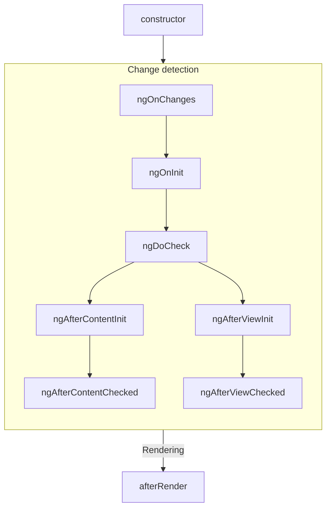

### Subsequent updates

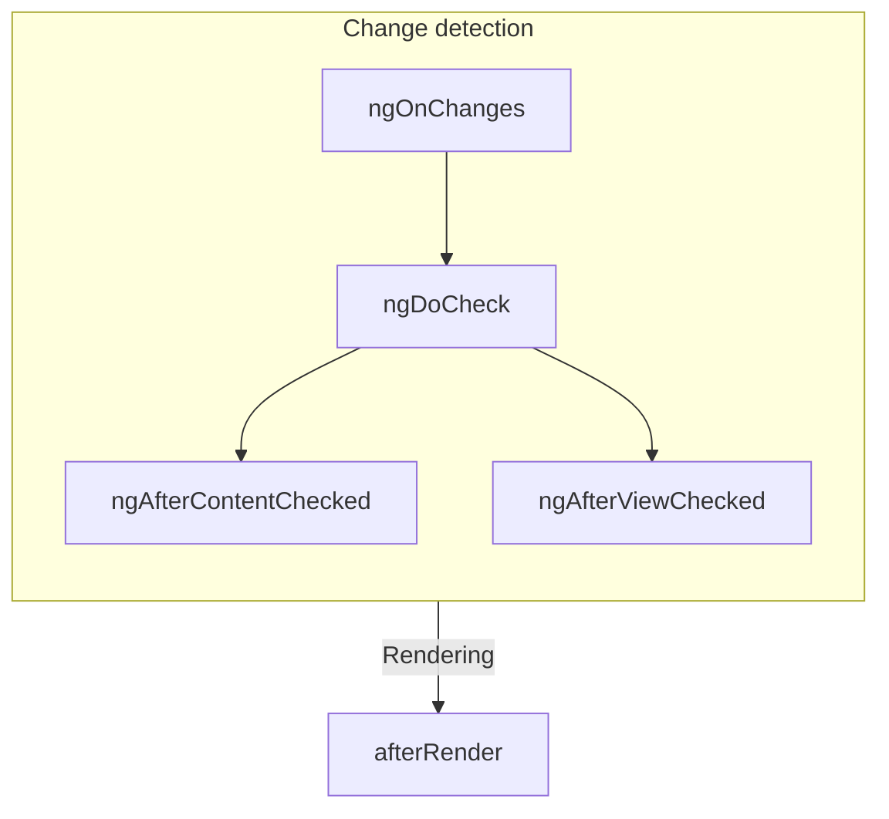

### Ordering with directives

When you put one or more directives on the same element as a component, either in a template or with
the `hostDirectives` property, the framework does not guarantee any ordering of a given lifecycle
hook between the component and the directives on a single element. Never depend on an observed
ordering, as this may change in later versions of Angular.

# Referencing component children with queries

Tip: This guide assumes you've already read the [Essentials Guide](essentials). Read that first if you're new to Angular.

A component can define **queries** that find child elements and read values from their injectors.

Developers most commonly use queries to retrieve references to child components, directives, DOM elements, and more.

There are two categories of query: **view queries** and **content queries.**

## View queries

View queries retrieve results from the elements in the component's _view_ — the elements defined in the component's own template. You can query for a single result with the `@ViewChild` decorator.

<docs-code language="ts" highlight="[14, 16, 17, 18]">
@Component({
  selector: 'custom-card-header',
  ...
})
export class CustomCardHeader {
  text: string;
}

@Component({
  selector: 'custom-card',
  template: '<custom-card-header>Visit sunny California!</custom-card-header>',
})
export class CustomCard {
  @ViewChild(CustomCardHeader) header: CustomCardHeader;

  ngAfterViewInit() {
   console.log(this.header.text);
  }
}
</docs-code>

In this example, the `CustomCard` component queries for a child `CustomCardHeader` and accesses the result in `ngAfterViewInit`.

If the query does not find a result, its value is `undefined`. This may occur if the target element is hidden by `NgIf`. Angular keeps the result of `@ViewChild` up to date as your application state changes.

**View query results become available in the `ngAfterViewInit` lifecycle method**. Before this point, the value is `undefined`. See the [Lifecycle](guide/components/lifecycle) section for details on the component lifecycle.

You can also query for multiple results with the `@ViewChildren` decorator.

<docs-code language="ts" highlight="[17, 19, 20, 21, 22, 23]">
@Component({
  selector: 'custom-card-action',
  ...,
})
export class CustomCardAction {
  text: string;
}

@Component({
  selector: 'custom-card',
  template: `
    <custom-card-action>Save</custom-card-action>
    <custom-card-action>Cancel</custom-card-action>
  `,
})
export class CustomCard {
  @ViewChildren(CustomCardAction) actions: QueryList<CustomCardAction>;

  ngAfterViewInit() {
    this.actions.forEach(action => {
      console.log(action.text);
    });
  }
}
</docs-code>

`@ViewChildren` creates a `QueryList` object that contains the query results. You can subscribe to changes to the query results over time via the `changes` property.

**Queries never pierce through component boundaries.** View queries can only retrieve results from the component's template.

## Content queries

Content queries retrieve results from the elements in the component's _content_— the elements nested inside the component in the template where it's used. You can query for a single result with the `@ContentChild` decorator.

<docs-code language="ts" highlight="[14, 16, 17, 18, 25]">
@Component({
  selector: 'custom-toggle',
  ...
})
export class CustomToggle {
  text: string;
}

@Component({
  selector: 'custom-expando',
  ...
})
export class CustomExpando {
  @ContentChild(CustomToggle) toggle: CustomToggle;

  ngAfterContentInit() {
    console.log(this.toggle.text);
  }
}

@Component({
  selector: 'user-profile',
  template: `
    <custom-expando>
      <custom-toggle>Show</custom-toggle>
    </custom-expando>
  `
})
</docs-code>

In this example, the `CustomExpando` component queries for a child `CustomToggle` and accesses the result in `ngAfterContentInit`.

If the query does not find a result, its value is `undefined`. This may occur if the target element is absent or hidden by `NgIf`. Angular keeps the result of `@ContentChild` up to date as your application state changes.

By default, content queries find only _direct_ children of the component and do not traverse into descendants.

**Content query results become available in the `ngAfterContentInit` lifecycle method**. Before this point, the value is `undefined`. See the [Lifecycle](guide/components/lifecycle) section for details on the component lifecycle.

You can also query for multiple results with the `@ContentChildren` decorator.

<docs-code language="ts" highlight="[14, 16, 17, 18, 19, 20]">
@Component({
  selector: 'custom-menu-item',
  ...
})
export class CustomMenuItem {
  text: string;
}

@Component({
  selector: 'custom-menu',
  ...,
})
export class CustomMenu {
  @ContentChildren(CustomMenuItem) items: QueryList<CustomMenuItem>;

  ngAfterContentInit() {
    this.items.forEach(item => {
      console.log(item.text);
    });
  }
}

@Component({
  selector: 'user-profile',
  template: `
    <custom-menu>
      <custom-menu-item>Cheese</custom-menu-item>
      <custom-menu-item>Tomato</custom-menu-item>
    </custom-menu>
  `
})
</docs-code>

`@ContentChildren` creates a `QueryList` object that contains the query results. You can subscribe to changes to the query results over time via the `changes` property.

**Queries never piece through component boundaries.** Content queries can only retrieve results from the same template as the component itself.

## Query locators

This first parameter for each query decorator is its **locator**.

Most of the time, you want to use a component or directive as your locator.

You can alternatively specify a string locator corresponding to
a [template reference variable](guide/templates/reference-variables).

```ts
@Component({
  ...,
  template: `
    <button #save>Save</button>
    <button #cancel>Cancel</button>
  `
})
export class ActionBar {
  @ViewChild('save') saveButton: ElementRef<HTMLButtonElement>;
}
```

If more than one element defines the same template reference variable, the query retrieves the first matching element.

Angular does not support CSS selectors as query locators.

### Queries and the injector tree

Tip: See [Dependency Injection](guide/di) for background on providers and Angular's injection tree.

For more advanced cases, you can use any `ProviderToken` as a locator. This lets you locate elements based on component and directive providers.

```ts
const SUB_ITEM = new InjectionToken<string>('sub-item');

@Component({
  ...,
  providers: [{provide: SUB_ITEM, useValue: 'special-item'}],
})
export class SpecialItem { }

@Component({...})
export class CustomList {
  @ContentChild(SUB_ITEM) subItemType: string;
}
```

The above example uses an `InjectionToken` as a locator, but you can use any `ProviderToken` to locate specific elements.

## Query options

All query decorators accept an options object as a second parameter. These options control how the query finds its results.

### Static queries

`@ViewChild` and `@ContentChild` queries accept the `static` option.

```ts
@Component({
  selector: 'custom-card',
  template: '<custom-card-header>Visit sunny California!</custom-card-header>',
})
export class CustomCard {
  @ViewChild(CustomCardHeader, {static: true}) header: CustomCardHeader;

  ngOnInit() {
    console.log(this.header.text);
  }
}
```

By setting `static: true`, you guarantee to Angular that the target of this query is _always_ present and is not conditionally rendered. This makes the result available earlier, in the `ngOnInit` lifecycle method.

Static query results do not update after initialization.

The `static` option is not available for `@ViewChildren` and `@ContentChildren` queries.

### Content descendants

By default, content queries find only _direct_ children of the component and do not traverse into descendants.

<docs-code language="ts" highlight="[13, 14, 15, 16]">
@Component({
  selector: 'custom-expando',
  ...
})
export class CustomExpando {
  @ContentChild(CustomToggle) toggle: CustomToggle;
}

@Component({
  selector: 'user-profile',
  template: `
    <custom-expando>
      <some-other-component>
        <!-- custom-toggle will not be found! -->
        <custom-toggle>Show</custom-toggle>
      </some-other-component>
    </custom-expando>
  `
})
</docs-code>

In the example above, `CustomExpando` cannot find `<custom-toggle>` because it is not a direct child of `<custom-expando>`. By setting `descendants: true`, you configure the query to traverse all descendants in the same template. Queries, however, _never_ pierce into components to traverse elements in other templates.

View queries do not have this option because they _always_ traverse into descendants.

### Reading specific values from an element's injector

By default, the query locator indicates both the element you're searching for and the value retrieved. You can alternatively specify the `read` option to retrieve a different value from the element matched by the locator.

```ts
@Component({...})
export class CustomExpando {
  @ContentChild(ExpandoContent, {read: TemplateRef}) toggle: TemplateRef;
}
```

The above example, locates an element with the directive `ExpandoContent` and retrieves
the `TemplateRef` associated with that element.

Developers most commonly use `read` to retrieve `ElementRef` and `TemplateRef`.

## Using QueryList

`@ViewChildren` and `@ContentChildren` both provide a `QueryList` object that contains a list of results.

`QueryList` offers a number of convenience APIs for working with results in an array-like manner, such as `map`, `reduce`, and `forEach`. You can get an array of the current results by calling `toArray`.

You can subscribe to the `changes` property to do something any time the results change.

## Common query pitfalls

When using queries, common pitfalls can make your code harder to understand and maintain.

Always maintain a single source of truth for state shared between multiple components. This avoids scenarios where repeated state in different components becomes out of sync.

Avoid directly writing state to child components. This pattern can lead to brittle code that is hard to understand and is prone to [ExpressionChangedAfterItHasBeenChecked](errors/NG0100) errors.

Never directly write state to parent or ancestor components. This pattern can lead to brittle code that is hard to understand and is prone to [ExpressionChangedAfterItHasBeenChecked](errors/NG0100) errors.

# Accepting data with input properties

Tip: This guide assumes you've already read the [Essentials Guide](essentials). Read that first if you're new to Angular.

Tip: If you're familiar with other web frameworks, input properties are similar to _props_.

When creating a component, you can mark specific class properties as **bindable** by adding the `@Input` decorator on the property:

<docs-code language="ts" highlight="[3]">
@Component({...})
export class CustomSlider {
  @Input() value = 0;
}
</docs-code>

This lets you bind to the property in a template:

```html
<custom-slider [value]="50" />
```

Angular refers to properties marked with the `@Input` decorator as **inputs**. When using a component, you pass data to it by setting its inputs.

**Angular records inputs statically at compile-time**. Inputs cannot be added or removed at run-time.

When extending a component class, **inputs are inherited by the child class.**

**Input names are case-sensitive.**

## Customizing inputs

The `@Input` decorator accepts a config object that lets you change the way that input works.

### Required inputs

You can specify the `required` option to enforce that a given input must always have a value.

<docs-code language="ts" highlight="[3]">
@Component({...})
export class CustomSlider {
  @Input({required: true}) value = 0;
}
</docs-code>

If you try to use a component without specifying all of its required inputs, Angular reports an error at build-time.

### Input transforms

You can specify a `transform` function to change the value of an input when it's set by Angular.

<docs-code language="ts" highlight="[6]">
@Component({
  selector: 'custom-slider',
  ...
})
export class CustomSlider {
  @Input({transform: trimString}) label = '';
}

function trimString(value: string | undefined) {
  return value?.trim() ?? '';
}
</docs-code>

```html
<custom-slider [label]="systemVolume" />
```

In the example above, whenever the value of `systemVolume` changes, Angular runs `trimString` and sets `label` to the result.

The most common use-case for input transforms is to accept a wider range of value types in templates, often including `null` and `undefined`.

**Input transform function must be statically analyzable at build-time.** You cannot set transform functions conditionally or as the result of an expression evaluation.

**Input transform functions should always be [pure functions](https://en.wikipedia.org/wiki/Pure_function).** Relying on state outside of the transform function can lead to unpredictable behavior.

#### Type checking

When you specify an input transform, the type of the transform function's parameter determines the types of values that can be set to the input in a template.

<docs-code language="ts">
@Component({...})
export class CustomSlider {
  @Input({transform: appendPx}) widthPx: string = '';
}

function appendPx(value: number) {
  return `${value}px`;
}
</docs-code>

In the example above, the `widthPx` input accepts a `number` while the property on the class is a `string`.

#### Built-in transformations

Angular includes two built-in transform functions for the two most common scenarios: coercing values to boolean and numbers.

<docs-code language="ts">
import {Component, Input, booleanAttribute, numberAttribute} from '@angular/core';

@Component({...})
export class CustomSlider {
  @Input({transform: booleanAttribute}) disabled = false;
  @Input({transform: numberAttribute}) number = 0;
}
</docs-code>

`booleanAttribute` imitates the behavior of standard
HTML [boolean attributes](https://developer.mozilla.org/en-US/docs/Glossary/Boolean/HTML), where the _presence_ of the attribute indicates a "true" value. However, Angular's `booleanAttribute` treats the literal string `"false"` as the boolean `false`.

`numberAttribute` attempts to parse the given value to a number, producing `NaN` if parsing fails.

### Input aliases

You can specify the `alias` option to change the name of an input in templates.

<docs-code language="ts" highlight="[3]">
@Component({...})
export class CustomSlider {
  @Input({alias: 'sliderValue'}) value = 0;
}
</docs-code>

```html
<custom-slider [sliderValue]="50" />
```

This alias does not affect usage of the property in TypeScript code.

While you should generally avoid aliasing inputs for components, this feature can be useful for renaming properties while preserving an alias for the original name or for avoiding collisions with the name of native DOM element properties.

The `@Input` decorator also accepts the alias as its first parameter in place of the config object.

## Inputs with getters and setters

A property implemented with a getter and setter can be an input:

<docs-code language="ts">
export class CustomSlider {
  @Input()
  get value(): number {
    return this.internalValue;
  }

  set value(newValue: number) {
    this.internalValue = newValue;
  }

  private internalValue = 0;
}
</docs-code>

You can even create a _write-only_ input by only defining a public setter:

<docs-code language="ts">
export class CustomSlider {
  @Input()
  set value(newValue: number) {
    this.internalValue = newValue;
  }

  private internalValue = 0;
}
</docs-code>

Prefer using <span style="text-decoration:underline;">input transforms</span> instead of getters and setters if possible.

Avoid complex or costly getters and setters. Angular may invoke an input's setter multiple times, which may negatively impact application performance if the setter performs any costly behaviors, such as DOM manipulation.

## Specify inputs in the `@Component` decorator

In addition to the `@Input` decorator, you can also specify a component's inputs with the `inputs` property in the `@Component` decorator. This can be useful when a component inherits a property from a base class:

<docs-code language="ts" highlight="[4]">
// `CustomSlider` inherits the `disabled` property from `BaseSlider`.
@Component({
  ...,
  inputs: ['disabled'],
})
export class CustomSlider extends BaseSlider { }
</docs-code>

You can additionally specify an input alias in the `inputs` list by putting the alias after a colon in the string:

<docs-code language="ts" highlight="[4]">
// `CustomSlider` inherits the `disabled` property from `BaseSlider`.
@Component({
  ...,
  inputs: ['disabled: sliderDisabled'],
})
export class CustomSlider extends BaseSlider { }
</docs-code>

## Choosing input names

Avoid choosing input names that collide with properties on DOM elements like HTMLElement. Name collisions introduce confusion about whether the bound property belongs to the component or the DOM element.

Avoid adding prefixes for component inputs like you would with component selectors. Since a given element can only host one component, any custom properties can be assumed to belong to the component.

# Inheritance

Tip: This guide assumes you've already read the [Essentials Guide](essentials). Read that first if you're new to Angular.

Angular components are TypeScript classes and participate in standard JavaScript inheritance
semantics.

A component can extend any base class:

```ts
export class ListboxBase {
  value: string;
}

@Component({ ... })
export class CustomListbox extends ListboxBase {
  // CustomListbox inherits the `value` property.
}
```

## Extending other components and directives

When a component extends another component or a directive, it inherits all the metadata defined in
the base class's decorator and the base class's decorated members. This includes the selector,
template, styles, host bindings, inputs, outputs, lifecycle methods, and any other settings.

```ts
@Component({
  selector: 'base-listbox',
  template: `
    ...
  `,
  host: {
    '(keydown)': 'handleKey($event)',
  },
})
export class ListboxBase {
  @Input() value: string;
  handleKey(event: KeyboardEvent) {
    /* ... */
  }
}

@Component({
  selector: 'custom-listbox',
  template: `
    ...
  `,
  host: {
    '(click)': 'focusActiveOption()',
  },
})
export class CustomListbox extends ListboxBase {
  @Input() disabled = false;
  focusActiveOption() {
    /* ... */
  }
}
```

In the example above, `CustomListbox` inherits all the information associated with `ListboxBase`,
overriding the selector and template with its own values. `CustomListbox` has two inputs (`value`
and `disabled`) and two event listeners (`keydown` and `click`).

Child classes end up with the _union_ of all of their ancestors' inputs, outputs, and host bindings
and their own.

### Forwarding injected dependencies

If a base class relies on dependency injection, the child class must explicitly pass these
dependencies to `super`.

```ts
@Component({ ... })
export class ListboxBase {
  constructor(private element: ElementRef) { }
}

@Component({ ... })
export class CustomListbox extends ListboxBase {
  constructor(element: ElementRef) {
    super(element);
  }
}
```

### Overriding lifecycle methods

If a base class defines a lifecycle method, such as `ngOnInit`, a child class that also
implements `ngOnInit` _overrides_ the base class's implementation. If you want to preserve the base
class's lifecycle method, explicitly call the method with `super`:

```ts
@Component({ ... })
export class ListboxBase {
  protected isInitialized = false;
  ngOnInit() {
    this.isInitialized = true;
  }
}

@Component({ ... })
export class CustomListbox extends ListboxBase {
  override ngOnInit() {
    super.ngOnInit();
    /* ... */
  }
}
```

# Custom events with outputs

Tip: This guide assumes you've already read the [Essentials Guide](essentials). Read that first if you're new to Angular.

Angular components can define custom events by assigning a property to a new `EventEmitter` and adding the `@Output` decorator:

<docs-code language="ts" highlight="">
@Component({...})
export class ExpandablePanel {
  @Output() panelClosed = new EventEmitter<void>();
}
</docs-code>

```html
<expandable-panel (panelClosed)="savePanelState()" />
```

You can emit an event by calling the `emit` method on the `EventEmitter`:

<docs-code language="ts" highlight="">
  this.panelClosed.emit();
</docs-code>

Angular refers to properties marked with the `@Output` decorator as **outputs**. You can use outputs to pass data to other components, similar to native browser events like `click`.

**Angular custom events do not bubble up the DOM**.

**Output names are case-sensitive.**

When extending a component class, **outputs are inherited by the child class.**

## Emitting event data

You can pass event data when calling `emit`:

<docs-code language="ts" highlight="">
// You can emit primitive values.
this.valueChanged.emit(7);

// You can emit custom event objects
this.thumbDropped.emit({
  pointerX: 123,
  pointerY: 456,
})
</docs-code>

When defining an event listener in a template, you can access the event data from the `$event` variable:

```html
<custom-slider (valueChanged)="logValue($event)" />
```

## Customizing output names

The `@Output` decorator accepts a parameter that lets you specify a different name for the event in a template:

<docs-code language="ts" highlight="">
@Component({...})
export class CustomSlider {
  @Output('valueChanged') changed = new EventEmitter<number>();
}
</docs-code>

```html
<custom-slider (valueChanged)="saveVolume()" />
```

This alias does not affect usage of the property in TypeScript code.

While you should generally avoid aliasing outputs for components, this feature can be useful for renaming properties while preserving an alias for the original name or for avoiding collisions with the name of native DOM events.

## Specify outputs in the `@Component` decorator

In addition to the `@Output` decorator, you can also specify a component's outputs with the `outputs` property in the `@Component` decorator. This can be useful when a component inherits a property from a base class:

<docs-code language="ts" highlight="">
// `CustomSlider` inherits the `valueChanged` property from `BaseSlider`.
@Component({
  ...,
  outputs: ['valueChanged'],
})
export class CustomSlider extends BaseSlider {}
</docs-code>

You can additionally specify an output alias in the `outputs` list by putting the alias after a colon in the string:

<docs-code language="ts" highlight="">
// `CustomSlider` inherits the `valueChanged` property from `BaseSlider`.
@Component({
  ...,
  outputs: ['valueChanged: volumeChanged'],
})
export class CustomSlider extends BaseSlider {}
</docs-code>

## Choosing event names

Avoid choosing output names that collide with events on DOM elements like HTMLElement. Name collisions introduce confusion about whether the bound property belongs to the component or the DOM element.

Avoid adding prefixes for component outputs like you would with component selectors. Since a given element can only host one component, any custom properties can be assumed to belong to the component.

Always use [camelCase](https://en.wikipedia.org/wiki/Camel_case) output names. Avoid prefixing output names with "on".

# Advanced component configuration

Tip: This guide assumes you've already read the [Essentials Guide](essentials). Read that first if you're new to Angular.

## ChangeDetectionStrategy

The `@Component` decorator accepts a `changeDetection` option that controls the component's **change
detection mode**. There are two change detection mode options.

**`ChangeDetectionStrategy.Default`** is, unsurprisingly, the default strategy. In this mode,
Angular checks whether the component's DOM needs an update whenever any activity may have occurred
application-wide. Activities that trigger this checking include user interaction, network response,
timers, and more.

**`ChangeDetectionStrategy.OnPush`** is an optional mode that reduces the amount of checking Angular
needs to perform. In this mode, the framework only checks if a component's DOM needs an update when:

- A component input has changes as a result of a binding in a template, or
- An event listener in this component runs
- The component is explicitly marked for check, via `ChangeDetectorRef.markForCheck` or something which wraps it, like `AsyncPipe`.

Additionally, when an OnPush component is checked, Angular _also_ checks all of its ancestor
components, traversing upwards through the application tree.

## PreserveWhitespace

By default, Angular removes and collapses superfluous whitespace in templates, most commonly from
newlines and indentation. You can change this setting by explicitly setting `preserveWhitespace` to
false in a component's metadata.

## Custom element schemas

By default, Angular throws an error when it encounters an unknown HTML element. You can
disable this behavior for a component by including `CUSTOM_ELEMENTS_SCHEMA` in the `schemas`
property in your component metadata.

```ts
import {Component, CUSTOM_ELEMENTS_SCHEMA} from '@angular/core';

@Component({
  ...,
  schemas: [CUSTOM_ELEMENTS_SCHEMA],
  template: '<some-unknown-component></some-unknown-component>'
})
export class ComponentWithCustomElements { }
```

Angular does not support any other schemas at this time.

# Function-based outputs

The `output()` function declares an output in a directive or component.
Outputs allow you to emit values to parent components.

HELPFUL: The `output()` function is currently in [developer preview](/guide/releases#developer-preview).

<docs-code language="ts" highlight="[[5], [8]]">
import {Component, output} from '@angular/core';

@Component({...})
export class MyComp {
  onNameChange = output<string>()    // OutputEmitterRef<string>

  setNewName(newName: string) {
    this.onNameChange.emit(newName);
  }
}
</docs-code>

An output is automatically recognized by Angular whenever you use the `output` function as an initializer of a class member.
Parent components can listen to outputs in templates by using the event binding syntax.

```html
<my-comp (onNameChange)="showNewName($event)" />
```

## Aliasing an output

Angular uses the class member name as the name of the output.
You can alias outputs to change their public name to be different.

```typescript
class MyComp {
  onNameChange = output({alias: 'ngxNameChange'});
}
```

This allows users to bind to your output using `(ngxNameChange)`, while inside your component you can access the output emitter using `this.onNameChange`.

## Subscribing programmatically

Consumers may create your component dynamically with a reference to a `ComponentRef`.
In those cases, parents can subscribe to outputs by directly accessing the property of type `OutputRef`.

```ts
const myComp = viewContainerRef.createComponent(...);

myComp.instance.onNameChange.subscribe(newName => {
  console.log(newName);
});
```

Angular will automatically clean up the subscription when `myComp` is destroyed.
Alternatively, an object with a function to explicitly unsubscribe earlier is returned.

## Using RxJS observables as source

In some cases, you may want to emit output values based on RxJS observables.
Angular provides a way to use RxJS observables as source for outputs.

The `outputFromObservable` function is a compiler primitive, similar to the `output()` function, and declares outputs that are driven by RxJS observables.

<docs-code language="ts" highlight="[7]">
import {Directive} from '@angular/core';
import {outputFromObservable} from '@angular/core/rxjs-interop';

@Directive(...)
class MyDir {
  nameChange$ = this.dataService.get(); // Observable<Data>
  nameChange = outputFromObservable(this.nameChange$);
}
</docs-code>

Angular will forward subscriptions to the observable, but will stop forwarding values when the owning directive is destroyed.
In the example above, if `MyDir` is destroyed, `nameChange` will no longer emit values.

HELPFUL: Most of the time, using `output()` is sufficient and you can emit values imperatively.

## Converting an output to an observable

You can subscribe to outputs by calling `.subscribe` method on `OutputRef`.
In other cases, Angular provides a helper function that converts an `OutputRef` to an observable.

<docs-code language="ts" highlight="[11]">
import {outputToObservable} from '@angular/core/rxjs-interop';

@Component(...)
class MyComp {
  onNameChange = output<string>();
}

// Instance reference to `MyComp`.
const myComp: MyComp;

outputToObservable(this.myComp.instance.onNameChange) // Observable<string>
  .pipe(...)
  .subscribe(...);
</docs-code>

## Why you should use `output()` over decorator-based `@Output()`?

The `output()` function provides numerous benefits over decorator-based `@Output` and `EventEmitter`:

1. Simpler mental model and API:
  <br/>• No concept of error channel, completion channels, or other APIs from RxJS.
  <br/>• Outputs are simple emitters. You can emit values using the `.emit` function.
2. More accurate types.
  <br/>• `OutputEmitterRef.emit(value)` is now correctly typed, while `EventEmitter` has broken types and can cause runtime errors.

# Content projection with ng-content

Tip: This guide assumes you've already read the [Essentials Guide](essentials). Read that first if you're new to Angular.

You often need to create components that act as containers for different types of content. For
example, you may want to create a custom card component:

```ts
@Component({
  selector: 'custom-card',
  template: '<div class="card-shadow"> <!-- card content goes here --> </div>',
})
export class CustomCard {/* ... */}
```

**You can use the `<ng-content>` element as a placeholder to mark where content should go**:

```ts
@Component({
  selector: 'custom-card',
  template: '<div class="card-shadow"> <ng-content></ng-content> </div>',
})
export class CustomCard {/* ... */}
```

Tip: `<ng-content>` works similarly
to [the native `<slot>` element](https://developer.mozilla.org/en-US/docs/Web/HTML/Element/slot),
but with some Angular-specific functionality.

When you use a component with `<ng-content>`, any children of the component host element are
rendered, or **projected**, at the location of that `<ng-content>`:

```ts
// Component source
@Component({
  selector: 'custom-card',
  template: `
    <div class="card-shadow">
      <ng-content />
    </div>
  `,
})
export class CustomCard {/* ... */}
```

```html
<!-- Using the component -->
<custom-card>
  <p>This is the projected content</p>
</custom-card>
```

```html
<!-- The rendered DOM -->
<custom-card>
  <div class="card-shadow">
    <p>This is the projected content</p>
  </div>
</custom-card>
```

Angular refers to any children of a component passed this way as that component's **content**. This
is distinct from the component's **view**, which refers to the elements defined in the component's
template.

**The `<ng-content>` element is neither a component nor DOM element**. Instead, it is a special
placeholder that tells Angular where to render content. Angular's compiler processes
all `<ng-content>` elements at build-time. You cannot insert, remove, or modify `<ng-content>` at
run time. You cannot add **<span style="text-decoration:underline;">directives</span>**, styles, or
arbitrary attributes to `<ng-content>`.

You should not conditionally include `<ng-content>` with `ngIf`, `ngFor`, or `ngSwitch`. For
conditional rendering of component content, see [Template fragments](api/core/ng-template).

## Multiple content placeholders

Angular supports projecting multiple different elements into different `<ng-content>` placeholders
based on CSS selector. Expanding the card example from above, you could create two placeholders for
a card title and a card body by using the `select` attribute:

```html
<!-- Component template -->
<div class="card-shadow">
  <ng-content select="card-title"></ng-content>
  <div class="card-divider"></div>
  <ng-content select="card-body"></ng-content>
</div>
```

```html
<!-- Using the component -->
<custom-card>
  <card-title>Hello</card-title>
  <card-body>Welcome to the example</card-body>
</custom-card>
```

```html
<!-- Rendered DOM -->
<custom-card>
  <div class="card-shadow">
    <card-title>Hello</card-title>
    <div class="card-divider"></div>
    <card-body>Welcome to the example</card-body>
  </div>
</custom-card>
```

The `<ng-content>` placeholder supports the same CSS selectors
as [component selectors](guide/components/selectors).

If you include one or more `<ng-content>` placeholders with a `select` attribute and
one `<ng-content>` placeholder without a `select` attribute, the latter captures all elements that
did not match a `select` attribute:

```html
<!-- Component template -->
<div class="card-shadow">
  <ng-content select="card-title"></ng-content>
  <div class="card-divider"></div>
  <!-- capture anything except "card-title" -->
  <ng-content></ng-content>
</div>
```

```html
<!-- Using the component -->
<custom-card>
  <card-title>Hello</card-title>
  
  <p>Welcome to the example</p>
</custom-card>
```

```html
<!-- Rendered DOM -->
<custom-card>
  <div class="card-shadow">
    <card-title>Hello</card-title>
    <div class="card-divider"></div>
    
    <p>Welcome to the example></p>
  </div>
</custom-card>
```

If a component does not include an `<ng-content>` placeholder without a `select` attribute, any
elements that don't match one of the component's placeholders do not render into the DOM.

## Aliasing content for projection

Angular supports a special attribute, `ngProjectAs`, that allows you to specify a CSS selector on
any element. Whenever an element with `ngProjectAs` is checked against an `<ng-content>`
placeholder, Angular compares against the `ngProjectAs` value instead of the element's identity:

```html
<!-- Component template -->
<div class="card-shadow">
  <ng-content select="card-title"></ng-content>
  <div class="card-divider"></div>
  <ng-content></ng-content>
</div>
```

```html
<!-- Using the component -->
<custom-card>
  <h3 ngProjectAs="card-title">Hello</h3>

  <p>Welcome to the example</p>
</custom-card>
```

```html
<!-- Rendered DOM -->
<custom-card>
  <div class="card-shadow">
    <h3>Hello</h3>
    <div class="card-divider"></div>
    <p>Welcome to the example></p>
  </div>
</custom-card>
```

`ngProjectAs` supports only static values and cannot be bound to dynamic expressions.

<docs-decorative-header title="Anatomy of a component" imgSrc="adev/src/assets/images/components.svg"> <!-- markdownlint-disable-line -->
</docs-decorative-header>

Tip: This guide assumes you've already read the [Essentials Guide](essentials). Read that first if you're new to Angular.

Every component must have:

* A TypeScript class with _behaviors_ such as handling user input and fetching data from a server
* An HTML template that controls what renders into the DOM
* A [CSS selector](https://developer.mozilla.org/en-US/docs/Learn/CSS/Building_blocks/Selectors) that defines how the component is used in HTML

You provide Angular-specific information for a component by adding a `@Component` [decorator](https://www.typescriptlang.org/docs/handbook/decorators.html) on top of the TypeScript class:

<docs-code language="ts" highlight="[1, 2, 3, 4]">
@Component({
  selector: 'profile-photo',
  template: ``,
})
export class ProfilePhoto { }
</docs-code>

For full details on writing Angular templates, see the [Templates guide](guide/templates).

The object passed to the `@Component` decorator is called the component's **metadata**. This includes the `selector`, `template`, and other properties described throughout this guide.

Components can optionally include a list of CSS styles that apply to that component's DOM:

<docs-code language="ts" highlight="[4]">
@Component({
  selector: 'profile-photo',
  template: ``,
  styles: `img { border-radius: 50%; }`,
})
export class ProfilePhoto { }
</docs-code>

By default, a component's styles only affect elements defined in that component's template. See [Styling Components](guide/components/styling) for details on Angular's approach to styling.

You can alternatively choose to write your template and styles in separate files:

<docs-code language="ts" highlight="[3, 4]">
@Component({
  selector: 'profile-photo',
  templateUrl: 'profile-photo.html',
  styleUrl: 'profile-photo.css',
})
export class ProfilePhoto { }
</docs-code>

This can help separate the concerns of _presentation_ from _behavior_ in your project. You can choose one approach for your entire project, or you decide which to use for each component.

Both `templateUrl` and `styleUrl` are relative to the directory in which the component resides.

## Using components

Every component defines a [CSS selector](https://developer.mozilla.org/en-US/docs/Learn/CSS/Building_blocks/Selectors):

<docs-code language="ts" highlight="[2]">
@Component({
  selector: 'profile-photo',
  ...
})
export class ProfilePhoto { }
</docs-code>

See [Component Selectors](guide/components/selectors) for details about which types of selectors Angular supports and guidance on choosing a selector.

You use a component by creating a matching HTML element in the template of _other_ components:

<docs-code language="ts" highlight="[4]">
@Component({
  selector: 'user-profile',
  template: `
    <profile-photo />
    <button>Upload a new profile photo</button>`,
  ...,
})
export class UserProfile { }
</docs-code>

See [Importing and using components](guide/components/importing) for details on how to reference and use other components in your template.

Angular creates an instance of the component for every matching HTML element it encounters. The DOM element that matches a component's selector is referred to as that component's **host element**. The contents of a component's template are rendered inside its host element.

The DOM rendered by a component, corresponding to that component's template, is called that
component's **view**.

In composing components in this way, **you can think of your Angular application as a tree of components**.

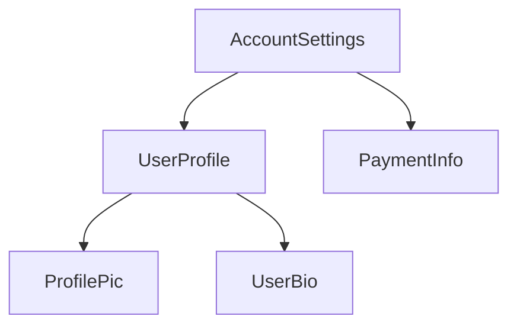


This tree structure is important to understanding several other Angular concepts, including [dependency injection](guide/di) and [child queries](guide/components/queries).

# Importing and using components

Tip: This guide assumes you've already read the [Essentials Guide](essentials). Read that first if you're new to Angular.

Angular supports two ways of making a component available to other components: as a standalone component or in an `NgModule`.

## Standalone components

A **standalone component** is a component that sets `standalone: true` in its component metadata.
Standalone components directly import other components, directives, and pipes used in their
templates:

<docs-code language="ts" highlight="[2, [8, 9]]">
@Component({
  standalone: true,
  selector: 'profile-photo',
})
export class ProfilePhoto { }

@Component({
  standalone: true,
  imports: [ProfilePhoto],
  template: `<profile-photo />`
})
export class UserProfile { }
</docs-code>

Standalone components are directly importable into other standalone components.

The Angular team recommends using standalone components for all new development.

## NgModules

Angular code that predates standalone components uses `NgModule` as a mechanism for importing and
using other components. See the full [`NgModule` guide](guide/ngmodules) for details.

# Component host elements

Tip: This guide assumes you've already read the [Essentials Guide](essentials). Read that first if you're new to Angular.

Angular creates an instance of a component for every HTML element that matches the component's
selector. The DOM element that matches a component's selector is that component's **host element**.
The contents of a component's template are rendered inside its host element.

```ts
// Component source
@Component({
  selector: 'profile-photo',
  template: `
    
  `,
})
export class ProfilePhoto {}
```

```html
<!-- Using the component -->
<h3>Your profile photo</h3>
<profile-photo />
<button>Upload a new profile photo</button>
```

```html
<!-- Rendered DOM -->
<h3>Your profile photo</h3>
<profile-photo>
  
</profile-photo>
<button>Upload a new profile photo</button>
```

In the above example, `<profile-photo>` is the host element of the `ProfilePhoto` component.

## Binding to the host element

A component can bind properties, attributes, and events to its host element. This behaves
identically to bindings on elements inside the component's template, but instead defined with
the `host` property in the `@Component` decorator:

```ts
@Component({
  ...,
  host: {
    'role': 'slider',
    '[attr.aria-valuenow]': 'value',
    '[tabIndex]': 'disabled ? -1 : 0',
    '(keydown)': 'updateValue($event)',
  },
})
export class CustomSlider {
  value: number = 0;
  disabled: boolean = false;

  updateValue(event: KeyboardEvent) { /* ... */ }

  /* ... */
}
```

## The `@HostBinding` and `@HostListener` decorators

You can alternatively bind to the host element by applying the `@HostBinding` and `@HostListener`
decorator to class members.

`@HostBinding` lets you bind host properties and attributes to properties and methods:

```ts
@Component({
  /* ... */
})
export class CustomSlider {
  @HostBinding('attr.aria-valuenow')
  value: number = 0;

  @HostBinding('tabIndex')
  getTabIndex() {
    return this.disabled ? -1 : 0;
  }

  /* ... */
}
```

`@HostListener` lets you bind event listeners to the host element. The decorator accepts an event
name and an optional array of arguments:

```ts
export class CustomSlider {
  @HostListener('keydown', ['$event'])
  updateValue(event: KeyboardEvent) {
    /* ... */
  }
}
```

**Always prefer using the `host` property over `@HostBinding` and `@HostListener`.** These
decorators exist exclusively for backwards compatibility.

## Binding collisions

When you use a component in a template, you can add bindings to that component instance's element.
The component may _also_ define host bindings for the same properties or attributes.

```ts
@Component({
  ...,
  host: {
    'role': 'presentation',
    '[id]': 'id',
  }
})
export class ProfilePhoto { /* ... */ }
```

```html
<profile-photo role="group" [id]="otherId" />
```

In cases like this, the following rules determine which value wins:

- If both values are static, the instance binding wins.
- If one value is static and the other dynamic, the dynamic value wins.
- If both values are dynamic, the component's host binding wins.

# Component selectors

Tip: This guide assumes you've already read the [Essentials Guide](essentials). Read that first if you're new to Angular.

Every component defines
a [CSS selector](https://developer.mozilla.org/en-US/docs/Web/CSS/CSS_selectors) that determines how
the component is used:

<docs-code language="ts" highlight="[2]">
@Component({
  selector: 'profile-photo',
  ...
})
export class ProfilePhoto { }
</docs-code>

You use a component by creating a matching HTML element in the templates of _other_ components:

<docs-code language="ts" highlight="[3]">
@Component({
  template: `
    <profile-photo />
    <button>Upload a new profile photo</button>`,
  ...,
})
export class UserProfile { }
</docs-code>

**Angular matches selectors statically at compile-time**. Changing the DOM at run-time, either via
Angular bindings or with DOM APIs, does not affect the components rendered.

**An element can match exactly one component selector.** If multiple component selectors match a
single element, Angular reports an error.

**Component selectors are case-sensitive.**

## Types of selectors

Angular supports a limited subset
of [basic CSS selector types](https://developer.mozilla.org/en-US/docs/Web/CSS/CSS_Selectors) in
component selectors:

| **Selector type**  | **Description**                                                                                                 | **Examples**                  |
| ------------------ | --------------------------------------------------------------------------------------------------------------- | ----------------------------- |
| Type selector      | Matches elements based on their HTML tag name, or node name.                                                    | `profile-photo`               |
| Attribute selector | Matches elements based on the presence of an HTML attribute and, optionally, an exact value for that attribute. | `[dropzone]` `[type="reset"]` |
| Class selector     | Matches elements based on the presence of a CSS class.                                                          | `.menu-item`                  |

For attribute values, Angular supports matching an exact attribute value with the equals (`=`)
operator. Angular does not support other attribute value operators.

Angular component selectors do not support combinators, including
the [descendant combinator](https://developer.mozilla.org/en-US/docs/Web/CSS/Descendant_combinator)
or [child combinator](https://developer.mozilla.org/en-US/docs/Web/CSS/Child_combinator).

Angular component selectors do not support
specifying [namespaces](https://developer.mozilla.org/en-US/docs/Web/SVG/Namespaces_Crash_Course).

### The `:not` pseudo-class

Angular supports [the `:not` pseudo-class](https://developer.mozilla.org/en-US/docs/Web/CSS/:not).
You can append this pseudo-class to any other selector to narrow which elements a component's
selector matches. For example, you could define a `[dropzone]` attribute selector and prevent
matching `textarea` elements:

<docs-code language="ts" highlight="[2]">
@Component({
  selector: '[dropzone]:not(textarea)',
  ...
})
export class DropZone { }
</docs-code>

Angular does not support any other pseudo-classes or pseudo-elements in component selectors.

### Combining selectors

You can combine multiple selectors by concatenating them. For example, you can match `<button>`
elements that specify `type="reset"`:

<docs-code language="ts" highlight="[2]">
@Component({
  selector: 'button[type="reset"]',
  ...
})
export class ResetButton { }
</docs-code>

You can also define multiple selectors with a comma-separated list:

<docs-code language="ts" highlight="[2]">
@Component({
  selector: 'drop-zone, [dropzone]',
  ...
})
export class DropZone { }
</docs-code>

Angular creates a component for each element that matches _any_ of the selectors in the list.

## Choosing a selector

The vast majority of components should use a custom element name as their selector. All custom
element names should include a hyphen as described
by [the HTML specification](https://html.spec.whatwg.org/multipage/custom-elements.html#valid-custom-element-name).
By default, Angular reports an error if it encounters a custom tag name that does not match any
available components, preventing bugs due to mistyped component names.

See [Advanced component configuration](guide/components/advanced-configuration) for details on
using [native custom elements](https://developer.mozilla.org/en-US/docs/Web/Web_Components) in
Angular templates.

### Selector prefixes

The Angular team recommends using a short, consistent prefix for all the custom components
defined inside your project. For example, if you were to build YouTube with Angular, you might
prefix your components with `yt-`, with components like `yt-menu`, `yt-player`, etc. Namespacing
your selectors like this makes it immediately clear where a particular component comes from. By
default, the Angular CLI uses `app-`.

Angular uses the `ng` selector prefix for its own framework APIs. Never use `ng` as a selector
prefix for your own custom components.

### When to use an attribute selector

You should consider an attribute selector when you want to create a component on a standard native
element. For example, if you want to create a custom button component, you can take advantage of the
standard `<button>` element by using an attribute selector:

<docs-code language="ts" highlight="[2]">
@Component({
  selector: 'button[yt-upload]',
   ...
})
export class YouTubeUploadButton { }
</docs-code>

This approach allows consumers of the component to directly use all the element's standard APIs
without extra work. This is especially valuable for ARIA attributes such as `aria-label`.

Angular does not report errors when it encounters custom attributes that don't match an available
component. When using components with attribute selectors, consumers may forget to import the
component or its NgModule, resulting in the component not rendering.
See [Importing and using components](guide/components/importing) for more information.

Components that define attribute selectors should use lowercase, dash-case attributes. You can
follow the same prefixing recommendation described above.

# Styling components

Tip: This guide assumes you've already read the [Essentials Guide](essentials). Read that first if you're new to Angular.

Components can optionally include CSS styles that apply to that component's DOM:

<docs-code language="ts" highlight="[4]">
@Component({
  selector: 'profile-photo',
  template: ``,
  styles: ` img { border-radius: 50%; } `,
})
export class ProfilePhoto { }
</docs-code>

You can also choose to write your styles in separate files:

<docs-code language="ts" highlight="[4]">
@Component({
  selector: 'profile-photo',
  templateUrl: 'profile-photo.html',
  styleUrl: 'profile-photo.css',
})
export class ProfilePhoto { }
</docs-code>

When Angular compiles your component, these styles are emitted with your component's JavaScript
output. This means that component styles participate in the JavaScript module system. When you
render an Angular component, the framework automatically includes its associated styles, even when
lazy-loading a component.

Angular works with any tool that outputs CSS,
including [Sass](https://sass-lang.com), [less](https://lesscss.org),
and [stylus](https://stylus-lang.com).

## Style scoping

Every component has a **view encapsulation** setting that determines how the framework scopes a
component's styles. There are three view encapsulation modes: `Emulated`, `ShadowDom`, and `None`.
You can specify the mode in the `@Component` decorator:

<docs-code language="ts" highlight="[3]">
@Component({
  ...,
  encapsulation: ViewEncapsulation.None,
})
export class ProfilePhoto { }
</docs-code>

### ViewEncapsulation.Emulated

By default, Angular uses emulated encapsulation so that a component's styles only apply to elements
defined in that component's template. In this mode, the framework generates a unique HTML attribute
for each component instance, adds that attribute to elements in the component's template, and
inserts that attribute into the CSS selectors defined in your component's styles.

This mode ensures that a component's styles do not leak out and affect other components. However,
global styles defined outside of a component may still affect elements inside a component with
emulated encapsulation.

In emulated mode, Angular supports
the [`:host`](https://developer.mozilla.org/en-US/docs/Web/CSS/:host)
and [`:host-context`](https://developer.mozilla.org/en-US/docs/Web/CSS/:host-context) pseudo
classes without
using [Shadow DOM](https://developer.mozilla.org/en-US/docs/Web/Web_Components/Using_shadow_DOM).
During compilation, the framework transforms these pseudo classes into attributes. Angular's
emulated encapsulation mode does not support any other pseudo classes related to Shadow DOM, such
as `::shadow` or `::part`.

#### `::ng-deep`

Angular's emulated encapsulation mode supports a custom pseudo class, `:ng-deep`. Applying this
pseudo class to a CSS rule disables encapsulation for that rule, effectively turning it into a
global style. **The Angular team strongly discourages new use of `::ng-deep`**. These APIs remain
exclusively for backwards compatibility.

### ViewEncapsulation.ShadowDom

This mode scopes styles within a component by
using [the web standard Shadow DOM API](https://developer.mozilla.org/en-US/docs/Web/Web_Components/Using_shadow_DOM).
When enabling this mode, Angular attaches a shadow root to the component's host element and renders
the component's template and styles into the corresponding shadow tree.

This mode strictly guarantees that _only_ that component's styles apply to elements in the
component's template. Global styles cannot affect elements in a shadow tree and styles inside the
shadow tree cannot affect elements outside of that shadow tree.

Enabling `ShadowDom` encapsulation, however, impacts more than style scoping. Rendering the
component in a shadow tree affects event propagation, interaction
with [the `<slot>` API](https://developer.mozilla.org/en-US/docs/Web/Web_Components/Using_templates_and_slots),
and how browser developer tools show elements. Always understand the full implications of using
Shadow DOM in your application before enabling this option.

### ViewEncapsulation.None

This mode disables all style encapsulation for the component. Any styles associated with the
component behave as global styles.

## Defining styles in templates

You can use the `<style>` element in a component's template to define additional styles. The
component's view encapsulation mode applies to styles defined this way.

Angular does not support bindings inside of style elements.

## Referencing external style files

Component templates can
use [the `<link>` element](https://developer.mozilla.org/en-US/docs/Web/HTML/Element/link) to
reference CSS files. Additionally, your CSS may
use [the `@import`at-rule](https://developer.mozilla.org/en-US/docs/Web/CSS/@import) to reference
CSS files. Angular treats these references as _external_ styles. External styles are not affected by
emulated view encapsulation.

# Using DOM APIs

Tip: This guide assumes you've already read the [Essentials Guide](essentials). Read that first if you're new to Angular.

Angular handles most DOM creation, updates, and removals for you. However, you might rarely need to
directly interact with a component's DOM. Components can inject ElementRef to get a reference to the
component's host element:

```ts
@Component({...})
export class ProfilePhoto {
  constructor(elementRef: ElementRef) {
    console.log(elementRef.nativeElement);
  }
}
```

The `nativeElement` property references the
host [Element](https://developer.mozilla.org/en-US/docs/Web/API/Element) instance.

You can use Angular's `afterRender` and `afterNextRender` functions to register a **render
callback** that runs when Angular has finished rendering the page.

```ts
@Component({...})
export class ProfilePhoto {
  constructor(elementRef: ElementRef) {
    afterRender(() => {
      // Focus the first input element in this component.
      elementRef.nativeElement.querySelector('input')?.focus();
    });
  }
}
```

`afterRender` and `afterNextRender` must be called in an _injection context_, typically a
component's constructor.

**Avoid direct DOM manipulation whenever possible.** Always prefer expressing your DOM's structure
in component templates and updating that DOM with bindings.

**Render callbacks never run during server-side rendering or build-time pre-rendering.**

**Never directly manipulate the DOM inside of other Angular lifecycle hooks**. Angular does not
guarantee that a component's DOM is fully rendered at any point other than in render callbacks.
Further, reading or modifying the DOM during other lifecycle hooks can negatively impact page
performance by
causing [layout thrashing](https://web.dev/avoid-large-complex-layouts-and-layout-thrashing).

## Using a component's renderer

Components can inject an instance of `Renderer2` to perform certain DOM manipulations that are tied
to other Angular features.

Any DOM elements created by a component's `Renderer2` participate in that
component's [style encapsulation](guide/components/styling#style-scoping).

Certain `Renderer2` APIs also tie into Angular's animation system. You can use the `setProperty`
method to update synthetic animation properties and the `listen` method to add event listeners for
synthetic animation events. See the [Animations](guide/animations) guide for details.

Aside from these two narrow use-cases, there is no difference between using `Renderer2` and native
DOM APIs. `Renderer2` APIs do not support DOM manipulation in server-side rendering or build-time
pre-rendering contexts.

## When to use DOM APIs

While Angular handles most rendering concerns, some behaviors may still require using DOM APIs. Some
common use cases include:

- Managing element focus
- Measuring element geometry, such as with `getBoundingClientRect`
- Reading an element's text content
- Setting up native observers such
  as [`MutationObserver`](https://developer.mozilla.org/en-US/docs/Web/API/MutationObserver),
  [`ResizeObserver`](https://developer.mozilla.org/en-US/docs/Web/API/ResizeObserver), or
  [`IntersectionObserver`](https://developer.mozilla.org/en-US/docs/Web/API/Intersection_Observer_API).

Avoid inserting, removing, and modifying DOM elements. In particular, **never directly set an
element's `innerHTML` property**, which can make your application vulnerable
to [cross-site scripting (XSS) exploits](https://developer.mozilla.org/en-US/docs/Glossary/Cross-site_scripting).
Angular's template bindings, including bindings for `innerHTML`, include safeguards that help
protect against XSS attacks. See the [Security guide](guide/security) for details.

# Programmatically rendering components

Tip: This guide assumes you've already read the [Essentials Guide](essentials). Read that first if you're new to Angular.

In addition to using a component directly in a template, you can also dynamically render components.
There are two main ways to dynamically render a component: in a template with `NgComponentOutlet`,
or in your TypeScript code with `ViewContainerRef`.

## Using NgComponentOutlet

`NgComponentOutlet` is a structural directive that dynamically renders a given component in a
template.

```ts
@Component({ ... })
export class AdminBio { /* ... */ }

@Component({ ... })
export class StandardBio { /* ... */ }

@Component({
  ...,
  template: `
    <p>Profile for {{user.name}}</p>
    <ng-container *ngComponentOutlet="getBioComponent()" /> `
})
export class CustomDialog {
  @Input() user: User;

  getBioComponent() {
    return this.user.isAdmin ? AdminBio : StandardBio;
  }
}
```

See the [NgComponentOutlet API reference](api/common/NgComponentOutlet) for more information on the
directive's capabilities.

## Using ViewContainerRef

A **view container** is a node in Angular's component tree that can contain content. Any component
or directive can inject `ViewContainerRef` to get a reference to a view container corresponding to
that component or directive's location in the DOM.

You can use the `createComponent`method on `ViewContainerRef` to dynamically create and render a
component. When you create a new component with a `ViewContainerRef`, Angular appends it into the
DOM as the next sibling of the component or directive that injected the `ViewContainerRef`.

```ts
@Component({
  selector: 'leaf-content',
  template: `
    This is the leaf content
  `,
})
export class LeafContent {}

@Component({
  selector: 'outer-container',
  template: `
    <p>This is the start of the outer container</p>
    <inner-item />
    <p>This is the end of the outer container</p>
  `,
})
export class OuterContainer {}

@Component({
  selector: 'inner-item',
  template: `
    <button (click)="loadContent()">Load content</button>
  `,
})
export class InnerItem {
  constructor(private viewContainer: ViewContainerRef) {}

  loadContent() {
    this.viewContainer.createComponent(LeafContent);
  }
}
```

In the example above, clicking the "Load content" button results in the following DOM structure

```html
<outer-container>
  <p>This is the start of the outer container</p>
  <inner-item>
    <button>Load content</button>
  </inner-item>
  <leaf-content>This is the leaf content</leaf-content>
  <p>This is the end of the outer container</p>
</outer-container>
```

## Lazy-loading components

You can use both of the approaches described above, `NgComponentOutlet` and `ViewContainerRef`, to
render components that are lazy-loaded with a standard
JavaScript [dynamic import](https://developer.mozilla.org/en-US/docs/Web/JavaScript/Reference/Operators/import).

```ts
@Component({
  ...,
  template: `
    <section>
      <h2>Basic settings</h2>
      <basic-settings />
    </section>
    <section>
      <h2>Advanced settings</h2>
      <button (click)="loadAdvanced()" *ngIf="!advancedSettings">
        Load advanced settings
      </button>
      <ng-container *ngComponentOutlet="advancedSettings" />
    </section>`
})
export class AdminSettings {
  advancedSettings: {new(): AdminSettings} | undefined;

  async loadAdvanced() {
    this.advancedSettings = await import('path/to/advanced_settings.js');
  }
}
```

The example above loads and displays the `AdvancedSettings` upon receiving a button click.

# Prerendering (SSG)

Prerendering, commonly referred to as Static Site Generation (SSG), represents the method by which pages are rendered to static HTML files during the build process.

Prerendering maintains the same performance benefits of [server-side rendering (SSR)](guide/ssr#why-use-server-side-rendering) but achieves a reduced Time to First Byte (TTFB), ultimately enhancing user experience. The key distinction lies in its approach that pages are served as static content, and there is no request-based rendering.

When the data necessary for server-side rendering remains consistent across all users, the strategy of prerendering emerges as a valuable alternative. Rather than dynamically rendering pages for each user request, prerendering takes a proactive approach by rendering them in advance.

## How to prerender a page

To prerender a static page, add SSR capabilities to your application with the following Angular CLI command:

<docs-code language="shell">

ng add @angular/ssr

</docs-code>

<div class="alert is-helpful">

To create an application with prerendering capabilities from the beginning use the [`ng new --ssr`](tools/cli/setup-local) command.

</div>

Once SSR is added, you can generate the static pages by running the build command:

<docs-code language="shell">

ng build

</docs-code>

### Build options for prerender

The application builder `prerender` option can be either a Boolean or an Object for more fine-tuned configuration.
When the option is `false`, no prerendering is done. When it is `true`, all options use the default value. When it is an Object, each option can be individually configured.

| Options          | Details                                                                                                                                                                   | Default Value |
| :--------------- | :------------------------------------------------------------------------------------------------------------------------------------------------------------------------ | :------------ |
| `discoverRoutes` | Whether the builder should process the Angular Router configuration to find all unparameterized routes and prerender them.                                                | `true`        |
| `routesFile`     | The path to a file that contains a list of all routes to prerender, separated by newlines. This option is useful if you want to prerender routes with parameterized URLs. |               |

<docs-code language="json">

{
  "projects": {
    "my-app": {
      "architect": {
        "build": {
          "builder": "@angular-devkit/build-angular:application",
          "options": {
            "prerender": {
              "discoverRoutes": false
            }
          }
        }
      }
    }
  }
}

</docs-code>

### Prerendering parameterized routes

You can prerender parameterized routes using the `routesFile` option. An example of a parameterized route is `product/:id`, where `id` is dynamically provided. To specify these routes, they should be listed in a text file, with each route on a separate line.

For an app with a large number of parameterized routes, consider generating this file using a script before running `ng build`.

<docs-code header="routes.txt" language="text">

/products/1
/products/555

</docs-code>

With routes specified in the `routes.txt` file, use the `routesFile` option to configure the builder to prerender the product routes.

<docs-code language="json">

{
  "projects": {
    "my-app": {
      "architect": {
        "build": {
          "builder": "@angular-devkit/build-angular:application",
          "options": {
            "prerender": {
              "routesFile": "routes.txt"
            }
          }
        }
      }
    }
  }
}

</docs-code>

This configures `ng build` to prerender `/products/1` and `/products/555` at build time.

# Getting started with NgOptimizedImage

The `NgOptimizedImage` directive makes it easy to adopt performance best practices for loading images.

The directive ensures that the loading of the [Largest Contentful Paint (LCP)](http://web.dev/lcp) image is prioritized by:

* Automatically setting the `fetchpriority` attribute on the `` tag
* Lazy loading other images by default
* Asserting that there is a corresponding preconnect link tag in the document head
* Automatically generating a `srcset` attribute
* Generating a [preload hint](https://developer.mozilla.org/en-US/docs/Web/HTML/Link_types/preload) if app is using SSR

In addition to optimizing the loading of the LCP image, `NgOptimizedImage` enforces a number of image best practices, such as:

* Using [image CDN URLs to apply image optimizations](https://web.dev/image-cdns/#how-image-cdns-use-urls-to-indicate-optimization-options)
* Preventing layout shift by requiring `width` and `height`
* Warning if `width` or `height` have been set incorrectly
* Warning if the image will be visually distorted when rendered

**Note: Although the `NgOptimizedImage` directive was made a stable feature in Angular version 15, it has been backported and is available as a stable feature in versions 13.4.0 and 14.3.0 as well.**

## Getting Started

<docs-workflow>
<docs-step title="Import `NgOptimizedImage` directive">
Import `NgOptimizedImage` directive from `@angular/common`:

<docs-code language="typescript">

import { NgOptimizedImage } from '@angular/common'

</docs-code>

and include it into the `imports` array of a standalone component or an NgModule:

<docs-code language="typescript">

imports: [
  NgOptimizedImage,
  // ...
],

</docs-code>
</docs-step>
<docs-step title="(Optional) Set up a Loader">
An image loader is not **required** in order to use NgOptimizedImage, but using one with an image CDN enables powerful performance features, including automatic `srcset`s for your images.

A brief guide for setting up a loader can be found in the [Configuring an Image Loader](#configuring-an-image-loader-for-ngoptimizedimage) section at the end of this page.
</docs-step>
<docs-step title="Enable the directive">
To activate the `NgOptimizedImage` directive, replace your image's `src` attribute with `ngSrc`.

<docs-code language="typescript">


</docs-code>

If you're using a [built-in third-party loader](#built-in-loaders), make sure to omit the base URL path from `src`, as that will be prepended automatically by the loader.
</docs-step>
<docs-step title="Mark images as `priority`">
Always mark the [LCP image](https://web.dev/lcp/#what-elements-are-considered) on your page as `priority` to prioritize its loading.

<docs-code language="typescript">


</docs-code>

Marking an image as `priority` applies the following optimizations:

* Sets `fetchpriority=high` (read more about priority hints [here](https://web.dev/priority-hints))
* Sets `loading=eager` (read more about native lazy loading [here](https://web.dev/browser-level-image-lazy-loading))
* Automatically generates a [preload link element](https://developer.mozilla.org/en-US/docs/Web/HTML/Link_types/preload) if [rendering on the server](guide/ssr).

Angular displays a warning during development if the LCP element is an image that does not have the `priority` attribute. A page’s LCP element can vary based on a number of factors - such as the dimensions of a user's screen, so a page may have multiple images that should be marked `priority`. See [CSS for Web Vitals](https://web.dev/css-web-vitals/#images-and-largest-contentful-paint-lcp) for more details.
</docs-step>
<docs-step title="Include Width and Height">
In order to prevent [image-related layout shifts](https://web.dev/css-web-vitals/#images-and-layout-shifts), NgOptimizedImage requires that you specify a height and width for your image, as follows:

<docs-code language="typescript">


</docs-code>

For **responsive images** (images which you've styled to grow and shrink relative to the viewport), the `width` and `height` attributes should be the intrinsic size of the image file. For responsive images it's also important to [set a value for `sizes`.](#responsive-images)

For **fixed size images**, the `width` and `height` attributes should reflect the desired rendered size of the image. The aspect ratio of these attributes should always match the intrinsic aspect ratio of the image.

Note: If you don't know the size of your images, consider using "fill mode" to inherit the size of the parent container, as described below.
</docs-step>
</docs-workflow>

## Using `fill` mode

In cases where you want to have an image fill a containing element, you can use the `fill` attribute. This is often useful when you want to achieve a "background image" behavior. It can also be helpful when you don't know the exact width and height of your image, but you do have a parent container with a known size that you'd like to fit your image into (see "object-fit" below).

When you add the `fill` attribute to your image, you do not need and should not include a `width` and `height`, as in this example:

<docs-code language="typescript">


</docs-code>

You can use the [object-fit](https://developer.mozilla.org/en-US/docs/Web/CSS/object-fit) CSS property to change how the image will fill its container. If you style your image with `object-fit: "contain"`, the image will maintain its aspect ratio and be "letterboxed" to fit the element. If you set `object-fit: "cover"`, the element will retain its aspect ratio, fully fill the element, and some content may be "cropped" off.

See visual examples of the above at the [MDN object-fit documentation.](https://developer.mozilla.org/en-US/docs/Web/CSS/object-fit)

You can also style your image with the [object-position property](https://developer.mozilla.org/en-US/docs/Web/CSS/object-position) to adjust its position within its containing element.

IMPORTANT: For the "fill" image to render properly, its parent element **must** be styled with `position: "relative"`, `position: "fixed"`, or `position: "absolute"`.

## Using placeholders

### Automatic placeholders

NgOptimizedImage can display an automatic low-resolution placeholder for your image if you're using a CDN or image host that provides automatic image resizing. Take advantage of this feature by adding the `placeholder` attribute to your image:

<docs-code format="typescript" language="typescript">


</docs-code>

Adding this attribute automatically requests a second, smaller version of the image using your specified image loader. This small image will be applied as a `background-image` style with a CSS blur while your image loads. If no image loader is provided, no placeholder image can be generated and an error will be thrown.

The default size for generated placeholders is 30px wide. You can change this size by specifying a pixel value in the `IMAGE_CONFIG` provider, as seen below:

<docs-code format="typescript" language="typescript">
providers: [
  {
    provide: IMAGE_CONFIG,
    useValue: {
      placeholderResolution: 40
    }
  },
],
</docs-code>

If you want sharp edges around your blurred placeholder, you can wrap your image in a containing `<div>` with the `overflow: hidden` style. As long as the `<div>` is the same size as the image (such as by using the `width: fit-content` style), the "fuzzy edges" of the placeholder will be hidden.

### Data URL placeholders

You can also specify a placeholder using a base64 [data URL](https://developer.mozilla.org/en-US/docs/Web/HTTP/Basics_of_HTTP/Data_URLs) without an image loader. The data url format is `data:image/[imagetype];[data]`, where `[imagetype]` is the image format, just as `png`, and `[data]` is a base64 encoding of the image. That encoding can be done using the command line or in JavaScript. For specific commands, see [the MDN documentation](https://developer.mozilla.org/en-US/docs/Web/HTTP/Basics_of_HTTP/Data_URLs#encoding_data_into_base64_format). An example of a data URL placeholder with truncated data is shown below:

<docs-code format="typescript" language="typescript">


</docs-code>

However, large data URLs  increase the size of your Angular bundles and slow down page load. If you cannot use an image loader, the Angular team recommends keeping base64 placeholder images smaller than 4KB and using them exclusively on critical images. In addition to decreasing placeholder dimensions, consider changing image formats or parameters used when saving images. At very low resolutions, these parameters can have a large effect on file size.

### Non-blurred placeholders

By default, NgOptimizedImage applies a CSS blur effect to image placeholders. To render a placeholder without blur, provide a `placeholderConfig` argument with an object that includes the `blur` property, set to false. For example:

<docs-code format="typescript" language="typescript">


</docs-code>

## Adjusting image styling

Depending on the image's styling, adding `width` and `height` attributes may cause the image to render differently. `NgOptimizedImage` warns you if your image styling renders the image at a distorted aspect ratio.

You can typically fix this by adding `height: auto` or `width: auto` to your image styles. For more information, see the [web.dev article on the `` tag](https://web.dev/patterns/web-vitals-patterns/images/img-tag).

If the `width` and `height` attribute on the image are preventing you from sizing the image the way you want with CSS, consider using `fill` mode instead, and styling the image's parent element.

## Performance Features

NgOptimizedImage includes a number of features designed to improve loading performance in your app. These features are described in this section.

### Add resource hints

You can add a [`preconnect` resource hint](https://web.dev/preconnect-and-dns-prefetch) for your image origin to ensure that the LCP image loads as quickly as possible. Always put resource hints in the `<head>` of the document.

<docs-code language="html">

<link rel="preconnect" href="https://my.cdn.origin" />

</docs-code>

By default, if you use a loader for a third-party image service, the `NgOptimizedImage` directive will warn during development if it detects that there is no `preconnect` resource hint for the origin that serves the LCP image.

To disable these warnings, inject the `PRECONNECT_CHECK_BLOCKLIST` token:

<docs-code language="typescript">

providers: [
  {provide: PRECONNECT_CHECK_BLOCKLIST, useValue: 'https://your-domain.com'}
],

</docs-code>

### Request images at the correct size with automatic `srcset`

Defining a [`srcset` attribute](https://developer.mozilla.org/en-US/docs/Web/API/HTMLImageElement/srcset) ensures that the browser requests an image at the right size for your user's viewport, so it doesn't waste time downloading an image that's too large. `NgOptimizedImage` generates an appropriate `srcset` for the image, based on the presence and value of the [`sizes` attribute](https://developer.mozilla.org/en-US/docs/Web/API/HTMLImageElement/sizes) on the image tag.

#### Fixed-size images

If your image should be "fixed" in size  (i.e. the same size across devices, except for [pixel density](https://web.dev/codelab-density-descriptors/)), there is no need to set a `sizes` attribute. A `srcset` can be generated automatically from the image's width and height attributes with no further input required.

Example srcset generated: ``

#### Responsive images

If your image should be responsive (i.e. grow and shrink according to viewport size), then you will need to define a [`sizes` attribute](https://developer.mozilla.org/en-US/docs/Web/API/HTMLImageElement/sizes) to generate the `srcset`.

If you haven't used `sizes` before, a good place to start is to set it based on viewport width. For example, if your CSS causes the image to fill 100% of viewport width, set `sizes` to `100vw` and the browser will select the image in the `srcset` that is closest to the viewport width (after accounting for pixel density). If your image is only likely to take up half the screen (ex: in a sidebar), set `sizes` to `50vw` to ensure the browser selects a smaller image. And so on.

If you find that the above does not cover your desired image behavior, see the documentation on [advanced sizes values](#advanced-sizes-values).

By default, the responsive breakpoints are:

`[16, 32, 48, 64, 96, 128, 256, 384, 640, 750, 828, 1080, 1200, 1920, 2048, 3840]`

If you would like to customize these breakpoints, you can do so using the `IMAGE_CONFIG` provider:

<docs-code language="typescript">
providers: [
  {
    provide: IMAGE_CONFIG,
    useValue: {
      breakpoints: [16, 48, 96, 128, 384, 640, 750, 828, 1080, 1200, 1920]
    }
  },
],
</docs-code>

If you would like to manually define a `srcset` attribute, you can provide your own using the `ngSrcset` attribute:

<docs-code language="html">


</docs-code>

If the `ngSrcset` attribute is present, `NgOptimizedImage` generates and sets the `srcset` based on the sizes included. Do not include image file names in `ngSrcset` - the directive infers this information from `ngSrc`. The directive supports both width descriptors (e.g. `100w`) and density descriptors (e.g. `1x`).

<docs-code language="html">


</docs-code>

### Disabling automatic srcset generation

To disable srcset generation for a single image, you can add the `disableOptimizedSrcset` attribute on the image:

<docs-code language="html">


</docs-code>

### Disabling image lazy loading

By default, `NgOptimizedImage` sets `loading=lazy` for all images that are not marked `priority`. You can disable this behavior for non-priority images by setting the `loading` attribute. This attribute accepts values: `eager`, `auto`, and `lazy`. [See the documentation for the standard image `loading` attribute for details](https://developer.mozilla.org/en-US/docs/Web/API/HTMLImageElement/loading#value).

<docs-code language="html">


</docs-code>

### Advanced 'sizes' values

You may want to have images displayed at varying widths on differently-sized screens. A common example of this pattern is a grid- or column-based layout that renders a single column on mobile devices, and two columns on larger devices. You can capture this behavior in the `sizes` attribute, using a "media query" syntax, such as the following:

<docs-code language="html">


</docs-code>

The `sizes` attribute in the above example says "I expect this image to be 100 percent of the screen width on devices under 768px wide. Otherwise, I expect it to be 50 percent of the screen width.

For additional information about the `sizes` attribute, see [web.dev](https://web.dev/learn/design/responsive-images/#sizes) or [mdn](https://developer.mozilla.org/en-US/docs/Web/API/HTMLImageElement/sizes).

## Configuring an image loader for `NgOptimizedImage`

A "loader" is a function that generates an [image transformation URL](https://web.dev/image-cdns/#how-image-cdns-use-urls-to-indicate-optimization-options) for a given image file. When appropriate, `NgOptimizedImage` sets the size, format, and image quality transformations for an image.

`NgOptimizedImage` provides both a generic loader that applies no transformations, as well as loaders for various third-party image services. It also supports writing your own custom loader.

| Loader type| Behavior |
|:--- |:--- |
| Generic loader | The URL returned by the generic loader will always match the value of `src`. In other words, this loader applies no transformations. Sites that use Angular to serve images are the primary intended use case for this loader.|
| Loaders for third-party image services | The URL returned by the loaders for third-party image services will follow API conventions used by that particular image service. |
| Custom loaders | A custom loader's behavior is defined by its developer. You should use a custom loader if your image service isn't supported by the loaders that come preconfigured with `NgOptimizedImage`.|

Based on the image services commonly used with Angular applications, `NgOptimizedImage` provides loaders preconfigured to work with the following image services:

| Image Service | Angular API | Documentation |
|:--- |:--- |:--- |
| Cloudflare Image Resizing | `provideCloudflareLoader` | [Documentation](https://developers.cloudflare.com/images/image-resizing/) |
| Cloudinary | `provideCloudinaryLoader` | [Documentation](https://cloudinary.com/documentation/resizing_and_cropping) |
| ImageKit | `provideImageKitLoader` | [Documentation](https://docs.imagekit.io/) |
| Imgix | `provideImgixLoader` | [Documentation](https://docs.imgix.com/) |
| Netlify | `provideNetlifyLoader` | [Documentation](https://docs.netlify.com/image-cdn/overview/) |

To use the **generic loader** no additional code changes are necessary. This is the default behavior.

### Built-in Loaders

To use an existing loader for a **third-party image service**, add the provider factory for your chosen service to the `providers` array. In the example below, the Imgix loader is used:

<docs-code language="typescript">
providers: [
  provideImgixLoader('https://my.base.url/'),
],
</docs-code>

The base URL for your image assets should be passed to the provider factory as an argument. For most sites, this base URL should match one of the following patterns:

* <https://yoursite.yourcdn.com>
* <https://subdomain.yoursite.com>
* <https://subdomain.yourcdn.com/yoursite>

You can learn more about the base URL structure in the docs of a corresponding CDN provider.

### Custom Loaders

To use a **custom loader**, provide your loader function as a value for the `IMAGE_LOADER` DI token. In the example below, the custom loader function returns a URL starting with `https://example.com` that includes `src` and `width` as URL parameters.

<docs-code language="typescript">
providers: [
  {
    provide: IMAGE_LOADER,
    useValue: (config: ImageLoaderConfig) => {
      return `https://example.com/images?src=${config.src}&width=${config.width}`;
    },
  },
],
</docs-code>

A loader function for the `NgOptimizedImage` directive takes an object with the `ImageLoaderConfig` type (from `@angular/common`) as its argument and returns the absolute URL of the image asset. The `ImageLoaderConfig` object contains the `src` property, and optional `width` and `loaderParams` properties.

Note: even though the `width` property may not always be present, a custom loader must use it to support requesting images at various widths in order for `ngSrcset` to work properly.

### The `loaderParams` Property

There is an additional attribute supported by the `NgOptimizedImage` directive, called `loaderParams`, which is specifically designed to support the use of custom loaders. The `loaderParams` attribute takes an object with any properties as a value, and does not do anything on its own. The data in `loaderParams` is added to the `ImageLoaderConfig` object passed to your custom loader, and can be used to control the behavior of the loader.

A common use for `loaderParams` is controlling advanced image CDN features.

### Example custom loader

The following shows an example of a custom loader function. This example function concatenates `src` and `width`, and uses `loaderParams` to control a custom CDN feature for rounded corners:

<docs-code language="typescript">
const myCustomLoader = (config: ImageLoaderConfig) => {
  let url = `https://example.com/images/${config.src}?`;
  let queryParams = [];
  if (config.width) {
    queryParams.push(`w=${config.width}`);
  }
  if (config.loaderParams?.roundedCorners) {
    queryParams.push('mask=corners&corner-radius=5');
  }
  return url + queryParams.join('&');
};
</docs-code>

Note that in the above example, we've invented the 'roundedCorners' property name to control a feature of our custom loader. We could then use this feature when creating an image, as follows:

<docs-code language="html">


</docs-code>

## Frequently Asked Questions

### Does NgOptimizedImage support the `background-image` css property?

The NgOptimizedImage does not directly support the `background-image` css property, but it is designed to easily accommodate the use case of having an image as the background of another element.

Here's a simple step-by-step process for migrating from `background-image` to `NgOptimizedImage`. For these steps, we'll refer to the element that has an image background as the "containing element":

1) Remove the `background-image` style from the containing element.
2) Ensure that the containing element has `position: "relative"`, `position: "fixed"`, or `position: "absolute"`.
3) Create a new image element as a child of the containing element, using `ngSrc` to enable the `NgOptimizedImage` directive.
4) Give that element the `fill` attribute. Do not include a `height` and `width`.
5) If you believe this image might be your [LCP element](https://web.dev/lcp/), add the `priority` attribute to the image element.

You can adjust how the background image fills the container as described in the [Using fill mode](#using-fill-mode) section.

### Why can't I use `src` with `NgOptimizedImage`?

The `ngSrc` attribute was chosen as the trigger for NgOptimizedImage due to technical considerations around how images are loaded by the browser. NgOptimizedImage makes programmatic changes to the `loading` attribute -- if the browser sees the `src` attribute before those changes are made, it will begin eagerly downloading the image file, and the loading changes will be ignored.

### Can I use two different image domains in the same page?

The [image loaders](#configuring-an-image-loader-for-ngoptimizedimage) provider pattern is designed to be as simple as possible for the common use case of having only a single image CDN used within a component. However, it's still very possible to manage multiple image CDNs using a single provider.

To do this, we recommend writing a [custom image loader](#custom-loaders) which uses the [`loaderParams` property](#the-loaderparams-property) to pass a flag that specifies which image CDN should be used, and then invokes the appropriate loader based on that flag.

### Can you add a new built-in loader for my preferred CDN?

For maintenance reasons, we don't currently plan to support additional built-in loaders in the Angular repository. Instead, we encourage developers to publish any additional image loaders as third-party packages.

# Understanding communicating with backend services using HTTP

Most front-end applications need to communicate with a server over the HTTP protocol, to download or upload data and access other back-end services. Angular provides a client HTTP API for Angular applications, the `HttpClient` service class in `@angular/common/http`.

## HTTP client service features

The HTTP client service offers the following major features:

* The ability to request [typed response values](guide/http/making-requests#fetching-json-data)
* Streamlined [error handling](guide/http/making-requests#handling-request-failure)
* Request and response [interception](guide/http/interceptors)
* Robust [testing utilities](guide/http/testing)

## What's next

<docs-pill-row>
  <docs-pill href="guide/http/setup" title="Setting up HttpClient"/>
  <docs-pill href="guide/http/making-requests" title="Making HTTP requests"/>
</docs-pill-row>

# Setting up `HttpClient`

Before you can use `HttpClient` in your app, you must configure it using [dependency injection](guide/di).

## Providing `HttpClient` through dependency injection

`HttpClient` is provided using the `provideHttpClient` helper function, which most apps include in the application `providers` in `app.config.ts`.

<docs-code language="ts">
export const appConfig: ApplicationConfig = {
  providers: [
    provideHttpClient(),
  ]
};
</docs-code>

If your app is using NgModule-based bootstrap instead, you can include `provideHttpClient` in the providers of your app's NgModule:

<docs-code language="ts">
@NgModule({
  providers: [
    provideHttpClient(),
  ],
  // ... other application configuration
})
export class AppModule {}
</docs-code>

You can then inject the `HttpClient` service as a dependency of your components, services, or other classes:

<docs-code language="ts">
@Injectable({providedIn: 'root'})
export class ConfigService {
  constructor(private http: HttpClient) {
    // This service can now make HTTP requests via `this.http`.
  }
}
</docs-code>

## Configuring features of `HttpClient`

`provideHttpClient` accepts a list of optional feature configurations, to enable or configure the behavior of different aspects of the client. This section details the optional features and their usages.

### `withFetch`

<docs-code language="ts">
export const appConfig: ApplicationConfig = {
  providers: [
    provideHttpClient(
      withFetch(),
    ),
  ]
};
</docs-code>

By default, `HttpClient` uses the [`XMLHttpRequest`](https://developer.mozilla.org/en-US/docs/Web/API/XMLHttpRequest) API to make requests. The `withFetch` feature switches the client to use the [`fetch`](https://developer.mozilla.org/en-US/docs/Web/API/Fetch_API) API instead.

`fetch` is a more modern API and is available in a few environments where `XMLHttpRequest` is not supported. It does have a few limitations, such as not producing upload progress events.

### `withInterceptors(...)`

`withInterceptors` configures the set of interceptor functions which will process requests made through `HttpClient`. See the [interceptor guide](guide/http/interceptors) for more information.

### `withInterceptorsFromDi()`

`withInterceptorsFromDi` includes the older style of class-based interceptors in the `HttpClient` configuration. See the [interceptor guide](guide/http/interceptors) for more information.

HELPFUL: Functional interceptors (through `withInterceptors`) have more predictable ordering and we recommend them over DI-based interceptors.

### `withRequestsMadeViaParent()`

By default, when you configure `HttpClient` using `provideHttpClient` within a given injector, this configuration overrides any configuration for `HttpClient` which may be present in the parent injector.

When you add `withRequestsMadeViaParent()`, `HttpClient` is configured to instead pass requests up to the `HttpClient` instance in the parent injector, once they've passed through any configured interceptors at this level. This is useful if you want to _add_ interceptors in a child injector, while still sending the request through the parent injector's interceptors as well.

CRITICAL: You must configure an instance of `HttpClient` above the current injector, or this option is not valid and you'll get a runtime error when you try to use it.

### `withJsonpSupport()`

Including `withJsonpSupport` enables the `.jsonp()` method on `HttpClient`, which makes a GET request via the [JSONP convention](https://en.wikipedia.org/wiki/JSONP) for cross-domain loading of data.

HELPFUL: Prefer using [CORS](https://developer.mozilla.org/en-US/docs/Web/HTTP/CORS) to make cross-domain requests instead of JSONP when possible.

### `withXsrfConfiguration(...)`

Including this option allows for customization of `HttpClient`'s built-in XSRF security functionality. See the [security guide](best-practices/security) for more information.

### `withNoXsrfProtection()`

Including this option disables `HttpClient`'s built-in XSRF security functionality. See the [security guide](best-practices/security) for more information.

## `HttpClientModule`-based configuration

Some applications may configure `HttpClient` using the older API based on NgModules.

This table lists the NgModules available from `@angular/common/http` and how they relate to the provider configuration functions above.

| **NgModule**                            | `provideHttpClient()` equivalent              |
| --------------------------------------- | --------------------------------------------- |
| `HttpClientModule`                      | `provideHttpClient(withInterceptorsFromDi())` |
| `HttpClientJsonpModule`                 | `withJsonpSupport()`                          |
| `HttpClientXsrfModule.withOptions(...)` | `withXsrfConfiguration(...)`                  |
| `HttpClientXsrfModule.disable()`        | `withNoXsrfProtection()`                      |

<docs-callout important title="Use caution when using HttpClientModule in multiple injectors">
When `HttpClientModule` is present in multiple injectors, the behavior of interceptors is poorly defined and depends on the exact options and provider/import ordering.

Prefer `provideHttpClient` for multi-injector configurations, as it has more stable behavior. See the `withRequestsMadeViaParent` feature above.
</docs-callout>

# Making HTTP requests

`HttpClient` has methods corresponding to the different HTTP verbs used to make requests, both to load data and to apply mutations on the server. Each method returns an [RxJS `Observable`](https://rxjs.dev/guide/observable) which, when subscribed, sends the request and then emits the results when the server responds.

Note: `Observable`s created by `HttpClient` may be subscribed any number of times and will make a new backend request for each subscription.

Through an options object passed to the request method, various properties of the request and the returned response type can be adjusted.

## Fetching JSON data

Fetching data from a backend often requires making a GET request using the [`HttpClient.get()`](api/common/http/HttpClient#get) method. This method takes two arguments: the string endpoint URL from which to fetch, and an *optional options* object to configure the request.

For example, to fetch configuration data from a hypothetical API using the `HttpClient.get()` method:

<docs-code language="ts">
http.get<Config>('/api/config').subscribe(config => {
  // process the configuration.
});
</docs-code>

Note the generic type argument which specifies that the data returned by the server will be of type `Config`. This argument is optional, and if you omit it then the returned data will have type `any`.

Tip: If the data has an unknown shape, then a safer alternative to `any` is to use the `unknown` type as the response type.

CRITICAL: The generic type of request methods is a type **assertion** about the data returned by the server. `HttpClient` does not verify that the actual return data matches this type.

## Fetching other types of data

By default, `HttpClient` assumes that servers will return JSON data. When interacting with a non-JSON API, you can tell `HttpClient` what response type to expect and return when making the request. This is done with the `responseType` option.

| **`responseType` value** | **Returned response type** |
| - | - |
| `'json'` (default) | JSON data of the given generic type |
| `'text'` | string data |
| `'arraybuffer'` | [`ArrayBuffer`](https://developer.mozilla.org/en-US/docs/Web/JavaScript/Reference/Global_Objects/ArrayBuffer) containing the raw response bytes |
| `'blob'` | [`Blob`](https://developer.mozilla.org/en-US/docs/Web/API/Blob) instance |

For example, you can ask `HttpClient` to download the raw bytes of a `.jpeg` image into an `ArrayBuffer`:

<docs-code language="ts">
http.get('/images/dog.jpg', {responseType: 'arraybuffer'}).subscribe(buffer => {
  console.log('The image is ' + buffer.length + ' bytes large');
});
</docs-code>

<docs-callout important title="Literal value for `responseType`">
Because the value of `responseType` affects the type returned by `HttpClient`, it must have a literal type and not a `string` type.

This happens automatically if the options object passed to the request method is a literal object, but if you're extracting the request options out into a variable or helper method you might need to explicitly specify it as a literal, such as `responseType: 'text' as const`.
</docs-callout>

## Mutating server state

Server APIs which perform mutations often require making POST requests with a request body specifying the new state or the change to be made.

The [`HttpClient.post()`](api/common/http/HttpClient#post) method behaves similarly to `get()`, and accepts an additional `body` argument before its options:

<docs-code language="ts">
http.post<Config>('/api/config', newConfig).subscribe(config => {
  console.log('Updated config:', config);
});
</docs-code>

Many different types of values can be provided as the request's `body`, and `HttpClient` will serialize them accordingly:

| **`body` type** | **Serialized as** |
| - | - |
| string | Plain text |
| number, boolean, array, or plain object | JSON |
| [`ArrayBuffer`](https://developer.mozilla.org/en-US/docs/Web/JavaScript/Reference/Global_Objects/ArrayBuffer) | raw data from the buffer |
| [`Blob`](https://developer.mozilla.org/en-US/docs/Web/API/Blob) | raw data with the `Blob`'s content type |
| [`FormData`](https://developer.mozilla.org/en-US/docs/Web/API/FormData) | `multipart/form-data` encoded data |
| [`HttpParams`](api/common/http/HttpParams) or [`URLSearchParams`](https://developer.mozilla.org/en-US/docs/Web/API/URLSearchParams) | `application/x-www-form-urlencoded` formatted string |

IMPORTANT: Remember to `.subscribe()` to mutation request `Observable`s in order to actually fire the request.

## Setting URL parameters

Specify request parameters that should be included in the request URL using the `params` option.

Passing an object literal is the simplest way of configuring URL parameters:

<docs-code language="ts">
http.get('/api/config', {
  params: {filter: 'all'},
}).subscribe(config => {
  // ...
});
</docs-code>

Alternatively, pass an instance of `HttpParams` if you need more control over the construction or serialization of the parameters.

IMPORTANT: Instances of `HttpParams` are _immutable_ and cannot be directly changed. Instead, mutation methods such as `append()` return a new instance of `HttpParams` with the mutation applied.

<docs-code language="ts">
const baseParams = new HttpParams().set('filter', 'all');

http.get('/api/config', {
  params: baseParams.set('details', 'enabled'),
}).subscribe(config => {
  // ...
});
</docs-code>

You can instantiate `HttpParams` with a custom `HttpParameterCodec` that determines how `HttpClient` will encode the parameters into the URL.

## Setting request headers

Specify request headers that should be included in the request using the `headers` option.

Passing an object literal is the simplest way of configuring request headers:

<docs-code language="ts">
http.get('/api/config', {
  headers: {
    'X-Debug-Level': 'verbose',
  }
}).subscribe(config => {
  // ...
});
</docs-code>

Alternatively, pass an instance of `HttpHeaders` if you need more control over the construction of headers

IMPORTANT: Instances of `HttpHeaders` are _immutable_ and cannot be directly changed. Instead, mutation methods such as `append()` return a new instance of `HttpHeaders` with the mutation applied.

<docs-code language="ts">
const baseHeaders = new HttpHeaders().set('X-Debug-Level', 'minimal');

http.get<Config>('/api/config', {
  params: baseParams.set('X-Debug-Level', 'verbose'),
}).subscribe(config => {
  // ...
});
</docs-code>

## Interacting with the server response events

For convenience, `HttpClient` by default returns an `Observable` of the data returned by the server (the response body). Occasionally it's desirable to examine the actual response, for example to retrieve specific response headers.

To access the entire response, set the `observe` option to `'response'`:

<docs-code language="ts">
http.get<Config>('/api/config', {observe: 'response'}).subscribe(res => {
  console.log('Response status:', res.status);
  console.log('Body:', res.body);
});
</docs-code>

<docs-callout important title="Literal value for `observe`">
Because the value of `observe` affects the type returned by `HttpClient`, it must have a literal type and not a `string` type.

This happens automatically if the options object passed to the request method is a literal object, but if you're extracting the request options out into a variable or helper method you might need to explicitly specify it as a literal, such as `observe: 'response' as const`.
</docs-callout>

## Receiving raw progress events

In addition to the response body or response object, `HttpClient` can also return a stream of raw _events_ corresponding to specific moments in the request lifecycle. These events include when the request is sent, when the response header is returned, and when the body is complete. These events can also include _progress events_ which report upload and download status for large request or response bodies.

Progress events are disabled by default (as they have a performance cost) but can be enabled with the `reportProgress` option.

Note: The optional `fetch` implementation of `HttpClient` does not report _upload_ progress events.

To observe the event stream, set the `observe` option to `'events'`:

<docs-code language="ts">
http.post('/api/upload', myData, {
  reportProgress: true,
  observe: 'events',
}).subscribe(event => {
  switch (event.type) {
    case HttpEventType.UploadProgress:
      console.log('Uploaded ' + event.loaded + ' out of ' + event.total + ' bytes');
      break;
    case HttpEventType.Response:
      console.log('Finished uploading!');
      break;
  }
});
</docs-code>

<docs-callout important title="Literal value for `observe`">
Because the value of `observe` affects the type returned by `HttpClient`, it must have a literal type and not a `string` type.

This happens automatically if the options object passed to the request method is a literal object, but if you're extracting the request options out into a variable or helper method you might need to explicitly specify it as a literal, such as `observe: 'events' as const`.
</docs-callout>

Each `HttpEvent` reported in the event stream has a `type` which distinguishes what the event represents:

| **`type` value** | **Event meaning** |
| - | - |
| `HttpEventType.Sent` | The request has been dispatched to the server |
| `HttpEventType.UploadProgress` | An `HttpUploadProgressEvent` reporting progress on uploading the request body |
| `HttpEventType.ResponseHeader` | The head of the response has been received, including status and headers |
| `HttpEventType.DownloadProgress` | An `HttpDownloadProgressEvent` reporting progress on downloading the response body |
| `HttpEventType.Response` | The entire response has been received, including the response body |
| `HttpEventType.User` | A custom event from an Http interceptor.

## Handling request failure

There are two ways an HTTP request can fail:

* A network or connection error can prevent the request from reaching the backend server.
* The backend can receive the request but fail to process it, and return an error response.

`HttpClient` captures both kinds of errors in an `HttpErrorResponse` which it returns through the `Observable`'s error channel. Network errors have a `status` code of `0` and an `error` which is an instance of [`ProgressEvent`](https://developer.mozilla.org/en-US/docs/Web/API/ProgressEvent). Backend errors have the failing `status` code returned by the backend, and the error response as the `error`. Inspect the response to identify the error's cause and the appropriate action to handle the error.

The [RxJS library](https://rxjs.dev/) offers several operators which can be useful for error handling.

You can use the `catchError` operator to transform an error response into a value for the UI. This value can tell the UI to display an error page or value, and capture the error's cause if necessary.

Sometimes transient errors such as network interruptions can cause a request to fail unexpectedly, and simply retrying the request will allow it to succeed. RxJS provides several *retry* operators which automatically re-subscribe to a failed `Observable` under certain conditions. For example, the `retry()` operator will automatically attempt to re-subscribe a specified number of times.

## Http `Observable`s

Each request method on `HttpClient` constructs and returns an `Observable` of the requested response type. Understanding how these `Observable`s work is important when using `HttpClient`.

`HttpClient` produces what RxJS calls "cold" `Observable`s, meaning that no actual request happens until the `Observable` is subscribed. Only then is the request actually dispatched to the server. Subscribing to the same `Observable` multiple times will trigger multiple backend requests. Each subscription is independent.

TIP: You can think of `HttpClient` `Observable`s as _blueprints_ for actual server requests.

Once subscribed, unsubscribing will abort the in-progress request. This is very useful if the `Observable` is subscribed via the `async` pipe, as it will automatically cancel the request if the user navigates away from the current page. Additionally, if you use the `Observable` with an RxJS combinator like `switchMap`, this cancellation will clean up any stale requests.

Once the response returns, `Observable`s from `HttpClient` usually complete (although interceptors can influence this).

Because of the automatic completion, there is usually no risk of memory leaks if `HttpClient` subscriptions are not cleaned up. However, as with any async operation, we strongly recommend that you clean up subscriptions when the component using them is destroyed, as the subscription callback may otherwise run and encounter errors when it attempts to interact with the destroyed component.

TIP: Using the `async` pipe or the `toSignal` operation to subscribe to `Observable`s ensures that subscriptions are disposed properly.

## Best practices

While `HttpClient` can be injected and used directly from components, generally we recommend you create reusable, injectable services which isolate and encapsulate data access logic. For example, this `UserService` encapsulates the logic to request data for a user by their id:

<docs-code language="ts">
@Injectable({providedIn: 'root'})
export class UserService {
  constructor(private http: HttpClient) {}

  getUser(id: string): Observable<User> {
    return this.http.get<User>(`/api/user/${id}`);
  }
}
</docs-code>

Within a component, you can combine `NgIf` with the `async` pipe to render the UI for the data only after it's finished loading:

<docs-code language="ts">
@Component({
  template: `
    <ng-container *ngIf="user$ | async as user">
      <p>Name: {{ user.name }}</p>
      <p>Biography: {{ user.biography }}</p>
    </ng-container>
  `,
})
export class UserProfileComponent {
  @Input() userId!: string;
  user$!: Observable<User>;

  constructor(private userService: UserService) {}

  ngOnInit(): void {
    this.user$ = userService.getUser(this.userId);
  }
}
</docs-code>

# Test requests

As for any external dependency, you must mock the HTTP backend so your tests can simulate interaction with a remote server. The `@angular/common/http/testing` library provides tools to capture requests made by the application, make assertions about them, and mock the responses to emulate your backend's behavior.

The testing library is designed for a pattern in which the app executes code and makes requests first. The test then expects that certain requests have or have not been made, performs assertions against those requests, and finally provides responses by "flushing" each expected request.

At the end, tests can verify that the app made no unexpected requests.

## Setup for testing

To begin testing usage of `HttpClient`, configure `TestBed` and include `provideHttpClient()` and `provideHttpClientTesting` in your test's setup. This configures `HttpClient` to use a test backend instead of the real network. It also provides `HttpTestingController`, which you'll use to interact with the test backend, set expectations about which requests have been made, and flush responses to those requests. `HttpTestingController` can be injected from `TestBed` once configured.

<docs-code language="ts">
TestBed.configureTestingModule({
  providers: [
    // ... other test providers
    provideHttpClient(),
    provideHttpClientTesting(),
  ],
});

const httpTesting = TestBed.inject(HttpTestingController);
</docs-code>

Now when your tests make requests, they will hit the testing backend instead of the normal one. You can use `httpTesting` to make assertions about those requests.

## Expecting and answering requests

For example, you can write a test that expects a GET request to occur and provides a mock response:

<docs-code language="ts">
TestBed.configureTestingModule({
  providers: [
    ConfigService,
    provideHttpClient(),
    provideHttpClientTesting(),
  ],
});

const httpTesting = TestBed.inject(HttpTestingController);

// Load `ConfigService` and request the current configuration.
const service = TestBed.inject(ConfigService);
const config$ = this.configService.getConfig<Config>();

// `firstValueFrom` subscribes to the `Observable`, which makes the HTTP request,
// and creates a `Promise` of the response.
const configPromise = firstValueFrom(config$);

// At this point, the request is pending, and we can assert it was made
// via the `HttpTestingController`:
const req = httpTesting.expectOne('/api/config', 'Request to load the configuration');

// We can assert various properties of the request if desired.
expect(req.request.method).toBe('GET');

// Flushing the request causes it to complete, delivering the result.
req.flush(DEFAULT_CONFIG);

// We can then assert that the response was successfully delivered by the `ConfigService`:
expect(await configPromise).toEqual(DEFAULT_CONFIG);

// Finally, we can assert that no other requests were made.
httpTesting.verify();
</docs-code>

Note: `expectOne` will fail if the test has made more than one request which matches the given criteria.

As an alternative to asserting on `req.method`, you could instead use an expanded form of `expectOne` to also match the request method:

<docs-code language="ts">
const req = httpTesting.expectOne({
  method: 'GET',
  url: '/api/config',
}, 'Request to load the configuration');
</docs-code>

HELPFUL: The expectation APIs match against the full URL of requests, including any query parameters.

The last step, verifying that no requests remain outstanding, is common enough for you to move it into an `afterEach()` step:

<docs-code language="ts">
afterEach(() => {
  // Verify that none of the tests make any extra HTTP requests.
  TestBed.inject(HttpTestingController).verify();
});
</docs-code>

## Handling more than one request at once

If you need to respond to duplicate requests in your test, use the `match()` API instead of `expectOne()`. It takes the same arguments but returns an array of matching requests. Once returned, these requests are removed from future matching and you are responsible for flushing and verifying them.

<docs-code language="ts">
const allGetRequests = httpTesting.match({method: 'GET'});
foreach (const req of allGetRequests) {
  // Handle responding to each request.
}
</docs-code>

## Advanced matching

All matching functions accept a predicate function for custom matching logic:

<docs-code language="ts">
// Look for one request that has a request body.
const requestsWithBody = httpTesting.expectOne(req => req.body !== null);
</docs-code>

The `expectNone` function asserts that no requests match the given criteria.

<docs-code language="ts">
// Assert that no mutation requests have been issued.
httpTesting.expectNone(req => req.method !== 'GET');
</docs-code>

## Testing error handling

You should test your app's responses when HTTP requests fail.

### Backend errors

To test handling of backend errors (when the server returns a non-successful status code), flush requests with an error response that emulates what your backend would return when a request fails.

<docs-code language="ts">
const req = httpTesting.expectOne('/api/config');
req.flush('Failed!', {status: 500, statusText: 'Internal Server Error'});

// Assert that the application successfully handled the backend error.
</docs-code>

### Network errors

Requests can also fail due to network errors, which surface as `ProgressEvent` errors. These can be delivered with the `error()` method:

<docs-code language="ts">
const req = httpTesting.expectOne('/api/config');
req.error(new ProgressEvent('network error!'));

// Assert that the application successfully handled the network error.
</docs-code>

# Interceptors

`HttpClient` supports a form of middleware known as _interceptors_.

TLDR: Interceptors are middleware that allows common patterns around retrying, caching, logging, and authentication to be abstracted away from individual requests.

`HttpClient` supports two kinds of interceptors: functional and DI-based. Our recommendation is to use functional interceptors because they have more predictable behavior, especially in complex setups. Our examples in this guide use functional interceptors, and we cover [DI-based interceptors](#di-based-interceptors) in their own section at the end.

## Interceptors

Interceptors are generally functions which you can run for each request, and have broad capabilities to affect the contents and overall flow of requests and responses. You can install multiple interceptors, which form an interceptor chain where each interceptor processes the request or response before forwarding it to the next interceptor in the chain.

You can use interceptors to implement a variety of common patterns, such as:

* Adding authentication headers to outgoing requests to a particular API.
* Retrying failed requests with exponential backoff.
* Caching responses for a period of time, or until invalidated by mutations.
* Customizing the parsing of responses.
* Measuring server response times and log them.
* Driving UI elements such as a loading spinner while network operations are in progress.
* Collecting and batch requests made within a certain timeframe.
* Automatically failing requests after a configurable deadline or timeout.
* Regularly polling the server and refreshing results.

## Defining an interceptor

The basic form of an interceptor is a function which receives the outgoing `HttpRequest` and a `next` function representing the next processing step in the interceptor chain.

For example, this `loggingInterceptor` will log the outgoing request URL to `console.log` before forwarding the request:

<docs-code language="ts">
export function loggingInterceptor(req: HttpRequest<unknown>, next: HttpHandlerFn): Observable<HttpEvent<unknown>> {
  console.log(req.url);
  return next(req);
}
</docs-code>

In order for this interceptor to actually intercept requests, you must configure `HttpClient` to use it.

## Configuring interceptors

You declare the set of interceptors to use when configuring `HttpClient` through dependency injection, by using the `withInterceptors` feature:

<docs-code language="ts">
bootstrapApplication(AppComponent, {providers: [
  provideHttpClient(
    withInterceptors([loggingInterceptor, cachingInterceptor]),
  )
]});
</docs-code>

The interceptors you configure are chained together in the order that you've listed them in the providers. In the above example, the `loggingInterceptor` would process the request and then forward it to the `cachingInterceptor`.

### Intercepting response events

An interceptor may transform the `Observable` stream of `HttpEvent`s returned by `next` in order to access or manipulate the response. Because this stream includes all response events, inspecting the `.type` of each event may be necessary in order to identify the final response object.

<docs-code language="ts">
export function loggingInterceptor(req: HttpRequest<unknown>, next: HttpHandlerFn): Observable<HttpEvent<unknown>> {
  return next(req).pipe(tap(event => {
    if (event.type === HttpEventType.Response) {
      console.log(req.url, 'returned a response with status', event.status);
    }
  }));
}
</docs-code>

Tip: Interceptors naturally associate responses with their outgoing requests, because they transform the response stream in a closure that captures the request object.

## Modifying requests

Most aspects of `HttpRequest` and `HttpResponse` instances are _immutable_, and interceptors cannot directly modify them. Instead, interceptors apply mutations by cloning these objects using the `.clone()` operation, and specifying which properties should be mutated in the new instance. This might involve performing immutable updates on the value itself (like `HttpHeaders` or `HttpParams`).

For example, to add a header to a request:

<docs-code language="ts">
const reqWithHeader = req.clone({
  headers: req.headers.set('X-New-Header', 'new header value'),
});
</docs-code>

This immutability allows most interceptors to be idempotent if the same `HttpRequest` is submitted to the interceptor chain multiple times. This can happen for a few reasons, including when a request is retried after failure.

CRITICAL: The body of a request or response is **not** protected from deep mutations. If an interceptor must mutate the body, take care to handle running multiple times on the same request.

## Dependency injection in interceptors

Interceptors are run in the _injection context_ of the injector which registered them, and can use  Angular's `inject` API to retrieve dependencies.

For example, suppose an application has a service called `AuthService`, which creates authentication tokens for outgoing requests. An interceptor can inject and use this service:

<docs-code language="ts">
export function authInterceptor(req: HttpRequest<unknown>, next: HttpHandlerFn) {
  // Inject the current `AuthService` and use it to get an authentication token:
  const authToken = inject(AuthService).getAuthToken();

  // Clone the request to add the authentication header.
  const newReq = req.clone({headers: {
    req.headers.append('X-Authentication-Token', authToken),
  }});
  return next(newReq);
}
</docs-code>

## Request and response metadata

Often it's useful to include information in a request that's not sent to the backend, but is specifically meant for interceptors. `HttpRequest`s have a `.context` object which stores this kind of metadata as an instance of `HttpContext`. This object functions as a typed map, with keys of type `HttpContextToken`.

To illustrate how this system works, let's use metadata to control whether a caching interceptor is enabled for a given request.

### Defining context tokens

To store whether the caching interceptor should cache a particular request in that request's `.context` map, define a new `HttpContextToken` to act as a key:

<docs-code language="ts">
export const CACHING_ENABLED = new HttpContextToken<boolean>(() => true);
</docs-code>

The provided function creates the default value for the token for requests that haven't explicitly set a value for it. Using a function ensures that if the token's value is an object or array, each request gets its own instance.

### Reading the token in an interceptor

An interceptor can then read the token and choose to apply caching logic or not based on its value:

<docs-code language="ts">
export function cachingInterceptor(req: HttpRequest<unknown>, next: HttpHandlerFn): Observable<HttpEvent<unknown>> {
  if (req.context.get(CACHING_ENABLED)) {
    // apply caching logic
    return ...;
  } else {
    // caching has been disabled for this request
    return next(req);
  }
}
</docs-code>

### Setting context tokens when making a request

When making a request via the `HttpClient` API, you can provide values for `HttpContextToken`s:

<docs-code language="ts">
const data$ = http.get('/sensitive/data', {
  context: new HttpContext().set(CACHING_ENABLED, false),
});
</docs-code>

Interceptors can read these values from the `HttpContext` of the request.

### The request context is mutable

Unlike other properties of `HttpRequest`s, the associated `HttpContext` is _mutable_. If an interceptor changes the context of a request that is later retried, the same interceptor will observe the context mutation when it runs again. This is useful for passing state across multiple retries if needed.

## Synthetic responses

Most interceptors will simply invoke the `next` handler while transforming either the request or the response, but this is not strictly a requirement. This section discusses several of the ways in which an interceptor may incorporate more advanced behavior.

Interceptors are not required to invoke `next`. They may instead choose to construct responses through some other mechanism, such as from a cache or by sending the request through an alternate mechanism.

Constructing a response is possible using the `HttpResponse` constructor:

<docs-code language="ts">
const resp = new HttpResponse({
  body: 'response body',
});
</docs-code>

## DI-based interceptors

`HttpClient` also supports interceptors which are defined as injectable classes and configured through the DI system. The capabilities of DI-based interceptors are identical to those of functional interceptors, but the configuration mechanism is different.

A DI-based interceptor is an injectable class which implements the `HttpInterceptor` interface:

<docs-code language="ts">
@Injectable()
public class LoggingInterceptor implements HttpInterceptor {
  intercept(req: HttpRequest<any>, handler: HttpHandler): Observable<HttpEvent<any>> {
    console.log('Request URL: ' + req.url);
    return handler.handle(req);
  }
}
</docs-code>

DI-based interceptors are configured through a dependency injection multi-provider:

<docs-code language="ts">
bootstrapApplication(AppComponent, {providers: [
  provideHttpClient(
    // DI-based interceptors must be explicitly enabled.
    withInterceptorsFromDi(),
  ),

  {provide: HTTP_INTERCEPTORS, useClass: LoggingInterceptor, multi: true},
]});
</docs-code>

DI-based interceptors run in the order that their providers are registered. In an app with an extensive and hierarchical DI configuration, this order can be very hard to predict.

# `HttpClient` security

`HttpClient` includes built-in support for two common HTTP security mechanisms: XSSI protection and XSRF/CSRF protection.

Tip: Also consider adopting a [Content Security Policy](https://developer.mozilla.org/en-US/docs/Web/HTTP/Headers/Content-Security-Policy) for your APIs.

## XSSI protection

Cross-Site Script Inclusion (XSSI) is a form of [Cross-Site Scripting](https://en.wikipedia.org/wiki/Cross-site_scripting) attack where an attacker loads JSON data from your API endpoints as `<script>`s on a page they control. Different JavaScript techniques can then be used to access this data.

A common technique to prevent XSSI is to serve JSON responses with a "non-executable prefix", commonly `)]}',\n`. This prefix prevents the JSON response from being interpreted as valid executable JavaScript. When the API is loaded as data, the prefix can be stripped before JSON parsing.

`HttpClient` automatically strips this XSSI prefix (if present) when parsing JSON from a response.

## XSRF/CSRF protection

[Cross-Site Request Forgery (XSRF or CSRF)](https://en.wikipedia.org/wiki/Cross-site_request_forgery) is an attack technique by which the attacker can trick an authenticated user into unknowingly executing actions on your website.

`HttpClient` supports a [common mechanism](https://en.wikipedia.org/wiki/Cross-site_request_forgery#Cookie-to-header_token) used to prevent XSRF attacks. When performing HTTP requests, an interceptor reads a token from a cookie, by default `XSRF-TOKEN`, and sets it as an HTTP header, `X-XSRF-TOKEN`. Because only code that runs on your domain could read the cookie, the backend can be certain that the HTTP request came from your client application and not an attacker.

By default, an interceptor sends this header on all mutating requests (such as `POST`) to relative URLs, but not on GET/HEAD requests or on requests with an absolute URL.

<docs-callout helpful title="Why not protect GET requests?">
CSRF protection is only needed for requests that can change state on the backend. By their nature, CSRF attacks cross domain boundaries, and the web's [same-origin policy](https://developer.mozilla.org/en-US/docs/Web/Security/Same-origin_policy) will prevent an attacking page from retrieving the results of authenticated GET requests.
</docs-callout>

To take advantage of this, your server needs to set a token in a JavaScript readable session cookie called `XSRF-TOKEN` on either the page load or the first GET request. On subsequent requests the server can verify that the cookie matches the `X-XSRF-TOKEN` HTTP header, and therefore be sure that only code running on your domain could have sent the request. The token must be unique for each user and must be verifiable by the server; this prevents the client from making up its own tokens. Set the token to a digest of your site's authentication cookie with a salt for added security.

To prevent collisions in environments where multiple Angular apps share the same domain or subdomain, give each application a unique cookie name.

<docs-callout important title="HttpClient supports only the client half of the XSRF protection scheme">
  Your backend service must be configured to set the cookie for your page, and to verify that the header is present on all eligible requests. Failing to do so renders Angular's default protection ineffective.
</docs-callout>

### Configure custom cookie/header names

If your backend service uses different names for the XSRF token cookie or header, use `withXsrfConfiguration` to override the defaults.

Add it to the `provideHttpClient` call as follows:

<docs-code language="ts">
export const appConfig: ApplicationConfig = {
  providers: [
    provideHttpClient(
      withXsrfConfiguration({
        cookieName: 'CUSTOM_XSRF_TOKEN',
        headerName: 'X-Custom-Xsrf-Header',
      }),
    ),
  ]
};
</docs-code>

### Disabling XSRF protection

If the built-in XSRF protection mechanism doesn't work for your application, you can disable it using the `withNoXsrfProtection` feature:

<docs-code language="ts">
export const appConfig: ApplicationConfig = {
  providers: [
    provideHttpClient(
      withNoXsrfProtection(),
    ),
  ]
};
</docs-code>

# Server-side rendering

Server-side rendering (SSR) is a process that involves rendering pages on the server, resulting in initial HTML content which contains initial page state. Once the HTML content is delivered to a browser, Angular initializes the application and utilizes the data contained within the HTML.

## Why use SSR?

The main advantages of SSR as compared to client-side rendering (CSR) are:

- **Improved performance**: SSR can improve the performance of web applications by delivering fully rendered HTML to the client, which the browser can parse and display even before it downloads the application JavaScript. This can be especially beneficial for users on low-bandwidth connections or mobile devices.
- **Improved Core Web Vitals**: SSR results in performance improvements that can be measured using [Core Web Vitals (CWV)](https://web.dev/learn-core-web-vitals/) statistics, such as reduced First Contentful Paint ([FCP](https://developer.chrome.com/en/docs/lighthouse/performance/first-contentful-paint/)) and Largest Contentful Paint ([LCP](https://web.dev/lcp/)), as well as Cumulative Layout Shift ([CLS](https://web.dev/cls/)).
- **Better SEO**: SSR can improve the search engine optimization (SEO) of web applications by making it easier for search engines to crawl and index the content of the application.

## Enable server-side rendering

To create a **new** project with SSR, run:

<docs-code language="shell">

ng new --ssr

</docs-code>

To add SSR to an **existing** project, use the Angular CLI `ng add` command.

<docs-code language="shell">

ng add @angular/ssr

</docs-code>

These commands create and update application code to enable SSR and adds extra files to the project structure.

<docs-code language="text">

my-app
|-- server.ts                       # application server
└── src
    |-- app
    |   └── app.config.server.ts    # server application configuration
    └── main.server.ts              # main server application bootstrapping

</docs-code>

To verify that the application is server-side rendered, run it locally with `ng serve`. The initial HTML request should contain application content.

## Configure server-side rendering

The `server.ts` file configures a Node.js Express server and Angular server-side rendering. `CommonEngine` is used to render an Angular application.

<docs-code path="adev/src/content/examples/ssr/server.ts" visibleLines="[31,45]"></docs-code>

The `render` method of `CommonEngine` accepts an object with the following properties:

| Properties          | Details                                                                                  | Default Value |
| ------------------- | ---------------------------------------------------------------------------------------- | ------------- |
| `bootstrap`         | A method which returns an `NgModule` or a promise which resolves to an `ApplicationRef`. |               |
| `providers`         | An array of platform level providers for the current request.                            |               |
| `url`               | The url of the page to render.                                                           |               |
| `inlineCriticalCss` | Whether to reduce render blocking requests by inlining critical CSS.                     | `true`        |
| `publicPath`        | Base path for browser files and assets.                                                  |               |
| `document`          | The initial DOM to use for bootstrapping the server application.                         |               |
| `documentFilePath`  | File path of the initial DOM to use to bootstrap the server application.                 |               |

Angular CLI will scaffold an initial server implementation focused on server-side rendering your Angular application. This server can be extended to support other features such as API routes, redirects, static assets, and more. See [Express documentation](https://expressjs.com/) for more details.

## Hydration

Hydration is the process that restores the server side rendered application on the client. This includes things like reusing the server rendered DOM structures, persisting the application state, transferring application data that was retrieved already by the server, and other processes. Hydration is enabled by default when you use SSR. You can find more info in [the hydration guide](guide/hydration).

## Caching data when using HttpClient

[`HttpClient`](api/common/http/HttpClient) cached outgoing network requests when running on the server. This information is serialized and transferred to the browser as part of the initial HTML sent from the server. In the browser, `HttpClient` checks whether it has data in the cache and if so, reuses it instead of making a new HTTP request during initial application rendering. `HttpClient` stops using the cache once an application becomes [stable](api/core/ApplicationRef#isStable) while running in a browser.

By default, `HttpClient` caches all `HEAD` and `GET` requests which don't contain `Authorization` or `Proxy-Authorization` headers. You can override those settings by using [`withHttpTransferCacheOptions`](api/platform-browser/withHttpTransferCacheOptions) when providing hydration.

<docs-code language="typescript">

bootstrapApplication(AppComponent, {
  providers: [
    provideClientHydration(withHttpTransferCacheOptions({
      includePostRequests: true
    }))
  ]
});

</docs-code>

## Authoring server-compatible components

Some common browser APIs and capabilities might not be available on the server. Applications cannot make use of browser-specific global objects like `window`, `document`, `navigator`, or `location` as well as certain properties of `HTMLElement`.

In general, code which relies on browser-specific symbols should only be executed in the browser, not on the server. This can be enforced through the [`afterRender`](api/core/afterRender) and [`afterNextRender`](api/core/afterNextRender) lifecycle hooks. These are only executed on the browser and skipped on the server.

<docs-code language="typescript">

import { Component, ViewChild, afterNextRender } from '@angular/core';

@Component({
  selector: 'my-cmp',
  template: `<span #content>{{ ... }}</span>`,
})
export class MyComponent {
  @ViewChild('content') contentRef: ElementRef;

  constructor() {
    afterNextRender(() => {
      // Safe to check `scrollHeight` because this will only run in the browser, not the server.
      console.log('content height: ' + this.contentRef.nativeElement.scrollHeight);
    });
  }
}

</docs-code>

## Using Angular Service Worker

If you are using Angular on the server in combination with the Angular service worker, the behavior deviates from the normal server-side rendering behavior. The initial server request will be rendered on the server as expected. However, after that initial request, subsequent requests are handled by the service worker and always client-side rendered.

# SVG as templates

You can use SVG files as templates in your Angular applications.
When you use an SVG as the template, you are able to use directives and bindings just like with HTML templates.
Use these features to dynamically generate interactive graphics.

## SVG syntax example

The following example shows the syntax for using an SVG as a template.

<docs-code header="src/app/svg.component.ts" path="adev/src/content/examples/template-syntax/src/app/svg.component.ts"/>

To see property and event binding in action, add the following code to your `svg.component.svg` file:

<docs-code header="src/app/svg.component.svg" path="adev/src/content/examples/template-syntax/src/app/svg.component.svg"/>

The example given uses a `click()` event binding and the property binding syntax \(`[attr.fill]="fillColor"`\).

# Understanding template variables

Template variables help you use data from one part of a template in another part of the template.
Use template variables to perform tasks such as respond to user input or finely tune your application's forms.

A template variable can refer to the following:

* a DOM element within a template
* a directive or component
* a [TemplateRef](api/core/TemplateRef) from an [ng-template](api/core/ng-template)
* a <a href="https://developer.mozilla.org/en-US/docs/Web/Web_Components" title="MDN: Web Components">web component</a>

## Syntax

In the template, you use the hash symbol, `#`, to declare a template variable.
The following template variable, `#phone`, declares a `phone` variable with the `<input>` element as its value.

<docs-code path="adev/src/content/examples/template-reference-variables/src/app/app.component.html" visibleRegion="ref-var" header="src/app/app.component.html"/>

Refer to a template variable anywhere in the component's template.
Here, a `<button>` further down the template refers to the `phone` variable.

<docs-code path="adev/src/content/examples/template-reference-variables/src/app/app.component.html" visibleRegion="ref-phone" header="src/app/app.component.html"/>

## How Angular assigns values to template variables

Angular assigns a template variable a value based on where you declare the variable:

* If you declare the variable on a component, the variable refers to the component instance.
* If you declare the variable on a standard HTML tag, the variable refers to the element.
* If you declare the variable on an `<ng-template>` element, the variable refers to a `TemplateRef` instance which represents the template.
  For more information on `<ng-template>`, see [How Angular uses the asterisk, `*`, syntax](guide/directives/structural-directives#asterisk) in [Structural directives](guide/directives/structural-directives).

## Variable specifying a name

If the variable specifies a name on the right-hand side, such as `#var="ngModel"`, the variable refers to the directive or component on the element with a matching `exportAs` name.
<!-- What does the second half of this mean?^^ Can we explain this more fully? Could I see a working example? -kw -->

### Using `NgForm` with template variables

In most cases, Angular sets the template variable's value to the element on which it occurs.
In the previous example, `phone` refers to the phone number `<input>`.
The button's click handler passes the `<input>` value to the component's `callPhone()` method.

The `NgForm` directive demonstrates getting a reference to a different value by referencing a directive's `exportAs` name.
In the following example, the template variable, `itemForm`, appears three times separated by HTML.

<docs-code path="adev/src/content/examples/template-reference-variables/src/app/app.component.html" visibleRegion="ngForm" header="src/app/hero-form.component.html"/>

Without the `ngForm` attribute value, the reference value of `itemForm` would be
the [HTMLFormElement](https://developer.mozilla.org/en-US/docs/Web/API/HTMLFormElement), `<form>`.
If an element is an Angular Component, a reference with no attribute value will automatically reference the component instance. Otherwise, a reference with no value will reference the DOM element, even if the element has one or more directives applied to it.
<!-- What is the train of thought from talking about a form element to the difference between a component and a directive? Why is the component directive conversation relevant here?  -kw I agree -alex -->

## Template variable scope

Just like variables in JavaScript or TypeScript code, template variables are scoped to the template that declares them.

Similarly, [Structural directives](guide/directives) such as `*ngIf` and `*ngFor`, or `<ng-template>` declarations create a new nested template scope, much like JavaScript's control flow statements like `if` and `for` create new lexical scopes. You cannot access template variables within one of these structural directives from outside of its boundaries.

HELPFUL: Define a variable only once in the template so the runtime value remains predictable.

### Accessing in a nested template

An inner template can access template variables that the outer template defines.

In the following example, changing the text in the `<input>` changes the value in the `<span>` because Angular immediately updates changes through the template variable, `ref1`.

<docs-code path="adev/src/content/examples/template-reference-variables/src/app/app.component.html" visibleRegion="template-ref-vars-scope1" header="src/app/app.component.html"/>

In this case, the `*ngIf` on `<span>` creates a new template scope, which includes the `ref1` variable from its parent scope.

However, accessing a template variable from a child scope in the parent template doesn't work:

```html
  <input *ngIf="true" #ref2 type="text" [(ngModel)]="secondExample" />
  <span>Value: {{ ref2?.value }}</span> <!-- doesn't work -->
```

Here, `ref2` is declared in the child scope created by `*ngIf`, and is not accessible from the parent template.

## Template input variables

A _template input variable_ is a variable with a value that is set when an instance of that template is created. See: [Writing structural directives](guide/directives/structural-directives)

Template input variables can be seen in action in the long-form usage of `NgFor`:

```html
<ul>
  <ng-template ngFor let-hero [ngForOf]="heroes">
    <li>{{hero.name}}
  </ng-template>
</ul>
```

The `NgFor` directive will instantiate this <ng-template> once for each hero in the `heroes` array, and will set the `hero` variable for each instance accordingly.

When an `<ng-template>` is instantiated, multiple named values can be passed which can be bound to different template input variables. The right-hand side of the `let-` declaration of an input variable can specify which value should be used for that variable.

`NgFor` for example also provides access to the `index` of each hero in the array:

```html
<ul>
  <ng-template ngFor let-hero let-i="index" [ngForOf]="heroes">
    <li>Hero number {{i}}: {{hero.name}}
  </ng-template>
</ul>
```

## What’s next

<docs-pill-row>
  <docs-pill href="guide/directives/structural-directives" title="Writing structural directives"/>
</docs-pill-row>

<docs-decorative-header title="Template syntax" imgSrc="adev/src/assets/images/templates.svg"> <!-- markdownlint-disable-line -->
In Angular, a *template* is a chunk of HTML.
Use special syntax within a template to build on many of Angular's features.
</docs-decorative-header>

Tip: Check out Angular's [Essentials](essentials/rendering-dynamic-templates) before diving into this comprehensive guide.

<!--todo: Do we still need the following section? It seems more relevant to those coming from AngularJS, which is now 7 versions ago. -->
<!-- You may be familiar with the component/template duality from your experience with model-view-controller (MVC) or model-view-viewmodel (MVVM).
In Angular, the component plays the part of the controller/viewmodel, and the template represents the view. -->

Each Angular template in your application is a section of HTML to include as a part of the page that the browser displays.
An Angular HTML template renders a view, or user interface, in the browser, just like regular HTML, but with a lot more functionality.

When you generate an Angular application with the Angular CLI, the `app.component.html` file is the default template containing placeholder HTML.

The template syntax guides show you how to control the UX/UI by coordinating data between the class and the template.

## Empower your HTML

Extend the HTML vocabulary of your applications with special Angular syntax in your templates.
For example, Angular helps you get and set DOM \(Document Object Model\) values dynamically with features such as built-in template functions, variables, event listening, and data binding.

Almost all HTML syntax is valid template syntax.
However, because an Angular template is part of an overall webpage, and not the entire page, you don't need to include elements such as `<html>`, `<body>`, or `<base>`, and can focus exclusively on the part of the page you are developing.

IMPORTANT: To eliminate the risk of script injection attacks, Angular does not support the `<script>` element in templates.
Angular ignores the `<script>` tag and outputs a warning to the browser console.
For more information, see the [Security](guide/security) page.

## More on template syntax

You might also be interested in the following:

| Topics                                                                    | Details                                                               |
| :------------------------------------------------------------------------ | :-------------------------------------------------------------------- |
| [Interpolation](guide/templates/interpolation)                            | Learn how to use interpolation and expressions in HTML.               |
| [Template statements](guide/templates/template-statements)                | Respond to events in your templates.                                  |
| [Binding syntax](guide/templates/binding)                                 | Use binding to coordinate values in your application.                 |
| [Property binding](guide/templates/property-binding)                      | Set properties of target elements or directive `@Input()` decorators. |
| [Attribute, class, and style bindings](guide/templates/attribute-binding) | Set the value of attributes, classes, and styles.                     |
| [Event binding](guide/templates/event-binding)                            | Listen for events and your HTML.                                      |
| [Two-way binding](guide/templates/two-way-binding)                        | Share data between a class and its template.                          |
| [Built-in directives](guide/directives)                                   | Listen to and modify the behavior and layout of HTML.                 |
| [Template reference variables](guide/templates/reference-variables)       | Use special variables to reference a DOM element within a template.   |
| [Inputs](guide/components/inputs)                                         | Accepting data with input properties                                  |
| [Outputs](guide/components/outputs)                                       | Custom events with outputs                                            |
| [SVG in templates](guide/templates/svg-in-templates)                      | Dynamically generate interactive graphics.                            |

# Two-way binding

Two-way binding gives components in your application a way to share data.
Use two-way binding to listen for events and update values simultaneously between parent and child components.

Two-way binding combines [property binding](guide/templates/property-binding) with event binding:

| Bindings                                   | Details |
|:---                                        |:---     |
| [Property binding](guide/templates/property-binding) | Sets a specific element property.    |
| [Event binding](guide/templates/event-binding)       | Listens for an element change event. |

## Adding two-way data binding

Angular's two-way binding syntax is a combination of square brackets and parentheses, `[()]`.
The `[()]` syntax combines the brackets of property binding, `[]`, with the parentheses of event binding, `()`, as follows.

<docs-code header="src/app/app.component.html" path="adev/src/content/examples/two-way-binding/src/app/app.component.html" visibleRegion="two-way-syntax"/>

## How two-way binding works

For two-way data binding to work, the `@Output()` property must use the pattern, `inputChange`, where `input` is the name of the `@Input()` property.
For example, if the `@Input()` property is `size`, the `@Output()` property must be `sizeChange`.

The following `sizerComponent` has a `size` value property and a `sizeChange` event.
The `size` property is an `@Input()`, so data can flow into the `sizerComponent`.
The `sizeChange` event is an `@Output()`, which lets data flow out of the `sizerComponent` to the parent component.

Next, there are two methods, `dec()` to decrease the font size and `inc()` to increase the font size.
These two methods use `resize()` to change the value of the `size` property within min/max value constraints, and to emit an event that conveys the new `size` value.

<docs-code header="src/app/sizer.component.ts" path="adev/src/content/examples/two-way-binding/src/app/sizer/sizer.component.ts" visibleRegion="sizer-component"/>

The `sizerComponent` template has two buttons that each bind the click event to the `inc()` and `dec()` methods.
When the user clicks one of the buttons, the `sizerComponent` calls the corresponding method.
Both methods, `inc()` and `dec()`, call the `resize()` method with a `+1` or `-1`, which in turn raises the `sizeChange` event with the new size value.

<docs-code header="src/app/sizer.component.html" path="adev/src/content/examples/two-way-binding/src/app/sizer/sizer.component.html"/>

In the `AppComponent` template, `fontSizePx` is two-way bound to the `SizerComponent`.

<docs-code header="src/app/app.component.html" path="adev/src/content/examples/two-way-binding/src/app/app.component.html" visibleRegion="two-way-1"/>

In the `AppComponent`, `fontSizePx` establishes the initial `SizerComponent.size` value by setting the value to `16`.

<docs-code header="src/app/app.component.ts" path="adev/src/content/examples/two-way-binding/src/app/app.component.ts" visibleRegion="font-size"/>

Clicking the buttons updates the `AppComponent.fontSizePx`.
The revised `AppComponent.fontSizePx` value updates the style binding, which makes the displayed text bigger or smaller.

The two-way binding syntax is shorthand for a combination of property binding and event binding.
The `SizerComponent` binding as separate property binding and event binding is as follows.

<docs-code header="src/app/app.component.html (expanded)" path="adev/src/content/examples/two-way-binding/src/app/app.component.html" visibleRegion="two-way-2"/>

The `$event` variable contains the data of the `SizerComponent.sizeChange` event.
Angular assigns the `$event` value to the `AppComponent.fontSizePx` when the user clicks the buttons.

<docs-callout title="Two-way binding in forms">

Because no built-in HTML element follows the `x` value and `xChange` event pattern, two-way binding with form elements requires `NgModel`.
For more information on how to use two-way binding in forms, see Angular [NgModel](guide/directives#displaying-and-updating-properties-with-ngmodel).

</docs-callout>

# Understanding binding

In an Angular template, a binding creates a live connection between a part of the UI created from a template (a DOM element, directive, or component) and the model (the component instance to which the template belongs). This connection can be used to synchronize the view with the model, to notify the model when an event or user action takes place in the view, or both. Angular's [Change Detection](best-practices/runtime-performance) algorithm is responsible for keeping the view and the model in sync.

Examples of binding include:

* text interpolations
* property binding
* event binding
* two-way binding

Bindings always have two parts: a _target_ which will receive the bound value, and a _template expression_ which produces a value from the model.

## Syntax

Template expressions are similar to JavaScript expressions.
Many JavaScript expressions are legal template expressions, with the following exceptions.

You can't use JavaScript expressions that have or promote side effects, including:

* Assignments (`=`, `+=`, `-=`, `...`)
* Operators such as `new`, `typeof`, or `instanceof`
* Chaining expressions with <code>;</code> or <code>,</code>
* The increment and decrement operators `++` and `--`
* Some of the ES2015+ operators

Other notable differences from JavaScript syntax include:

* No support for the bitwise operators such as `|` and `&`

## Expression context

Interpolated expressions have a context—a particular part of the application to which the expression belongs.  Typically, this context is the component instance.

In the following snippet, the expression `recommended` and the expression `itemImageUrl2` refer to properties of the `AppComponent`.

<docs-code path="adev/src/content/examples/interpolation/src/app/app.component.html" visibleRegion="component-context" header="src/app/app.component.html"/>

An expression can also refer to properties of the _template's_ context such as a [template input variable](guide/directives/structural-directives#shorthand) or a [template reference variable](guide/templates/reference-variables).

The following example uses a template input variable of `customer`.

<docs-code path="adev/src/content/examples/interpolation/src/app/app.component.html" visibleRegion="template-input-variable" header="src/app/app.component.html (template input variable)"/>

This next example features a template reference variable, `#customerInput`.

<docs-code path="adev/src/content/examples/interpolation/src/app/app.component.html" visibleRegion="template-reference-variable" header="src/app/app.component.html (template reference variable)"/>

HELPFUL: Template expressions cannot refer to anything in the global namespace, except `undefined`.  They can't refer to `window` or `document`.  Additionally, they can't call `console.log()` or `Math.max()` and are restricted to referencing members of the expression context.

### Preventing name collisions

The context against which an expression evaluates is the union of the template variables, the directive's context object—if it has one—and the component's members.
If you reference a name that belongs to more than one of these namespaces, Angular applies the following precedence logic to determine the context:

1. The template variable name.
1. A name in the directive's context.
1. The component's member names.

To avoid variables shadowing variables in another context, keep variable names unique.
In the following example, the `AppComponent` template greets the `customer`, Padma.

The `@for` then lists each `customer` in the `customers` array.

<docs-code path="adev/src/content/examples/interpolation/src/app/app.component.1.ts" visibleRegion="var-collision" header="src/app/app.component.ts"/>

The `customer` within the `@for` is in the context of the implicit `<ng-template>` defined by the _@for_.  It refers to each `customer` in the `customers` array and displays "Ebony" and "Chiho".  "Padma" is not displayed because that name is not in that array.

On the other hand, the `<h1>` displays "Padma" which is bound to the value of the `customer` property in the component class.

## Expression best practices

When using a template expression, follow these best practices:

* **Use short expressions**

Use property names or method calls whenever possible.  Keep application and business logic in the component, where it is accessible to develop and test.

* **Quick execution**

Angular executes a template expression after every change detection cycle.  Many asynchronous activities trigger change detection cycles, such as promise resolutions, HTTP results, timer events, key presses, and mouse moves.

An expression should finish quickly to keep the user experience as efficient as possible, especially on slower devices.  Consider caching values when their computation requires greater resources.

## No visible side effects

According to Angular's unidirectional data flow model, a template expression should not change any application state other than the value of the target property.  Reading a component value should not change some other displayed value.  The view should be stable throughout a single rendering pass.

  <docs-callout title='Idempotent expressions reduce side effects'>

An [idempotent](https://en.wikipedia.org/wiki/Idempotence) expression is free of side effects and improves Angular's change detection performance.  In Angular terms, an idempotent expression always returns _exactly the same thing_ until one of its dependent values changes.

Dependent values should not change during a single turn of the event loop.  If an idempotent expression returns a string or a number, it returns the same string or number if you call it twice consecutively.  If the expression returns an object, including an `array`, it returns the same object _reference_ if you call it twice consecutively.

  </docs-callout>

## What's next

<docs-pill-row>
  <docs-pill href="guide/templates/property-binding" title="Property binding"/>
  <docs-pill href="guide/templates/event-binding" title="Event binding"/>
</docs-pill-row>

# Event binding

Event binding lets you listen for and respond to user actions such as keystrokes, mouse movements, clicks, and touches.

## Binding to events

HELPFUL: For information on binding to properties, see [Property binding](guide/templates/property-binding).

To bind to an event you use the Angular event binding syntax.
This syntax consists of a target event name within parentheses to the left of an equal sign, and a quoted template statement to the right.

Create the following example; the target event name is `click` and the template statement is `onSave()`.

<docs-code language="html" header="Event binding syntax">
<button (click)="onSave()">Save</button>
</docs-code>

The event binding listens for the button's click events and calls the component's `onSave()` method whenever a click occurs.


### Determining an event target

To determine an event target, Angular checks if the name of the target event matches an event property of a known directive.

Create the following example: (Angular checks to see if `myClick` is an event on the custom `ClickDirective`)

<docs-code path="adev/src/content/examples/event-binding/src/app/app.component.html" visibleRegion="custom-directive" header="src/app/app.component.html"/>

If the target event name, `myClick` fails to match an output property of `ClickDirective`, Angular will instead bind to the `myClick` event on the underlying DOM element.

## Binding to keyboard events

You can bind to keyboard events using Angular's binding syntax. You can specify the key or code that you would like to bind to keyboard events. The `key` and `code` fields are a native part of the browser keyboard event object. By default, event binding assumes you want to use the `key` field on the keyboard event. You can also use the `code` field.

Combinations of keys can be separated by a `.` (period). For example, `keydown.enter` will allow you to bind events to the `enter` key. You can also use modifier keys, such as `shift`, `alt`, `control`, and the `command` keys from Mac. The following example shows how to bind a keyboard event to `keydown.shift.t`.

   ```html
   <input (keydown.shift.t)="onKeydown($event)" />
   ```

Depending on the operating system, some key combinations might create special characters instead of the key combination that you expect. MacOS, for example, creates special characters when you use the option and shift keys together. If you bind to `keydown.shift.alt.t`, on macOS, that combination produces a `ˇ` character instead of a `t`, which doesn't match the binding and won't trigger your event handler. To bind to `keydown.shift.alt.t` on macOS, use the `code` keyboard event field to get the correct behavior, such as `keydown.code.shiftleft.altleft.keyt` shown in this example.

   ```html
   <input (keydown.code.shiftleft.altleft.keyt)="onKeydown($event)" />
   ```

The `code` field is more specific than the `key` field. The `key` field always reports `shift`, whereas the `code` field will specify `leftshift` or `rightshift`. When using the `code` field, you might need to add separate bindings to catch all the behaviors you want. Using the `code` field avoids the need to handle OS specific behaviors such as the `shift + option` behavior on macOS.

For more information, visit the full reference for [key](https://developer.mozilla.org/en-US/docs/Web/API/UI_Events/Keyboard_event_key_values) and [code](https://developer.mozilla.org/en-US/docs/Web/API/UI_Events/Keyboard_event_code_values) to help build out your event strings.

## Binding to passive events

Angular also supports [passive event](https://developer.chrome.com/en/docs/lighthouse/best-practices/uses-passive-event-listeners/) listeners.

This is an advanced technique that is not necessary for most applications. You may find this useful if you need to optimize handling of frequently occurring events that are causing performance problems.

For example, use the following steps to make a scroll event passive.

1. Create a file `zone-flags.ts` under `src` directory.
2. Add the following line into this file.

   ```typescript
   (window as any)['__zone_symbol__PASSIVE_EVENTS'] = ['scroll'];
   ```

3. In the `src/polyfills.ts` file, before importing zone.js, import the newly created `zone-flags`.

   ```typescript
   import './zone-flags';
   import 'zone.js';  // Included with Angular CLI.
   ```

After those steps, if you add event listeners for the `scroll` event, the listeners will be `passive`.

## What's next

<docs-pill-row>
  <docs-pill href="guide/templates/event-binding" title="How event binding works"/>
  <docs-pill href="guide/templates/property-binding" title="Property binding"/>
  <docs-pill href="guide/templates/interpolation" title="Text interpolation"/>
  <docs-pill href="guide/templates/two-way-binding" title="Two-way binding"/>
</docs-pill-row>

# Property binding

Property binding in Angular helps you set values for properties of HTML elements or directives. Use property binding to do things such as toggle button features, set paths programmatically, and share values between components.

## Understanding the flow of data

Property binding moves a value in one direction, from a component's property into a target element property.

To read a target element property or call one of its methods, see the API reference for [ViewChild](api/core/ViewChild) and [ContentChild](api/core/ContentChild).

## Binding to a property

HELPFUL: For information on listening for events, see [Event binding](guide/templates/event-binding).

To bind to an element's property, enclose it in square brackets, `[]`, which identifies the property as a target property.

A target property is the DOM property to which you want to assign a value.

To assign a string to a component's property (such as the `childItem` of the `ItemDetailComponent`), you use the same bracket assignment notation:

<docs-code path="adev/src/content/examples/property-binding/src/app/app.component.html" visibleRegion="property-binding" header="src/app/app.component.html"/>

In most cases, the target name is the name of a property, even when it appears to be the name of an attribute.

In this example, `src` is the name of the `` element property.

<!-- vale Angular.Google_WordListSuggestions = NO -->

The brackets, `[]`, cause Angular to evaluate the right-hand side of the assignment as a dynamic expression.

<!-- vale Angular.Google_WordListSuggestions = NO -->

Without the brackets, Angular treats the right-hand side as a string literal and sets the property to that static value.

To assign a string to a property, type the following code:

<docs-code path="adev/src/content/examples/property-binding/src/app/app.component.html" visibleRegion="no-evaluation" header="src/app.component.html"/>

Omitting the brackets renders the string `parentItem`, not the value of `parentItem`.

## Setting an element property to a component property value

To bind the `src` property of an `` element to a component's property, place `src` in square brackets followed by an equal sign and then the property.

Using the property `itemImageUrl`, type the following code:

<docs-code path="adev/src/content/examples/property-binding/src/app/app.component.html" visibleRegion="property-binding" header="src/app/app.component.html"/>

Declare the `itemImageUrl` property in the class, in this case `AppComponent`.

<docs-code path="adev/src/content/examples/property-binding/src/app/app.component.ts" visibleRegion="item-image" header="src/app/app.component.ts"/>

### `colspan` and `colSpan`

A common point of confusion is between the attribute, `colspan`, and the property, `colSpan`.  Notice that these two names differ by only a single letter.

To use property binding using `colSpan`, type the following:

<docs-code path="adev/src/content/examples/attribute-binding/src/app/app.component.html" visibleRegion="colSpan" header="src/app/app.component.html"/>

To disable a button while the component's `isUnchanged` property is `true`, type the following:

<docs-code path="adev/src/content/examples/property-binding/src/app/app.component.html" visibleRegion="disabled-button" header="src/app/app.component.html"/>

To set a property of a directive, type the following:

<docs-code path="adev/src/content/examples/property-binding/src/app/app.component.html" visibleRegion="class-binding" header="src/app/app.component.html"/>

To set the model property of a custom component for parent and child components to communicate with each other, type the following:

<docs-code path="adev/src/content/examples/property-binding/src/app/app.component.html" visibleRegion="model-property-binding" header="src/app/app.component.html"/>

## Toggling button features

<!-- vale Angular.Google_WordListSuggestions = NO -->

To use a Boolean value to disable a button's features, bind the `disabled` DOM attribute to a Boolean property in the class.

<!-- vale Angular.Google_WordListSuggestions = YES -->

<docs-code path="adev/src/content/examples/property-binding/src/app/app.component.html" visibleRegion="disabled-button" header="src/app/app.component.html"/>

Because the value of the property `isUnchanged` is `true` in the `AppComponent`, Angular disables the button.

<docs-code path="adev/src/content/examples/property-binding/src/app/app.component.ts" visibleRegion="boolean" header="src/app/app.component.ts"/>

## What's next

<docs-pill-row>
  <docs-pill href="guide/templates/property-binding-best-practices" title="Property binding best practices"/>
  <docs-pill href="guide/templates/event-binding" title="Event binding"/>
  <docs-pill href="guide/templates/interpolation" title="Text Interpolation"/>
  <docs-pill href="guide/templates/class-binding" title="Class & Style Binding"/>
  <docs-pill href="guide/templates/attribute-binding" title="Attribute Binding"/>
</docs-pill-row>

# Template statements

Template statements are methods or properties that you can use in your HTML to respond to user events.
With template statements, your application can engage users through actions such as displaying dynamic content or submitting forms.

In the following example, the template statement `deleteHero()` appears in quotes to the right of the equals sign `=` character as in `(event)="statement"`.

<docs-code header="src/app/app.component.html" path="adev/src/content/examples/template-syntax/src/app/app.component.html" visibleRegion="context-component-statement"/>

When the user clicks the **Delete hero** button, Angular calls the `deleteHero()` method in the component class.

Use template statements with elements, components, or directives in response to events.

HELPFUL: Responding to events is an aspect of Angular's unidirectional data flow.
You can change anything in your application during a single event loop.

## Syntax

Like [template expressions](guide/templates/interpolation), template statements use a language that looks like JavaScript.
However, the parser for template statements differs from the parser for template expressions.
In addition, the template statements parser specifically supports both basic assignment \(`=`\) and chaining expressions with semicolons \(`;`\).

The following JavaScript and template expression syntax is not allowed:

* `new`
* Increment and decrement operators, `++` and `--`
* Operator assignment, such as `+=` and `-=`
* The bitwise operators, such as `|` and `&`
* The [pipe operator](guide/pipes)

## Statement context

Statements have a context —a particular part of the application to which the statement belongs.

Statements can refer only to what's in the statement context, which is typically the component instance.
For example, `deleteHero()` of `(click)="deleteHero()"` is a method of the component in the following snippet.

<docs-code header="src/app/app.component.html" path="adev/src/content/examples/template-syntax/src/app/app.component.html" visibleRegion="context-component-statement"/>

The statement context may also refer to properties of the template's own context.
In the following example, the component's event handling method, `onSave()` takes the template's own `$event` object as an argument.
On the next two lines, the `deleteHero()` method takes a [template input variable](guide/directives/structural-directives#shorthand), `hero`, and `onSubmit()` takes a [template reference variable](guide/templates/reference-variables), `#heroForm`.

<docs-code header="src/app/app.component.html" path="adev/src/content/examples/template-syntax/src/app/app.component.html" visibleRegion="context-var-statement"/>

In this example, the context of the `$event` object, `hero`, and `#heroForm` is the template.

Template context names take precedence over component context names.
In the preceding `deleteHero(hero)`, the `hero` is the template input variable, not the component's `hero` property.

## Statement best practices

| Practices               | Details |
|:---                     |:---     |
| Conciseness             | Use method calls or basic property assignments to keep template statements minimal.                                                                                                                                                                                                         |
| Work within the context | The context of a template statement can be the component class instance or the template. Because of this, template statements cannot refer to anything in the global namespace such as `window` or `document`. For example, template statements can't call `console.log()` or `Math.max()`. |

# Displaying values with interpolation

Interpolation refers to embedding expressions into marked up text. By default, interpolation uses the double curly braces `{{` and `}}` as delimiters.

To illustrate how interpolation works, consider an Angular component that contains a `currentCustomer` variable:

<docs-code path="adev/src/content/examples/interpolation/src/app/app.component.ts" visibleLines="13"/>

Use interpolation to display the value of this variable in the corresponding component template:

<docs-code path="adev/src/content/examples/interpolation/src/app/app.component.html" visibleRegion="interpolation-example1"/>

Angular replaces `currentCustomer` with the string value of the corresponding component property. In this case, the value is `Maria`.

In the following example, Angular evaluates the `title` and `itemImageUrl` properties to display some title text and an image.

<docs-code path="adev/src/content/examples/interpolation/src/app/app.component.html" visibleRegion="component-property"/>

## What's Next

<docs-pill-row>
  <docs-pill href="guide/templates/property-binding" title="Property binding"/>
  <docs-pill href="guide/templates/event-binding" title="Event binding"/>
</docs-pill-row>

# Class and style binding

Use class and style bindings to add and remove CSS class names from an element's `class` attribute and to set styles dynamically.

## Binding to a single CSS `class`

To create a single class binding, type the following:

`[class.sale]="onSale"`

Angular adds the class when the bound expression, `onSale` is truthy, and it removes the class when the expression is falsy—with the exception of `undefined`. The behavior of `undefined` is specifically useful when multiple bindings to the same class exist across different directives on an element. 

## Binding to multiple CSS classes

To bind to multiple classes, type the following:

`[class]="classExpression"`

The expression can be one of:

* A space-delimited string of class names.
* An object with class names as the keys and truthy or falsy expressions as the values.
* An array of class names.

With the object format, Angular adds a class only if its associated value is truthy.

IMPORTANT: With any object-like expression—such as `object`, `Array`, `Map`, or `Set` —the identity of the object must change for Angular to update the class list.
Updating the property without changing object identity has no effect.

If there are multiple bindings to the same class name, Angular uses styling precedence to determine which binding to use.

The following table summarizes class binding syntax.

| Binding Type         | Syntax                      | Input Type                                                                  | Example Input Values |
|:---                  |:---                         |:---                                                                         |:---                  |
| Single class binding | `[class.sale]="onSale"`     | <code>boolean | undefined | null</code>                       | `true`, `false`                      |
| Multi-class binding  | `[class]="classExpression"` | `string`                                                                    | `"my-class-1 my-class-2 my-class-3"` |
| Multi-class binding  | `[class]="classExpression"` | <code>Record<string, boolean | undefined | null></code> | `{foo: true, bar: false}`            |
| Multi-class binding  | `[class]="classExpression"` | <code>Array<string></code>                                            | `['foo', 'bar']`                     |

## Binding to a single style

To create a single style binding, use the prefix `style` followed by a dot and the name of the CSS style.

For example, to set the `width` style, type the following:  `[style.width]="width"`

Angular sets the property to the value of the bound expression, which is usually a string. Optionally, you can add a unit extension like `em` or `%`, which requires a number type.

1. To write a style in dash-case, type the following:

    <docs-code language="html"><nav [style.background-color]="expression"></nav></docs-code>

2. To write a style in camelCase, type the following:

    <docs-code language="html"><nav [style.backgroundColor]="expression"></nav></docs-code>

## Binding to multiple styles

To toggle multiple styles, bind to the `[style]` attribute—for example, `[style]="styleExpression"`.  The `styleExpression` can be one of:

* A string list of styles such as `"width: 100px; height: 100px; background-color: cornflowerblue;"`.
* An object with style names as the keys and style values as the values, such as `{width: '100px', height: '100px', backgroundColor: 'cornflowerblue'}`.

Note that binding an array to `[style]` is not supported.

IMPORTANT: When binding `[style]` to an object expression, the identity of the object must change for Angular to update the class list.
Updating the property without changing object identity has no effect.

### Single and multiple-style binding example

<docs-code path="adev/src/content/examples/attribute-binding/src/app/single-and-multiple-style-binding.component.ts" header="nav-bar.component.ts"/>

If there are multiple bindings to the same style attribute, Angular uses styling precedence to determine which binding to use.

The following table summarizes style binding syntax.

| Binding Type                    | Syntax                      | Input Type                                                                 | Example Input Values |
|:---                             |:---                         |:---                                                                        |:---                  |
| Single style binding            | `[style.width]="width"`     | <code>string | undefined | null</code>                       | `"100px"`                           |
| Single style binding with units | `[style.width.px]="width"`  | <code>number | undefined | null</code>                       | `100`                               |
| Multi-style binding             | `[style]="styleExpression"` | `string`                                                                   | `"width: 100px; height: 100px"`     |
| Multi-style binding             | `[style]="styleExpression"` | <code>Record<string, string | undefined | null></code> | `{width: '100px', height: '100px'}` |

## Styling precedence

A single HTML element can have its CSS class list and style values bound to multiple sources (for example, host bindings from multiple directives).

## What’s next

<docs-pill-row>
  <docs-pill href="/guide/components/styling" title="Component Styling"/>
  <docs-pill href="/guide/animations" title="Introduction to Angular animations"/>
</docs-pill-row>

# Built-in control flow

Angular templates support *control flow blocks* that let you conditionally show, hide, and repeat elements.

## `@if` block conditionals

The `@if` block conditionally displays its content when its condition expression is truthy:

```html
@if (a > b) {
{{a}} is greater than {{b}}
}
```

The `@if` block might have one or more associated `@else` blocks. Immediately after an `@if` block, you can optionally
specify any number of `@else if` blocks and one `@else` block:

```html
@if (a > b) {
{{a}} is greater than {{b}}
} @else if (b > a) {
{{a}} is less than {{b}}
} @else {
{{a}} is equal to {{b}}
}
```

### Referencing the conditional expression's result

The new built-in `@if` conditional supports referencing of expression results to keep a solution for common coding
patterns:

```html
@if (users$ | async; as users) {
{{ users.length }}
}
```

## `@for` block - repeaters

The `@for` repeatedly renders content of a block for each item in a collection. The collection can be represented as any
JavaScript [iterable](https://developer.mozilla.org/en-US/docs/Web/JavaScript/Reference/Iteration_protocols) but there
are performance advantages of using a regular `Array`. A basic `@for` loop looks like:

```html
@for (item of items; track item.id) {
{{ item.name }}
}
```

### `track` for calculating difference of two collections

The value of the `track` expression determines a key used to associate array items with the views in the DOM. Having
clear indication of the item identity allows Angular to execute a minimal set of DOM operations as items are added,
removed or moved in a collection.

Using track effectively can significantly enhance your application's performance, especially in loops over data
collections.

For collections that do not undergo modifications (no items are moved, added, or deleted), using `track $index` is an
efficient strategy. For collections with mutable data or frequent changes, select a property that uniquely identifies
each item to use as your track expression.

Be aware of the potential for increased DOM re-creation when using object identity as a track key with immutable data
structures, as this can lead to unnecessary performance costs.

### `$index` and other contextual variables

Inside `@for`  contents, several implicit variables are always available:

| Variable | Meaning                                       |
|----------|-----------------------------------------------|
| `$count` | Number of items in a collection iterated over |
| `$index` | Index of the current row                      |
| `$first` | Whether the current row is the first row      |
| `$last`  | Whether the current row is the last row       |
| `$even`  | Whether the current row index is even         |
| `$odd`   | Whether the current row index is odd          |

These variables are always available with these names, but can be aliased via a `let` segment:

```html
@for (item of items; track item.id; let idx = $index, e = $even) {
Item #{{ idx }}: {{ item.name }}
}
```

The aliasing is especially useful in case of using nested `@for` blocks where contextual variable names could collide.

### `empty` block

You can optionally include an `@empty` section immediately after the `@for` block content. The content of the `@empty`
block displays when there are no items:

```html
@for (item of items; track item.name) {
<li> {{ item.name }}</li>
} @empty {
<li> There are no items.</li>
}
```

## `@switch` block - selection

The syntax for `switch` is very similar to `if`, and is inspired by the JavaScript `switch` statement:

```html
@switch (condition) {
@case (caseA) {
Case A.
}
@case (caseB) {
Case B.
}
@default {
Default case.
}
}
```

The value of the conditional expression is compared to the case expression using the `===` operator.

**`@switch` does not have fallthrough**, so you do not need an equivalent to a `break` or `return` statement.

The `@default` block is optional and can be omitted. If no `@case` matches the expression and there is no `@default`
block, nothing is shown.

## Built-in control flow and the `NgIf`, `NgSwitch` and `NgFor` structural directives

The `@if` block replaces `*ngIf` for expressing conditional parts of the UI.

The `@switch` block replaces `ngSwitch` with major benefits:

* it does not require a container element to hold the condition expression or each conditional template;
* it supports template type-checking, including type narrowing within each branch.

The `@for` block replaces `*ngFor` for iteration, and has several differences compared to its structural
directive `NgFor` predecessor:

* tracking expression (calculating keys corresponding to object identities) is mandatory but has better ergonomics (it
  is enough to write an expression instead of creating the `trackBy` method);
* uses a new optimized algorithm for calculating a minimal number of DOM operations to be performed in response to
  changes in a collection, instead of Angular’s customizable diffing implementation (`IterableDiffer`);
* has support for `@empty` blocks.

The `track` setting replaces `NgFor`'s concept of a `trackBy` function. Because `@for` is built-in, we can provide a
better experience than passing a `trackBy` function, and directly use an expression representing the key instead.
Migrating from `trackBy` to `track` is possible by invoking the `trackBy` function:

```html
@for (item of items; track itemId($index, item)) {
{{ item.name }}
}
```

# Attribute binding

Attribute binding in Angular helps you set values for attributes directly.
With attribute binding, you can improve accessibility, style your application dynamically, and manage multiple CSS classes or styles simultaneously.

## Syntax

Attribute binding syntax resembles [property binding](guide/templates/property-binding), but instead of an element property between brackets, you precede the name of the attribute with the prefix `attr`, followed by a dot.
Then, you set the attribute value with an expression that resolves to a string.

<docs-code language="html">

<p [attr.attribute-you-are-targeting]="expression"></p>

</docs-code>

HELPFUL: When the expression resolves to `null` or `undefined`, Angular removes the attribute altogether.

## Binding ARIA attributes

One of the primary use cases for attribute binding is to set ARIA attributes.

To bind to an ARIA attribute, type the following:

<docs-code header="src/app/app.component.html" path="adev/src/content/examples/attribute-binding/src/app/app.component.html" visibleRegion="attrib-binding-aria"/>

## Binding to `colspan`

Another common use case for attribute binding is with the `colspan` attribute in tables.  Binding to the `colspan` attribute helps you to keep your tables programmatically dynamic.  Depending on the amount of data that your application populates a table with, the number of columns that a row spans could change.

To use attribute binding with the `<td>` attribute `colspan`

1. Specify the `colspan` attribute by using the following syntax: `[attr.colspan]`.
1. Set `[attr.colspan]` equal to an expression.

In the following example, you bind the `colspan` attribute to the expression `1 + 1`.

<docs-code header="src/app/app.component.html" path="adev/src/content/examples/attribute-binding/src/app/app.component.html" visibleRegion="colspan"/>

This binding causes the `<tr>` to span two columns.

HELPFUL: Sometimes there are differences between the name of property and an attribute.

`colspan` is an attribute of `<td>`, while `colSpan`  with a capital "S" is a property.
When using attribute binding, use `colspan` with a lowercase "s".

For more information on how to bind to the `colSpan` property, see the [`colspan` and `colSpan`](guide/templates/property-binding#colspan-and-colspan) section of [Property Binding](guide/templates/property-binding).

## What’s next

<docs-pill-row>
  <docs-pill href="guide/templates/class-binding" title="Class & Style Binding"/>
</docs-pill-row>

# Property binding best practices

By following a few guidelines, you can use property binding in a way that helps you reduce bugs and keep your code readable.

## Avoid side effects

Evaluation of a template expression should have no visible side effects.
Use the syntax for template expressions to help avoid side effects.
In general, the correct syntax prevents you from assigning a value to anything in a property binding expression.
The syntax also prevents you from using increment and decrement operators.

### An example of producing side effects

If you had an expression that changed the value of something else that you were binding to, that change of value would be a side effect.
Angular might or might not display the changed value.
If Angular does detect the change, it throws an error.

As a best practice, use only properties and methods that return values.

## Return the proper type

A template expression should result in the type of value that the target property expects.
For example, return:

* a `string`, if the target property expects a string
* a `number`, if it expects a number
* an `object`, if it expects an object.

### Passing in a string

In the following example, the `childItem` property of the `ItemDetailComponent` expects a string.

<docs-code header="src/app/app.component.html" path="adev/src/content/examples/property-binding/src/app/app.component.html" visibleRegion="model-property-binding"/>

Confirm this expectation by looking in the `ItemDetailComponent` where the `@Input()` type is `string`:

<docs-code header="src/app/item-detail.component.ts (setting the @Input() type)" path="adev/src/content/examples/property-binding/src/app/item-detail.component.ts" visibleRegion="input-type"/>

The `parentItem` in `AppComponent` is a string, which means that the expression, `parentItem` within `[childItem]="parentItem"`, evaluates to a string.

<docs-code header="src/app/app.component.ts" path="adev/src/content/examples/property-binding/src/app/app.component.ts" visibleRegion="parent-data-type"/>

If `parentItem` were some other type, you would need to specify `childItem`  `@Input()` as that type as well.

### Passing in an object

In this example, `ItemListComponent` is a child component of `AppComponent` and the `items` property expects an array of objects.

<docs-code header="src/app/app.component.html" path="adev/src/content/examples/property-binding/src/app/app.component.html" visibleRegion="pass-object"/>

In the `ItemListComponent` the `@Input()`, `items`, has a type of `Item[]`.

<docs-code header="src/app/item-list.component.ts" path="adev/src/content/examples/property-binding/src/app/item-list.component.ts" visibleRegion="item-input"/>

Notice that `Item` is an object and it has two properties, an `id` and a `name`.

<docs-code header="src/app/item.ts" path="adev/src/content/examples/property-binding/src/app/item.ts" visibleRegion="item-class"/>

In `app.component.ts`, `currentItems` is an array of objects in the same shape as the `Item` object in `items.ts`, with an `id` and a `name`.

<docs-code header="src/app.component.ts" path="adev/src/content/examples/property-binding/src/app/app.component.ts" visibleRegion="pass-object"/>

By supplying an object in the same shape, you meet the expectations of `items` when Angular evaluates the expression `currentItems`.

<docs-decorative-header title="Angular Routing" imgSrc="adev/src/assets/images/routing.svg"> <!-- markdownlint-disable-line -->
Routing helps you change what the user sees in a single-page app.
</docs-decorative-header>

In a single-page app, you change what the user sees by showing or hiding portions of the display that correspond to particular components, rather than going out to the server to get a new page.

As users perform application tasks, they need to move between the different views that you have defined.

To handle the navigation from one view to the next, you use the Angular **`Router`**.
The **`Router`** enables navigation by interpreting a browser URL as an instruction to change the view.

## Learn about Angular routing

<docs-card-container>
  <docs-card title="Common routing tasks" href="guide/routing/common-router-tasks">
    Learn how to implement many of the common tasks associated with Angular routing.
  </docs-card>
  <docs-card title="Routing SPA tutorial" href="guide/routing/router-tutorial">
    A tutorial that covers patterns associated with Angular routing.
  </docs-card>
  <docs-card title="Creating custom route matches tutorial" href="guide/routing/routing-with-urlmatcher">
    A tutorial that covers how to use custom matching strategy patterns with Angular routing.
  </docs-card>
  <docs-card title="Router reference" href="guide/routing/router-reference">
    Describes some core router API concepts.
  </docs-card>
</docs-card-container>

# Creating custom route matches

The Angular Router supports a powerful matching strategy that you can use to help users navigate your application.
This matching strategy supports static routes, variable routes with parameters, wildcard routes, and so on.
Also, build your own custom pattern matching for situations in which the URLs are more complicated.

In this tutorial, you'll build a custom route matcher using Angular's `UrlMatcher`.
This matcher looks for a Twitter handle in the URL.

## Objectives

Implement Angular's `UrlMatcher` to create a custom route matcher.

## Create a sample application

Using the Angular CLI, create a new application, *angular-custom-route-match*.
In addition to the default Angular application framework, you will also create a *profile* component.

1. Create a new Angular project, *angular-custom-route-match*.

    ```shell
    ng new angular-custom-route-match
    ```

    When prompted with `Would you like to add Angular routing?`, select `Y`.

    When prompted with `Which stylesheet format would you like to use?`, select `CSS`.

    After a few moments, a new project, `angular-custom-route-match`, is ready.

1. From your terminal, navigate to the `angular-custom-route-match` directory.
1. Create a component, *profile*.

    ```shell
    ng generate component profile
    ```

1. In your code editor, locate the file, `profile.component.html` and replace the placeholder content with the following HTML.

    <docs-code header="src/app/profile/profile.component.html" path="adev/src/content/examples/routing-with-urlmatcher/src/app/profile/profile.component.html"/>

1. In your code editor, locate the file, `app.component.html` and replace the placeholder content with the following HTML.

    <docs-code header="src/app/app.component.html" path="adev/src/content/examples/routing-with-urlmatcher/src/app/app.component.html"/>

## Configure your routes for your application

With your application framework in place, you next need to add routing capabilities to the `app.config.ts` file.
As a part of this process, you will create a custom URL matcher that looks for a Twitter handle in the URL.
This handle is identified by a preceding `@` symbol.

1. In your code editor, open your `app.config.ts` file.
1. Add an `import` statement for Angular's `provideRouter` and `withComponentInputBinding` as well as the application routes.

    ```ts
    import {provideRouter, withComponentInputBinding} from '@angular/router';

    import {routes} from './app.routes';
    ```

1. In the providers array, add a `provideRouter(routes, withComponentInputBinding())` statement.

1. Define the custom route matcher by adding the following code to the application routes.

    <docs-code header="src/app/app.routes.ts" path="adev/src/content/examples/routing-with-urlmatcher/src/app/app.routes.ts" visibleRegion="matcher"/>

This custom matcher is a function that performs the following tasks:

* The matcher verifies that the array contains only one segment
* The matcher employs a regular expression to ensure that the format of the username is a match
* If there is a match, the function returns the entire URL, defining a `username` route parameter as a substring of the path
* If there isn't a match, the function returns null and the router continues to look for other routes that match the URL

HELPFUL: A custom URL matcher behaves like any other route definition. Define child routes or lazy loaded routes as you would with any other route.

## Reading the route parameters

With the custom matcher in place, you can now bind the route parameter in the `profile` component.

In your code editor, open your `profile.component.ts` file and create an `Input` matching the `username` parameter.
We added the `withComponentInputBinding` feature earlier
in `provideRouter`. This allows the `Router` to bind information directly to the route components.

```ts
@Input() username!: string;
```

## Test your custom URL matcher

With your code in place, you can now test your custom URL matcher.

1. From a terminal window, run the `ng serve` command.

    <docs-code language="shell">
    ng serve
    </docs-code>

1. Open a browser to `http://localhost:4200`.

    You should see a single web page, consisting of a sentence that reads `Navigate to my profile`.

1. Click the **my profile** hyperlink.

    A new sentence, reading `Hello, Angular!` appears on the page.

## Next steps

Pattern matching with the Angular Router provides you with a lot of flexibility when you have dynamic URLs in your application.
To learn more about the Angular Router, see the following topics:

<docs-pill-row>
  <docs-pill href="guide/routing/common-router-tasks" title="In-app Routing and Navigation"/>
  <docs-pill href="api/router/Router" title="Router API"/>
</docs-pill-row>

HELPFUL: This content is based on [Custom Route Matching with the Angular Router](https://medium.com/@brandontroberts/custom-route-matching-with-the-angular-router-fbdd48665483), by [Brandon Roberts](https://twitter.com/brandontroberts).

# Common Routing Tasks

This topic describes how to implement many of the common tasks associated with adding the Angular router to your application.

## Generate an application with routing enabled

The following command uses the Angular CLI to generate a basic Angular application with application routes. The application name in the following example is `routing-app`.

```shell
ng new routing-app
```

### Adding components for routing

To use the Angular router, an application needs to have at least two components so that it can navigate from one to the other. To create a component using the CLI, enter the following at the command line where `first` is the name of your component:

```shell
ng generate component first
```

Repeat this step for a second component but give it a different name. Here, the new name is `second`.

<docs-code language="shell">

ng generate component second

</docs-code>

The CLI automatically appends `Component`, so if you were to write `first-component`, your component would be `FirstComponentComponent`.

<docs-callout title="`base href`">

This guide works with a CLI-generated Angular application.

</docs-callout>

### Importing your new components

To use your new components, import them into `app.routes.ts` at the top of the file, as follows:

<docs-code language="ts">

import {FirstComponent} from './first/first.component';
import {SecondComponent} from './second/second.component';

</docs-code>

## Defining a basic route

There are three fundamental building blocks to creating a route.

Import the routes into `app.config.ts` and add it to the `provideRouter` function. The following is the default `ApplicationConfig` using the CLI.

<docs-code language="ts">

export const appConfig: ApplicationConfig = {
  providers: [provideRouter(routes)]
};

</docs-code>

The Angular CLI performs this step for you. However, if you are creating an application manually or working with an existing, non-CLI application, verify that the imports and configuration are correct.

<docs-workflow>

<docs-step title="Set up a `Routes` array for your routes">

The Angular CLI performs this step automatically.

```ts
import { Routes } from '@angular/router';

export const routes: Routes = [];
```

</docs-step>

<docs-step title="Define your routes in your `Routes` array">

Each route in this array is a JavaScript object that contains two properties. The first property, `path`, defines the URL path for the route. The second property, `component`, defines the component Angular should use for the corresponding path.

```ts
const routes: Routes = [
  { path: 'first-component', component: FirstComponent },
  { path: 'second-component', component: SecondComponent },
];
```

</docs-step>

<docs-step title="Add your routes to your application">

Now that you have defined your routes, add them to your application. First, add links to the two components. Assign the anchor tag that you want to add the route to the `routerLink` attribute. Set the value of the attribute to the component to show when a user clicks on each link. Next, update your component template to include `<router-outlet>`. This element informs Angular to update the application view with the component for the selected route.

```html
<h1>Angular Router App</h1>
<nav>
  <ul>
    <li><a routerLink="/first-component" routerLinkActive="active" ariaCurrentWhenActive="page">First Component</a></li>
    <li><a routerLink="/second-component" routerLinkActive="active" ariaCurrentWhenActive="page">Second Component</a></li>
  </ul>
</nav>
<!-- The routed views render in the <router-outlet>-->
<router-outlet></router-outlet>
```

You also need to add the `RouterLink`, `RouterLinkActive`, and `RouterOutlet` to the `imports` array of `AppComponent`.

```ts
@Component({
  selector: 'app-root',
  standalone: true,
  imports: [CommonModule, RouterOutlet, RouterLink, RouterLinkActive],
  templateUrl: './app.component.html',
  styleUrls: ['./app.component.css']
})
export class AppComponent {
  title = 'routing-app';
}
```

</docs-step>

</docs-workflow>

### Route order

The order of routes is important because the `Router` uses a first-match wins strategy when matching routes, so more specific routes should be placed above less specific routes.
List routes with a static path first, followed by an empty path route, which matches the default route.
The [wildcard route](guide/routing/common-router-tasks#setting-up-wildcard-routes) comes last because it matches every URL and the `Router` selects it only if no other routes match first.

## Getting route information

Often, as a user navigates your application, you want to pass information from one component to another.
For example, consider an application that displays a shopping list of grocery items.
Each item in the list has a unique `id`.
To edit an item, users click an Edit button, which opens an `EditGroceryItem` component.
You want that component to retrieve the `id` for the grocery item so it can display the right information to the user.

Use a route to pass this type of information to your application components.
To do so, you use the [withComponentInputBinding](api/router/withComponentInputBinding) feature with `provideRouter` or the `bindToComponentInputs` option of `RouterModule.forRoot`.

To get information from a route:

<docs-workflow>

<docs-step title="Add `withComponentInputBinding`">

Add the `withComponentInputBinding` feature to the `provideRouter` method.

```ts
providers: [
  provideRouter(appRoutes, withComponentInputBinding()),
]
```

</docs-step>

<docs-step title="Add an `Input` to the component">

Update the component to have an `Input` matching the name of the parameter.

```ts
@Input()
set id(heroId: string) {
  this.hero$ = this.service.getHero(heroId);
}
```

NOTE: You can bind all route data with key, value pairs to component inputs: static or resolved route data, path parameters, matrix parameters, and query parameters.
If you want to use the parent components route info you will need to set the router `paramsInheritanceStrategy` option:
`withRouterConfig({paramsInheritanceStrategy: 'always'})`

</docs-step>

</docs-workflow>

## Setting up wildcard routes

A well-functioning application should gracefully handle when users attempt to navigate to a part of your application that does not exist.
To add this functionality to your application, you set up a wildcard route.
The Angular router selects this route any time the requested URL doesn't match any router paths.

To set up a wildcard route, add the following code to your `routes` definition.

<docs-code>

{ path: '\*\*', component: <component-name> }

</docs-code>

The two asterisks, `**`, indicate to Angular that this `routes` definition is a wildcard route.
For the component property, you can define any component in your application.
Common choices include an application-specific `PageNotFoundComponent`, which you can define to [display a 404 page](guide/routing/common-router-tasks#displaying-a-404-page) to your users; or a redirect to your application's main component.
A wildcard route is the last route because it matches any URL.
For more detail on why order matters for routes, see [Route order](guide/routing/common-router-tasks#route-order).

## Displaying a 404 page

To display a 404 page, set up a [wildcard route](guide/routing/common-router-tasks#setting-up-wildcard-routes) with the `component` property set to the component you'd like to use for your 404 page as follows:

```ts
const routes: Routes = [
  { path: 'first-component', component: FirstComponent },
  { path: 'second-component', component: SecondComponent },
  { path: '**', component: PageNotFoundComponent },  // Wildcard route for a 404 page
];
```

The last route with the `path` of `**` is a wildcard route.
The router selects this route if the requested URL doesn't match any of the paths earlier in the list and sends the user to the `PageNotFoundComponent`.

## Setting up redirects

To set up a redirect, configure a route with the `path` you want to redirect from, the `component` you want to redirect to, and a `pathMatch` value that tells the router how to match the URL.

```ts
const routes: Routes = [
  { path: 'first-component', component: FirstComponent },
  { path: 'second-component', component: SecondComponent },
  { path: '',   redirectTo: '/first-component', pathMatch: 'full' }, // redirect to `first-component`
  { path: '**', component: PageNotFoundComponent },  // Wildcard route for a 404 page
];
```

In this example, the third route is a redirect so that the router defaults to the `first-component` route.
Notice that this redirect precedes the wildcard route.
Here, `path: ''` means to use the initial relative URL \(`''`\).

Sometimes a redirect is not a simple, static redirect. The `redirectTo` property can also be a function
with more complex logic that returns a string or `UrlTree`.

```ts
const routes: Routes = [
  { path: "first-component", component: FirstComponent },
  {
    path: "old-user-page",
    redirectTo: ({ queryParams }) => {
      const errorHandler = inject(ErrorHandler);
      const userIdParam = queryParams['userId'];
      if (userIdParam !== undefined) {
        return `/user/${userIdParam}`;
      } else {
        errorHandler.handleError(new Error('Attempted navigation to user page without user ID.'));
        return `/not-found`;
      }
    },
  },
  { path: "user/:userId", component: OtherComponent },
];
```

## Nesting routes

As your application grows more complex, you might want to create routes that are relative to a component other than your root component.
These types of nested routes are called child routes.
This means you're adding a second `<router-outlet>` to your app, because it is in addition to the `<router-outlet>` in `AppComponent`.

In this example, there are two additional child components, `child-a`, and `child-b`.
Here, `FirstComponent` has its own `<nav>` and a second `<router-outlet>` in addition to the one in `AppComponent`.

```html
<h2>First Component</h2>

<nav>
  <ul>
    <li><a routerLink="child-a">Child A</a></li>
    <li><a routerLink="child-b">Child B</a></li>
  </ul>
</nav>

<router-outlet></router-outlet>
```

A child route is like any other route, in that it needs both a `path` and a `component`.
The one difference is that you place child routes in a `children` array within the parent route.

```ts
const routes: Routes = [
  {
    path: 'first-component',
    component: FirstComponent, // this is the component with the <router-outlet> in the template
    children: [
      {
        path: 'child-a', // child route path
        component: ChildAComponent, // child route component that the router renders
      },
      {
        path: 'child-b',
        component: ChildBComponent, // another child route component that the router renders
      },
    ],
  },
];
```

## Setting the page title

Each page in your application should have a unique title so that they can be identified in the browser history.
The `Router` sets the document's title using the `title` property from the `Route` config.

```ts
const routes: Routes = [
  {
    path: 'first-component',
    title: 'First component',
    component: FirstComponent,  // this is the component with the <router-outlet> in the template
    children: [
      {
        path: 'child-a',  // child route path
        title: resolvedChildATitle,
        component: ChildAComponent,  // child route component that the router renders
      },
      {
        path: 'child-b',
        title: 'child b',
        component: ChildBComponent,  // another child route component that the router renders
      },
    ],
  },
];

const resolvedChildATitle: ResolveFn<string> = () => Promise.resolve('child a');
```

HELPFUL: The `title` property follows the same rules as static route `data` and dynamic values that implement `ResolveFn`.

You can also provide a custom title strategy by extending the `TitleStrategy`.

```ts
@Injectable({providedIn: 'root'})
export class TemplatePageTitleStrategy extends TitleStrategy {
  constructor(private readonly title: Title) {
    super();
  }

  override updateTitle(routerState: RouterStateSnapshot) {
    const title = this.buildTitle(routerState);
    if (title !== undefined) {
      this.title.setTitle(`My Application | ${title}`);
    }
  }
}

export const appConfig: ApplicationConfig = {
  providers: [
    provideRouter(routes),
    {provide: TitleStrategy, useClass: TemplatePageTitleStrategy},
  ]
};
```

## Using relative paths

Relative paths let you define paths that are relative to the current URL segment.
The following example shows a relative route to another component, `second-component`.
`FirstComponent` and `SecondComponent` are at the same level in the tree, however, the link to `SecondComponent` is situated within the `FirstComponent`, meaning that the router has to go up a level and then into the second directory to find the `SecondComponent`.
Rather than writing out the whole path to get to `SecondComponent`, use the `../` notation to go up a level.

```html
<h2>First Component</h2>

<nav>
  <ul>
    <li><a routerLink="../second-component">Relative Route to second component</a></li>
  </ul>
</nav>
<router-outlet></router-outlet>
```

In addition to `../`, use `./` or no leading slash to specify the current level.

### Specifying a relative route

To specify a relative route, use the `NavigationExtras` `relativeTo` property.
In the component class, import `NavigationExtras` from the `@angular/router`.

Then use `relativeTo` in your navigation method.
After the link parameters array, which here contains `items`, add an object with the `relativeTo` property set to the `ActivatedRoute`, which is `this.route`.

```ts
goToItems() {
  this.router.navigate(['items'], { relativeTo: this.route });
}
```

The `navigate()` arguments configure the router to use the current route as a basis upon which to append `items`.

The `goToItems()` method interprets the destination URI as relative to the activated route and navigates to the `items` route.

## Accessing query parameters and fragments

Sometimes, a feature of your application requires accessing a part of a route, such as a query parameter or a fragment.
The Tour of Heroes application at this stage in the tutorial uses a list view in which you can click on a hero to see details.
The router uses an `id` to show the correct hero's details.

First, import the following members in the component you want to navigate from.

```ts
import { ActivatedRoute } from '@angular/router';
import { Observable } from 'rxjs';
import { switchMap } from 'rxjs/operators';
```

Next inject the activated route service:

```ts
constructor(private route: ActivatedRoute) {}
```

Configure the class so that you have an observable, `heroes$`, a `selectedId` to hold the `id` number of the hero, and the heroes in the `ngOnInit()`, add the following code to get the `id` of the selected hero.
This code snippet assumes that you have a heroes list, a hero service, a function to get your heroes, and the HTML to render your list and details, just as in the Tour of Heroes example.

```ts
heroes$: Observable<Hero[]>;
selectedId: number;
heroes = HEROES;

ngOnInit() {
  this.heroes$ = this.route.paramMap.pipe(
    switchMap(params => {
      this.selectedId = Number(params.get('id'));
      return this.service.getHeroes();
    })
  );
}
```

Next, in the component that you want to navigate to, import the following members.

```ts
import { Router, ActivatedRoute, ParamMap } from '@angular/router';
import { Observable } from 'rxjs';
```

Inject `ActivatedRoute` and `Router` in the constructor of the component class so they are available to this component:

```ts
hero$: Observable<Hero>;

constructor(
  private route: ActivatedRoute,
  private router: Router  ) {}

ngOnInit() {
  const heroId = this.route.snapshot.paramMap.get('id');
  this.hero$ = this.service.getHero(heroId);
}

gotoItems(hero: Hero) {
  const heroId = hero ? hero.id : null;
  // Pass along the hero id if available
  // so that the HeroList component can select that item.
  this.router.navigate(['/heroes', { id: heroId }]);
}
```

## Lazy loading

You can configure your routes to lazy load modules, which means that Angular only loads modules as needed, rather than loading all modules when the application launches.
Additionally, preload parts of your application in the background to improve the user experience.

For more information on lazy loading and preloading see the dedicated guide [Lazy loading](guide/ngmodules/lazy-loading).

## Preventing unauthorized access

Use route guards to prevent users from navigating to parts of an application without authorization.
The following route guards are available in Angular:

<docs-pill-row>
  <docs-pill href="api/router/CanActivateFn" title="`canActivate`"/>
  <docs-pill href="api/router/CanActivateChildFn" title="`canActivateChild`"/>
  <docs-pill href="api/router/CanDeactivateFn" title="`canDeactivate`"/>
  <docs-pill href="api/router/CanMatchFn" title="`canMatch`"/>
  <docs-pill href="api/router/ResolveFn" title="`resolve`"/>
  <docs-pill href="api/router/CanLoadFn" title="`canLoad`"/>
</docs-pill-row>

To use route guards, consider using [component-less routes](api/router/Route#componentless-routes) as this facilitates guarding child routes.

Create a file for your guard:

```bash
ng generate guard your-guard
```

In your guard file, add the guard functions you want to use.
The following example uses `canActivateFn` to guard the route.

```ts
export const yourGuardFunction: CanActivateFn = (
    next: ActivatedRouteSnapshot,
    state: RouterStateSnapshot) => {
      // your  logic goes here
  }
```

In your routing module, use the appropriate property in your `routes` configuration.
Here, `canActivate` tells the router to mediate navigation to this particular route.

```ts
{
  path: '/your-path',
  component: YourComponent,
  canActivate: [yourGuardFunction],
}
```

## Link parameters array

A link parameters array holds the following ingredients for router navigation:

- The path of the route to the destination component
- Required and optional route parameters that go into the route URL

Bind the `RouterLink` directive to such an array like this:

```html
<a [routerLink]="['/heroes']">Heroes</a>
```

The following is a two-element array when specifying a route parameter:

```html
<a [routerLink]="['/hero', hero.id]">
  <span class="badge">{{ hero.id }}</span>{{ hero.name }}
</a>
```

Provide optional route parameters in an object, as in `{ foo: 'foo' }`:

```html
<a [routerLink]="['/crisis-center', { foo: 'foo' }]">Crisis Center</a>
```

These three examples cover the needs of an application with one level of routing.
However, with a child router, such as in the crisis center, you create new link array possibilities.

The following minimal `RouterLink` example builds upon a specified default child route for the crisis center.

```html
<a [routerLink]="['/crisis-center']">Crisis Center</a>
```

Review the following:

- The first item in the array identifies the parent route \(`/crisis-center`\)
- There are no parameters for this parent route
- There is no default for the child route so you need to pick one
- You're navigating to the `CrisisListComponent`, whose route path is `/`, but you don't need to explicitly add the slash

Consider the following router link that navigates from the root of the application down to the Dragon Crisis:

```html
<a [routerLink]="['/crisis-center', 1]">Dragon Crisis</a>
```

- The first item in the array identifies the parent route \(`/crisis-center`\)
- There are no parameters for this parent route
- The second item identifies the child route details about a particular crisis \(`/:id`\)
- The details child route requires an `id` route parameter
- You added the `id` of the Dragon Crisis as the second item in the array \(`1`\)
- The resulting path is `/crisis-center/1`

You could also redefine the `AppComponent` template with Crisis Center routes exclusively:

```ts
template: `
  <h1 class="title">Angular Router</h1>
  <nav>
    <a [routerLink]="['/crisis-center']">Crisis Center</a>
    <a [routerLink]="['/crisis-center/1', { foo: 'foo' }]">Dragon Crisis</a>
    <a [routerLink]="['/crisis-center/2']">Shark Crisis</a>
  </nav>
  <router-outlet></router-outlet>
`
```

In summary, you can write applications with one, two or more levels of routing.
The link parameters array affords the flexibility to represent any routing depth and any legal sequence of route paths, \(required\) router parameters, and \(optional\) route parameter objects.

## `LocationStrategy` and browser URL styles

When the router navigates to a new component view, it updates the browser's location and history with a URL for that view.

Modern HTML5 browsers support [history.pushState](https://developer.mozilla.org/docs/Web/API/History_API/Working_with_the_History_API#adding_and_modifying_history_entries 'HTML5 browser history push-state'), a technique that changes a browser's location and history without triggering a server page request.
The router can compose a "natural" URL that is indistinguishable from one that would otherwise require a page load.

Here's the Crisis Center URL in this "HTML5 pushState" style:

```http
localhost:3002/crisis-center
```

Older browsers send page requests to the server when the location URL changes unless the change occurs after a "#" \(called the "hash"\).
Routers can take advantage of this exception by composing in-application route URLs with hashes.
Here's a "hash URL" that routes to the Crisis Center.

```http
localhost:3002/src/#/crisis-center
```

The router supports both styles with two `LocationStrategy` providers:

| Providers              | Details                              |
| :--------------------- | :----------------------------------- |
| `PathLocationStrategy` | The default "HTML5 pushState" style. |
| `HashLocationStrategy` | The "hash URL" style.                |

The `RouterModule.forRoot()` function sets the `LocationStrategy` to the `PathLocationStrategy`, which makes it the default strategy.
You also have the option of switching to the `HashLocationStrategy` with an override during the bootstrapping process.

HELPFUL: For more information on providers and the bootstrap process, see [Dependency Injection](guide/di/dependency-injection-providers).

## Choosing a routing strategy

You must choose a routing strategy early in the development of your project because once the application is in production, visitors to your site use and depend on application URL references.

Almost all Angular projects should use the default HTML5 style.
It produces URLs that are easier for users to understand and it preserves the option to do server-side rendering.

Rendering critical pages on the server is a technique that can greatly improve perceived responsiveness when the application first loads.
An application that would otherwise take ten or more seconds to start could be rendered on the server and delivered to the user's device in less than a second.

This option is only available if application URLs look like normal web URLs without hash \(`#`\) characters in the middle.

## `<base href>`

The router uses the browser's [history.pushState](https://developer.mozilla.org/docs/Web/API/History_API/Working_with_the_History_API#adding_and_modifying_history_entries 'HTML5 browser history push-state') for navigation.
`pushState` lets you customize in-application URL paths; for example, `localhost:4200/crisis-center`.
The in-application URLs can be indistinguishable from server URLs.

Modern HTML5 browsers were the first to support `pushState` which is why many people refer to these URLs as "HTML5 style" URLs.

HELPFUL: HTML5 style navigation is the router default.
In the [LocationStrategy and browser URL styles](#browser-url-styles) section, learn why HTML5 style is preferable, how to adjust its behavior, and how to switch to the older hash \(`#`\) style, if necessary.

You must add a [`<base href>` element](https://developer.mozilla.org/docs/Web/HTML/Element/base 'base href') to the application's `index.html` for `pushState` routing to work.
The browser uses the `<base href>` value to prefix relative URLs when referencing CSS files, scripts, and images.

Add the `<base>` element just after the `<head>` tag.
If the `app` folder is the application root, as it is for this application, set the `href` value in `index.html` as shown here.

<docs-code header="src/index.html (base-href)" path="adev/src/content/examples/router/src/index.html" visibleRegion="base-href"/>

### HTML5 URLs and the `<base href>`

The guidelines that follow will refer to different parts of a URL.
This diagram outlines what those parts refer to:

<docs-code hideCopy language="text">
foo://example.com:8042/over/there?name=ferret#nose
\_/   \______________/\_________/ \_________/ \__/
 |           |            |            |        |
scheme    authority      path        query   fragment
</docs-code>

While the router uses the [HTML5 pushState](https://developer.mozilla.org/docs/Web/API/History_API#Adding_and_modifying_history_entries 'Browser history push-state') style by default, you must configure that strategy with a `<base href>`.

The preferred way to configure the strategy is to add a [`<base href>` element](https://developer.mozilla.org/docs/Web/HTML/Element/base 'base href') tag in the `<head>` of the `index.html`.

```html
<base href="/">
```

Without that tag, the browser might not be able to load resources \(images, CSS, scripts\) when "deep linking" into the application.

Some developers might not be able to add the `<base>` element, perhaps because they don't have access to `<head>` or the `index.html`.

Those developers can still use HTML5 URLs by taking the following two steps:

1. Provide the router with an appropriate `APP_BASE_HREF` value.
1. Use root URLs \(URLs with an `authority`\) for all web resources: CSS, images, scripts, and template HTML files.

   - The `<base href>` `path` should end with a "/", as browsers ignore characters in the `path` that follow the right-most "`/`"
   - If the `<base href>` includes a `query` part, the `query` is only used if the `path` of a link in the page is empty and has no `query`.
     This means that a `query` in the `<base href>` is only included when using `HashLocationStrategy`.

   - If a link in the page is a root URL \(has an `authority`\), the `<base href>` is not used.
     In this way, an `APP_BASE_HREF` with an authority will cause all links created by Angular to ignore the `<base href>` value.

   - A fragment in the `<base href>` is _never_ persisted

For more complete information on how `<base href>` is used to construct target URIs, see the [RFC](https://tools.ietf.org/html/rfc3986#section-5.2.2) section on transforming references.

### `HashLocationStrategy`

Use `HashLocationStrategy` by providing the `useHash: true` in an object as the second argument of the `RouterModule.forRoot()` in the `AppModule`.

```ts
providers: [
  provideRouter(appRoutes, withHashLocation())
]
```

When using `RouterModule.forRoot`, this is configured with the `useHash: true` in the second argument: `RouterModule.forRoot(routes, {useHash: true})`.

# Router reference

The following sections highlight some core router concepts.

## Router imports

The Angular Router is an optional service that presents a particular component view for a given URL.
It isn't part of the Angular core and thus is in its own library package, `@angular/router`.

Import what you need from it as you would from any other Angular package.

```ts
import { provideRouter } from '@angular/router';
```

HELPFUL: For more on browser URL styles, see [`LocationStrategy` and browser URL styles](guide/routing/common-router-tasks#browser-url-styles).

## Configuration

A routed Angular application has one singleton instance of the `Router` service.
When the browser's URL changes, that router looks for a corresponding `Route` from which it can determine the component to display.

A router has no routes until you configure it.
The following example creates five route definitions, configures the router via the `provideRouter` method, and adds the result to the `providers` array of the `ApplicationConfig`'.

```ts
const appRoutes: Routes = [
  { path: 'crisis-center', component: CrisisListComponent },
  { path: 'hero/:id',      component: HeroDetailComponent },
  {
    path: 'heroes',
    component: HeroListComponent,
    data: { title: 'Heroes List' }
  },
  { path: '',
    redirectTo: '/heroes',
    pathMatch: 'full'
  },
  { path: '**', component: PageNotFoundComponent }
];
export const appConfig: ApplicationConfig = {
    providers: [provideRouter(routes, withDebugTracing())]
}
```

The `routes` array of routes describes how to navigate.
Pass it to the `provideRouter` method in the `ApplicationConfig` `providers` to configure the router.

Each `Route` maps a URL `path` to a component.
There are no leading slashes in the path.
The router parses and builds the final URL for you, which lets you use both relative and absolute paths when navigating between application views.

The `:id` in the second route is a token for a route parameter.
In a URL such as `/hero/42`, "42" is the value of the `id` parameter.
The corresponding `HeroDetailComponent` uses that value to find and present the hero whose `id` is 42.

The `data` property in the third route is a place to store arbitrary data associated with this specific route.
The data property is accessible within each activated route.
Use it to store items such as page titles, breadcrumb text, and other read-only, static data.
Use the resolve guard to retrieve dynamic data.

The empty path in the fourth route represents the default path for the application —the place to go when the path in the URL is empty, as it typically is at the start.
This default route redirects to the route for the `/heroes` URL and, therefore, displays the `HeroesListComponent`.

If you need to see what events are happening during the navigation lifecycle, there is the `withDebugTracing` feature.
This outputs each router event that took place during each navigation lifecycle to the browser console.
Use `withDebugTracing` only for debugging purposes.
You set the `withDebugTracing` option in the object passed as the second argument to the `provideRouter` method.

## Router outlet

The `RouterOutlet` is a directive from the router library that is used like a component.
It acts as a placeholder that marks the spot in the template where the router should display the components for that outlet.

<docs-code language="html">

<router-outlet></router-outlet>
<!-- Routed components go here -->

</docs-code>

Given the preceding configuration, when the browser URL for this application becomes `/heroes`, the router matches that URL to the route path `/heroes` and displays the `HeroListComponent` as a sibling element to the `RouterOutlet` that you've placed in the host component's template.

## Router links

To navigate as a result of some user action such as the click of an anchor tag, use `RouterLink`.

Consider the following template:

<docs-code header="src/app/app.component.html" path="adev/src/content/examples/router/src/app/app.component.1.html"/>

The `RouterLink` directives on the anchor tags give the router control over those elements.
The navigation paths are fixed, so you can assign a string as a one-time binding to the `routerLink`.

Had the navigation path been more dynamic, you could have bound to a template expression that returned an array of route link parameters; that is, the [link parameters array](guide/routing/common-router-tasks#link-parameters-array).
The router resolves that array into a complete URL.

## Active router links

The `RouterLinkActive` directive toggles CSS classes for active `RouterLink` bindings based on the current `RouterState`.

On each anchor tag, you see a [property binding](guide/templates/property-binding) to the `RouterLinkActive` directive that looks like

<docs-code hideCopy language="html">

routerLinkActive="..."

</docs-code>

The template expression to the right of the equal sign, `=`, contains a space-delimited string of CSS classes that the Router adds when this link is active and removes when the link is inactive.
You set the `RouterLinkActive` directive to a string of classes such as `routerLinkActive="active fluffy"` or bind it to a component property that returns such a string.
For example,

<docs-code hideCopy language="typescript">

[routerLinkActive]="someStringProperty"

</docs-code>

Active route links cascade down through each level of the route tree, so parent and child router links can be active at the same time.
To override this behavior, bind to the `[routerLinkActiveOptions]` input binding with the `{ exact: true }` expression.
By using `{ exact: true }`, a given `RouterLink` is only active if its URL is an exact match to the current URL.

`RouterLinkActive` also allows you to easily apply the `aria-current` attribute to the active element, thus providing a more accessible experience for all users. For more information see the Accessibility Best Practices [Active links identification section](/best-practices/a11y#active-links-identification).

## Router state

After the end of each successful navigation lifecycle, the router builds a tree of `ActivatedRoute` objects that make up the current state of the router.
You can access the current `RouterState` from anywhere in the application using the `Router` service and the `routerState` property.

Each `ActivatedRoute` in the `RouterState` provides methods to traverse up and down the route tree to get information from parent, child, and sibling routes.

## Activated route

The route path and parameters are available through an injected router service called the [ActivatedRoute](api/router/ActivatedRoute).
It has a great deal of useful information including:

| Property        | Details |
|:---             |:---     |
| `url`           | An `Observable` of the route paths, represented as an array of strings for each part of the route path.                                                                                                                                                        |
| `data`          | An `Observable` that contains the `data` object provided for the route. Also contains any resolved values from the resolve guard.                                                                                     |
| `params`        | An `Observable` that contains the required and optional parameters specific to the route.                                                                                                                 |
| `paramMap`      | An `Observable` that contains a [map](api/router/ParamMap) of the required and optional parameters specific to the route. The map supports retrieving single and multiple values from the same parameter. |
| `queryParamMap` | An `Observable` that contains a [map](api/router/ParamMap) of the query parameters available to all routes. The map supports retrieving single and multiple values from the query parameter.                       |
| `queryParams`   | An `Observable` that contains the query parameters available to all routes.                                                                                                                                        |
| `fragment`      | An `Observable` of the URL fragment available to all routes.                                                                                                                                                               |
| `outlet`        | The name of the `RouterOutlet` used to render the route. For an unnamed outlet, the outlet name is primary.                                                                                                                                                      |
| `routeConfig`   | The route configuration used for the route that contains the origin path.                                                                                                                                                                                        |
| `parent`        | The route's parent `ActivatedRoute` when this route is a child route.                                                                                                                                       |
| `firstChild`    | Contains the first `ActivatedRoute` in the list of this route's child routes.                                                                                                                                                                                    |
| `children`      | Contains all the child routes activated under the current route.                                                                                                                                            |

## Router events

During each navigation, the `Router` emits navigation events through the `Router.events` property.
These events are shown in the following table.

| Router event                                              | Details |
|:---                                                       |:---     |
| [`NavigationStart`](api/router/NavigationStart)           | Triggered when navigation starts.                                                                                                                                                     |
| [`RouteConfigLoadStart`](api/router/RouteConfigLoadStart) | Triggered before the `Router` lazy loads a route configuration.                                                                     |
| [`RouteConfigLoadEnd`](api/router/RouteConfigLoadEnd)     | Triggered after a route has been lazy loaded.                                                                                                                                         |
| [`RoutesRecognized`](api/router/RoutesRecognized)         | Triggered when the Router parses the URL and the routes are recognized.                                                                                                               |
| [`GuardsCheckStart`](api/router/GuardsCheckStart)         | Triggered when the Router begins the Guards phase of routing.                                                                                                                         |
| [`ChildActivationStart`](api/router/ChildActivationStart) | Triggered when the Router begins activating a route's children.                                                                                                                       |
| [`ActivationStart`](api/router/ActivationStart)           | Triggered when the Router begins activating a route.                                                                                                                                  |
| [`GuardsCheckEnd`](api/router/GuardsCheckEnd)             | Triggered when the Router finishes the Guards phase of routing successfully.                                                                                                          |
| [`ResolveStart`](api/router/ResolveStart)                 | Triggered when the Router begins the Resolve phase of routing.                                                                                                                        |
| [`ResolveEnd`](api/router/ResolveEnd)                     | Triggered when the Router finishes the Resolve phase of routing successfully.                                                                                                          |
| [`ChildActivationEnd`](api/router/ChildActivationEnd)     | Triggered when the Router finishes activating a route's children.                                                                                                                     |
| [`ActivationEnd`](api/router/ActivationEnd)               | Triggered when the Router finishes activating a route.                                                                                                                                |
| [`NavigationEnd`](api/router/NavigationEnd)               | Triggered when navigation ends successfully.                                                                                                                                          |
| [`NavigationCancel`](api/router/NavigationCancel)         | Triggered when navigation is canceled. This can happen when a Route Guard returns false during navigation, or redirects by returning a `UrlTree` or `RedirectCommand`. |
| [`NavigationError`](api/router/NavigationError)           | Triggered when navigation fails due to an unexpected error.                                                                                                                           |
| [`Scroll`](api/router/Scroll)                             | Represents a scrolling event.                                                                                                                                                         |

When you enable the `withDebugTracing` feature, Angular logs these events to the console.

## Router terminology

Here are the key `Router` terms and their meanings:

| Router part           | Details |
|:---                   |:---     |
| `Router`              | Displays the application component for the active URL. Manages navigation from one component to the next.                                                                                        |
| `provideRouter`       | provides the necessary service providers for navigating through application views.                                                                                        |
| `RouterModule`        | A separate NgModule that provides the necessary service providers and directives for navigating through application views.                                                                       |
| `Routes`              | Defines an array of Routes, each mapping a URL path to a component.                                                                                                                              |
| `Route`               | Defines how the router should navigate to a component based on a URL pattern. Most routes consist of a path and a component type.                                                                |
| `RouterOutlet`        | The directive \(`<router-outlet>`\) that marks where the router displays a view.                                                                                                                 |
| `RouterLink`          | The directive for binding a clickable HTML element to a route. Clicking an element with a `routerLink` directive that's bound to a *string* or a *link parameters array* triggers a navigation. |
| `RouterLinkActive`    | The directive for adding/removing classes from an HTML element when an associated `routerLink` contained on or inside the element becomes active/inactive. It can also set the `aria-current` of an active link for better accessibility.                                       |
| `ActivatedRoute`      | A service that's provided to each route component that contains route specific information such as route parameters, static data, resolve data, global query parameters, and the global fragment.   |
| `RouterState`         | The current state of the router including a tree of the currently activated routes together with convenience methods for traversing the route tree.                                              |
| Link parameters array | An array that the router interprets as a routing instruction. You can bind that array to a `RouterLink` or pass the array as an argument to the `Router.navigate` method.                        |
| Routing component     | An Angular component with a `RouterOutlet` that displays views based on router navigations.                                                                                                      |

# Using Angular routes in a single-page application

This tutorial describes how to build a single-page application, SPA that uses multiple Angular routes.

In a Single Page Application \(SPA\), all of your application's functions exist in a single HTML page.
As users access your application's features, the browser needs to render only the parts that matter to the user, instead of loading a new page.
This pattern can significantly improve your application's user experience.

To define how users navigate through your application, you use routes.
Add routes to define how users navigate from one part of your application to another.
You can also configure routes to guard against unexpected or unauthorized behavior.

## Objectives

* Organize a sample application's features into modules.
* Define how to navigate to a component.
* Pass information to a component using a parameter.
* Structure routes by nesting several routes.
* Check whether users can access a route.
* Control whether the application can discard unsaved changes.
* Improve performance by pre-fetching route data and lazy loading feature modules.
* Require specific criteria to load components.

## Create a sample application

Using the Angular CLI, create a new application, *angular-router-sample*.
This application will have two components: *crisis-list* and *heroes-list*.

1. Create a new Angular project, *angular-router-sample*.

    <docs-code language="shell">
    ng new angular-router-sample
    </docs-code>

    When prompted with `Would you like to add Angular routing?`, select `N`.

    When prompted with `Which stylesheet format would you like to use?`, select `CSS`.

    After a few moments, a new project, `angular-router-sample`, is ready.

1. From your terminal, navigate to the `angular-router-sample` directory.
1. Create a component, *crisis-list*.

    <docs-code language="shell">
    ng generate component crisis-list
    </docs-code>

1. In your code editor, locate the file, `crisis-list.component.html` and replace the placeholder content with the following HTML.

    <docs-code header="src/app/crisis-list/crisis-list.component.html" path="adev/src/content/examples/router-tutorial/src/app/crisis-list/crisis-list.component.html"/>

1. Create a second component, *heroes-list*.

    <docs-code language="shell">
    ng generate component heroes-list
    </docs-code>

1. In your code editor, locate the file, `heroes-list.component.html` and replace the placeholder content with the following HTML.

    <docs-code header="src/app/heroes-list/heroes-list.component.html" path="adev/src/content/examples/router-tutorial/src/app/heroes-list/heroes-list.component.html"/>

1. In your code editor, open the file, `app.component.html` and replace its contents with the following HTML.

    <docs-code header="src/app/app.component.html" path="adev/src/content/examples/router-tutorial/src/app/app.component.html" visibleRegion="setup"/>

1. Verify that your new application runs as expected by running the `ng serve` command.

    <docs-code language="shell">
    ng serve
    </docs-code>

1. Open a browser to `http://localhost:4200`.

    You should see a single web page, consisting of a title and the HTML of your two components.

## Define your routes

In this section, you'll define two routes:

* The route `/crisis-center` opens the `crisis-center` component.
* The route `/heroes-list` opens the `heroes-list` component.

A route definition is a JavaScript object.
Each route typically has two properties.
The first property, `path`, is a string that specifies the URL path for the route.
The second property, `component`, is a string that specifies what component your application should display for that path.

1. From your code editor, create and open the `app.routes.ts` file.
1. Create and export a routes list for your application:

    ```ts
    import {Routes} from '@angular/router';

    export const routes = [];
    ```

1. Add two routes for your first two components:

    ```ts
    {path: 'crisis-list', component: CrisisListComponent},
    {path: 'heroes-list', component: HeroesListComponent},
    ```

This routes list is an array of JavaScript objects, with each object defining the properties of a route.

## Import `provideRouter` from `@angular/router`

Routing lets you display specific views of your application depending on the URL path.
To add this functionality to your sample application, you need to update the `app.config.ts` file to use the router providers function, `provideRouter`.
You import this provider function from `@angular/router`.

1. From your code editor, open the `app.config.ts` file.
1. Add the following import statements:

    ```ts
    import { provideRouter } from '@angular/router';
    import { routes } from './app.routes';
    ```

1. Update the providers in the `appConfig`:

    ```ts
    providers: [provideRouter(routes)]
    ```

For `NgModule` based applications, put the `provideRouter` in the `providers` list of the `AppModule`, or whichever module is passed to `bootstrapModule` in the application.

## Update your component with `router-outlet`

At this point, you have defined two routes for your application.
However, your application still has both the `crisis-list` and `heroes-list` components hard-coded in your `app.component.html` template.
For your routes to work, you need to update your template to dynamically load a component based on the URL path.

To implement this functionality, you add the `router-outlet` directive to your template file.

1. From your code editor, open the `app.component.html` file.
1. Delete the following lines.

    <docs-code header="src/app/app.component.html" path="adev/src/content/examples/router-tutorial/src/app/app.component.html" visibleRegion="components"/>

1. Add the `router-outlet` directive.

    <docs-code header="src/app/app.component.html" path="adev/src/content/examples/router-tutorial/src/app/app.component.html" visibleRegion="router-outlet"/>

1. Add `RouterOutlet` to the imports of the `AppComponent` in `app.component.ts`

    ```ts
    imports: [RouterOutlet],
    ```

View your updated application in your browser.
You should see only the application title.
To view the `crisis-list` component, add `crisis-list` to the end of the path in your browser's address bar.
For example:

<docs-code language="https">
http://localhost:4200/crisis-list
</docs-code>

Notice that the `crisis-list` component displays.
Angular is using the route you defined to dynamically load the component.
You can load the `heroes-list` component the same way:

<docs-code language="https">
http://localhost:4200/heroes-list
</docs-code>

## Control navigation with UI elements

Currently, your application supports two routes.
However, the only way to use those routes is for the user to manually type the path in the browser's address bar.
In this section, you'll add two links that users can click to navigate between the `heroes-list` and `crisis-list` components.
You'll also add some CSS styles.
While these styles are not required, they make it easier to identify the link for the currently-displayed component.
You'll add that functionality in the next section.

1. Open the `app.component.html` file and add the following HTML below the title.

    <docs-code header="src/app/app.component.html" path="adev/src/content/examples/router-tutorial/src/app/app.component.html" visibleRegion="nav"/>

    This HTML uses an Angular directive, `routerLink`.
    This directive connects the routes you defined to your template files.

1. Add the `RouterLink` directive to the imports list of `AppComponent` in `app.component.ts`.

1. Open the `app.component.css` file and add the following styles.

    <docs-code header="src/app/app.component.css" path="adev/src/content/examples/router-tutorial/src/app/app.component.css"/>

If you view your application in the browser, you should see these two links.
When you click on a link, the corresponding component appears.

## Identify the active route

While users can navigate your application using the links you added in the previous section, they don't have a straightforward way to identify what the active route is.
Add this functionality using Angular's `routerLinkActive` directive.

1. From your code editor, open the `app.component.html` file.
1. Update the anchor tags to include the `routerLinkActive` directive.

    <docs-code header="src/app/app.component.html" path="adev/src/content/examples/router-tutorial/src/app/app.component.html" visibleRegion="routeractivelink"/>
1. Add the `RouterLinkActive` directive to the `imports` list of `AppComponent` in `app.component.ts`.

View your application again.
As you click one of the buttons, the style for that button updates automatically, identifying the active component to the user.
By adding the `routerLinkActive` directive, you inform your application to apply a specific CSS class to the active route.
In this tutorial, that CSS class is `activebutton`, but you could use any class that you want.

Note that we are also specifying a value for the `routerLinkActive`'s `ariaCurrentWhenActive`. This makes sure that visually impaired users (which may not perceive the different styling being applied) can also identify the active button. For more information see the Accessibility Best Practices [Active links identification section](/best-practices/a11y#active-links-identification).

## Adding a redirect

In this step of the tutorial, you add a route that redirects the user to display the `/heroes-list` component.

1. From your code editor, open the `app.routes.ts` file.
1. Update the `routes` section as follows.

    ```ts
    {path: '', redirectTo: '/heroes-list', pathMatch: 'full'},
    ```

    Notice that this new route uses an empty string as its path.
    In addition, it replaces the `component` property with two new ones:

    | Properties   | Details |
    |:---        |:---    |
    | `redirectTo` | This property instructs Angular to redirect from an empty path to the `heroes-list` path.                                                                                                                                                       |
    | `pathMatch`  | This property instructs Angular on how much of the URL to match. For this tutorial, you should set this property to `full`. This strategy is recommended when you have an empty string for a path. For more information about this property, see the [Route API documentation](api/router/Route). |

Now when you open your application, it displays the `heroes-list` component by default.

## Adding a 404 page

It is possible for a user to try to access a route that you have not defined.
To account for this behavior, the best practice is to display a 404 page.
In this section, you'll create a 404 page and update your route configuration to show that page for any unspecified routes.

1. From the terminal, create a new component, `PageNotFound`.

    <docs-code language="shell">
    ng generate component page-not-found
    </docs-code>

1. From your code editor, open the `page-not-found.component.html` file and replace its contents with the following HTML.

    <docs-code header="src/app/page-not-found/page-not-found.component.html" path="adev/src/content/examples/router-tutorial/src/app/page-not-found/page-not-found.component.html"/>

1. Open the `app.routes.ts` file and add the following route to the routes list:

    ```ts
    {path: '**', component: PageNotFoundComponent}
    ```

    The new route uses a path, `**`.
    This path is how Angular identifies a wildcard route.
    Any route that does not match an existing route in your configuration will use this route.

IMPORTANT: Notice that the wildcard route is placed at the end of the array.
The order of your routes is important, as Angular applies routes in order and uses the first match it finds.

Try navigating to a non-existing route on your application, such as `http://localhost:4200/powers`.
This route doesn't match anything defined in your `app.routes.ts` file.
However, because you defined a wildcard route, the application automatically displays your `PageNotFound` component.

## Next steps

At this point, you have a basic application that uses Angular's routing feature to change what components the user can see based on the URL address.
You have extended these features to include a redirect, as well as a wildcard route to display a custom 404 page.

For more information about routing, see the following topics:

<docs-pill-row>
  <docs-pill href="guide/routing/common-router-tasks" title="In-app Routing and Navigation"/>
  <docs-pill href="api/router/Router" title="Router API"/>
</docs-pill-row>

# Format data based on locale

Angular provides the following built-in data transformation [pipes](guide/pipes).
The data transformation pipes use the [`LOCALE_ID`][ApiCoreLocaleId] token to format data based on rules of each locale.

| Data transformation pipe                   | Details |
|:---                                        |:---     |
| [`DatePipe`][ApiCommonDatepipe]         | Formats a date value.                             |
| [`CurrencyPipe`][ApiCommonCurrencypipe] | Transforms a number into a currency string.       |
| [`DecimalPipe`][ApiCommonDecimalpipe]   | Transforms a number into a decimal number string. |
| [`PercentPipe`][ApiCommonPercentpipe]   | Transforms a number into a percentage string.     |

## Use DatePipe to display the current date

To display the current date in the format for the current locale, use the following format for the `DatePipe`.

<!--todo: replace with docs-code -->

<docs-code language="typescript">

{{ today | date }}

</docs-code>

## Override current locale for CurrencyPipe

Add the `locale` parameter to the pipe to override the current value of `LOCALE_ID` token.

To force the currency to use American English \(`en-US`\), use the following format for the `CurrencyPipe`

<!--todo: replace with docs-code -->

<docs-code language="typescript">

{{ amount | currency : 'en-US' }}

</docs-code>

HELPFUL: The locale specified for the `CurrencyPipe` overrides the global `LOCALE_ID` token of your application.

## What's next

<docs-pill-row>
  <docs-pill href="guide/i18n/prepare" title="Prepare component for translation"/>
</docs-pill-row>

[ApiCommonCurrencypipe]: api/common/CurrencyPipe "CurrencyPipe | Common - API | Angular"

[ApiCommonDatepipe]: api/common/DatePipe "DatePipe | Common - API | Angular"
[ApiCommonDecimalpipe]: api/common/DecimalPipe "DecimalPipe | Common - API | Angular"
[ApiCommonPercentpipe]: api/common/PercentPipe "PercentPipe | Common - API | Angular"
[ApiCoreLocaleId]: api/core/LOCALE_ID "LOCALE_ID | Core - API | Angular"

# Work with translation files

After you prepare a component for translation, use the [`extract-i18n`][CliExtractI18n] [Angular CLI][CliMain] command to extract the marked text in the component into a *source language* file.

The marked text includes text marked with `i18n`, attributes marked with `i18n-`*attribute*, and text tagged with `$localize` as described in [Prepare component for translation][GuideI18nCommonPrepare].

Complete the following steps to create and update translation files for your project.

1. [Extract the source language file][GuideI18nCommonTranslationFilesExtractTheSourceLanguageFile].
    1. Optionally, change the location, format, and name.
1. Copy the source language file to [create a translation file for each language][GuideI18nCommonTranslationFilesCreateATranslationFileForEachLanguage].
1. [Translate each translation file][GuideI18nCommonTranslationFilesTranslateEachTranslationFile].
1. Translate plurals and alternate expressions separately.
    1. [Translate plurals][GuideI18nCommonTranslationFilesTranslatePlurals].
    1. [Translate alternate expressions][GuideI18nCommonTranslationFilesTranslateAlternateExpressions].
    1. [Translate nested expressions][GuideI18nCommonTranslationFilesTranslateNestedExpressions].

## Extract the source language file

To extract the source language file, complete the following actions.

1. Open a terminal window.
1. Change to the root directory of your project.
1. Run the following CLI command.

    <docs-code path="adev/src/content/examples/i18n/doc-files/commands.sh" visibleRegion="extract-i18n-default"/>

The `extract-i18n` command creates a source language file named `messages.xlf` in the root directory of your project.
For more information about the XML Localization Interchange File Format \(XLIFF, version 1.2\), see [XLIFF][WikipediaWikiXliff].

Use the following [`extract-i18n`][CliExtractI18n] command options to change the source language file location, format, and file name.

| Command option  | Details |
|:---             |:---     |
| `--format`      | Set the format of the output file    |
| `--out-file`     | Set the name of the output file      |
| `--output-path` | Set the path of the output directory |

### Change the source language file location

To create a file in the `src/locale` directory, specify the output path as an option.

#### `extract-i18n --output-path` example

The following example specifies the output path as an option.

<docs-code path="adev/src/content/examples/i18n/doc-files/commands.sh" visibleRegion="extract-i18n-output-path"/>

### Change the source language file format

The `extract-i18n` command creates files in the following translation formats.

| Translation format | Details                                                                                                          | File extension |
|:---                |:---                                                                                                              |:---            |
| ARB                | [Application Resource Bundle][GithubGoogleAppResourceBundleWikiApplicationresourcebundlespecification]           | `.arb`            |
| JSON               | [JavaScript Object Notation][JsonMain]                                                                           | `.json`           |
| XLIFF 1.2          | [XML Localization Interchange File Format, version 1.2][OasisOpenDocsXliffXliffCoreXliffCoreHtml]                | `.xlf`            |
| XLIFF 2            | [XML Localization Interchange File Format, version 2][OasisOpenDocsXliffXliffCoreV20Cos01XliffCoreV20Cose01Html] | `.xlf`            |
| XMB                | [XML Message Bundle][UnicodeCldrDevelopmentDevelopmentProcessDesignProposalsXmb]                                 | `.xmb` \(`.xtb`\) |

Specify the translation format explicitly with the `--format` command option.

HELPFUL: The XMB format generates `.xmb` source language files, but uses`.xtb` translation files.

#### `extract-i18n --format` example

The following example demonstrates several translation formats.

<docs-code path="adev/src/content/examples/i18n/doc-files/commands.sh" visibleRegion="extract-i18n-formats"/>

### Change the source language file name

To change the name of the source language file generated by the extraction tool, use the `--out-file` command option.

#### `extract-i18n --out-file` example

The following example demonstrates naming the output file.

<docs-code path="adev/src/content/examples/i18n/doc-files/commands.sh" visibleRegion="extract-i18n-out-file"/>

## Create a translation file for each language

To create a translation file for a locale or language, complete the following actions.

1. [Extract the source language file][GuideI18nCommonTranslationFilesExtractTheSourceLanguageFile].
1. Make a copy of the source language file to create a *translation* file for each language.
1. Rename the *translation* file to add the locale.

    <docs-code language="file">

    messages.xlf --> messages.{locale}.xlf

    </docs-code>

1. Create a new directory at your project root named `locale`.

    <docs-code language="file">

    src/locale

    </docs-code>

1. Move the *translation* file to the new directory.
1. Send the *translation* file to your translator.
1. Repeat the above steps for each language you want to add to your application.

### `extract-i18n` example for French

For example, to create a French translation file, complete the following actions.

1. Run the `extract-i18n` command.
1. Make a copy of the `messages.xlf` source language file.
1. Rename the copy to `messages.fr.xlf` for the French language \(`fr`\) translation.
1. Move the `fr` translation file to the `src/locale` directory.
1. Send the `fr` translation file to the translator.

## Translate each translation file

Unless you are fluent in the language and have the time to edit translations, you will likely complete the following steps.

1. Send each translation file to a translator.
1. The translator uses an XLIFF file editor to complete the following actions.
    1. Create the translation.
    1. Edit the translation.

### Translation process example for French

To demonstrate the process, review the `messages.fr.xlf` file in the [Example Angular Internationalization application][GuideI18nExample].  The [Example Angular Internationalization application][GuideI18nExample] includes a French translation for you to edit without a special XLIFF editor or knowledge of French.

The following actions describe the translation process for French.

1. Open `messages.fr.xlf` and find the first `<trans-unit>` element.
    This is a *translation unit*, also known as a *text node*, that represents the translation of the `<h1>` greeting tag that was previously marked with the `i18n` attribute.

    <docs-code header="src/locale/messages.fr.xlf (<trans-unit>)" path="adev/src/content/examples/i18n/doc-files/messages.fr.xlf.html" visibleRegion="translated-hello-before"/>

    The `id="introductionHeader"` is a [custom ID][GuideI18nOptionalManageMarkedText], but without the `@@` prefix required in the source HTML.

1. Duplicate the `<source>... </source>` element in the text node, rename it to `target`, and then replace the content with the French text.

    <docs-code header="src/locale/messages.fr.xlf (<trans-unit>, after translation)" path="adev/src/content/examples/i18n/doc-files/messages.fr.xlf.html" visibleRegion="translated-hello"/>

    In a more complex translation, the information and context in the [description and meaning elements][GuideI18nCommonPrepareAddHelpfulDescriptionsAndMeanings] help you choose the right words for translation.

1. Translate the other text nodes.
    The following example displays the way to translate.

    <docs-code header="src/locale/messages.fr.xlf (<trans-unit>)" path="adev/src/content/examples/i18n/doc-files/messages.fr.xlf.html" visibleRegion="translated-other-nodes"/>

IMPORTANT: Don't change the IDs for translation units.
Each `id` attribute is generated by Angular and depends on the content of the component text and the assigned meaning.

If you change either the text or the meaning, then the `id` attribute changes.
For more about managing text updates and IDs, see [custom IDs][GuideI18nOptionalManageMarkedText].

## Translate plurals

Add or remove plural cases as needed for each language.

HELPFUL: For language plural rules, see [CLDR plural rules][GithubUnicodeOrgCldrStagingChartsLatestSupplementalLanguagePluralRulesHtml].

### `minute` `plural` example

To translate a `plural`, translate the ICU format match values.

* `just now`
* `one minute ago`
* `<x id="INTERPOLATION" equiv-text="{{minutes}}"/> minutes ago`

The following example displays the way to translate.

<docs-code header="src/locale/messages.fr.xlf (<trans-unit>)" path="adev/src/content/examples/i18n/doc-files/messages.fr.xlf.html" visibleRegion="translated-plural"/>

## Translate alternate expressions

Angular also extracts alternate `select` ICU expressions as separate translation units.

### `gender` `select` example

The following example displays a `select` ICU expression in the component template.

<docs-code header="src/app/app.component.html" path="adev/src/content/examples/i18n/src/app/app.component.html" visibleRegion="i18n-select"/>

In this example, Angular extracts the expression into two translation units.
The first contains the text outside of the `select` clause, and uses a placeholder for `select` \(`<x id="ICU">`\):

<docs-code header="src/locale/messages.fr.xlf (<trans-unit>)" path="adev/src/content/examples/i18n/doc-files/messages.fr.xlf.html" visibleRegion="translate-select-1"/>

IMPORTANT: When you translate the text, move the placeholder if necessary, but don't remove it.
If you remove the placeholder, the ICU expression is removed from your translated application.

The following example displays the second translation unit that contains the `select` clause.

<docs-code header="src/locale/messages.fr.xlf (<trans-unit>)" path="adev/src/content/examples/i18n/doc-files/messages.fr.xlf.html" visibleRegion="translate-select-2"/>

The following example displays both translation units after translation is complete.

<docs-code header="src/locale/messages.fr.xlf (<trans-unit>)" path="adev/src/content/examples/i18n/doc-files/messages.fr.xlf.html" visibleRegion="translated-select"/>

## Translate nested expressions

Angular treats a nested expression in the same manner as an alternate expression.
Angular extracts the expression into two translation units.

### Nested `plural` example

The following example displays the first translation unit that contains the text outside of the nested expression.

<docs-code header="src/locale/messages.fr.xlf (<trans-unit>)" path="adev/src/content/examples/i18n/doc-files/messages.fr.xlf.html" visibleRegion="translate-nested-1"/>

The following example displays the second translation unit that contains the complete nested expression.

<docs-code header="src/locale/messages.fr.xlf (<trans-unit>)" path="adev/src/content/examples/i18n/doc-files/messages.fr.xlf.html" visibleRegion="translate-nested-2"/>

The following example displays both translation units after translating.

<docs-code header="src/locale/messages.fr.xlf (<trans-unit>)" path="adev/src/content/examples/i18n/doc-files/messages.fr.xlf.html" visibleRegion="translate-nested"/>

## What's next

<docs-pill-row>
  <docs-pill href="guide/i18n/merge" title="Merge translations into the app"/>
</docs-pill-row>

[CliMain]: cli "CLI Overview and Command Reference | Angular"
[CliExtractI18n]: cli/extract-i18n "ng extract-i18n | CLI | Angular"

[GuideI18nCommonPrepare]: guide/i18n/prepare "Prepare component for translation | Angular"
[GuideI18nCommonPrepareAddHelpfulDescriptionsAndMeanings]: guide/i18n/prepare#add-helpful-descriptions-and-meanings "Add helpful descriptions and meanings - Prepare component for translation | Angular"

[GuideI18nCommonTranslationFilesCreateATranslationFileForEachLanguage]: guide/i18n/translation-files#create-a-translation-file-for-each-language "Create a translation file for each language - Work with translation files | Angular"
[GuideI18nCommonTranslationFilesExtractTheSourceLanguageFile]: guide/i18n/translation-files#extract-the-source-language-file "Extract the source language file - Work with translation files | Angular"
[GuideI18nCommonTranslationFilesTranslateAlternateExpressions]: guide/i18n/translation-files#translate-alternate-expressions "Translate alternate expressions - Work with translation files | Angular"
[GuideI18nCommonTranslationFilesTranslateEachTranslationFile]: guide/i18n/translation-files#translate-each-translation-file "Translate each translation file - Work with translation files | Angular"
[GuideI18nCommonTranslationFilesTranslateNestedExpressions]: guide/i18n/translation-files#translate-nested-expressions "Translate nested expressions - Work with translation files | Angular"
[GuideI18nCommonTranslationFilesTranslatePlurals]: guide/i18n/translation-files#translate-plurals "Translate plurals - Work with translation files | Angular"

[GuideI18nExample]: guide/i18n/example "Example Angular Internationalization application | Angular"

[GuideI18nOptionalManageMarkedText]: guide/i18n/manage-marked-text "Manage marked text with custom IDs | Angular"

[GithubGoogleAppResourceBundleWikiApplicationresourcebundlespecification]: https://github.com/google/app-resource-bundle/wiki/ApplicationResourceBundleSpecification "ApplicationResourceBundleSpecification | google/app-resource-bundle | GitHub"

[GithubUnicodeOrgCldrStagingChartsLatestSupplementalLanguagePluralRulesHtml]: https://cldr.unicode.org/index/cldr-spec/plural-rules "Language Plural Rules - CLDR Charts | Unicode | GitHub"

[JsonMain]: https://www.json.org "Introducing JSON | JSON"

[OasisOpenDocsXliffXliffCoreXliffCoreHtml]: http://docs.oasis-open.org/xliff/xliff-core/xliff-core.html "XLIFF Version 1.2 Specification | Oasis Open Docs"
[OasisOpenDocsXliffXliffCoreV20Cos01XliffCoreV20Cose01Html]: http://docs.oasis-open.org/xliff/xliff-core/v2.0/cos01/xliff-core-v2.0-cos01.html "XLIFF Version 2.0 | Oasis Open Docs"

[UnicodeCldrDevelopmentDevelopmentProcessDesignProposalsXmb]: http://cldr.unicode.org/development/development-process/design-proposals/xmb "XMB | CLDR - Unicode Common Locale Data Repository | Unicode"

[WikipediaWikiXliff]: https://en.wikipedia.org/wiki/XLIFF "XLIFF | Wikipedia"

# Manage marked text with custom IDs

The Angular extractor generates a file with a translation unit entry each of the following instances.

* Each `i18n` attribute in a component template
* Each [`$localize`][ApiLocalizeInitLocalize] tagged message string in component code

As described in [How meanings control text extraction and merges][GuideI18nCommonPrepareHowMeaningsControlTextExtractionAndMerges], Angular assigns each translation unit a unique ID.

The following example displays translation units with unique IDs.

<docs-code header="messages.fr.xlf.html" path="adev/src/content/examples/i18n/doc-files/messages.fr.xlf.html" visibleRegion="generated-id"/>

When you change the translatable text, the extractor generates a new ID for that translation unit.
In most cases, changes in the source text also require a change to the translation.
Therefore, using a new ID keeps the text change in sync with translations.

However, some translation systems require a specific form or syntax for the ID.
To address the requirement, use a custom ID to mark text.
Most developers don't need to use a custom ID.
If you want to use a unique syntax to convey additional metadata, use a custom ID.
Additional metadata may include the library, component, or area of the application in which the text appears.

To specify a custom ID in the `i18n` attribute or [`$localize`][ApiLocalizeInitLocalize] tagged message string, use the `@@` prefix.
The following example defines the `introductionHeader` custom ID in a heading element.

<docs-code header="app/app.component.html" path="adev/src/content/examples/i18n/doc-files/app.component.html" visibleRegion="i18n-attribute-solo-id"/>

The following example defines the `introductionHeader` custom ID for a variable.

<!--todo: replace with code example -->

<docs-code language="typescript">

variableText1 = $localize `:@@introductionHeader:Hello i18n!`;

</docs-code>

When you specify a custom ID, the extractor generates a translation unit with the custom ID.

<docs-code header="messages.fr.xlf.html" path="adev/src/content/examples/i18n/doc-files/messages.fr.xlf.html" visibleRegion="custom-id"/>

If you change the text, the extractor does not change the ID.
As a result, you don't have to take the extra step to update the translation.
The drawback of using custom IDs is that if you change the text, your translation may be out-of-sync with the newly changed source text.

## Use a custom ID with a description

Use a custom ID in combination with a description and a meaning to further help the translator.

The following example includes a description, followed by the custom ID.

<docs-code header="app/app.component.html" path="adev/src/content/examples/i18n/doc-files/app.component.html" visibleRegion="i18n-attribute-id"/>

The following example defines the `introductionHeader` custom ID and description for a variable.

<!--todo: replace with code example -->

<docs-code language="typescript">

variableText2 = $localize `:An introduction header for this sample@@introductionHeader:Hello i18n!`;

</docs-code>

The following example adds a meaning.

<docs-code header="app/app.component.html" path="adev/src/content/examples/i18n/doc-files/app.component.html" visibleRegion="i18n-attribute-meaning-and-id"/>

The following example defines the `introductionHeader` custom ID for a variable.

<!--todo: replace with code example -->

<docs-code language="typescript">

variableText3 = $localize `:site header|An introduction header for this sample@@introductionHeader:Hello i18n!`;

</docs-code>

### Define unique custom IDs

Be sure to define custom IDs that are unique.
If you use the same ID for two different text elements, the extraction tool extracts only the first one, and Angular uses the translation in place of both original text elements.

For example, in the following code snippet the same `myId` custom ID is defined for two different text elements.

<docs-code header="app/app.component.html" path="adev/src/content/examples/i18n/doc-files/app.component.html" visibleRegion="i18n-duplicate-custom-id"/>

The following displays the translation in French.

<docs-code header="src/locale/messages.fr.xlf" path="adev/src/content/examples/i18n/doc-files/messages.fr.xlf.html" visibleRegion="i18n-duplicate-custom-id"/>

Both elements now use the same translation \(`Bonjour`\), because both were defined with the same custom ID.

<docs-code path="adev/src/content/examples/i18n/doc-files/rendered-output.html"/>

[ApiLocalizeInitLocalize]: api/localize/init/$localize "$localize | init - localize - API | Angular"

[GuideI18nCommonPrepareHowMeaningsControlTextExtractionAndMerges]: guide/i18n/prepare#h1-example "How meanings control text extraction and merges - Prepare components for translations | Angular"

# Angular Internationalization

*Internationalization*, sometimes referenced as i18n, is the process of designing and preparing your project for use in different locales around the world.
*Localization* is the process of building versions of your project for different locales.
The localization process includes the following actions.

* Extract text for translation into different languages
* Format data for a specific locale

A *locale* identifies a region in which people speak a particular language or language variant.
Possible regions include countries and geographical regions.
A locale determines the formatting and parsing of the following details.

* Measurement units including date and time, numbers, and currencies
* Translated names including time zones, languages, and countries

For a quick introduction to localization and internationalization watch this video:

<docs-video src="https://www.youtube.com/embed/KNTN-nsbV7M"/>

## Learn about Angular internationalization

<docs-card-container>
  <docs-card title="Add the localize package" href="guide/i18n/add-package">
    Learn how to add the Angular Localize package to your project
  </docs-card>
  <docs-card title="Refer to locales by ID" href="guide/i18n/locale-id">
    Learn how to identify and specify a locale identifier for your project
  </docs-card>
  <docs-card title="Format data based on locale" href="guide/i18n/format-data-locale">
    Learn how to implement localized data pipes and override the locale for your project
  </docs-card>
  <docs-card title="Prepare component for translation" href="guide/i18n/prepare">
    Learn how to specify source text for translation
  </docs-card>
  <docs-card title="Work with translation files" href="guide/i18n/translation-files">
    Learn how to review and process translation text
  </docs-card>
  <docs-card title="Merge translations into the application" href="guide/i18n/merge">
    Learn how to merge translations and build your translated application
  </docs-card>
  <docs-card title="Deploy multiple locales" href="guide/i18n/deploy">
    Learn how to deploy multiple locales for your application
  </docs-card>
  <docs-card title="Import global variants of the locale data" href="guide/i18n/import-global-variants">
    Learn how to import locale data for language variants
  </docs-card>
  <docs-card title="Manage marked text with custom IDs" href="guide/i18n/manage-marked-text">
    Learn how to implement custom IDs to help you manage your marked text
  </docs-card>
  <docs-card title="Internationalization example" href="guide/i18n/example">
    Review an example of Angular internationalization.
  </docs-card>
</docs-card-container>

# Example Angular Internationalization application

<!-- ## Explore the translated example application -->

<!-- Explore the sample application with French translations used in the [Angular Internationalization][GuideI18nOverview] guide: -->
<!-- TODO: link to GitHub -->
<!-- <docs-code live path="adev/src/content/examples/i18n" title="live example"/> -->

## `fr-CA` and `en-US` example

The following tabs display the example application and the associated translation files.

<docs-code-multifile>
    <docs-code header="src/app/app.component.html" path="adev/src/content/examples/i18n/src/app/app.component.html"/>
    <docs-code header="src/app/app.component.ts" path="adev/src/content/examples/i18n/src/app/app.component.ts"/>
    <docs-code header="src/main.ts" path="adev/src/content/examples/i18n/doc-files/main.1.ts"/>
    <docs-code header="src/locale/messages.fr.xlf" path="adev/src/content/examples/i18n/doc-files/messages.fr.xlf.html"/>
</docs-code-multifile>

# Prepare component for translation

To prepare your project for translation, complete the following actions.

* Use the `i18n` attribute to mark text in component templates
* Use the `i18n-` attribute to mark attribute text strings in component templates
* Use the `$localize` tagged message string to mark text strings in component code

## Mark text in component template

In a component template, the i18n metadata is the value of the `i18n` attribute.

<docs-code language="html">
<element i18n="{i18n_metadata}">{string_to_translate}</element>
</docs-code>

Use the `i18n` attribute to mark a static text message in your component templates for translation.
Place it on every element tag that contains fixed text you want to translate.

HELPFUL: The `i18n` attribute is a custom attribute that the Angular tools and compilers recognize.

### `i18n` example

The following `<h1>` tag displays a simple English language greeting, "Hello i18n!".

<docs-code header="src/app/app.component.html" path="adev/src/content/examples/i18n/doc-files/app.component.html" visibleRegion="greeting"/>

To mark the greeting for translation, add the `i18n` attribute to the `<h1>` tag.

<docs-code header="src/app/app.component.html" path="adev/src/content/examples/i18n/doc-files/app.component.html" visibleRegion="i18n-attribute"/>

### Translate inline text without HTML element

Use the `<ng-container>` element to associate a translation behavior for specific text without changing the way text is displayed.

HELPFUL: Each HTML element creates a new DOM element.
To avoid creating a new DOM element, wrap the text in an `<ng-container>` element.
The following example shows the `<ng-container>` element transformed into a non-displayed HTML comment.

<docs-code path="adev/src/content/examples/i18n/src/app/app.component.html" visibleRegion="i18n-ng-container"/>

## Mark element attributes for translations

In a component template, the i18n metadata is the value of the `i18n-{attribute_name}` attribute.

<docs-code language="html">
<element i18n-{attribute_name}="{i18n_metadata}" {attribute_name}="{attribute_value}" />
</docs-code>

The attributes of HTML elements include text that should be translated along with the rest of the displayed text in the component template.

Use `i18n-{attribute_name}` with any attribute of any element and replace `{attribute_name}` with the name of the attribute.
Use the following syntax to assign a meaning, description, and custom ID.

<!--todo: replace with docs-code -->

<docs-code language="html">
i18n-{attribute_name}="{meaning}|{description}@@{id}"
</docs-code>

### `i18n-title` example

To translate the title of an image, review this example.
The following example displays an image with a `title` attribute.

<docs-code header="src/app/app.component.html" path="adev/src/content/examples/i18n/doc-files/app.component.html" visibleRegion="i18n-title"/>

To mark the title attribute for translation, complete the following action.

1. Add the `i18n-title` attribute

    The following example displays how to mark the `title` attribute on the `img` tag by adding `i18n-title`.

    <docs-code header="src/app/app.component.html" path="adev/src/content/examples/i18n/src/app/app.component.html" visibleRegion="i18n-title-translate"/>

## Mark text in component code

In component code, the translation source text and the metadata are surrounded by backtick \(<code>&#96;</code>\) characters.

Use the [`$localize`][ApiLocalizeInitLocalize] tagged message string to mark a string in your code for translation.

<!--todo: replace with docs-code -->

<docs-code language="typescript">
$localize `string_to_translate`;
</docs-code>

The i18n metadata is surrounded by colon \(`:`\) characters and prepends the translation source text.

<!--todo: replace with docs-code -->

<docs-code language="typescript">
$localize `:{i18n_metadata}:string_to_translate`
</docs-code>

### Include interpolated text

Include [interpolations](guide/templates/interpolation) in a [`$localize`][ApiLocalizeInitLocalize] tagged message string.

<!--todo: replace with docs-code -->

<docs-code language="typescript">
$localize `string_to_translate ${variable_name}`;
</docs-code>

### Name the interpolation placeholder

<docs-code language="typescript">
$localize `string_to_translate ${variable_name}:placeholder_name:`;
</docs-code>

## i18n metadata for translation

<!--todo: replace with docs-code -->

<docs-code language="html">
{meaning}|{description}@@{custom_id}
</docs-code>

The following parameters provide context and additional information to reduce confusion for your translator.

| Metadata parameter | Details                                                               |
|:---                |:---                                                                   |
| Custom ID          | Provide a custom identifier                                           |
| Description        | Provide additional information or context                             |
| Meaning            | Provide the meaning or intent of the text within the specific context |

For additional information about custom IDs, see [Manage marked text with custom IDs][GuideI18nOptionalManageMarkedText].

### Add helpful descriptions and meanings

To translate a text message accurately, provide additional information or context for the translator.

Add a *description* of the text message as the value of the `i18n` attribute or [`$localize`][ApiLocalizeInitLocalize] tagged message string.

The following example shows the value of the `i18n` attribute.

<docs-code header="src/app/app.component.html" path="adev/src/content/examples/i18n/doc-files/app.component.html" visibleRegion="i18n-attribute-desc"/>

The following example shows the value of the [`$localize`][ApiLocalizeInitLocalize] tagged message string with a description.

<!--todo: replace with docs-code -->

<docs-code language="typescript">

$localize `:An introduction header for this sample:Hello i18n!`;

</docs-code>

The translator may also need to know the meaning or intent of the text message within this particular application context, in order to translate it the same way as other text with the same meaning.
Start the `i18n` attribute value with the *meaning* and separate it from the *description* with the `|` character: `{meaning}|{description}`.

#### `h1` example

For example, you may want to specify that the `<h1>` tag is a site header that you need translated the same way, whether it is used as a header or referenced in another section of text.

The following example shows how to specify that the `<h1>` tag must be translated as a header or referenced elsewhere.

<docs-code header="src/app/app.component.html" path="adev/src/content/examples/i18n/doc-files/app.component.html" visibleRegion="i18n-attribute-meaning"/>

The result is any text marked with `site header`, as the *meaning* is translated exactly the same way.

The following code example shows the value of the [`$localize`][ApiLocalizeInitLocalize] tagged message string with a meaning and a description.

<!--todo: replace with docs-code -->

<docs-code language="typescript">

$localize `:site header|An introduction header for this sample:Hello i18n!`;

</docs-code>

<docs-callout title="How meanings control text extraction and merges">

The Angular extraction tool generates a translation unit entry for each `i18n` attribute in a template.
The Angular extraction tool assigns each translation unit a unique ID based on the *meaning* and *description*.

HELPFUL: For more information about the Angular extraction tool, see [Work with translation files](guide/i18n/translation-files).

The same text elements with different *meanings* are extracted with different IDs.
For example, if the word "right" uses the following two definitions in two different locations, the word is translated differently and merged back into the application as different translation entries.

* `correct` as in "you are right"
* `direction` as in "turn right"

If the same text elements meet the following conditions, the text elements are extracted only once and use the same ID.

* Same meaning or definition
* Different descriptions

That one translation entry is merged back into the application wherever the same text elements appear.

</docs-callout>

## ICU expressions

ICU expressions help you mark alternate text in component templates to meet conditions.
An ICU expression includes a component property, an ICU clause, and the case statements surrounded by open curly brace \(`{`\) and close curly brace \(`}`\) characters.

<!--todo: replace with docs-code -->

<docs-code language="html">

{ component_property, icu_clause, case_statements }

</docs-code>

The component property defines the variable
An ICU clause defines the type of conditional text.

| ICU clause                                                              | Details                                                             |
|:---                                                                     |:---                                                                 |
| [`plural`][GuideI18nCommonPrepareMarkPlurals]                        | Mark the use of plural numbers                                      |
| [`select`][GuideI18nCommonPrepareMarkAlternatesAndNestedExpressions] | Mark choices for alternate text based on your defined string values |

To simplify translation, use International Components for Unicode clauses \(ICU clauses\) with regular expressions.

HELPFUL: The ICU clauses adhere to the [ICU Message Format][GithubUnicodeOrgIcuUserguideFormatParseMessages] specified in the [CLDR pluralization rules][UnicodeCldrIndexCldrSpecPluralRules].

### Mark plurals

Different languages have different pluralization rules that increase the difficulty of translation.
Because other locales express cardinality differently, you may need to set pluralization categories that do not align with English.
Use the `plural` clause to mark expressions that may not be meaningful if translated word-for-word.

<!--todo: replace with docs-code -->

<docs-code language="html">

{ component_property, plural, pluralization_categories }

</docs-code>

After the pluralization category, enter the default text \(English\) surrounded by open curly brace \(`{`\) and close curly brace \(`}`\) characters.

<!--todo: replace with docs-code -->

<docs-code language="html">

pluralization_category { }

</docs-code>

The following pluralization categories are available for English and may change based on the locale.

| Pluralization category | Details                    | Example                    |
|:---                    |:---                        |:---                        |
| `zero`                 | Quantity is zero           | `=0 { }` <br /> `zero { }` |
| `one`                  | Quantity is 1              | `=1 { }` <br /> `one { }`  |
| `two`                  | Quantity is 2              | `=2 { }` <br /> `two { }`  |
| `few`                  | Quantity is 2 or more      | `few { }`                  |
| `many`                 | Quantity is a large number | `many { }`                 |
| `other`                | The default quantity       | `other { }`                |

If none of the pluralization categories match, Angular uses `other` to match the standard fallback for a missing category.

<!--todo: replace with docs-code -->

<docs-code language="html">

other { default_quantity }

</docs-code>

HELPFUL: For more information about pluralization categories, see [Choosing plural category names][UnicodeCldrIndexCldrSpecPluralRulesTocChoosingPluralCategoryNames] in the [CLDR - Unicode Common Locale Data Repository][UnicodeCldrMain].

<docs-callout header='Background: Locales may not support some pluralization categories'>

Many locales don't support some of the pluralization categories.
The default locale \(`en-US`\) uses a very simple `plural()` function that doesn't support the `few` pluralization category.
Another locale with a simple `plural()` function is `es`.
The following code example shows the [en-US `plural()`][GithubAngularAngularBlobEcffc3557fe1bff9718c01277498e877ca44588dPackagesCoreSrcI18nLocaleEnTsL14L18] function.

<docs-code path="adev/src/content/examples/i18n/doc-files/locale_plural_function.ts" class="no-box" hideCopy/>

The `plural()` function only returns 1 \(`one`\) or 5 \(`other`\).
The `few` category never matches.

</docs-callout>

#### `minutes` example

If you want to display the following phrase in English, where `x` is a number.

<!--todo: replace output docs-code with screen capture image --->

<docs-code language="html">

updated x minutes ago

</docs-code>

And you also want to display the following phrases based on the cardinality of `x`.

<!--todo: replace output docs-code with screen capture image --->

<docs-code language="html">

updated just now

</docs-code>

<!--todo: replace output docs-code with screen capture image --->

<docs-code language="html">

updated one minute ago

</docs-code>

Use HTML markup and [interpolations](guide/templates/interpolation).
The following code example shows how to use the `plural` clause to express the previous three situations in a `<span>` element.

<docs-code header="src/app/app.component.html" path="adev/src/content/examples/i18n/src/app/app.component.html" visibleRegion="i18n-plural"/>

Review the following details in the previous code example.

| Parameters                        | Details|
|:---                               |:---    |
| `minutes`                         | The first parameter specifies the component property is `minutes` and determines the number of minutes.               |
| `plural`                          | The second parameter specifies the ICU clause is `plural`.                                                            |
| `=0 {just now}`                   | For zero minutes, the pluralization category is `=0`. The value is `just now`.                                        |
| `=1 {one minute}`                 | For one minute, the pluralization category is `=1`. The value is `one minute`.                                        |
| `other {{{minutes}} minutes ago}` | For any unmatched cardinality, the default pluralization category is `other`. The value is `{{minutes}} minutes ago`. |

`{{minutes}}` is an [interpolation](guide/templates/interpolation).

### Mark alternates and nested expressions

The `select` clause marks choices for alternate text based on your defined string values.

<!--todo: replace with docs-code -->

<docs-code language="html">

{ component_property, select, selection_categories }

</docs-code>

Translate all of the alternates to display alternate text based on the value of a variable.

After the selection category, enter the text \(English\) surrounded by open curly brace \(`{`\) and close curly brace \(`}`\) characters.

<!--todo: replace with docs-code -->

<docs-code language="html">

selection_category { text }

</docs-code>

Different locales have different grammatical constructions that increase the difficulty of translation.
Use HTML markup.
If none of the selection categories match, Angular uses `other` to match the standard fallback for a missing category.

<!--todo: replace with docs-code -->

<docs-code language="html">

other { default_value }

</docs-code>

#### `gender` example

If you want to display the following phrase in English.

<!--todo: replace output docs-code with screen capture image --->

<docs-code language="html">

The author is other

</docs-code>

And you also want to display the following phrases based on the `gender` property of the component.

<!--todo: replace output docs-code with screen capture image --->

<docs-code language="html">

The author is female

</docs-code>

<!--todo: replace output docs-code with screen capture image --->

<docs-code language="html">

The author is male

</docs-code>

The following code example shows how to bind the `gender` property of the component and use the `select` clause to express the previous three situations in a `<span>` element.

The `gender` property binds the outputs to each of following string values.

| Value  | English value |
|:---    |:---           |
| female | `female`      |
| male   | `male`        |
| other  | `other`       |

The `select` clause maps the values to the appropriate translations.
The following code example shows `gender` property used with the select clause.

<docs-code header="src/app/app.component.html" path="adev/src/content/examples/i18n/src/app/app.component.html" visibleRegion="i18n-select"/>

#### `gender` and `minutes` example

Combine different clauses together, such as the `plural` and `select` clauses.
The following code example shows nested clauses based on the `gender` and `minutes` examples.

<docs-code header="src/app/app.component.html" path="adev/src/content/examples/i18n/src/app/app.component.html" visibleRegion="i18n-nested"/>

## What's next

<docs-pill-row>
  <docs-pill href="guide/i18n/translation-files" title="Work with translation files"/>
</docs-pill-row>

[ApiLocalizeInitLocalize]: api/localize/init/$localize "$localize | init - localize - API  | Angular"

[GuideI18nCommonPrepareMarkAlternatesAndNestedExpressions]: guide/i18n/prepare#mark-alternates-and-nested-expressions "Mark alternates and nested expressions - Prepare templates for translation | Angular"
[GuideI18nCommonPrepareMarkPlurals]: guide/i18n/prepare#mark-plurals "Mark plurals - Prepare component for translation | Angular"

[GuideI18nOptionalManageMarkedText]: guide/i18n/manage-marked-text "Manage marked text with custom IDs | Angular"

[GithubAngularAngularBlobEcffc3557fe1bff9718c01277498e877ca44588dPackagesCoreSrcI18nLocaleEnTsL14L18]: <https://github.com/angular/angular/blob/ecffc3557fe1bff9718c01277498e877ca44588d/packages/core/src/i18n/locale_en.ts#L14-L18> "Line 14 to 18 - angular/packages/core/src/i18n/locale_en.ts | angular/angular | GitHub"

[GithubUnicodeOrgIcuUserguideFormatParseMessages]: https://unicode-org.github.io/icu/userguide/format_parse/messages "ICU Message Format - ICU Documentation | Unicode | GitHub"

[UnicodeCldrMain]: https://cldr.unicode.org "Unicode CLDR Project"
[UnicodeCldrIndexCldrSpecPluralRules]: http://cldr.unicode.org/index/cldr-spec/plural-rules "Plural Rules | CLDR - Unicode Common Locale Data Repository | Unicode"
[UnicodeCldrIndexCldrSpecPluralRulesTocChoosingPluralCategoryNames]: http://cldr.unicode.org/index/cldr-spec/plural-rules#TOC-Choosing-Plural-Category-Names "Choosing Plural Category Names - Plural Rules | CLDR - Unicode Common Locale Data Repository | Unicode"

# Add the localize package

To take advantage of the localization features of Angular, use the [Angular CLI][CliMain] to add the `@angular/localize` package to your project.

To add the `@angular/localize` package, use the following command to update the `package.json` and TypeScript configuration files in your project.

<docs-code path="adev/src/content/examples/i18n/doc-files/commands.sh" visibleRegion="add-localize"/>

It adds `types: ["@angular/localize"]` in the TypeScript configuration files as well as the reference to the type definition of `@angular/localize` at the top of the `main.ts` file.

HELPFUL: For more information about `package.json` and `tsconfig.json` files, see [Workspace npm dependencies][GuideNpmPackages] and [TypeScript Configuration][GuideTsConfig].

If `@angular/localize` is not installed and you try to build a localized version of your project (for example, while using the `i18n` attributes in templates), the [Angular CLI][CliMain] will generate an error, which would contain the steps that you can take to enable i18n for your project.

## Options

| OPTION           | DESCRIPTION | VALUE TYPE | DEFAULT VALUE
|:---              |:---    |:------     |:------
| `--project`      | The name of the project. | `string` |
| `--use-at-runtime` | If set, then `$localize` can be used at runtime. Also `@angular/localize` gets included in the `dependencies` section of `package.json`, rather than `devDependencies`, which is the default.  | `boolean` | `false`

For more available options, see `ng add` in [Angular CLI][CliMain].

## What's next

<docs-pill-row>
  <docs-pill href="api/localize" title="@angular/localize API"/>
  <docs-pill href="guide/i18n/locale-id" title="Refer to locales by ID"/>
</docs-pill-row>

[CliMain]: cli "CLI Overview and Command Reference | Angular"

[GuideNpmPackages]: reference/configs/npm-packages "Workspace npm dependencies | Angular"

[GuideTsConfig]: https://www.typescriptlang.org/docs/handbook/tsconfig-json.html "TypeScript Configuration"

# Deploy multiple locales

If `myapp` is the directory that contains the distributable files of your project, you typically make different versions available for different locales in locale directories.
For example, your French version is located in the `myapp/fr` directory and the Spanish version is located in the `myapp/es` directory.

The HTML `base` tag with the `href` attribute specifies the base URI, or URL, for relative links.
If you set the `"localize"` option in [`angular.json`][GuideWorkspaceConfig] workspace build configuration file to `true` or to an array of locale IDs, the CLI adjusts the base `href` for each version of the application.
To adjust the base `href` for each version of the application, the CLI adds the locale to the configured `"baseHref"`.
Specify the `"baseHref"` for each locale in your [`angular.json`][GuideWorkspaceConfig] workspace build configuration file.
The following example displays `"baseHref"` set to an empty string.

<docs-code header="angular.json" path="adev/src/content/examples/i18n/angular.json" visibleRegion="i18n-baseHref"/>

Also, to declare the base `href` at compile time, use the CLI `--baseHref` option with [`ng build`][CliBuild].

## Configure a server

Typical deployment of multiple languages serve each language from a different subdirectory.
Users are redirected to the preferred language defined in the browser using the `Accept-Language` HTTP header.
If the user has not defined a preferred language, or if the preferred language is not available, then the server falls back to the default language.
To change the language, change your current location to another subdirectory.
The change of subdirectory often occurs using a menu implemented in the application.

HELPFUL: For more information on how to deploy apps to a remote server, see [Deployment][GuideDeployment].

### Nginx example

The following example displays an Nginx configuration.

<docs-code path="adev/src/content/examples/i18n/doc-files/nginx.conf" language="nginx"/>

### Apache example

The following example displays an Apache configuration.

<docs-code path="adev/src/content/examples/i18n/doc-files/apache2.conf" language="apache"/>

[CliBuild]: cli/build "ng build | CLI | Angular"

[GuideDeployment]: tools/cli/deployment "Deployment | Angular"

[GuideWorkspaceConfig]: reference/configs/workspace-config "Angular workspace configuration | Angular"

# Import global variants of the locale data

The [Angular CLI][CliMain] automatically includes locale data if you run the [`ng build`][CliBuild] command with the `--localize` option.

<!--todo: replace with docs-code -->

<docs-code language="shell">

ng build --localize

</docs-code>

HELPFUL: The initial installation of Angular already contains locale data for English in the United States \(`en-US`\).
The [Angular CLI][CliMain] automatically includes the locale data and sets the `LOCALE_ID` value when you use the `--localize` option with [`ng build`][CliBuild] command.

The `@angular/common` package on npm contains the locale data files.
Global variants of the locale data are available in `@angular/common/locales/global`.

## `import` example for French

For example, you could import the global variants for French \(`fr`\) in `main.ts` where you bootstrap the application.

<docs-code header="src/main.ts (import locale)" path="adev/src/content/examples/i18n/src/main.ts" visibleRegion="global-locale"/>

HELPFUL: In an `NgModules` application, you would import it in your `app.module`.

[CliMain]: cli "CLI Overview and Command Reference | Angular"
[CliBuild]: cli/build "ng build | CLI | Angular"

# Merge translations into the application

To merge the completed translations into your project, complete the following actions

1. Use the [Angular CLI][CliMain] to build a copy of the distributable files of your project
1. Use the `"localize"` option to replace all of the i18n messages with the valid translations and build a localized variant application.
    A variant application is a complete a copy of the distributable files of your application translated for a single locale.

After you merge the translations, serve each distributable copy of the application using server-side language detection or different subdirectories.

HELPFUL: For more information about how to serve each distributable copy of the application, see [deploying multiple locales](guide/i18n/deploy).

For a compile-time translation of the application, the build process uses ahead-of-time (AOT) compilation to produce a small, fast, ready-to-run application.

HELPFUL: For a detailed explanation of the build process, see [Building and serving Angular apps][GuideBuild].
The build process works for translation files in the `.xlf` format or in another format that Angular understands, such as `.xtb`.
For more information about translation file formats used by Angular, see [Change the source language file format][GuideI18nCommonTranslationFilesChangeTheSourceLanguageFileFormat]

To build a separate distributable copy of the application for each locale, [define the locales in the build configuration][GuideI18nCommonMergeDefineLocalesInTheBuildConfiguration] in the [`angular.json`][GuideWorkspaceConfig] workspace build configuration file of your project.

This method shortens the build process by removing the requirement to perform a full application build for each locale.

To [generate application variants for each locale][GuideI18nCommonMergeGenerateApplicationVariantsForEachLocale], use the `"localize"` option in the [`angular.json`][GuideWorkspaceConfig] workspace build configuration file.
Also, to [build from the command line][GuideI18nCommonMergeBuildFromTheCommandLine], use the [`build`][CliBuild] [Angular CLI][CliMain] command with the `--localize` option.

HELPFUL: Optionally, [apply specific build options for just one locale][GuideI18nCommonMergeApplySpecificBuildOptionsForJustOneLocale] for a custom locale configuration.

## Define locales in the build configuration

Use the `i18n` project option in the [`angular.json`][GuideWorkspaceConfig] workspace build configuration file of your project to define locales for a project.

The following sub-options identify the source language and tell the compiler where to find supported translations for the project.

| Suboption      | Details |
|:---            |:--- |
| `sourceLocale` | The locale you use within the application source code \(`en-US` by default\) |
| `locales`      | A map of locale identifiers to translation files                             |

### `angular.json` for `en-US` and `fr` example

For example, the following excerpt of an [`angular.json`][GuideWorkspaceConfig] workspace build configuration file sets the source locale to `en-US` and provides the path to the French \(`fr`\) locale translation file.

<docs-code header="angular.json" path="adev/src/content/examples/i18n/angular.json" visibleRegion="locale-config"/>

## Generate application variants for each locale

To use your locale definition in the build configuration, use the `"localize"` option in the [`angular.json`][GuideWorkspaceConfig] workspace build configuration file to tell the CLI which locales to generate for the build configuration.

* Set `"localize"` to `true` for all the locales previously defined in the build configuration.
* Set `"localize"` to an array of a subset of the previously defined locale identifiers to build only those locale versions.
* Set `"localize"` to `false` to disable localization and not generate any locale-specific versions.

HELPFUL: Ahead-of-time (AOT) compilation is required to localize component templates.

If you changed this setting, set `"aot"` to `true` in order to use AOT.

HELPFUL: Due to the deployment complexities of i18n and the need to minimize rebuild time, the development server only supports localizing a single locale at a time.
If you set the `"localize"` option to `true`, define more than one locale, and use `ng serve`; then an error occurs.
If you want to develop against a specific locale, set the `"localize"` option to a specific locale.
For example, for French \(`fr`\), specify `"localize": ["fr"]`.

The CLI loads and registers the locale data, places each generated version in a locale-specific directory to keep it separate from other locale versions, and puts the directories within the configured `outputPath` for the project.
For each application variant the `lang` attribute of the `html` element is set to the locale.
The CLI also adjusts the HTML base HREF for each version of the application by adding the locale to the configured `baseHref`.

Set the `"localize"` property as a shared configuration to effectively inherit for all the configurations.
Also, set the property to override other configurations.

### `angular.json` include all locales from build example

The following example displays the `"localize"` option set to `true` in the [`angular.json`][GuideWorkspaceConfig] workspace build configuration file, so that all locales defined in the build configuration are built.

<docs-code header="angular.json" path="adev/src/content/examples/i18n/angular.json" visibleRegion="build-localize-true"/>

## Build from the command line

Also, use the `--localize` option with the [`ng build`][CliBuild] command and your existing `production` configuration.
The CLI builds all locales defined in the build configuration.
If you set the locales in build configuration, it is similar to when you set the `"localize"` option to `true`.

HELPFUL: For more information about how to set the locales, see [Generate application variants for each locale][GuideI18nCommonMergeGenerateApplicationVariantsForEachLocale].

<docs-code path="adev/src/content/examples/i18n/doc-files/commands.sh" visibleRegion="build-localize"/>

## Apply specific build options for just one locale

To apply specific build options to only one locale, specify a single locale to create a custom locale-specific configuration.

IMPORTANT: Use the [Angular CLI][CliMain] development server \(`ng serve`\) with only a single locale.

### build for French example

The following example displays a custom locale-specific configuration using a single locale.

<docs-code header="angular.json" path="adev/src/content/examples/i18n/angular.json" visibleRegion="build-single-locale"/>

Pass this configuration to the `ng serve` or `ng build` commands.
The following code example displays how to serve the French language file.

<docs-code path="adev/src/content/examples/i18n/doc-files/commands.sh" visibleRegion="serve-french"/>

For production builds, use configuration composition to run both configurations.

<docs-code path="adev/src/content/examples/i18n/doc-files/commands.sh" visibleRegion="build-production-french"/>

<docs-code header="angular.json" path="adev/src/content/examples/i18n/angular.json" visibleRegion="build-production-french" />

## Report missing translations

When a translation is missing, the build succeeds but generates a warning such as `Missing translation for message "{translation_text}"`.
To configure the level of warning that is generated by the Angular compiler, specify one of the following levels.

| Warning level | Details                                              | Output |
|:---           |:---                                                  |:---    |
| `error`       | Throw an error and the build fails                   | n/a                                                    |
| `ignore`      | Do nothing                                           | n/a                                                    |
| `warning`     | Displays the default warning in the console or shell | `Missing translation for message "{translation_text}"` |

Specify the warning level in the `options` section for the `build` target of your [`angular.json`][GuideWorkspaceConfig] workspace build configuration file.

### `angular.json` `error` warning example

The following example displays how to set the warning level to `error`.

<docs-code header="angular.json" path="adev/src/content/examples/i18n/angular.json" visibleRegion="missing-translation-error" />

HELPFUL: When you compile your Angular project into an Angular application, the instances of the `i18n` attribute are replaced with instances of the [`$localize`][ApiLocalizeInitLocalize] tagged message string.
This means that your Angular application is translated after compilation.
This also means that you can create localized versions of your Angular application without re-compiling your entire Angular project for each locale.

When you translate your Angular application, the *translation transformation* replaces and reorders the parts \(static strings and expressions\) of the template literal string with strings from a collection of translations.
For more information, see [`$localize`][ApiLocalizeInitLocalize].

TLDR: Compile once, then translate for each locale.

## What's next

<docs-pill-row>
  <docs-pill href="guide/i18n/deploy" title="Deploy multiple locales"/>
</docs-pill-row>

[ApiLocalizeInitLocalize]: api/localize/init/$localize "$localize | init - localize - API | Angular"

[CliMain]: cli "CLI Overview and Command Reference | Angular"
[CliBuild]: cli/build "ng build | CLI | Angular"

[GuideBuild]: tools/cli/build "Building and serving Angular apps | Angular"

[GuideI18nCommonMergeApplySpecificBuildOptionsForJustOneLocale]: guide/i18n/merge#apply-specific-build-options-for-just-one-locale "Apply specific build options for just one locale - Merge translations into the application | Angular"
[GuideI18nCommonMergeBuildFromTheCommandLine]: guide/i18n/merge#build-from-the-command-line "Build from the command line - Merge translations into the application | Angular"
[GuideI18nCommonMergeDefineLocalesInTheBuildConfiguration]: guide/i18n/merge#define-locales-in-the-build-configuration "Define locales in the build configuration - Merge translations into the application | Angular"
[GuideI18nCommonMergeGenerateApplicationVariantsForEachLocale]: guide/i18n/merge#generate-application-variants-for-each-locale "Generate application variants for each locale - Merge translations into the application | Angular"

[GuideI18nCommonTranslationFilesChangeTheSourceLanguageFileFormat]: guide/i18n/translation-files#change-the-source-language-file-format "Change the source language file format - Work with translation files | Angular"

[GuideWorkspaceConfig]: reference/configs/workspace-config "Angular workspace configuration | Angular"

# Refer to locales by ID

Angular uses the Unicode *locale identifier* \(Unicode locale ID\) to find the correct locale data for internationalization of text strings.

<docs-callout title="Unicode locale ID">

* A locale ID conforms to the [Unicode Common Locale Data Repository (CLDR) core specification][UnicodeCldrDevelopmentCoreSpecification].
    For more information about locale IDs, see [Unicode Language and Locale Identifiers][UnicodeCldrDevelopmentCoreSpecificationLocaleIDs].

* CLDR and Angular use [BCP 47 tags][RfcEditorInfoBcp47] as the base for the locale ID

</docs-callout>

A locale ID specifies the language, country, and an optional code for further variants or subdivisions.
A locale ID consists of the language identifier, a hyphen \(`-`\) character, and the locale extension.

<docs-code language="html">
{language_id}-{locale_extension}
</docs-code>

HELPFUL: To accurately translate your Angular project, you must decide which languages and locales you are targeting for internationalization.

Many countries share the same language, but differ in usage.
The differences include grammar, punctuation, formats for currency, decimal numbers, dates, and so on.

For the examples in this guide, use the following languages and locales.

| Language | Locale                   | Unicode locale ID |
|:---      |:---                      |:---               |
| English  | Canada                   | `en-CA`           |
| English  | United States of America | `en-US`           |
| French   | Canada                   | `fr-CA`           |
| French   | France                   | `fr-FR`           |

The [Angular repository][GithubAngularAngularTreeMasterPackagesCommonLocales] includes common locales.

<docs-callout>
For a list of language codes, see [ISO 639-2](https://www.loc.gov/standards/iso639-2).
</docs-callout>

## Set the source locale ID

Use the Angular CLI to set the source language in which you are writing the component template and code.

By default, Angular uses `en-US` as the source locale of your project.

To change the source locale of your project for the build, complete the following actions.

1. Open the [`angular.json`][GuideWorkspaceConfig] workspace build configuration file.
1. Change the source locale in the `sourceLocale` field.

## What's next

<docs-pill-row>
  <docs-pill href="guide/i18n/format-data-locale" title="Format data based on locale"/>
</docs-pill-row>

[GuideWorkspaceConfig]: reference/configs/workspace-config "Angular workspace configuration | Angular"

[GithubAngularAngularTreeMasterPackagesCommonLocales]: <https://github.com/angular/angular/tree/main/packages/common/locales> "angular/packages/common/locales | angular/angular | GitHub"

[RfcEditorInfoBcp47]: https://www.rfc-editor.org/info/bcp47 "BCP 47 | RFC Editor"

[UnicodeCldrDevelopmentCoreSpecification]: https://cldr.unicode.org/index/cldr-spec "Core Specification | Unicode CLDR Project"

[UnicodeCldrDevelopmentCoreSpecificationLocaleID]: https://cldr.unicode.org/index/cldr-spec/picking-the-right-language-code "Unicode Language and Locale Identifiers - Core Specification | Unicode CLDR Project"

# Angular elements overview

_Angular elements_ are Angular components packaged as _custom elements_ \(also called Web Components\), a web standard for defining new HTML elements in a framework-agnostic way.

[Custom elements](https://developer.mozilla.org/docs/Web/Web_Components/Using_custom_elements) are a Web Platform feature available on all browsers supported by Angular.
A custom element extends HTML by allowing you to define a tag whose content is created and controlled by JavaScript code.
The browser maintains a `CustomElementRegistry` of defined custom elements, which maps an instantiable JavaScript class to an HTML tag.

The `@angular/elements` package exports a `createCustomElement()` API that provides a bridge from Angular's component interface and change detection functionality to the built-in DOM API.

Transforming a component to a custom element makes all the required Angular infrastructure available to the browser.
Creating a custom element is simple and straightforward, and automatically connects your component-defined view with change detection and data binding, mapping Angular functionality to the corresponding built-in HTML equivalents.

## Using custom elements

Custom elements bootstrap themselves - they start when they are added to the DOM, and are destroyed when removed from the DOM.
Once a custom element is added to the DOM for any page, it looks and behaves like any other HTML element, and does not require any special knowledge of Angular terms or usage conventions.

To add the `@angular/elements` package to your workspace, run the following command:

<docs-code language="shell">

npm install @angular/elements --save

</docs-code>

### How it works

The `createCustomElement()` function converts a component into a class that can be registered with the browser as a custom element.
After you register your configured class with the browser's custom-element registry, use the new element just like a built-in HTML element in content that you add directly into the DOM:

<docs-code language="html">

<my-popup message="Use Angular!"></my-popup>

</docs-code>

When your custom element is placed on a page, the browser creates an instance of the registered class and adds it to the DOM.
The content is provided by the component's template, which uses Angular template syntax, and is rendered using the component and DOM data.
Input properties in the component correspond to input attributes for the element.

## Transforming components to custom elements

Angular provides the `createCustomElement()` function for converting an Angular component, together with its dependencies, to a custom element.

The conversion process implements the `NgElementConstructor` interface, and creates a
constructor class that is configured to produce a self-bootstrapping instance of your component.

Use the browser's native [`customElements.define()`](https://developer.mozilla.org/docs/Web/API/CustomElementRegistry/define) function to register the configured constructor and its associated custom-element tag with the browser's [`CustomElementRegistry`](https://developer.mozilla.org/docs/Web/API/CustomElementRegistry).
When the browser encounters the tag for the registered element, it uses the constructor to create a custom-element instance.

IMPORTANT: Avoid using the component's selector as the custom element tag name.
This can lead to unexpected behavior, due to Angular creating two component instances for a single DOM element:
One regular Angular component and a second one using the custom element.

### Mapping

A custom element _hosts_ an Angular component, providing a bridge between the data and logic defined in the component and standard DOM APIs.
Component properties and logic maps directly into HTML attributes and the browser's event system.

* The creation API parses the component looking for input properties, and defines corresponding attributes for the custom element.
  It transforms the property names to make them compatible with custom elements, which do not recognize case distinctions.
  The resulting attribute names use dash-separated lowercase.
  For example, for a component with `@Input('myInputProp') inputProp`, the corresponding custom element defines an attribute `my-input-prop`.

* Component outputs are dispatched as HTML [Custom Events](https://developer.mozilla.org/docs/Web/API/CustomEvent), with the name of the custom event matching the output name.
    For example, for a component with `@Output() valueChanged = new EventEmitter()`, the corresponding custom element dispatches events with the name "valueChanged", and the emitted data is stored on the event's `detail` property.
    If you provide an alias, that value is used; for example, `@Output('myClick') clicks = new EventEmitter<string>();` results in dispatch events with the name "myClick".

For more information, see Web Component documentation for [Creating custom events](https://developer.mozilla.org/docs/Web/Guide/Events/Creating_and_triggering_events#Creating_custom_events).

## Example: A Popup Service

Previously, when you wanted to add a component to an application at runtime, you had to define a _dynamic component_, and then you would have to load it, attach it to an element in the DOM, and wire up all of the dependencies, change detection, and event handling.

Using an Angular custom element makes the process simpler and more transparent, by providing all the infrastructure and framework automatically —all you have to do is define the kind of event handling you want.
\(You do still have to exclude the component from compilation, if you are not going to use it in your application.\)

The following Popup Service example application defines a component that you can either load dynamically or convert to a custom element.

| Files                | Details                                                                                                                                                                                                                      |
| :------------------- | :--------------------------------------------------------------------------------------------------------------------------------------------------------------------------------------------------------------------------- |
| `popup.component.ts` | Defines a simple pop-up element that displays an input message, with some animation and styling.                                                                                                                             |
| `popup.service.ts`   | Creates an injectable service that provides two different ways to invoke the `PopupComponent`; as a dynamic component, or as a custom element. Notice how much more setup is required for the dynamic-loading method.        |  |
| `app.component.ts`   | Defines the application's root component, which uses the `PopupService` to add the pop-up to the DOM at run time. When the application runs, the root component's constructor converts `PopupComponent` to a custom element. |

For comparison, the demo shows both methods.
One button adds the popup using the dynamic-loading method, and the other uses the custom element.
The result is the same, but the preparation is different.

<docs-code-multifile>
    <docs-code header="popup.component.ts" path="adev/src/content/examples/elements/src/app/popup.component.ts"/>
    <docs-code header="popup.service.ts" path="adev/src/content/examples/elements/src/app/popup.service.ts"/>
    <docs-code header="app.component.ts" path="adev/src/content/examples/elements/src/app/app.component.ts"/>
</docs-code-multifile>

## Typings for custom elements

Generic DOM APIs, such as `document.createElement()` or `document.querySelector()`, return an element type that is appropriate for the specified arguments.
For example, calling `document.createElement('a')` returns an `HTMLAnchorElement`, which TypeScript knows has an `href` property.
Similarly, `document.createElement('div')` returns an `HTMLDivElement`, which TypeScript knows has no `href` property.

When called with unknown elements, such as a custom element name \(`popup-element` in our example\), the methods return a generic type, such as `HTMLElement`, because TypeScript can't infer the correct type of the returned element.

Custom elements created with Angular extend `NgElement` \(which in turn extends `HTMLElement`\).
Additionally, these custom elements will have a property for each input of the corresponding component.
For example, our `popup-element` has a `message` property of type `string`.

There are a few options if you want to get correct types for your custom elements.
Assume you create a `my-dialog` custom element based on the following component:

<docs-code language="typescript">

@Component(…)
class MyDialog {
  @Input() content: string;
}

</docs-code>

The most straightforward way to get accurate typings is to cast the return value of the relevant DOM methods to the correct type.
For that, use the `NgElement` and `WithProperties` types \(both exported from `@angular/elements`\):

<docs-code language="typescript">

const aDialog = document.createElement('my-dialog') as NgElement & WithProperties<{content: string}>;
aDialog.content = 'Hello, world!';
aDialog.content = 123;  // <-- ERROR: TypeScript knows this should be a string.
aDialog.body = 'News';  // <-- ERROR: TypeScript knows there is no `body` property on `aDialog`.

</docs-code>

This is a good way to quickly get TypeScript features, such as type checking and autocomplete support, for your custom element.
But it can get cumbersome if you need it in several places, because you have to cast the return type on every occurrence.

An alternative way, that only requires defining each custom element's type once, is augmenting the `HTMLElementTagNameMap`, which TypeScript uses to infer the type of a returned element based on its tag name \(for DOM methods such as `document.createElement()`, `document.querySelector()`, etc.\):

<docs-code language="typescript">

declare global {
  interface HTMLElementTagNameMap {
    'my-dialog': NgElement & WithProperties<{content: string}>;
    'my-other-element': NgElement & WithProperties<{foo: 'bar'}>;
    …
  }
}

</docs-code>

Now, TypeScript can infer the correct type the same way it does for built-in elements:

<docs-code language="typescript">

document.createElement('div')               //--> HTMLDivElement (built-in element)
document.querySelector('foo')               //--> Element        (unknown element)
document.createElement('my-dialog')         //--> NgElement & WithProperties<{content: string}> (custom element)
document.querySelector('my-other-element')  //--> NgElement & WithProperties<{foo: 'bar'}>      (custom element)

</docs-code>

# Introduction to Angular animations

Animation provides the illusion of motion: HTML elements change styling over time.
Well-designed animations can make your application more fun and straightforward to use, but they aren't just cosmetic.
Animations can improve your application and user experience in a number of ways:

* Without animations, web page transitions can seem abrupt and jarring
* Motion greatly enhances the user experience, so animations give users a chance to detect the application's response to their actions
* Good animations intuitively call the user's attention to where it is needed

Typically, animations involve multiple style *transformations* over time.
An HTML element can move, change color, grow or shrink, fade, or slide off the page.
These changes can occur simultaneously or sequentially. You can control the timing of each transformation.

Angular's animation system is built on CSS functionality, which means you can animate any property that the browser considers animatable.
This includes positions, sizes, transforms, colors, borders, and more.
The W3C maintains a list of animatable properties on its [CSS Transitions](https://www.w3.org/TR/css-transitions-1) page.

## About this guide

This guide covers the basic Angular animation features to get you started on adding Angular animations to your project.

## Getting started

The main Angular modules for animations are `@angular/animations` and `@angular/platform-browser`.

To get started with adding Angular animations to your project, import the animation-specific modules along with standard Angular functionality.

<docs-workflow>
<docs-step title="Enabling the animations module">
Import `provideAnimationsAsync` from `@angular/platform-browser/animations/async` and add it to the providers list in the `bootstrapApplication` function call.

<docs-code header="Enabling Animations" language="ts" linenums>
bootstrapApplication(AppComponent, {
  providers: [
    provideAnimationsAsync(),
  ]
});
</docs-code>

<docs-callout important title="If you need immediate animations in your application">
  If you need to have an animation happen immediately when your application is loaded,
  you will want to switch to the eagerly loaded animations module. Import `provideAnimations`
  from `@angular/platform-browser/animations` instead, and use `provideAnimations` **in place of**
  `provideAnimationsAsync` in the `bootstrapApplication` function call.
</docs-callout>

For `NgModule` based applications import `BrowserAnimationsModule`, which introduces the animation capabilities into your Angular root application module.

<docs-code header="src/app/app.module.ts" path="adev/src/content/examples/animations/src/app/app.module.1.ts"/>
</docs-step>
<docs-step title="Importing animation functions into component files">
If you plan to use specific animation functions in component files, import those functions from `@angular/animations`.

<docs-code header="src/app/app.component.ts" path="adev/src/content/examples/animations/src/app/app.component.ts" visibleRegion="imports"/>

See all [available animation functions](guide/animations#animations-api-summary) at the end of this guide.

</docs-step>
<docs-step title="Adding the animation metadata property">
In the component file, add a metadata property called `animations:` within the `@Component()` decorator.
You put the trigger that defines an animation within the `animations` metadata property.

<docs-code header="src/app/app.component.ts" path="adev/src/content/examples/animations/src/app/app.component.ts" visibleRegion="decorator"/>
</docs-step>
</docs-workflow>

## Animating a transition

Let's animate a transition that changes a single HTML element from one state to another.
For example, you can specify that a button displays either **Open** or **Closed** based on the user's last action.
When the button is in the `open` state, it's visible and yellow.
When it's the `closed` state, it's translucent and blue.

In HTML, these attributes are set using ordinary CSS styles such as color and opacity.
In Angular, use the `style()` function to specify a set of CSS styles for use with animations.
Collect a set of styles in an animation state, and give the state a name, such as `open` or `closed`.

HELPFUL: Let's create a new `open-close` component to animate with simple transitions.

Run the following command in terminal to generate the component:

<docs-code language="shell">

ng g component open-close

</docs-code>

This will create the component at `src/app/open-close.component.ts`.

### Animation state and styles

Use Angular's [`state()`](api/animations/state) function to define different states to call at the end of each transition.
This function takes two arguments:
A unique name like `open` or `closed` and a `style()` function.

Use the `style()` function to define a set of styles to associate with a given state name.
You must use *camelCase* for style attributes that contain dashes, such as `backgroundColor` or wrap them in quotes, such as `'background-color'`.

Let's see how Angular's [`state()`](api/animations/state) function works with the `style⁣­(⁠)` function to set CSS style attributes.
In this code snippet, multiple style attributes are set at the same time for the state.
In the `open` state, the button has a height of 200 pixels, an opacity of 1, and a yellow background color.

<docs-code header="src/app/open-close.component.ts" path="adev/src/content/examples/animations/src/app/open-close.component.ts" visibleRegion="state1"/>

In the following `closed` state, the button has a height of 100 pixels, an opacity of 0.8, and a background color of blue.

<docs-code header="src/app/open-close.component.ts" path="adev/src/content/examples/animations/src/app/open-close.component.ts" visibleRegion="state2"/>

### Transitions and timing

In Angular, you can set multiple styles without any animation.
However, without further refinement, the button instantly transforms with no fade, no shrinkage, or other visible indicator that a change is occurring.

To make the change less abrupt, you need to define an animation *transition* to specify the changes that occur between one state and another over a period of time.
The `transition()` function accepts two arguments:
The first argument accepts an expression that defines the direction between two transition states, and the second argument accepts one or a series of `animate()` steps.

Use the `animate()` function to define the length, delay, and easing of a transition, and to designate the style function for defining styles while transitions are taking place.
Use the `animate()` function to define the `keyframes()` function for multi-step animations.
These definitions are placed in the second argument of the `animate()` function.

#### Animation metadata: duration, delay, and easing

The `animate()` function \(second argument of the transition function\) accepts the `timings` and `styles` input parameters.

The `timings` parameter takes either a number or a string defined in three parts.

<docs-code language="typescript">

animate (duration)

</docs-code>

or

<docs-code language="typescript">

animate ('duration delay easing')

</docs-code>

The first part, `duration`, is required.
The duration can be expressed in milliseconds as a number without quotes, or in seconds with quotes and a time specifier.
For example, a duration of a tenth of a second can be expressed as follows:

* As a plain number, in milliseconds:
    `100`

* In a string, as milliseconds:
    `'100ms'`

* In a string, as seconds:
    `'0.1s'`

The second argument, `delay`, has the same syntax as `duration`.
For example:

* Wait for 100ms and then run for 200ms: `'0.2s 100ms'`

The third argument, `easing`, controls how the animation [accelerates and decelerates](https://easings.net) during its runtime.
For example, `ease-in` causes the animation to begin slowly, and to pick up speed as it progresses.

* Wait for 100ms, run for 200ms.
    Use a deceleration curve to start out fast and slowly decelerate to a resting point:
    `'0.2s 100ms ease-out'`

* Run for 200ms, with no delay.
    Use a standard curve to start slow, accelerate in the middle, and then decelerate slowly at the end:
    `'0.2s ease-in-out'`

* Start immediately, run for 200ms.
    Use an acceleration curve to start slow and end at full velocity:
    `'0.2s ease-in'`

HELPFUL: See the Material Design website's topic on [Natural easing curves](https://material.io/design/motion/speed.html#easing) for general information on easing curves.

This example provides a state transition from `open` to `closed` with a 1-second transition between states.

<docs-code header="src/app/open-close.component.ts" path="adev/src/content/examples/animations/src/app/open-close.component.ts" visibleRegion="transition1"/>

In the preceding code snippet, the `=>` operator indicates unidirectional transitions, and `<=>` is bidirectional.
Within the transition, `animate()` specifies how long the transition takes.
In this case, the state change from `open` to `closed` takes 1 second, expressed here as `1s`.

This example adds a state transition from the `closed` state to the `open` state with a 0.5-second transition animation arc.

<docs-code header="src/app/open-close.component.ts" path="adev/src/content/examples/animations/src/app/open-close.component.ts" visibleRegion="transition2"/>

HELPFUL: Some additional notes on using styles within [`state`](api/animations/state) and `transition` functions.

* Use [`state()`](api/animations/state) to define styles that are applied at the end of each transition, they persist after the animation completes
* Use `transition()` to define intermediate styles, which create the illusion of motion during the animation
* When animations are disabled, `transition()` styles can be skipped, but [`state()`](api/animations/state) styles can't
* Include multiple state pairs within the same `transition()` argument:

    <docs-code language="typescript">

    transition( 'on => off, off => void' )

    </docs-code>

### Triggering the animation

An animation requires a *trigger*, so that it knows when to start.
The `trigger()` function collects the states and transitions, and gives the animation a name, so that you can attach it to the triggering element in the HTML template.

The `trigger()` function describes the property name to watch for changes.
When a change occurs, the trigger initiates the actions included in its definition.
These actions can be transitions or other functions, as we'll see later on.

In this example, we'll name the trigger `openClose`, and attach it to the `button` element.
The trigger describes the open and closed states, and the timings for the two transitions.

HELPFUL: Within each `trigger()` function call, an element can only be in one state at any given time.
However, it's possible for multiple triggers to be active at once.

### Defining animations and attaching them to the HTML template

Animations are defined in the metadata of the component that controls the HTML element to be animated.
Put the code that defines your animations under the `animations:` property within the `@Component()` decorator.

<docs-code header="src/app/open-close.component.ts" path="adev/src/content/examples/animations/src/app/open-close.component.ts" visibleRegion="component"/>

When you've defined an animation trigger for a component, attach it to an element in that component's template by wrapping the trigger name in brackets and preceding it with an `@` symbol.
Then, you can bind the trigger to a template expression using standard Angular property binding syntax as shown below, where `triggerName` is the name of the trigger, and `expression` evaluates to a defined animation state.

<docs-code language="typescript">

<div [@triggerName]="expression">…</div>;

</docs-code>

The animation is executed or triggered when the expression value changes to a new state.

The following code snippet binds the trigger to the value of the `isOpen` property.

<docs-code header="src/app/open-close.component.html" path="adev/src/content/examples/animations/src/app/open-close.component.1.html" visibleRegion="trigger"/>

In this example, when the `isOpen` expression evaluates to a defined state of `open` or `closed`, it notifies the trigger `openClose` of a state change.
Then it's up to the `openClose` code to handle the state change and kick off a state change animation.

For elements entering or leaving a page \(inserted or removed from the DOM\), you can make the animations conditional.
For example, use `*ngIf` with the animation trigger in the HTML template.

HELPFUL: In the component file, set the trigger that defines the animations as the value of the `animations:` property in the `@Component()` decorator.

In the HTML template file, use the trigger name to attach the defined animations to the HTML element to be animated.

### Code review

Here are the code files discussed in the transition example.

<docs-code-multifile>
    <docs-code header="src/app/open-close.component.ts" path="adev/src/content/examples/animations/src/app/open-close.component.ts" visibleRegion="component"/>
    <docs-code header="src/app/open-close.component.html" path="adev/src/content/examples/animations/src/app/open-close.component.1.html" visibleRegion="trigger"/>
    <docs-code header="src/app/open-close.component.css" path="adev/src/content/examples/animations/src/app/open-close.component.css"/>
</docs-code-multifile>

### Summary

You learned to add animation to a transition between two states, using `style()` and [`state()`](api/animations/state) along with `animate()` for the timing.

Learn about more advanced features in Angular animations under the Animation section, beginning with advanced techniques in [transition and triggers](guide/animations/transition-and-triggers).

## Animations API summary

The functional API provided by the `@angular/animations` module provides a domain-specific language \(DSL\) for creating and controlling animations in Angular applications.
See the [API reference](api/animations) for a complete listing and syntax details of the core functions and related data structures.

| Function name                     | What it does                                                                                                                                                                                                |
|:---                               |:---                                                                                                                                                                                                         |
| `trigger()`                       | Kicks off the animation and serves as a container for all other animation function calls. HTML template binds to `triggerName`. Use the first argument to declare a unique trigger name. Uses array syntax. |
| `style()`                         | Defines one or more CSS styles to use in animations. Controls the visual appearance of HTML elements during animations. Uses object syntax.                                                                 |
| [`state()`](api/animations/state) | Creates a named set of CSS styles that should be applied on successful transition to a given state. The state can then be referenced by name within other animation functions.                              |
| `animate()`                       | Specifies the timing information for a transition. Optional values for `delay` and `easing`. Can contain `style()` calls within.                                                                            |
| `transition()`                    | Defines the animation sequence between two named states. Uses array syntax.                                                                                                                                 |
| `keyframes()`                     | Allows a sequential change between styles within a specified time interval. Use within `animate()`. Can include multiple `style()` calls within each `keyframe()`. Uses array syntax.                       |
| [`group()`](api/animations/group) | Specifies a group of animation steps \(*inner animations*\) to be run in parallel. Animation continues only after all inner animation steps have completed. Used within `sequence()` or `transition()`.     |
| `query()`                         | Finds one or more inner HTML elements within the current element.                                                                                                                                           |
| `sequence()`                      | Specifies a list of animation steps that are run sequentially, one by one.                                                                                                                                  |
| `stagger()`                       | Staggers the starting time for animations for multiple elements.                                                                                                                                            |
| `animation()`                     | Produces a reusable animation that can be invoked from elsewhere. Used together with `useAnimation()`.                                                                                                      |
| `useAnimation()`                  | Activates a reusable animation. Used with `animation()`.                                                                                                                                                    |
| `animateChild()`                  | Allows animations on child components to be run within the same timeframe as the parent.                                                                                                                    |

</table>

## More on Angular animations

HELPFUL: Check out this [presentation](https://www.youtube.com/watch?v=rnTK9meY5us), shown at the AngularConnect conference in November 2017, and the accompanying [source code](https://github.com/matsko/animationsftw.in).

You might also be interested in the following:

<docs-pill-row>
  <docs-pill href="guide/animations/transition-and-triggers" title="Transition and triggers"/>
  <docs-pill href="guide/animations/complex-sequences" title="Complex animation sequences"/>
  <docs-pill href="guide/animations/reusable-animations" title="Reusable animations"/>
  <docs-pill href="guide/animations/route-animations" title="Route transition animations"/>
</docs-pill-row>

# Reusable animations

This topic provides some examples of how to create reusable animations.

## Create reusable animations

To create a reusable animation, use the [`animation()`](api/animations/animation) function to define an animation in a separate `.ts` file and declare this animation definition as a `const` export variable.
You can then import and reuse this animation in any of your application components using the [`useAnimation()`](api/animations/useAnimation) function.

<docs-code header="src/app/animations.ts" path="adev/src/content/examples/animations/src/app/animations.1.ts" visibleRegion="animation-const"/>

In the preceding code snippet, `transitionAnimation` is made reusable by declaring it as an export variable.

HELPFUL: The `height`, `opacity`, `backgroundColor`, and `time` inputs are replaced during runtime.

You can also export a part of an animation.
For example, the following snippet exports the animation `trigger`.

<docs-code header="src/app/animations.1.ts" path="adev/src/content/examples/animations/src/app/animations.1.ts" visibleRegion="trigger-const"/>

From this point, you can import reusable animation variables in your component class.
For example, the following code snippet imports the `transitionAnimation` variable and uses it via the `useAnimation()` function.

<docs-code header="src/app/open-close.component.ts" path="adev/src/content/examples/animations/src/app/open-close.component.3.ts" visibleRegion="reusable"/>

## More on Angular animations

You might also be interested in the following:

<docs-pill-row>
  <docs-pill href="guide/animations" title="Introduction to Angular animations"/>
  <docs-pill href="guide/animations/transition-and-triggers" title="Transition and triggers"/>
  <docs-pill href="guide/animations/complex-sequences" title="Complex animation sequences"/>
  <docs-pill href="guide/animations/route-animations" title="Route transition animations"/>
</docs-pill-row>

# Complex animation sequences

So far, we've learned simple animations of single HTML elements.
Angular also lets you animate coordinated sequences, such as an entire grid or list of elements as they enter and leave a page.
You can choose to run multiple animations in parallel, or run discrete animations sequentially, one following another.

The functions that control complex animation sequences are:

| Functions                         | Details |
|:---                               |:---     |
| `query()`                         | Finds one or more inner HTML elements. |
| `stagger()`                       | Applies a cascading delay to animations for multiple elements. |
| [`group()`](api/animations/group) | Runs multiple animation steps in parallel. |
| `sequence()`                      | Runs animation steps one after another. |

## The query() function

Most complex animations rely on the `query()` function to find child elements and apply animations to them, basic examples of such are:

| Examples                               | Details |
|:---                                    |:---     |
| `query()` followed by `animate()`      | Used to query simple HTML elements and directly apply animations to them.                                                                                                                            |
| `query()` followed by `animateChild()` | Used to query child elements, which themselves have animations metadata applied to them and trigger such animation \(which would be otherwise be blocked by the current/parent element's animation\). |

The first argument of `query()` is a [css selector](https://developer.mozilla.org/docs/Web/CSS/CSS_Selectors) string which can also contain the following Angular-specific tokens:

| Tokens                     | Details |
|:---                        |:---     |
| `:enter` <br /> `:leave`   | For entering/leaving elements.               |
| `:animating`               | For elements currently animating.            |
| `@*` <br /> `@triggerName` | For elements with any—or a specific—trigger. |
| `:self`                    | The animating element itself.                |

<docs-callout title="Entering and Leaving Elements">

Not all child elements are actually considered as entering/leaving; this can, at times, be counterintuitive and confusing. Please see the [query api docs](api/animations/query#entering-and-leaving-elements) for more information.

You can also see an illustration of this in the animations example \(introduced in the animations [introduction section](guide/animations#about-this-guide)\) under the Querying tab.

</docs-callout>

## Animate multiple elements using query() and stagger() functions

After having queried child elements via `query()`, the `stagger()` function lets you define a timing gap between each queried item that is animated and thus animates elements with a delay between them.

The following example demonstrates how to use the `query()` and `stagger()` functions to animate a list \(of heroes\) adding each in sequence, with a slight delay, from top to bottom.

* Use `query()` to look for an element entering the page that meets certain criteria
* For each of these elements, use `style()` to set the same initial style for the element.
    Make it transparent and use `transform` to move it out of position so that it can slide into place.

* Use `stagger()` to delay each animation by 30 milliseconds
* Animate each element on screen for 0.5 seconds using a custom-defined easing curve, simultaneously fading it in and un-transforming it

<docs-code header="src/app/hero-list-page.component.ts" path="adev/src/content/examples/animations/src/app/hero-list-page.component.ts" visibleRegion="page-animations"/>

## Parallel animation using group() function

You've seen how to add a delay between each successive animation.
But you might also want to configure animations that happen in parallel.
For example, you might want to animate two CSS properties of the same element but use a different `easing` function for each one.
For this, you can use the animation [`group()`](api/animations/group) function.

HELPFUL: The [`group()`](api/animations/group) function is used to group animation *steps*, rather than animated elements.

The following example uses [`group()`](api/animations/group)s on both `:enter` and `:leave` for two different timing configurations, thus applying two independent animations to the same element in parallel.

<docs-code header="src/app/hero-list-groups.component.ts (excerpt)" path="adev/src/content/examples/animations/src/app/hero-list-groups.component.ts" visibleRegion="animationdef"/>

## Sequential vs. parallel animations

Complex animations can have many things happening at once.
But what if you want to create an animation involving several animations happening one after the other? Earlier you used [`group()`](api/animations/group) to run multiple animations all at the same time, in parallel.

A second function called `sequence()` lets you run those same animations one after the other.
Within `sequence()`, the animation steps consist of either `style()` or `animate()` function calls.

* Use `style()` to apply the provided styling data immediately.
* Use `animate()` to apply styling data over a given time interval.

## Filter animation example

Take a look at another animation on the example page.
Under the Filter/Stagger tab, enter some text into the **Search Heroes** text box, such as `Magnet` or `tornado`.

The filter works in real time as you type.
Elements leave the page as you type each new letter and the filter gets progressively stricter.
The heroes list gradually re-enters the page as you delete each letter in the filter box.

The HTML template contains a trigger called `filterAnimation`.

<docs-code header="src/app/hero-list-page.component.html" path="adev/src/content/examples/animations/src/app/hero-list-page.component.html" visibleRegion="filter-animations"/>

The `filterAnimation` in the component's decorator contains three transitions.

<docs-code header="src/app/hero-list-page.component.ts" path="adev/src/content/examples/animations/src/app/hero-list-page.component.ts" visibleRegion="filter-animations"/>

The code in this example performs the following tasks:

* Skips animations when the user first opens or navigates to this page \(the filter animation narrows what is already there, so it only works on elements that already exist in the DOM\)
* Filters heroes based on the search input's value

For each change:

* Hides an element leaving the DOM by setting its opacity and width to 0
* Animates an element entering the DOM over 300 milliseconds.
    During the animation, the element assumes its default width and opacity.

* If there are multiple elements entering or leaving the DOM, staggers each animation starting at the top of the page, with a 50-millisecond delay between each element

## Animating the items of a reordering list

Although Angular animates correctly `*ngFor` list items out of the box, it will not be able to do so if their ordering changes.
This is because it will lose track of which element is which, resulting in broken animations.
The only way to help Angular keep track of such elements is by assigning a `TrackByFunction` to the `NgForOf` directive.
This makes sure that Angular always knows which element is which, thus allowing it to apply the correct animations to the correct elements all the time.

IMPORTANT:
If you need to animate the items of an `*ngFor` list and there is a possibility that the order of such items will change during runtime, always use a `TrackByFunction`.

## Animations and Component View Encapsulation

Angular animations are based on the components DOM structure and do not directly take [View Encapsulation](guide/components/styling#style-scoping) into account, this means that components using `ViewEncapsulation.Emulated` behave exactly as if they were using `ViewEncapsulation.None` (`ViewEncapsulation.ShadowDom` behaves differently as we'll discuss shortly).

For example if the `query()` function (which you'll see more of in the rest of the Animations guide) were to be applied at the top of a tree of components using the emulated view encapsulation, such query would be able to identify (and thus animate) DOM elements on any depth of the tree.

On the other hand the `ViewEncapsulation.ShadowDom` changes the component's DOM structure by "hiding" DOM elements inside [`ShadowRoot`](https://developer.mozilla.org/en-US/docs/Web/API/ShadowRoot) elements. Such DOM manipulations do prevent some of the animations implementation to work properly since it relies on simple DOM structures and doesn't take `ShadowRoot` elements into account. Therefore it is advised to avoid applying animations to views incorporating components using the ShadowDom view encapsulation.

## Animation sequence summary

Angular functions for animating multiple elements start with `query()` to find inner elements; for example, gathering all images within a `<div>`.
The remaining functions, `stagger()`, [`group()`](api/animations/group), and `sequence()`, apply cascades or let you control how multiple animation steps are applied.

## More on Angular animations

You might also be interested in the following:

<docs-pill-row>
  <docs-pill href="guide/animations" title="Introduction to Angular animations"/>
  <docs-pill href="guide/animations/transition-and-triggers" title="Transition and triggers"/>
  <docs-pill href="guide/animations/reusable-animations" title="Reusable animations"/>
  <docs-pill href="guide/animations/route-animations" title="Route transition animations"/>
</docs-pill-row>

# Route transition animations

Routing enables users to navigate between different routes in an application.

## Enable routing transition animation

When a user navigates from one route to another, the Angular router maps the URL path to a relevant component and displays its view.
Animating this route transition can greatly enhance the user experience.

The Angular router comes with high-level animation functions that let you animate the transitions between views when a route changes.
To produce an animation sequence when switching between routes, you need to define nested animation sequences.
Start with the top-level component that hosts the view, and nest animations in the components that host the embedded views.

To enable routing transition animation, do the following:

1. Create a routing configuration that defines the possible routes. For NgModule based applications, this will include creating a `RouterModule` and adding it to the main `AppModule`.
1. Add a router outlet to tell the Angular router where to place the activated components in the DOM.
1. Define the animation.

Illustrate a router transition animation by navigating between two routes, *Home* and *About* associated with the `HomeComponent` and `AboutComponent` views respectively.
Both of these component views are children of the top-most view, hosted by `AppComponent`.
Implement a router transition animation that slides in the new view to the right and slides out the old view when navigating between the two routes.


## Route configuration

To begin, configure a set of routes. This route configuration tells the router how to navigate.

Create a `Routes` array to define a set of routes. Add the routes to the `provideRouter` function in the providers array of the `bootstrapApplication` function call in `main.ts`.

```ts
bootstrapApplication(AppComponent, {
  providers: [
    provideRouter(appRoutes),
  ]
});
```

Note: For `NgModule` based applications:
Use the `RouterModule.forRoot` method to define a set of routes.
Also, add `RouterModule` to the `imports` array of the main module, `AppModule`.

Use the `RouterModule.forRoot` method in the root module, `AppModule`, to register top-level application routes and providers.
For feature modules, call the `RouterModule.forChild` method instead.

The following configuration defines the possible routes for the application.

<docs-code header="src/app/app.routes.ts" path="adev/src/content/examples/animations/src/app/app.routes.ts" visibleRegion="route-animation-data"/>

The `home` and `about` paths are associated with the `HomeComponent` and `AboutComponent` views.
The route configuration tells the Angular router to instantiate the `HomeComponent` and `AboutComponent` views when the navigation matches the corresponding path.

The `data` property of each route defines the key animation-specific configuration associated with a route.
The `data` property value is passed into `AppComponent` when the route changes.

HELPFUL: The `data` property names that you use can be arbitrary.
For example, the name *animation* used in the preceding example is an arbitrary choice.

## Router outlet

After configuring the routes, add a `<router-outlet>` inside the root `AppComponent` template.
The `<router-outlet>` directive tells the Angular router where to render the views when matched with a route.

The `ChildrenOutletContexts` holds information about outlets and activated routes.
The `data` property of each `Route` can be used to animate routing transitions.

<docs-code header="src/app/app.component.html" path="adev/src/content/examples/animations/src/app/app.component.html" visibleRegion="route-animations-outlet"/>

`AppComponent` defines a method that can detect when a view changes.
The method assigns an animation state value to the animation trigger \(`@routeAnimation`\) based on the route configuration `data` property value.
Here's an example of an `AppComponent` method that detects when a route change happens.

<docs-code header="src/app/app.component.ts" path="adev/src/content/examples/animations/src/app/app.component.ts" visibleRegion="get-route-animations-data"/>

The `getRouteAnimationData()` method takes the value of the outlet. It returns a string that represents the state of the animation based on the custom data of the current active route.
Use this data to control which transition to run for each route.

## Animation definition

Animations can be defined directly inside your components.
For this example you are defining the animations in a separate file, which allows re-use of animations.

The following code snippet defines a reusable animation named `slideInAnimation`.

<docs-code header="src/app/animations.ts" path="adev/src/content/examples/animations/src/app/animations.ts" visibleRegion="route-animations"/>

The animation definition performs the following tasks:

* Defines two transitions \(a single `trigger` can define multiple states and transitions\)
* Adjusts the styles of the host and child views to control their relative positions during the transition
* Uses `query()` to determine which child view is entering and which is leaving the host view

A route change activates the animation trigger, and a transition matching the state change is applied.

HELPFUL: The transition states must match the `data` property value defined in the route configuration.

Make the animation definition available in your application by adding the reusable animation \(`slideInAnimation`\) to the `animations` metadata of the `AppComponent`.

<docs-code header="src/app/app.component.ts" path="adev/src/content/examples/animations/src/app/app.component.ts" visibleRegion="define"/>

### Style the host and child components

During a transition, a new view is inserted directly after the old one and both elements appear on screen at the same time.
To prevent this behavior, update the host view to use relative positioning.
Then, update the removed and inserted child views to use absolute positioning.
Adding these styles to the views animates the containers in place and prevents one view from affecting the position of the other on the page.

<docs-code header="src/app/animations.ts (excerpt)" path="adev/src/content/examples/animations/src/app/animations.ts" visibleRegion="style-view"/>

### Query the view containers

Use the `query()` method to find and animate elements within the current host component.
The `query(":enter")` statement returns the view that is being inserted, and `query(":leave")` returns the view that is being removed.

Assume that you are routing from the *Home => About*.

<docs-code header="src/app/animations.ts (excerpt)" path="adev/src/content/examples/animations/src/app/animations.ts" visibleRegion="query"/>

The animation code does the following after styling the views:

1. `query(':enter', style({ left: '-100%' }))` matches the view that is added and hides the newly added view by positioning it to the far left.
1. Calls `animateChild()` on the view that is leaving, to run its child animations.
1. Uses [`group()`](api/animations/group) function to make the inner animations run in parallel.
1. Within the [`group()`](api/animations/group) function:
    1. Queries the view that is removed and animates it to slide far to the right.
    1. Slides in the new view by animating the view with an easing function and duration.

        This animation results in the `about` view sliding in from the left.

1. Calls the `animateChild()` method on the new view to run its child animations after the main animation completes.

You now have a basic routable animation that animates routing from one view to another.

## More on Angular animations

You might also be interested in the following:

<docs-pill-row>
  <docs-pill href="guide/animations" title="Introduction to Angular animations"/>
  <docs-pill href="guide/animations/transition-and-triggers" title="Transition and triggers"/>
  <docs-pill href="guide/animations/complex-sequences" title="Complex animation sequences"/>
  <docs-pill href="guide/animations/reusable-animations" title="Reusable animations"/>
</docs-pill-row>

# Animation transitions and triggers

This guide goes into depth on special transition states such as the `*` wildcard and `void`. It shows how these special states are used for elements entering and leaving a view.
This section also explores multiple animation triggers, animation callbacks, and sequence-based animation using keyframes.

## Predefined states and wildcard matching

In Angular, transition states can be defined explicitly through the [`state()`](api/animations/state) function, or using the predefined `*` wildcard and `void` states.

### Wildcard state

An asterisk `*` or *wildcard* matches any animation state.
This is useful for defining transitions that apply regardless of the HTML element's start or end state.

For example, a transition of `open => *` applies when the element's state changes from open to anything else.


The following is another code sample using the wildcard state together with the previous example using the `open` and `closed` states.
Instead of defining each state-to-state transition pair, any transition to `closed` takes 1 second, and any transition to `open` takes 0.5 seconds.

This allows the addition of new states without having to include separate transitions for each one.

<docs-code header="src/app/open-close.component.ts" path="adev/src/content/examples/animations/src/app/open-close.component.ts" visibleRegion="trigger-wildcard1"/>

Use a double arrow syntax to specify state-to-state transitions in both directions.

<docs-code header="src/app/open-close.component.ts" path="adev/src/content/examples/animations/src/app/open-close.component.ts" visibleRegion="trigger-wildcard2"/>

### Use wildcard state with multiple transition states

In the two-state button example, the wildcard isn't that useful because there are only two possible states, `open` and `closed`.
In general, use wildcard states when an element has multiple potential states that it can change to.
If the button can change from `open` to either `closed` or something like `inProgress`, using a wildcard state could reduce the amount of coding needed.


<docs-code header="src/app/open-close.component.ts" path="adev/src/content/examples/animations/src/app/open-close.component.ts" visibleRegion="trigger-transition"/>

The `* => *` transition applies when any change between two states takes place.

Transitions are matched in the order in which they are defined.
Thus, you can apply other transitions on top of the `* => *` transition.
For example, define style changes or animations that would apply just to `open => closed`, then use `* => *` as a fallback for state pairings that aren't otherwise called out.

To do this, list the more specific transitions *before* `* => *`.

### Use wildcards with styles

Use the wildcard `*` with a style to tell the animation to use whatever the current style value is, and animate with that.
Wildcard is a fallback value that's used if the state being animated isn't declared within the trigger.

<docs-code header="src/app/open-close.component.ts" path="adev/src/content/examples/animations/src/app/open-close.component.ts" visibleRegion="transition4"/>

### Void state

Use the `void` state to configure transitions for an element that is entering or leaving a page.
See [Animating entering and leaving a view](guide/animations/transition-and-triggers#aliases-enter-and-leave).

### Combine wildcard and void states

Combine wildcard and void states in a transition to trigger animations that enter and leave the page:

* A transition of `* => void` applies when the element leaves a view, regardless of what state it was in before it left
* A transition of `void => *` applies when the element enters a view, regardless of what state it assumes when entering
* The wildcard state `*` matches to *any* state, including `void`

## Animate entering and leaving a view

This section shows how to animate elements entering or leaving a page.

Add a new behavior:

* When you add a hero to the list of heroes, it appears to fly onto the page from the left
* When you remove a hero from the list, it appears to fly out to the right

<docs-code header="src/app/hero-list-enter-leave.component.ts" path="adev/src/content/examples/animations/src/app/hero-list-enter-leave.component.ts" visibleRegion="animationdef"/>

In the preceding code, you applied the `void` state when the HTML element isn't attached to a view.

## Aliases :enter and :leave

`:enter` and `:leave` are aliases for the `void => *` and `* => void` transitions.
These aliases are used by several animation functions.

<docs-code hideCopy language="typescript">

transition ( ':enter', [ … ] );  // alias for void => *
transition ( ':leave', [ … ] );  // alias for * => void

</docs-code>

It's harder to target an element that is entering a view because it isn't in the DOM yet.
Use the aliases `:enter` and `:leave` to target HTML elements that are inserted or removed from a view.

### Use `*ngIf` and `*ngFor` with :enter and :leave

The `:enter` transition runs when any `*ngIf` or `*ngFor` views are placed on the page, and `:leave` runs when those views are removed from the page.

IMPORTANT: Entering/leaving behaviors can sometime be confusing.
As a rule of thumb consider that any element being added to the DOM by Angular passes via the `:enter` transition. Only elements being directly removed from the DOM by Angular pass via the `:leave` transition. For example, an element's view is removed from the DOM because its parent is being removed from the DOM.

This example has a special trigger for the enter and leave animation called `myInsertRemoveTrigger`.
The HTML template contains the following code.

<docs-code header="src/app/insert-remove.component.html" path="adev/src/content/examples/animations/src/app/insert-remove.component.html" visibleRegion="insert-remove"/>

In the component file, the `:enter` transition sets an initial opacity of 0. It then animates it to change that opacity to 1 as the element is inserted into the view.

<docs-code header="src/app/insert-remove.component.ts" path="adev/src/content/examples/animations/src/app/insert-remove.component.ts" visibleRegion="enter-leave-trigger"/>

Note that this example doesn't need to use [`state()`](api/animations/state).

## Transition :increment and :decrement

The `transition()` function takes other selector values, `:increment` and `:decrement`.
Use these to kick off a transition when a numeric value has increased or decreased in value.

HELPFUL: The following example uses `query()` and `stagger()` methods.
For more information on these methods, see the [complex sequences](guide/animations/complex-sequences) page.

<docs-code header="src/app/hero-list-page.component.ts" path="adev/src/content/examples/animations/src/app/hero-list-page.component.ts" visibleRegion="increment"/>

## Boolean values in transitions

If a trigger contains a Boolean value as a binding value, then this value can be matched using a `transition()` expression that compares `true` and `false`, or `1` and `0`.

<docs-code header="src/app/open-close.component.html" path="adev/src/content/examples/animations/src/app/open-close.component.2.html" visibleRegion="trigger-boolean"/>

In the code snippet above, the HTML template binds a `<div>` element to a trigger named `openClose` with a status expression of `isOpen`, and with possible values of `true` and `false`.
This pattern is an alternative to the practice of creating two named states like `open` and `close`.

Inside the `@Component` metadata under the `animations:` property, when the state evaluates to `true`, the associated HTML element's height is a wildcard style or default.
In this case, the animation uses whatever height the element already had before the animation started.
When the element is `closed`, the element gets animated to a height of 0, which makes it invisible.

<docs-code header="src/app/open-close.component.ts" path="adev/src/content/examples/animations/src/app/open-close.component.2.ts" visibleRegion="trigger-boolean"/>

## Multiple animation triggers

You can define more than one animation trigger for a component.
Attach animation triggers to different elements, and the parent-child relationships among the elements affect how and when the animations run.

### Parent-child animations

Each time an animation is triggered in Angular, the parent animation always gets priority and child animations are blocked.
For a child animation to run, the parent animation must query each of the elements containing child animations. It then lets the animations run using the [`animateChild()`](api/animations/animateChild) function.

#### Disable an animation on an HTML element

A special animation control binding called `@.disabled` can be placed on an HTML element to turn off animations on that element, as well as any nested elements.
When true, the `@.disabled` binding prevents all animations from rendering.

The following code sample shows how to use this feature.

<docs-code-multifile>
    <docs-code header="src/app/open-close.component.html" path="adev/src/content/examples/animations/src/app/open-close.component.4.html" visibleRegion="toggle-animation"/>
    <docs-code header="src/app/open-close.component.ts" path="adev/src/content/examples/animations/src/app/open-close.component.4.ts" visibleRegion="toggle-animation" language="typescript"/>
</docs-code-multifile>

When the `@.disabled` binding is true, the `@childAnimation` trigger doesn't kick off.

When an element within an HTML template has animations turned off using the `@.disabled` host binding, animations are turned off on all inner elements as well.
You can't selectively turn off multiple animations on a single element.<!-- vale off -->

A selective child animations can still be run on a disabled parent in one of the following ways:

* A parent animation can use the [`query()`](api/animations/query) function to collect inner elements located in disabled areas of the HTML template.
    Those elements can still animate.
<!-- vale on -->

* A child animation can be queried by a parent and then later animated with the `animateChild()` function

#### Disable all animations

To turn off all animations for an Angular application, place the `@.disabled` host binding on the topmost Angular component.

<docs-code header="src/app/app.component.ts" path="adev/src/content/examples/animations/src/app/app.component.ts" visibleRegion="toggle-app-animations"/>

HELPFUL: Disabling animations application-wide is useful during end-to-end \(E2E\) testing.

## Animation callbacks

The animation `trigger()` function emits *callbacks* when it starts and when it finishes.
The following example features a component that contains an `openClose` trigger.

<docs-code header="src/app/open-close.component.ts" path="adev/src/content/examples/animations/src/app/open-close.component.ts" visibleRegion="events1"/>

In the HTML template, the animation event is passed back via `$event`, as `@triggerName.start` and `@triggerName.done`, where `triggerName` is the name of the trigger being used.
In this example, the trigger `openClose` appears as follows.

<docs-code header="src/app/open-close.component.html" path="adev/src/content/examples/animations/src/app/open-close.component.3.html" visibleRegion="callbacks"/>

A potential use for animation callbacks could be to cover for a slow API call, such as a database lookup.
For example, an **InProgress** button can be set up to have its own looping animation while the backend system operation finishes.

Another animation can be called when the current animation finishes.
For example, the button goes from the `inProgress` state to the `closed` state when the API call is completed.

An animation can influence an end user to *perceive* the operation as faster, even when it is not.

Callbacks can serve as a debugging tool, for example in conjunction with `console.warn()` to view the application's progress in a browser's Developer JavaScript Console.
The following code snippet creates console log output for the original example, a button with the two states of `open` and `closed`.

<docs-code header="src/app/open-close.component.ts" path="adev/src/content/examples/animations/src/app/open-close.component.ts" visibleRegion="events"/>

## Keyframes

To create an animation with multiple steps run in sequence, use *keyframes*.

Angular's `keyframe()` function allows several style changes within a single timing segment.
For example, the button, instead of fading, could change color several times over a single 2-second time span.


The code for this color change might look like this.

<docs-code header="src/app/status-slider.component.ts" path="adev/src/content/examples/animations/src/app/status-slider.component.ts" visibleRegion="keyframes"/>

### Offset

Keyframes include an `offset` that defines the point in the animation where each style change occurs.
Offsets are relative measures from zero to one, marking the beginning and end of the animation. They should be applied to each of the keyframe steps if used at least once.

Defining offsets for keyframes is optional.
If you omit them, evenly spaced offsets are automatically assigned.
For example, three keyframes without predefined offsets receive offsets of 0, 0.5, and 1.
Specifying an offset of 0.8 for the middle transition in the preceding example might look like this.


The code with offsets specified would be as follows.

<docs-code header="src/app/status-slider.component.ts" path="adev/src/content/examples/animations/src/app/status-slider.component.ts" visibleRegion="keyframesWithOffsets"/>

You can combine keyframes with `duration`, `delay`, and `easing` within a single animation.

### Keyframes with a pulsation

Use keyframes to create a pulse effect in your animations by defining styles at specific offset throughout the animation.

Here's an example of using keyframes to create a pulse effect:

* The original `open` and `closed` states, with the original changes in height, color, and opacity, occurring over a timeframe of 1 second
* A keyframes sequence inserted in the middle that causes the button to appear to pulsate irregularly over the course of that same 1 second timeframe


The code snippet for this animation might look like this.

<docs-code header="src/app/open-close.component.ts" path="adev/src/content/examples/animations/src/app/open-close.component.1.ts" visibleRegion="trigger"/>

### Animatable properties and units

Angular animations support builds on top of web animations, so you can animate any property that the browser considers animatable.
This includes positions, sizes, transforms, colors, borders, and more.
The W3C maintains a list of animatable properties on its [CSS Transitions](https://www.w3.org/TR/css-transitions-1) page.

For properties with a numeric value, define a unit by providing the value as a string, in quotes, with the appropriate suffix:

* 50 pixels:
    `'50px'`

* Relative font size:
    `'3em'`

* Percentage:
    `'100%'`

You can also provide the value as a number. In such cases Angular assumes a default unit of pixels, or `px`.
Expressing 50 pixels as `50` is the same as saying `'50px'`.

HELPFUL: The string `"50"` would instead not be considered valid\).

### Automatic property calculation with wildcards

Sometimes, the value of a dimensional style property isn't known until runtime.
For example, elements often have widths and heights that depend on their content or the screen size.
These properties are often challenging to animate using CSS.

In these cases, you can use a special wildcard `*` property value under `style()`. The value of that particular style property is computed at runtime and then plugged into the animation.

The following example has a trigger called `shrinkOut`, used when an HTML element leaves the page.
The animation takes whatever height the element has before it leaves, and animates from that height to zero.

<docs-code header="src/app/hero-list-auto.component.ts" path="adev/src/content/examples/animations/src/app/hero-list-auto.component.ts" visibleRegion="auto-calc"/>

### Keyframes summary

The `keyframes()` function in Angular allows you to specify multiple interim styles within a single transition. An optional `offset` can be used to define the point in the animation where each style change should occur.

## More on Angular animations

You might also be interested in the following:

<docs-pill-row>
  <docs-pill href="guide/animations" title="Introduction to Angular animations"/>
  <docs-pill href="guide/animations/complex-sequences" title="Complex animation sequences"/>
  <docs-pill href="guide/animations/reusable-animations" title="Reusable animations"/>
  <docs-pill href="guide/animations/route-animations" title="Route transition animations"/>
</docs-pill-row>

# Security

This topic describes Angular's built-in protections against common web-application vulnerabilities and attacks such as cross-site scripting attacks.
It doesn't cover application-level security, such as authentication and authorization.

For more information about the attacks and mitigations described below, see the [Open Web Application Security Project (OWASP) Guide](https://www.owasp.org/index.php/Category:OWASP_Guide_Project).

<docs-callout title="Reporting vulnerabilities">

Angular is part of Google [Open Source Software Vulnerability Reward Program](https://bughunters.google.com/about/rules/6521337925468160/google-open-source-software-vulnerability-reward-program-rules). [For vulnerabilities in Angular, please submit your report at https://bughunters.google.com](https://bughunters.google.com/report).

For more information about how Google handles security issues, see [Google's security philosophy](https://www.google.com/about/appsecurity).

</docs-callout>

## Best practices

These are some best practices to ensure that your Angular application is secure.

1. **Keep current with the latest Angular library releases** - The Angular libraries get regular updates, and these updates might fix security defects discovered in previous versions. Check the Angular [change log](https://github.com/angular/angular/blob/main/CHANGELOG.md) for security-related updates.
2. **Don't alter your copy of Angular** - Private, customized versions of Angular tend to fall behind the current version and might not include important security fixes and enhancements. Instead, share your Angular improvements with the community and make a pull request.
3. **Avoid Angular APIs marked in the documentation as "_Security Risk_"** - For more information, see the [Trusting safe values](#trusting-safe-values) section of this page.

## Preventing cross-site scripting (XSS)

[Cross-site scripting (XSS)](https://en.wikipedia.org/wiki/Cross-site_scripting) enables attackers to inject malicious code into web pages.
Such code can then, for example, steal user and login data, or perform actions that impersonate the user.
This is one of the most common attacks on the web.

To block XSS attacks, you must prevent malicious code from entering the Document Object Model (DOM).
For example, if attackers can trick you into inserting a `<script>` tag in the DOM, they can run arbitrary code on your website.
The attack isn't limited to `<script>` tags —many elements and properties in the DOM allow code execution, for example, `` and `<a href="javascript:...">`.
If attacker-controlled data enters the DOM, expect security vulnerabilities.

### Angular's cross-site scripting security model

To systematically block XSS bugs, Angular treats all values as untrusted by default.
When a value is inserted into the DOM from a template binding, or interpolation, Angular sanitizes and escapes untrusted values.
If a value was already sanitized outside of Angular and is considered safe, communicate this to Angular by marking the [value as trusted](#trusting-safe-values).

Unlike values to be used for rendering, Angular templates are considered trusted by default, and should be treated as executable code.
Never create templates by concatenating user input and template syntax.
Doing this would enable attackers to [inject arbitrary code](https://en.wikipedia.org/wiki/Code_injection) into your application.
To prevent these vulnerabilities, always use the default [Ahead-Of-Time (AOT) template compiler](#use-the-aot-template-compiler) in production deployments.

An extra layer of protection can be provided through the use of Content security policy and Trusted Types.
These web platform features operate at the DOM level which is the most effective place to prevent XSS issues. Here they can't be bypassed using other, lower-level APIs.
For this reason, it is strongly encouraged to take advantage of these features. To do this, configure the [content security policy](#content-security-policy) for the application and enable [trusted types enforcement](#enforcing-trusted-types).

### Sanitization and security contexts

*Sanitization* is the inspection of an untrusted value, turning it into a value that's safe to insert into the DOM.
In many cases, sanitization doesn't change a value at all.
Sanitization depends on context:
A value that's harmless in CSS is potentially dangerous in a URL.

Angular defines the following security contexts:

| Security contexts | Details                                                                           |
| :---------------- | :-------------------------------------------------------------------------------- |
| HTML              | Used when interpreting a value as HTML, for example, when binding to `innerHtml`. |
| Style             | Used when binding CSS into the `style` property.                                  |
| URL               | Used for URL properties, such as `<a href>`.                                      |
| Resource URL      | A URL that is loaded and executed as code, for example, in `<script src>`.        |

Angular sanitizes untrusted values for HTML, styles, and URLs. Sanitizing resource URLs isn't possible because they contain arbitrary code.
In development mode, Angular prints a console warning when it has to change a value during sanitization.

### Sanitization example

The following template binds the value of `htmlSnippet`. Once by interpolating it into an element's content, and once by binding it to the `innerHTML` property of an element:

<docs-code header="src/app/inner-html-binding.component.html" path="adev/src/content/examples/security/src/app/inner-html-binding.component.html"/>

Interpolated content is always escaped —the HTML isn't interpreted and the browser displays angle brackets in the element's text content.

For the HTML to be interpreted, bind it to an HTML property such as `innerHTML`.
Be aware that binding a value that an attacker might control into `innerHTML` normally causes an XSS vulnerability.
For example, one could run JavaScript in a following way:

<docs-code header="src/app/inner-html-binding.component.ts (class)" path="adev/src/content/examples/security/src/app/inner-html-binding.component.ts" visibleRegion="class"/>

Angular recognizes the value as unsafe and automatically sanitizes it, which removes the `script` element but keeps safe content such as the `<b>` element.


### Direct use of the DOM APIs and explicit sanitization calls

Unless you enforce Trusted Types, the built-in browser DOM APIs don't automatically protect you from security vulnerabilities.
For example, `document`, the node available through `ElementRef`, and many third-party APIs contain unsafe methods.
Likewise, if you interact with other libraries that manipulate the DOM, you likely won't have the same automatic sanitization as with Angular interpolations.
Avoid directly interacting with the DOM and instead use Angular templates where possible.

For cases where this is unavoidable, use the built-in Angular sanitization functions.
Sanitize untrusted values with the [DomSanitizer.sanitize](api/platform-browser/DomSanitizer#sanitize) method and the appropriate `SecurityContext`.
That function also accepts values that were marked as trusted using the `bypassSecurityTrust` … functions, and does not sanitize them, as [described below](#trusting-safe-values).

### Trusting safe values

Sometimes applications genuinely need to include executable code, display an `<iframe>` from some URL, or construct potentially dangerous URLs.
To prevent automatic sanitization in these situations, tell Angular that you inspected a value, checked how it was created, and made sure it is secure.
Do _be careful_.
If you trust a value that might be malicious, you are introducing a security vulnerability into your application.
If in doubt, find a professional security reviewer.

To mark a value as trusted, inject `DomSanitizer` and call one of the following methods:

* `bypassSecurityTrustHtml`
* `bypassSecurityTrustScript`
* `bypassSecurityTrustStyle`
* `bypassSecurityTrustUrl`
* `bypassSecurityTrustResourceUrl`

Remember, whether a value is safe depends on context, so choose the right context for your intended use of the value.
Imagine that the following template needs to bind a URL to a `javascript:alert(...)` call:

<docs-code header="src/app/bypass-security.component.html (URL)" path="adev/src/content/examples/security/src/app/bypass-security.component.html" visibleRegion="URL"/>

Normally, Angular automatically sanitizes the URL, disables the dangerous code, and in development mode, logs this action to the console.
To prevent this, mark the URL value as a trusted URL using the `bypassSecurityTrustUrl` call:

<docs-code header="src/app/bypass-security.component.ts (trust-url)" path="adev/src/content/examples/security/src/app/bypass-security.component.ts" visibleRegion="trust-url"/>


If you need to convert user input into a trusted value, use a component method.
The following template lets users enter a YouTube video ID and load the corresponding video in an `<iframe>`.
The `<iframe src>` attribute is a resource URL security context, because an untrusted source can, for example, smuggle in file downloads that unsuspecting users could run.
To prevent this, call a method on the component to construct a trusted video URL, which causes Angular to let binding into `<iframe src>`:

<docs-code header="src/app/bypass-security.component.html (iframe)" path="adev/src/content/examples/security/src/app/bypass-security.component.html" visibleRegion="iframe"/>

<docs-code header="src/app/bypass-security.component.ts (trust-video-url)" path="adev/src/content/examples/security/src/app/bypass-security.component.ts" visibleRegion="trust-video-url"/>

### Content security policy

Content Security Policy \(CSP\) is a defense-in-depth technique to prevent XSS.
To enable CSP, configure your web server to return an appropriate `Content-Security-Policy` HTTP header.
Read more about content security policy at the [Web Fundamentals guide](https://developers.google.com/web/fundamentals/security/csp) on the Google Developers website.

The minimal policy required for a brand-new Angular application is:

<docs-code language="text">

default-src 'self'; style-src 'self' 'nonce-randomNonceGoesHere'; script-src 'self' 'nonce-randomNonceGoesHere';

</docs-code>

When serving your Angular application, the server should include a  randomly-generated nonce in the HTTP header for each request.
You must provide this nonce to Angular so that the framework can render `<style>` elements.
You can set the nonce for Angular in one of two ways:

1. Set the `ngCspNonce` attribute on the root application element as `<app ngCspNonce="randomNonceGoesHere"></app>`. Use this approach if you have access to server-side templating that can add the nonce both to the header and the `index.html` when constructing the response.
2. Provide the nonce using the `CSP_NONCE` injection token. Use this approach if you have access to the nonce at runtime and you want to be able to cache the `index.html`.

<docs-code language="typescript">

import {bootstrapApplication, CSP_NONCE} from '@angular/core';
import {AppComponent} from './app/app.component';

bootstrapApplication(AppComponent, {
  providers: [{
    provide: CSP_NONCE,
    useValue: globalThis.myRandomNonceValue
  }]
});

</docs-code>

<docs-callout title="Unique nonces">

Always ensure that the nonces you provide are <strong>unique per request</strong> and that they are not predictable or guessable.
If an attacker can predict future nonces, they can circumvent the protections offered by CSP.

</docs-callout>

If you cannot generate nonces in your project, you can allow inline styles by adding `'unsafe-inline'` to the `style-src` section of the CSP header.

| Sections                                         | Details                                                                                                                                                                                                         |
| :----------------------------------------------- | :-------------------------------------------------------------------------------------------------------------------------------------------------------------------------------------------------------------- |
| `default-src 'self';`                            | Allows the page to load all its required resources from the same origin.                                                                                                                                        |
| `style-src 'self' 'nonce-randomNonceGoesHere';`  | Allows the page to load global styles from the same origin \(`'self'`\) and styles inserted by Angular with the `nonce-randomNonceGoesHere`.                                                                    |
| `script-src 'self' 'nonce-randomNonceGoesHere';` | Allows the page to load JavaScript from the same origin \(`'self'`\) and scripts inserted by the Angular CLI with the `nonce-randomNonceGoesHere`. This is only required if you're using critical CSS inlining. |

Angular itself requires only these settings to function correctly.
As your project grows, you may need to expand your CSP settings to accommodate extra features specific to your application.

### Enforcing Trusted Types

It is recommended that you use [Trusted Types](https://w3c.github.io/trusted-types/dist/spec/) as a way to help secure your applications from cross-site scripting attacks.
Trusted Types is a [web platform](https://en.wikipedia.org/wiki/Web_platform) feature that can help you prevent cross-site scripting attacks by enforcing safer coding practices.
Trusted Types can also help simplify the auditing of application code.

<docs-callout title="Trusted types">

Trusted Types might not yet be available in all browsers your application targets.
In the case your Trusted-Types-enabled application runs in a browser that doesn't support Trusted Types, the features of the application are preserved. Your application is guarded against XSS by way of Angular's DomSanitizer.
See [caniuse.com/trusted-types](https://caniuse.com/trusted-types) for the current browser support.

</docs-callout>

To enforce Trusted Types for your application, you must configure your application's web server to emit HTTP headers with one of the following Angular policies:

| Policies                | Detail                                                                                                                                                                                                                                                                                     |
| :---------------------- | :----------------------------------------------------------------------------------------------------------------------------------------------------------------------------------------------------------------------------------------------------------------------------------------- |
| `angular`               | This policy is used in security-reviewed code that is internal to Angular, and is required for Angular to function when Trusted Types are enforced. Any inline template values or content sanitized by Angular is treated as safe by this policy.                                          |
| `angular#unsafe-bypass` | This policy is used for applications that use any of the methods in Angular's [DomSanitizer](api/platform-browser/DomSanitizer) that bypass security, such as `bypassSecurityTrustHtml`. Any application that uses these methods must enable this policy.                                  |
| `angular#unsafe-jit`    | This policy is used by the [Just-In-Time (JIT) compiler](api/core/Compiler). You must enable this policy if your application interacts directly with the JIT compiler or is running in JIT mode using the [platform browser dynamic](api/platform-browser-dynamic/platformBrowserDynamic). |
| `angular#bundler`       | This policy is used by the Angular CLI bundler when creating lazy chunk files.                                                                                                                                                                                                             |

You should configure the HTTP headers for Trusted Types in the following locations:

* Production serving infrastructure
* Angular CLI \(`ng serve`\), using the `headers` property in the `angular.json` file, for local development and end-to-end testing
* Karma \(`ng test`\), using the `customHeaders` property in the `karma.config.js` file, for unit testing

The following is an example of a header specifically configured for Trusted Types and Angular:

<docs-code language="html">

Content-Security-Policy: trusted-types angular; require-trusted-types-for 'script';

</docs-code>

An example of a header specifically configured for Trusted Types and Angular applications that use any of Angular's methods in [DomSanitizer](api/platform-browser/DomSanitizer) that bypasses security:

<docs-code language="html">

Content-Security-Policy: trusted-types angular angular#unsafe-bypass; require-trusted-types-for 'script';

</docs-code>

The following is an example of a header specifically configured for Trusted Types and Angular applications using JIT:

<docs-code language="html">

Content-Security-Policy: trusted-types angular angular#unsafe-jit; require-trusted-types-for 'script';

</docs-code>

The following is an example of a header specifically configured for Trusted Types and Angular applications that use lazy loading of modules:

<docs-code language="html">

Content-Security-Policy: trusted-types angular angular#bundler; require-trusted-types-for 'script';

</docs-code>

<docs-callout title="Community contributions">

To learn more about troubleshooting Trusted Type configurations, the following resource might be helpful:

[Prevent DOM-based cross-site scripting vulnerabilities with Trusted Types](https://web.dev/trusted-types/#how-to-use-trusted-types)

</docs-callout>

### Use the AOT template compiler

The AOT template compiler prevents a whole class of vulnerabilities called template injection, and greatly improves application performance.
The AOT template compiler is the default compiler used by Angular CLI applications, and you should use it in all production deployments.

An alternative to the AOT compiler is the JIT compiler which compiles templates to executable template code within the browser at runtime.
Angular trusts template code, so dynamically generating templates and compiling them, in particular templates containing user data, circumvents Angular's built-in protections. This is a security anti-pattern.
For information about dynamically constructing forms in a safe way, see the [Dynamic Forms](guide/forms/dynamic-forms) guide.

### Server-side XSS protection

HTML constructed on the server is vulnerable to injection attacks.
Injecting template code into an Angular application is the same as injecting executable code into the application:
It gives the attacker full control over the application.
To prevent this, use a templating language that automatically escapes values to prevent XSS vulnerabilities on the server.
Don't create Angular templates on the server side using a templating language. This carries a high risk of introducing template-injection vulnerabilities.

## HTTP-level vulnerabilities

Angular has built-in support to help prevent two common HTTP vulnerabilities, cross-site request forgery \(CSRF or XSRF\) and cross-site script inclusion \(XSSI\).
Both of these must be mitigated primarily on the server side, but Angular provides helpers to make integration on the client side easier.

### Cross-site request forgery

In a cross-site request forgery \(CSRF or XSRF\), an attacker tricks the user into visiting a different web page \(such as `evil.com`\) with malignant code. This web page secretly sends a malicious request to the application's web server \(such as `example-bank.com`\).

Assume the user is logged into the application at `example-bank.com`.
The user opens an email and clicks a link to `evil.com`, which opens in a new tab.

The `evil.com` page immediately sends a malicious request to `example-bank.com`.
Perhaps it's a request to transfer money from the user's account to the attacker's account.
The browser automatically sends the `example-bank.com` cookies, including the authentication cookie, with this request.

If the `example-bank.com` server lacks XSRF protection, it can't tell the difference between a legitimate request from the application and the forged request from `evil.com`.

To prevent this, the application must ensure that a user request originates from the real application, not from a different site.
The server and client must cooperate to thwart this attack.

In a common anti-XSRF technique, the application server sends a randomly created authentication token in a cookie.
The client code reads the cookie and adds a custom request header with the token in all following requests.
The server compares the received cookie value to the request header value and rejects the request if the values are missing or don't match.

This technique is effective because all browsers implement the _same origin policy_.
Only code from the website on which cookies are set can read the cookies from that site and set custom headers on requests to that site.
That means only your application can read this cookie token and set the custom header.
The malicious code on `evil.com` can't.

### `HttpClient` XSRF/CSRF security

`HttpClient` supports a [common mechanism](https://en.wikipedia.org/wiki/Cross-site_request_forgery#Cookie-to-header_token) used to prevent XSRF attacks. When performing HTTP requests, an interceptor reads a token from a cookie, by default `XSRF-TOKEN`, and sets it as an HTTP header, `X-XSRF-TOKEN`. Because only code that runs on your domain could read the cookie, the backend can be certain that the HTTP request came from your client application and not an attacker.

By default, an interceptor sends this header on all mutating requests (such as `POST`) to relative URLs, but not on GET/HEAD requests or on requests with an absolute URL.

<docs-callout helpful title="Why not protect GET requests?">
CSRF protection is only needed for requests that can change state on the backend. By their nature, CSRF attacks cross domain boundaries, and the web's [same-origin policy](https://developer.mozilla.org/en-US/docs/Web/Security/Same-origin_policy) will prevent an attacking page from retrieving the results of authenticated GET requests.
</docs-callout>

To take advantage of this, your server needs to set a token in a JavaScript readable session cookie called `XSRF-TOKEN` on either the page load or the first GET request. On subsequent requests the server can verify that the cookie matches the `X-XSRF-TOKEN` HTTP header, and therefore be sure that only code running on your domain could have sent the request. The token must be unique for each user and must be verifiable by the server; this prevents the client from making up its own tokens. Set the token to a digest of your site's authentication cookie with a salt for added security.

To prevent collisions in environments where multiple Angular apps share the same domain or subdomain, give each application a unique cookie name.

<docs-callout important title="HttpClient supports only the client half of the XSRF protection scheme">
  Your backend service must be configured to set the cookie for your page, and to verify that the header is present on all eligible requests. Failing to do so renders Angular's default protection ineffective.
</docs-callout>

### Configure custom cookie/header names

If your backend service uses different names for the XSRF token cookie or header, use `withXsrfConfiguration` to override the defaults.

Add it to the `provideHttpClient` call as follows:

<docs-code language="ts">
export const appConfig: ApplicationConfig = {
  providers: [
    provideHttpClient(
      withXsrfConfiguration({
        cookieName: 'CUSTOM_XSRF_TOKEN',
        headerName: 'X-Custom-Xsrf-Header',
      }),
    ),
  ]
};
</docs-code>

### Disabling XSRF protection

If the built-in XSRF protection mechanism doesn't work for your application, you can disable it using the `withNoXsrfProtection` feature:

<docs-code language="ts">
export const appConfig: ApplicationConfig = {
  providers: [
    provideHttpClient(
      withNoXsrfProtection(),
    ),
  ]
};
</docs-code>

For information about CSRF at the Open Web Application Security Project \(OWASP\), see [Cross-Site Request Forgery (CSRF)](https://owasp.org/www-community/attacks/csrf) and [Cross-Site Request Forgery (CSRF) Prevention Cheat Sheet](https://cheatsheetseries.owasp.org/cheatsheets/Cross-Site_Request_Forgery_Prevention_Cheat_Sheet.html).
The Stanford University paper [Robust Defenses for Cross-Site Request Forgery](https://seclab.stanford.edu/websec/csrf/csrf.pdf) is a rich source of detail.

See also Dave Smith's [talk on XSRF at AngularConnect 2016](https://www.youtube.com/watch?v=9inczw6qtpY "Cross Site Request Funkery Securing Your Angular Apps From Evil Doers").

### Cross-site script inclusion (XSSI)

Cross-site script inclusion, also known as JSON vulnerability, can allow an attacker's website to read data from a JSON API.
The attack works on older browsers by overriding built-in JavaScript object constructors, and then including an API URL using a `<script>` tag.

This attack is only successful if the returned JSON is executable as JavaScript.
Servers can prevent an attack by prefixing all JSON responses to make them non-executable, by convention, using the well-known string `")]}',\n"`.

Angular's `HttpClient` library recognizes this convention and automatically strips the string `")]}',\n"` from all responses before further parsing.

For more information, see the XSSI section of this [Google web security blog post](https://security.googleblog.com/2011/05/website-security-for-webmasters.html).

## Auditing Angular applications

Angular applications must follow the same security principles as regular web applications, and must be audited as such.
Angular-specific APIs that should be audited in a security review, such as the [_bypassSecurityTrust_](#trusting-safe-values) methods, are marked in the documentation as security sensitive.

